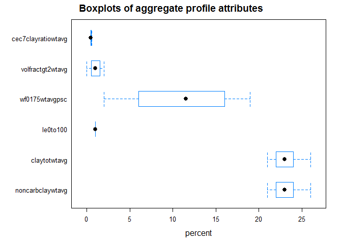
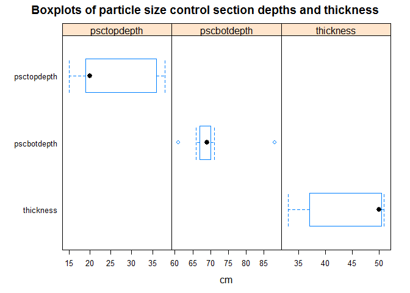
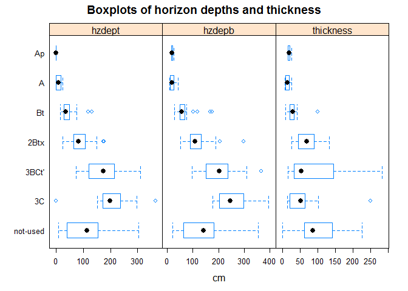

Lab pedon report
================

``` {.r}
# Set soil series
series <- "Cincinnati"
```

    ## finding horizonation errors ...
    ## horizon errors detected, use `get('bad.labpedon.ids', envir=soilDB.env)` for a list of pedon IDs
    ## NOTICE: multiple datums present
    ## converting Munsell to RGB ...
    ## mixing moist colors ... [8 of 285 horizons]
    ## finding horizonation errors ...
    ## horizon errors detected, use `get('bad.pedon.ids', envir=soilDB.env)` for a list of pedon IDs

Brief summary of NCSS lab pedon data
------------------------------------


|pedon\_id|taxonname|tax\_subgroup|part\_size\_class|pedon\_type|describer|
|:--------|:--------|:------------|:----------------|:----------|:--------|
|S1992IN079003|Cincinnati|oxyaquic fragiudalfs|fine-loamy|NA|Bill Hosteter, Shane McBurnett|
|S1982IN013001|Cincinnati|typic fragiudalfs|fine-silty|NA|NA|
|89IN119014|Cincinnati|typic fragiudalfs|fine-silty|NA|Paul McCarter, Jr. and Jerry Shively|
|87IN119003|Cincinnati|typic fragiudalfs|fine-silty|NA|P. McCarter, Jr.|
|1977IN021036|Cincinnati|typic fragiudults|fine-silty|NA|Mccarter and Neely|
|1977IN021037|Cincinnati|typic fragiudalfs|fine-silty|NA|Mccarter and Neely|
|1976IN031023|Cincinnati|typic fragiudalfs|fine-silty|NA|Shively|
|1976IN077006|Cincinnati|typic fragiudalfs|fine-silty|NA|Nickell and Koleszar|
|1978IN031013|Cincinnati|typic fragiudalfs|fine-silty|NA|Shively|
|1977IN021005|Cincinnati|typic fragiudalfs|fine-silty|NA|Mccarter|
|1978IN137004|Cincinnati|typic fragiudalfs|fine-silty|NA|Harkenrider and Shadis|
|1979IN055010|Cincinnati|typic fragiudalfs|fine-silty|NA|Mc carter and Langer|
|1979IN055012|Cincinnati|typic fragiudalfs|fine-silty|NA|Langer and Lefforge|
|1981IN047002|Cincinnati|typic fragiudalfs|fine-silty|NA|Shively|
|1981IN155004|Cincinnati|typic fragiudalfs|fine-silty|NA|Nickell and Stephenson|
|1981IN175008|Cincinnati|typic fragiudalfs|fine-silty|NA|Robards and Wade|
|1980IN055011|Cincinnati|typic fragiudults|fine-silty|NA|Mccarter and Lefforge|
|80KY-223-027|Cincinnati|typic fragiudalfs|fine-silty|NA|John H. Newton|
|80KY-223-025|Cincinnati|typic fragiudults|fine-silty|taxadjunct to the series|John H. Newton|
|1949-OH015-S03|Cincinnati|oxyaquic fragiudalfs|fine-silty|NA|farnham|
|1956-OH165-S11|Cincinnati|oxyaquic fragiudalfs|fine-silty|NA|roseler|
|1956-OH027-061|Cincinnati|oxyaquic fragiudalfs|fine-silty|NA|reeder, williams|
|1967-OH071-063|Cincinnati|oxyaquic fragiudalfs|fine-silty|NA|donaldson, petro, kerr, williams|
|1966-OH025-008|Cincinnati|oxyaquic fragiudalfs|fine-silty|NA|lerch, hale|
|1979-OH071-069|Cincinnati|oxyaquic fragiudalfs|fine-silty|NA|SHIPATALO/SMECK/NORTON|
|1980-OH127-013|Cincinnati|oxyaquic fragiudalfs|fine-silty|NA|RUBEL/JENNY/LEMASTER|
|90IN143015|Cincinnati|oxyaquic fragiudalfs|fine-silty|TUD pedon|Byron Nagel, Allan Nickell|

    ## guessing horizon designations are stored in `hzname`


Range in characteristics for NCSS pedon lab data
------------------------------------------------

### Summary of soil profiles

Five number summary (min, 25th, median, 75th, max)(percentiles)

|value|noncarbclaywtavg|claytotwtavg|le0to100|wf0175wtavgpsc|volfractgt2wtavg|cec7clayratiowtavg|
|:----|:---------------|:-----------|:-------|:-------------|:---------------|:-----------------|
|(all)|(21, 21, 23, 25, 26)(5)|(21, 21, 23, 25, 26)(5)|(1, 1, 1, 1, 1)(1)|(2, 4, 12, 17, 19)(4)|(0, 0, 1, 2, 2)(4)|(0, 0, 0, 1, 1)(5)|



|variable|range|
|:------:|:---:|
|psctopdepth|(15, 17, 20, 37, 38)(7)|
|pscbotdepth|(61, 64, 69, 78, 88)(7)|
|thickness|(33, 33, 50, 51, 51)(7)|



### Summary of soil horizons

||2B24X|2B3|2BC1|2BC2|2Bt|2Bt1|2Bt2|2Bt22|2Bt23|2Btb1|2Btb2|2Btb3|2Btb4|2Btx|2Btx1|2Btx2|2Btx21|2Btx22|2Btx3|2Btx4|2Btx5|2BX1|2BX2|2BX3|2Bxt1|2Bxt2|2C|2C1|2C2|3B25TB|3B326B|3BC|3BC1|3BC2|3BCb|3Bt|3Bt1|3Bt2|3Bt3|3Btb|3Btb1|3Btb2|3Btb5|3Btb6|3Btx|3C|3Cr|4BC1|4BC2|4Bt|4Btb3|4C|5Btb|A|A1|A2|Ap|AP|B|B'T1|B'T2|B1|B1T|B21|B21T|B22|B22T|B23T|B23X|B24T|B2T|B3|B31|B31TB|B32|B32TB|B3T|B3T1|B3T2|BA|BC|BCT11|BCT12|BCT13|BCT21|BCT22|BE|BET|Bt|BT|Bt1|BT1|Bt2|BT2|Bt21|Bt3|Btx|Btx1|BTX1|BTX2|BTX3|Bx1|BX1|BX11|BX12|Bx2|BX2|BX21|BX22|BX3|C|C1|C2|Cr|E|IIB23T|IIB24T|IIB3|IIBX1T|IIIB1TB|IIIB21T|IIIB22T|IIIBX1|IIIBX2|IIIC|Sum|
|---|----:|--:|---:|---:|--:|---:|---:|----:|----:|----:|----:|----:|----:|---:|----:|----:|-----:|-----:|----:|----:|----:|---:|---:|---:|----:|----:|--:|--:|--:|-----:|-----:|--:|---:|---:|---:|--:|---:|---:|---:|---:|----:|----:|----:|----:|---:|--:|--:|---:|---:|--:|----:|--:|---:|--:|--:|--:|--:|--:|--:|---:|---:|--:|--:|--:|---:|--:|---:|---:|---:|---:|--:|--:|--:|----:|--:|----:|--:|---:|---:|--:|--:|----:|----:|----:|----:|----:|--:|--:|--:|--:|--:|--:|--:|--:|---:|--:|--:|---:|---:|---:|---:|--:|--:|---:|---:|--:|--:|---:|---:|--:|--:|--:|--:|--:|--:|-----:|-----:|---:|-----:|------:|------:|------:|-----:|-----:|---:|--:|
|Ap|0|0|0|0|0|0|0|0|0|0|0|0|0|0|0|0|0|0|0|0|0|0|0|0|0|0|0|0|0|0|0|0|0|0|0|0|0|0|0|0|0|0|0|0|0|0|0|0|0|0|0|0|0|0|0|0|13|13|0|0|0|0|0|0|0|0|0|0|0|0|0|0|0|0|0|0|0|0|0|0|0|0|0|0|0|0|0|0|0|0|0|0|0|0|0|0|0|0|0|0|0|0|0|0|0|0|0|0|0|0|0|0|0|0|0|0|0|0|0|0|0|0|0|0|0|26|
|A|0|0|0|0|0|0|0|0|0|0|0|0|0|0|0|0|0|0|0|0|0|0|0|0|0|0|0|0|0|0|0|0|0|0|0|0|0|0|0|0|0|0|0|0|0|0|0|0|0|0|0|0|0|2|3|5|0|0|0|0|0|0|0|0|0|0|0|0|0|0|0|0|0|0|0|0|0|0|0|0|0|0|0|0|0|0|0|0|0|0|0|0|0|0|0|0|0|0|0|0|0|0|0|0|0|0|0|0|0|0|0|0|0|0|0|0|0|0|0|0|0|0|0|0|0|10|
|Bt|0|0|0|0|0|0|0|0|0|0|0|0|0|0|0|0|0|0|0|0|0|0|0|0|0|0|0|0|0|0|0|0|0|0|0|0|0|0|0|0|0|0|0|0|0|0|0|0|0|0|0|0|0|0|0|0|0|0|0|0|0|0|0|0|0|0|12|0|0|0|0|0|0|0|0|0|0|0|0|0|0|0|0|0|0|0|0|0|3|0|9|0|6|0|1|0|0|0|0|0|0|0|0|0|0|0|0|0|0|0|0|0|0|0|0|0|0|0|0|0|0|0|0|0|0|31|
|2Btx|0|0|0|0|0|0|0|0|0|0|0|0|0|2|4|4|1|1|2|1|1|0|0|0|1|1|0|0|0|0|0|0|0|0|0|0|0|0|0|0|0|0|0|0|0|0|0|0|0|0|0|0|0|0|0|0|0|0|0|0|0|0|0|0|0|0|0|0|0|0|0|0|0|0|0|0|0|0|0|0|0|0|0|0|0|0|0|0|0|0|0|0|0|0|0|0|3|2|0|0|0|1|10|1|1|1|9|1|1|5|0|0|0|0|0|2|1|1|1|0|0|0|0|0|0|58|
|3BCt'|0|0|0|0|0|0|0|0|0|0|0|0|0|0|0|0|0|0|0|0|0|0|0|0|0|0|0|0|0|0|0|1|1|1|1|3|1|1|2|3|2|2|1|1|1|0|0|1|1|0|0|0|0|0|0|0|0|0|0|0|0|0|0|0|0|0|0|0|0|0|0|0|0|0|0|0|0|0|0|0|0|0|0|0|0|0|0|0|0|0|0|0|0|0|0|0|0|0|0|0|0|0|0|0|0|0|0|0|0|0|0|0|0|0|0|0|0|0|0|1|1|1|1|1|0|28|
|3C|0|0|0|0|0|0|0|0|0|0|0|0|0|0|0|0|0|0|0|0|0|0|0|0|0|0|1|1|1|0|0|0|0|0|0|0|0|0|0|0|0|0|0|0|0|1|1|0|0|0|0|0|0|0|0|0|0|0|0|0|0|0|0|0|0|0|0|0|0|0|0|0|0|0|0|0|0|0|0|0|0|0|0|0|0|0|0|0|0|0|0|0|0|0|0|0|0|0|0|0|0|0|0|0|0|0|0|0|0|0|3|1|1|0|0|0|0|0|0|0|0|0|0|0|2|12|
|not-used|1|1|1|1|1|2|2|1|1|1|1|1|1|0|0|0|0|0|0|0|0|1|3|2|0|0|0|0|0|1|1|0|0|0|0|0|0|0|0|0|0|0|0|0|0|0|0|0|0|1|1|1|1|0|0|0|0|0|1|2|1|5|2|4|13|8|0|4|1|2|1|4|3|1|3|1|3|1|1|2|1|1|1|1|1|1|2|1|0|1|0|2|0|2|0|2|0|0|3|3|1|0|0|0|0|0|0|0|0|0|0|0|0|1|2|0|0|0|0|0|0|0|0|0|0|116|
|Sum|1|1|1|1|1|2|2|1|1|1|1|1|1|2|4|4|1|1|2|1|1|1|3|2|1|1|1|1|1|1|1|1|1|1|1|3|1|1|2|3|2|2|1|1|1|1|1|1|1|1|1|1|1|2|3|5|13|13|1|2|1|5|2|4|13|8|12|4|1|2|1|4|3|1|3|1|3|1|1|2|1|1|1|1|1|1|2|1|3|1|9|2|6|2|1|2|3|2|3|3|1|1|10|1|1|1|9|1|1|5|3|1|1|1|2|2|1|1|1|1|1|1|1|1|2|281|

|genhz|hzdept|hzdepb|thickness|
|:---:|:----:|:----:|:-------:|
|Ap|(0, 0, 0, 0, 0)(26)|(15, 15, 19, 23, 25)(26)|(15, 15, 19, 23, 25)(26)|
|A|(0, 0, 9, 19, 25)(10)|(8, 8, 18, 27, 43)(10)|(7, 8, 13, 21, 25)(7)|
|Bt|(15, 20, 36, 74, 132)(31)|(28, 38, 56, 102, 175)(31)|(8, 14, 28, 38, 99)(23)|
|2Btx|(25, 53, 82, 120, 176)(58)|(51, 75, 108, 156, 297)(58)|(26, 33, 68, 126, 132)(24)|
|3BCt'|(74, 98, 174, 241, 310)(28)|(97, 113, 203, 280, 366)(28)|(15, 26, 54, 197, 282)(8)|
|3C|(0, 153, 198, 291, 366)(12)|(178, 194, 246, 310, 396)(12)|(13, 15, 51, 132, 250)(9)|
|not-used|(8, 19, 113, 182, 305)(116)|(20, 36, 141, 221, 356)(116)|(0, 27, 85, 193, 226)(29)|



Range in characteristics for generic horizons
---------------------------------------------

Five number summary (min, 25th, median, 75th, max)(percentiles) and total number of observations (n)

|genhz|sandvc|sandco|sandmed|sandfine|
|:---:|:----:|:----:|:-----:|:------:|
|Ap|(0, 0, 0, 1, 2)(25)|(0, 1, 1, 2, 4)(25)|(0, 1, 2, 6, 8)(25)|(1, 1, 3, 6, 7)(25)|
|A|(0, 0, 1, 1, 1)(8)|(0, 1, 1, 2, 2)(8)|(0, 1, 4, 6, 8)(8)|(1, 1, 5, 8, 10)(8)|
|Bt|(0, 0, 0, 2, 4)(31)|(0, 0, 1, 2, 4)(31)|(0, 0, 2, 5, 7)(31)|(0, 1, 3, 9, 18)(31)|
|2Btx|(0, 0, 1, 3, 6)(58)|(0, 1, 3, 4, 8)(58)|(1, 2, 6, 11, 12)(58)|(2, 5, 9, 16, 19)(58)|
|3BCt'|(0, 1, 2, 4, 13)(28)|(1, 2, 3, 7, 27)(28)|(3, 4, 6, 12, 31)(28)|(5, 8, 12, 17, 17)(28)|
|3C|(0, 0, 4, 7, 7)(12)|(0, 0, 6, 8, 14)(12)|(0, 0, 5, 11, 19)(12)|(3, 6, 12, 16, 31)(12)|
|not-used|(0, 0, 1, 2, 5)(107)|(0, 1, 2, 4, 8)(107)|(0, 1, 5, 10, 14)(107)|(0, 2, 8, 14, 42)(107)|

|genhz|sandvf|sandtot|siltco|siltfine|
|:---:|:----:|:-----:|:----:|:------:|
|Ap|(0, 1, 3, 4, 6)(25)|(2, 4, 8, 17, 21)(26)|(16, 19, 23, 32, 42)(22)|(38, 41, 46, 55, 58)(22)|
|A|(0, 1, 2, 6, 7)(8)|(3, 6, 13, 18, 28)(10)|(17, 18, 21, 36, 41)(6)|(35, 38, 45, 52, 56)(6)|
|Bt|(0, 1, 2, 8, 16)(31)|(1, 3, 9, 22, 48)(31)|(12, 15, 19, 30, 36)(27)|(19, 34, 41, 48, 51)(27)|
|2Btx|(1, 3, 5, 8, 11)(58)|(5, 14, 25, 37, 48)(58)|(9, 11, 15, 24, 31)(52)|(16, 23, 32, 40, 55)(53)|
|3BCt'|(2, 4, 7, 14, 17)(28)|(13, 23, 33, 45, 71)(28)|(2, 9, 13, 17, 29)(22)|(6, 12, 19, 26, 33)(22)|
|3C|(4, 4, 10, 15, 28)(12)|(8, 19, 41, 50, 52)(12)|(8, 11, 14, 22, 23)(9)|(14, 20, 24, 26, 30)(9)|
|not-used|(0, 1, 5, 9, 15)(107)|(1, 6, 24, 38, 62)(116)|(6, 10, 16, 22, 36)(93)|(12, 20, 34, 47, 56)(93)|

|genhz|silttot|clayfine|claytot|carbonorganicpct|
|:---:|:-----:|:------:|:-----:|:--------------:|
|Ap|(59, 64, 72, 78, 81)(26)|(3, 3, 4, 8, 11)(6)|(13, 15, 17, 24, 26)(26)|(1, 1, 1, 2, 2)(19)|
|A|(61, 64, 69, 71, 73)(10)|(4, 5, 6, 13, 15)(4)|(11, 15, 18, 25, 30)(10)|(1, 1, 2, 2, 2)(5)|
|Bt|(31, 44, 64, 73, 75)(31)|(8, 10, 13, 15, 16)(12)|(19, 21, 27, 32, 39)(31)|(0, 0, 0, 0, 1)(14)|
|2Btx|(26, 34, 50, 63, 73)(58)|(4, 8, 12, 18, 28)(16)|(17, 20, 25, 33, 44)(58)|(0, 0, 0, 0, 0)(16)|
|3BCt'|(8, 26, 36, 45, 48)(28)|(4, 8, 12, 15, 16)(13)|(19, 21, 31, 39, 46)(28)|(0, 0, 0, 0, 0)(17)|
|3C|(12, 22, 37, 45, 48)(12)|(4, 4, 6, 24, 28)(10)|(11, 13, 21, 48, 49)(12)|(NA, NA, NA, NA, NA)(0)|
|not-used|(19, 29, 50, 68, 76)(116)|(3, 7, 13, 21, 26)(27)|(11, 19, 27, 37, 68)(116)|(0, 0, 0, 1, 1)(33)|

|genhz|carbontotalpct|fragwt25|fragwt520|fragwt2075|
|:---:|:------------:|:------:|:-------:|:--------:|
|Ap|(1, 1, 1, 1, 1)(7)|(0, 0, 0, 1, 1)(2)|(0, 0, 0, 0, 0)(2)|(0, 0, 0, 0, 0)(2)|
|A|(0, 0, 0, 2, 3)(5)|(1, 1, 1, 1, 1)(1)|(0, 0, 0, 0, 0)(1)|(0, 0, 0, 0, 0)(1)|
|Bt|(0, 0, 0, 0, 0)(10)|(0, 0, 1, 3, 4)(7)|(0, 0, 0, 1, 1)(7)|(0, 0, 0, 0, 0)(7)|
|2Btx|(0, 0, 0, 0, 0)(15)|(0, 0, 1, 2, 4)(9)|(0, 0, 1, 4, 5)(9)|(0, 0, 0, 0, 2)(9)|
|3BCt'|(0, 0, 0, 0, 0)(11)|(2, 2, 3, 10, 11)(5)|(1, 1, 2, 7, 9)(5)|(0, 0, 0, 1, 1)(5)|
|3C|(0, 0, 0, 0, 0)(3)|(NA, NA, NA, NA, NA)(0)|(NA, NA, NA, NA, NA)(0)|(NA, NA, NA, NA, NA)(0)|
|not-used|(0, 0, 0, 0, 0)(19)|(0, 1, 1, 5, 10)(10)|(0, 0, 1, 2, 2)(10)|(0, 0, 0, 0, 3)(10)|

|genhz|fragwt275|wtpct0175|wtpctgt2ws|ph1to1h2o|
|:---:|:-------:|:-------:|:--------:|:-------:|
|Ap|(0, 0, 0, 1, 1)(2)|(4, 6, 14, 18, 19)(3)|(0, 0, 0, 1, 1)(2)|(4.6, 4.8, 5.7, 6.9, 7.6)(26)|
|A|(1, 1, 1, 1, 1)(1)|(22, 22, 22, 22, 22)(1)|(1, 1, 1, 1, 1)(1)|(4.5, 5, 5.8, 6.6, 6.8)(10)|
|Bt|(0, 0, 1, 3, 5)(7)|(1, 2, 13, 19, 21)(7)|(0, 0, 1, 3, 5)(7)|(4.1, 4.4, 4.7, 5.5, 7.2)(31)|
|2Btx|(0, 0, 3, 7, 8)(9)|(3, 9, 22, 30, 31)(9)|(0, 0, 3, 7, 8)(9)|(4, 4.4, 4.9, 5.5, 6.5)(58)|
|3BCt'|(4, 4, 5, 18, 21)(5)|(24, 24, 29, 73, 75)(5)|(4, 4, 5, 18, 21)(5)|(4.6, 4.8, 5.6, 6.9, 7.2)(28)|
|3C|(NA, NA, NA, NA, NA)(0)|(NA, NA, NA, NA, NA)(0)|(NA, NA, NA, NA, NA)(0)|(4.6, 5, 7.2, 8, 8)(12)|
|not-used|(0, 1, 2, 7, 12)(10)|(2, 12, 22, 32, 37)(10)|(0, 1, 2, 7, 12)(10)|(3.9, 4.6, 5.1, 6.5, 7.8)(114)|

|genhz|ph01mcacl2|esp|cecsumcations|cec7|
|:---:|:--------:|:-:|:-----------:|:--:|
|Ap|(4.2, 4.3, 5.2, 6.5, 6.7)(20)|(0, 0, 1, 1, 2)(11)|(8.7, 10, 13.8, 17.8, 21)(24)|(8.7, 8.9, 10.3, 15.3, 15.7)(11)|
|A|(4.3, 4.3, 5.4, 6.2, 6.4)(6)|(0, 0, 0, 2, 2)(3)|(12.4, 12.5, 12.9, 17.5, 20.4)(7)|(9.1, 9.9, 12.9, 18.9, 20.4)(3)|
|Bt|(3.7, 3.7, 4.1, 4.9, 5.8)(23)|(0, 0, 0, 1, 3)(21)|(10.2, 12.3, 16.5, 21, 23.5)(31)|(8.2, 9.5, 14.2, 21, 23.5)(21)|
|2Btx|(3.6, 3.9, 4.1, 4.7, 5.3)(49)|(0, 0, 1, 2, 3)(30)|(8.4, 10.8, 15.7, 20.3, 28)(58)|(8.4, 9.1, 14.3, 19.8, 28)(30)|
|3BCt'|(3.8, 3.9, 5.1, 6.7, 6.8)(22)|(0, 0, 1, 5, 8)(28)|(8.1, 12.1, 20.2, 24.9, 29.2)(28)|(8, 10.1, 18, 25.7, 38.1)(28)|
|3C|(4, 4.3, 5, 7.4, 7.5)(6)|(0, 0, 0, 70, 100)(4)|(8.8, 9.3, 18.9, 30.7, 33)(5)|(0.1, 2.7, 13.8, 28.8, 33)(4)|
|not-used|(3.7, 4, 4.3, 6, 7.5)(83)|(0, 0, 1, 3, 5)(29)|(6.2, 11.3, 15.7, 21.8, 32.7)(96)|(5.5, 11.8, 16.4, 23.5, 32.7)(29)|

|genhz|ecec|sumbases|basesatsumcations|basesatnh4oac|
|:---:|:--:|:------:|:---------------:|:-----------:|
|Ap|(4.2, 4.7, 6.6, 8.4, 8.8)(3)|(2.3, 2.4, 5.8, 9, 10)(11)|(17, 23, 54, 73, 90)(24)|(4, 6, 14, 65, 71)(24)|
|A|(5.4, 5.4, 5.4, 5.4, 5.4)(1)|(4.9, 5, 5.4, 13.4, 15.4)(3)|(40, 41, 53, 75, 76)(7)|(7, 8, 12, 62, 75)(7)|
|Bt|(6.5, 6.7, 8.4, 9.7, 10.1)(8)|(0.8, 3.2, 5.9, 10.1, 11.9)(21)|(8, 14, 37, 60, 80)(31)|(2, 5, 34, 57, 80)(31)|
|2Btx|(5.7, 5.8, 7.6, 12, 12.9)(11)|(0.7, 2.9, 6.2, 10.1, 22.6)(30)|(7, 18, 36, 65, 81)(58)|(1, 4, 18, 62, 81)(58)|
|3BCt'|(6.8, 7.4, 12.6, 15.2, 15.3)(9)|(3.1, 5.9, 14.4, 22.3, 26.9)(28)|(24, 33, 71, 89, 92)(28)|(25, 37, 72, 93, 100)(28)|
|3C|(NA, NA, NA, NA, NA)(0)|(0.1, 2.2, 12.2, 26.7, 30.7)(4)|(61, 69, 92, 94, 95)(5)|(6, 16, 86, 96, 100)(6)|
|not-used|(2.9, 10.4, 12.3, 16.3, 18.9)(11)|(0.3, 5.1, 9.1, 16.7, 18.7)(29)|(5, 23, 46, 78, 90)(96)|(1, 3, 9, 66, 96)(96)|

|genhz|caco3equiv|feoxalate|sioxalate|extracid|
|:---:|:--------:|:-------:|:-------:|:------:|
|Ap|(0, 0, 0, 1, 1)(2)|(NA, NA, NA, NA, NA)(0)|(NA, NA, NA, NA, NA)(0)|(2.2, 3.8, 6.4, 9.7, 12.7)(24)|
|A|(NA, NA, NA, NA, NA)(0)|(0, 0, 0, 0, 0)(1)|(0, 0, 0, 0, 0)(1)|(3.7, 4.1, 5.9, 7.5, 7.5)(7)|
|Bt|(0, 0, 0, 0, 0)(2)|(0, 0, 0, 0, 0)(2)|(0, 0, 0, 0, 0)(2)|(3.7, 6.6, 10.6, 14.6, 20)(31)|
|2Btx|(0, 0, 0, 0, 0)(4)|(0, 0, 0, 0, 0)(1)|(0, 0, 0, 0, 0)(1)|(2.7, 5.4, 9.3, 13.1, 16.9)(58)|
|3BCt'|(0, 0, 0, 0, 0)(6)|(0, 0, 0, 0, 0)(2)|(0, 0, 0, 0, 0)(2)|(1.9, 2.3, 4.1, 13.3, 15.5)(28)|
|3C|(NA, NA, NA, NA, NA)(0)|(NA, NA, NA, NA, NA)(0)|(NA, NA, NA, NA, NA)(0)|(1.3, 1.4, 1.7, 3.3, 3.9)(5)|
|not-used|(0, 0, 0, 2, 2)(7)|(0, 0, 0, 0, 0)(5)|(0, 0, 0, 0, 0)(5)|(1.8, 3.4, 7, 12.5, 18.4)(96)|

|genhz|extral|aloxalate|dbthirdbar|dbovendry|
|:---:|:----:|:-------:|:--------:|:-------:|
|Ap|(0, 0, 0, 1, 2)(5)|(NA, NA, NA, NA, NA)(0)|(NA, NA, NA, NA, NA)(0)|(NA, NA, NA, NA, NA)(0)|
|A|(0, 0, 0, 0, 0)(1)|(0, 0, 0, 0, 0)(1)|(1.36, 1.36, 1.36, 1.36, 1.36)(1)|(1.37, 1.37, 1.37, 1.37, 1.37)(1)|
|Bt|(0, 1, 3, 6, 7)(10)|(0, 0, 0, 0, 0)(2)|(1.56, 1.56, 1.58, 1.6, 1.6)(2)|(1.48, 1.51, 1.64, 1.67, 1.68)(3)|
|2Btx|(0, 0, 3, 5, 7)(15)|(0, 0, 0, 0, 0)(1)|(1.37, 1.4, 1.52, 1.65, 1.68)(2)|(1.5, 1.55, 1.69, 1.77, 1.78)(4)|
|3BCt'|(0, 0, 1, 5, 7)(15)|(0, 0, 0, 0, 0)(2)|(1.41, 1.44, 1.55, 1.6, 1.6)(4)|(1.54, 1.55, 1.61, 1.68, 1.69)(4)|
|3C|(NA, NA, NA, NA, NA)(0)|(NA, NA, NA, NA, NA)(0)|(NA, NA, NA, NA, NA)(0)|(NA, NA, NA, NA, NA)(0)|
|not-used|(0, 0, 1, 4, 6)(15)|(0, 0, 0, 0, 0)(5)|(1.36, 1.37, 1.59, 1.74, 1.75)(6)|(1.37, 1.43, 1.66, 1.79, 1.79)(6)|

|genhz|wthirdbarclod|wfifteenbar|wretentiondiffws|wfifteenbartoclay|
|:---:|:-----------:|:---------:|:--------------:|:---------------:|
|Ap|(NA, NA, NA, NA, NA)(0)|(6.9, 7, 7.4, 7.7, 7.7)(5)|(NA, NA, NA, NA, NA)(0)|(0.4, 0.4, 0.4, 0.4, 0.4)(5)|
|A|(21.9, 21.9, 21.9, 21.9, 21.9)(1)|(7.2, 7.2, 7.2, 7.2, 7.2)(1)|(0.2, 0.2, 0.2, 0.2, 0.2)(1)|(0.7, 0.7, 0.7, 0.7, 0.7)(1)|
|Bt|(19.2, 19.62, 21.3, 25.94, 27.1)(3)|(8.2, 8.3, 9.8, 11.5, 13)(10)|(0.2, 0.2, 0.2, 0.2, 0.2)(2)|(0.4, 0.4, 0.4, 0.5, 0.5)(10)|
|2Btx|(19.1, 20.39, 23.65, 25.3, 25.9)(4)|(7.2, 7.8, 10.5, 12.9, 13.3)(14)|(0.1, 0.1, 0.1, 0.1, 0.1)(1)|(0.4, 0.4, 0.4, 0.5, 0.5)(14)|
|3BCt'|(15.6, 16.14, 18, 23.22, 25.2)(4)|(8.3, 8.9, 12.2, 13.7, 15.5)(13)|(0.1, 0.1, 0.1, 0.1, 0.1)(2)|(0.3, 0.4, 0.4, 0.4, 0.5)(13)|
|3C|(NA, NA, NA, NA, NA)(0)|(NA, NA, NA, NA, NA)(0)|(NA, NA, NA, NA, NA)(0)|(NA, NA, NA, NA, NA)(0)|
|not-used|(16.8, 18, 20.7, 27.55, 28.1)(6)|(4.6, 10.6, 14, 17.1, 18.8)(13)|(0.1, 0.1, 0.1, 0.2, 0.2)(5)|(0.4, 0.4, 0.4, 0.5, 0.5)(13)|

|genhz|cec7Clay|
|:---:|:------:|
|Ap|(0.5, 0.5, 0.7, 0.8, 0.9)(11)|
|A|(0.5, 0.6, 0.8, 1.1, 1.2)(3)|
|Bt|(0.4, 0.4, 0.5, 0.7, 0.7)(21)|
|2Btx|(0.4, 0.4, 0.6, 0.7, 0.8)(30)|
|3BCt'|(0.4, 0.5, 0.6, 0.7, 0.9)(28)|
|3C|(0, 0.1, 0.4, 0.6, 0.7)(4)|
|not-used|(0.4, 0.5, 0.6, 0.7, 0.7)(29)|


||c|cl|fsl|l|sc|scl|si|sic|sicl|sil|sl|Sum|
|---|--:|--:|--:|--:|--:|--:|--:|--:|---:|--:|--:|--:|
|Ap|0|0|0|0|0|0|1|0|0|25|0|26|
|A|0|0|0|0|0|0|0|0|1|9|0|10|
|Bt|0|2|0|2|0|0|0|0|12|15|0|31|
|2Btx|3|11|0|14|0|1|0|0|8|21|0|58|
|3BCt'|0|19|0|6|0|1|0|1|0|0|1|28|
|3C|2|0|0|8|1|0|0|1|0|0|0|12|
|not-used|9|35|1|11|0|1|0|1|16|42|0|116|
|Sum|14|67|1|41|1|3|1|3|37|112|1|281|
