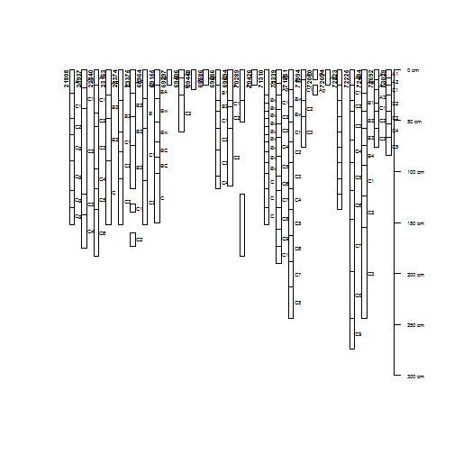
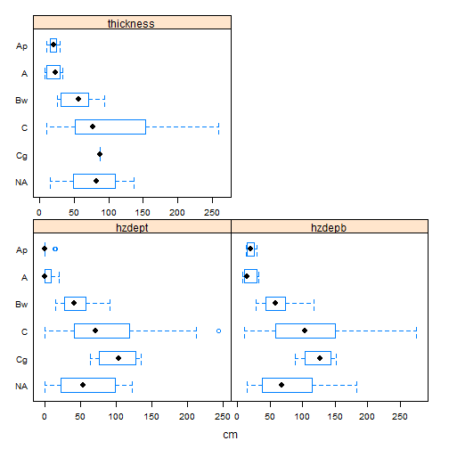
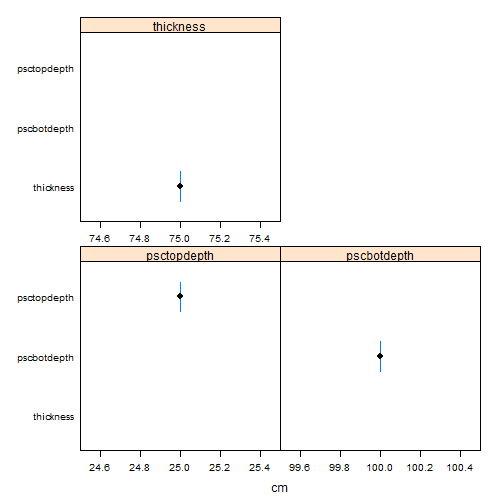

# Lab pedon report

```r
# Set soil series
series <- "Genesee"
```


```
## finding horizonation errors ...
## horizon errors detected, use `get('bad.labpedon.ids', envir=soilDB.env)` for a list of pedon IDs
## mixing dry colors ... [5 of 24 horizons]
## mixing moist colors ... [25 of 267 horizons]
## -> QC: horizon errors detected, use `get('bad.pedon.ids', envir=soilDB.env)` for related userpedonid values
```

## Plot of all pedons in selected set
Pedons that do not have their Std_Latitude and Std_Longitude columns populated in the NASIS Site table are currently not ploted on the map.
 

## Soil profile plots (depth, color, horizonation, and user pedon id)

```
## guessing horizon designations are stored in `hzname`
```

 

# Summary of NCSS Pedon Lab Data
<!-- html table generated in R 3.1.1 by xtable 1.7-4 package -->
<!-- Thu Mar 12 14:47:57 2015 -->
<table border=1>
<tr> <th>  </th> <th> pedon_id </th> <th> taxonname </th> <th> tax_subgroup </th> <th> part_size_class </th> <th> pedon_type </th> <th> describer </th>  </tr>
  <tr> <td align="right"> 1 </td> <td> 97IN045052 </td> <td> Genesee </td> <td> fluventic hapludolls </td> <td> fine-silty </td> <td> correlates to named soil </td> <td> MLW </td> </tr>
  <tr> <td align="right"> 2 </td> <td> 97IN045056 </td> <td> Genesee </td> <td> fluventic eutrochrepts </td> <td> fine-loamy </td> <td>  </td> <td> MLW </td> </tr>
  <tr> <td align="right"> 3 </td> <td> 81OH173GnA </td> <td> Genesee </td> <td> typic udifluvents </td> <td> fine-loamy </td> <td> within range of map unit </td> <td> MMF/RAR </td> </tr>
  <tr> <td align="right"> 4 </td> <td> 90OH125Ge </td> <td> Genesee </td> <td> fluventic eutrochrepts </td> <td> fine-loamy </td> <td> within range of map unit </td> <td> MMF/RAR </td> </tr>
  <tr> <td align="right"> 5 </td> <td> 90OH125Ge-2 </td> <td> Genesee </td> <td> fluventic eutrochrepts </td> <td> fine-loamy </td> <td> within range of map unit </td> <td> MMF/RAR </td> </tr>
  <tr> <td align="right"> 6 </td> <td> 78oh145040 </td> <td> Genesee </td> <td> typic udifluvents </td> <td>  </td> <td> representative pedon for component </td> <td> McCleary, Hamilton, and Miller </td> </tr>
  <tr> <td align="right"> 7 </td> <td> 1972IN097002 </td> <td> Genesee </td> <td>  </td> <td>  </td> <td>  </td> <td>  </td> </tr>
  <tr> <td align="right"> 8 </td> <td> 1980IN177012 </td> <td> Genesee </td> <td> typic udifluvents </td> <td> fine-loamy </td> <td>  </td> <td> Blank and Plank </td> </tr>
  <tr> <td align="right"> 9 </td> <td> 1977IN169011 </td> <td> Genesee </td> <td> typic udifluvents </td> <td> fine-loamy </td> <td>  </td> <td> Ruesch and Schumacher </td> </tr>
  <tr> <td align="right"> 10 </td> <td> 1986IL033011 </td> <td> Genesee </td> <td> fluventic eutrudepts </td> <td> fine-loamy </td> <td> map unit inclusion </td> <td> FLA, KTM </td> </tr>
  <tr> <td align="right"> 11 </td> <td> 1985IL033001 </td> <td> Genesee </td> <td> fluventic eutrudepts </td> <td> fine-loamy </td> <td>  </td> <td> FLA, KTM </td> </tr>
  <tr> <td align="right"> 12 </td> <td> C1102F07-1 </td> <td> Genesee </td> <td>  </td> <td>  </td> <td>  </td> <td> TAF, ZWW </td> </tr>
  <tr> <td align="right"> 13 </td> <td> C1102F07-2 </td> <td> Genesee </td> <td>  </td> <td>  </td> <td>  </td> <td> TAF, ZWW </td> </tr>
  <tr> <td align="right"> 14 </td> <td> C1102F07-3 </td> <td> Genesee </td> <td>  </td> <td>  </td> <td>  </td> <td> TAF, ZWW </td> </tr>
  <tr> <td align="right"> 15 </td> <td> C1102F07-4 </td> <td> Genesee </td> <td>  </td> <td>  </td> <td>  </td> <td> TAF, ZWW </td> </tr>
  <tr> <td align="right"> 16 </td> <td> C1102F07-5 </td> <td> Genesee </td> <td>  </td> <td>  </td> <td>  </td> <td> TAF, ZWW </td> </tr>
  <tr> <td align="right"> 17 </td> <td> C1109C29-2 </td> <td> Genesee </td> <td>  </td> <td>  </td> <td>  </td> <td> John Allen, Norm Stephens </td> </tr>
  <tr> <td align="right"> 18 </td> <td> C1109C29-4 </td> <td> Genesee </td> <td>  </td> <td>  </td> <td>  </td> <td> John Allen, Norm Stephens </td> </tr>
  <tr> <td align="right"> 19 </td> <td> C1109C29-3 </td> <td> Genesee </td> <td>  </td> <td>  </td> <td>  </td> <td> John Allen, Norm Stephens </td> </tr>
  <tr> <td align="right"> 20 </td> <td> C1109C29-5 </td> <td> Genesee </td> <td>  </td> <td>  </td> <td>  </td> <td> John Allen, Norm Stephens </td> </tr>
  <tr> <td align="right"> 21 </td> <td> C1102C09-1 </td> <td> Genesee </td> <td>  </td> <td> fine-loamy </td> <td>  </td> <td> KN,JA,NS </td> </tr>
  <tr> <td align="right"> 22 </td> <td> 1953-OH049-S28 </td> <td> Genesee </td> <td> fluventic eutrochrepts </td> <td> fine-loamy </td> <td>  </td> <td> meeker, hale, reese </td> </tr>
  <tr> <td align="right"> 23 </td> <td> 1955-OH049-S29 </td> <td> Genesee </td> <td> fluventic eutrochrepts </td> <td> fine-loamy </td> <td>  </td> <td> heddleston, post, holowaychuk </td> </tr>
  <tr> <td align="right"> 24 </td> <td> 1955-OH071-S35 </td> <td> Genesee </td> <td> fluventic eutrochrepts </td> <td> fine-loamy </td> <td>  </td> <td> stout, schafer, hale, meeker </td> </tr>
  <tr> <td align="right"> 25 </td> <td> 1958-OH165-016 </td> <td> Genesee </td> <td> fluventic eutrochrepts </td> <td> fine-loamy </td> <td>  </td> <td> garner, reeder </td> </tr>
  <tr> <td align="right"> 26 </td> <td> 1960-OH135-055 </td> <td> Genesee </td> <td> fluventic eutrochrepts </td> <td> fine-loamy </td> <td>  </td> <td> davis, tornes, mcloda </td> </tr>
  <tr> <td align="right"> 27 </td> <td> 1959-OH135-030 </td> <td> Genesee </td> <td> fluventic eutrochrepts </td> <td> fine-loamy </td> <td>  </td> <td> lerch, hayhurst </td> </tr>
  <tr> <td align="right"> 28 </td> <td> 1960-OH135-049 </td> <td> Genesee </td> <td> fluventic eutrochrepts </td> <td> fine-loamy </td> <td>  </td> <td> lerch, mcloda, tornes, davis </td> </tr>
  <tr> <td align="right"> 29 </td> <td> 1959-OH003-113 </td> <td> Genesee </td> <td> fluventic eutrochrepts </td> <td> fine-loamy </td> <td>  </td> <td> evans, donaldson, waters </td> </tr>
  <tr> <td align="right"> 30 </td> <td> 1961-OH165-048 </td> <td> Genesee </td> <td> fluventic eutrochrepts </td> <td> fine-loamy </td> <td>  </td> <td> garner, ernst </td> </tr>
  <tr> <td align="right"> 31 </td> <td> 1961-OH165-049 </td> <td> Genesee </td> <td> fluventic eutrochrepts </td> <td> fine-loamy </td> <td>  </td> <td> garner, ernst </td> </tr>
  <tr> <td align="right"> 32 </td> <td> 1961-OH165-050 </td> <td> Genesee </td> <td> fluventic eutrochrepts </td> <td> fine-loamy </td> <td>  </td> <td> garner, ernst </td> </tr>
  <tr> <td align="right"> 33 </td> <td> 1961-OH165-052 </td> <td> Genesee </td> <td> fluventic eutrochrepts </td> <td> fine-loamy </td> <td>  </td> <td> garner, ernst </td> </tr>
  <tr> <td align="right"> 34 </td> <td> 1961-OH165-054 </td> <td> Genesee </td> <td> fluventic eutrochrepts </td> <td> fine-loamy </td> <td>  </td> <td> garner, ernst </td> </tr>
  <tr> <td align="right"> 35 </td> <td> 1961-OH165-055 </td> <td> Genesee </td> <td> fluventic eutrochrepts </td> <td> fine-loamy </td> <td>  </td> <td> garner, ernst </td> </tr>
  <tr> <td align="right"> 36 </td> <td> 1961-OH165-056 </td> <td> Genesee </td> <td> fluventic eutrochrepts </td> <td> fine-loamy </td> <td>  </td> <td> garner, ernst </td> </tr>
  <tr> <td align="right"> 37 </td> <td> 1974-OH049-047 </td> <td> Genesee </td> <td> fluventic eutrochrepts </td> <td> fine-loamy </td> <td>  </td> <td> gerken, mc loda, milliron, porter </td> </tr>
  <tr> <td align="right"> 38 </td> <td> 1969-OH109-022 </td> <td> Genesee </td> <td> fluventic eutrochrepts </td> <td> fine-loamy </td> <td>  </td> <td> lehman, bottrell, matanzo </td> </tr>
  <tr> <td align="right"> 39 </td> <td> 1971-OH171-027 </td> <td> Genesee </td> <td> fluventic eutrochrepts </td> <td> fine-loamy </td> <td>  </td> <td> jenny/ gerken/ stone </td> </tr>
  <tr> <td align="right"> 40 </td> <td> 1975-OH137-S02 </td> <td> Genesee </td> <td> fluventic eutrochrepts </td> <td> fine-loamy </td> <td>  </td> <td> FLESHER </td> </tr>
  <tr> <td align="right"> 41 </td> <td> 1977-OH039-040 </td> <td> Genesee </td> <td> fluventic eutrochrepts </td> <td> fine-loamy </td> <td>  </td> <td> Crowner/ Monnin </td> </tr>
  <tr> <td align="right"> 42 </td> <td> 1959MN157029 </td> <td> Genesee </td> <td>  </td> <td>  </td> <td> TUD pedon </td> <td> Unknown </td> </tr>
   </table>


## Range in characteristics of NCSS Pedon Lab Data
Five number summary (min, 25th, median, 75th, max)(percentiles)
<!-- html table generated in R 3.1.1 by xtable 1.7-4 package -->
<!-- Thu Mar 12 14:47:57 2015 -->
<table border=1>
<tr> <th>  </th> <th> value </th> <th> noncarbclaywtavg </th> <th> claytotwtavg </th> <th> le0to100 </th> <th> wf0175wtavgpsc </th> <th> volfractgt2wtavg </th> <th> cec7clayratiowtavg </th>  </tr>
  <tr> <td align="right"> 1 </td> <td> (all) </td> <td> (NA, NA, NA, NA, NA)(0) </td> <td> (NA, NA, NA, NA, NA)(0) </td> <td> (NA, NA, NA, NA, NA)(0) </td> <td> (NA, NA, NA, NA, NA)(0) </td> <td> (NA, NA, NA, NA, NA)(0) </td> <td> (NA, NA, NA, NA, NA)(0) </td> </tr>
   </table>


## Box plots of NCSS Pedon Lab Data
Graphical five number summary (outliers, 5th, 25th, median, 75th, 95th, outliers)

```
## [1] "no pedon lab data have been populated"
```


# Summary of NCSS Layer Lab Data

## Horizon designations by generic horizon
Contingency table (counts) 

<!-- html table generated in R 3.1.1 by xtable 1.7-4 package -->
<!-- Thu Mar 12 14:47:57 2015 -->
<table border=1>
<tr> <th>  </th> <th> A </th> <th> A1 </th> <th> A2 </th> <th> A3 </th> <th> Ap </th> <th> AP </th> <th> Ap1 </th> <th> Ap2 </th> <th> B </th> <th> B1 </th> <th> B2 </th> <th> B21 </th> <th> B22 </th> <th> B3 </th> <th> B4 </th> <th> BA </th> <th> BC </th> <th> Bw </th> <th> Bw1 </th> <th> Bw2 </th> <th> Bw3 </th> <th> Bw4 </th> <th> C </th> <th> C1 </th> <th> C10 </th> <th> C2 </th> <th> C3 </th> <th> C4 </th> <th> C5 </th> <th> C6 </th> <th> C7 </th> <th> C8 </th> <th> C9 </th> <th> Cg1 </th> <th> Cg2 </th> <th> Cg3 </th> <th> Cg4 </th> <th> Cv </th> <th> NA </th> <th> Sum </th>  </tr>
  <tr> <td align="center"> Ap </td> <td align="center"> 0 </td> <td align="center"> 0 </td> <td align="center"> 0 </td> <td align="center"> 0 </td> <td align="center"> 15 </td> <td align="center"> 3 </td> <td align="center"> 1 </td> <td align="center"> 1 </td> <td align="center"> 0 </td> <td align="center"> 0 </td> <td align="center"> 0 </td> <td align="center"> 0 </td> <td align="center"> 0 </td> <td align="center"> 0 </td> <td align="center"> 0 </td> <td align="center"> 0 </td> <td align="center"> 0 </td> <td align="center"> 0 </td> <td align="center"> 0 </td> <td align="center"> 0 </td> <td align="center"> 0 </td> <td align="center"> 0 </td> <td align="center"> 0 </td> <td align="center"> 0 </td> <td align="center"> 0 </td> <td align="center"> 0 </td> <td align="center"> 0 </td> <td align="center"> 0 </td> <td align="center"> 0 </td> <td align="center"> 0 </td> <td align="center"> 0 </td> <td align="center"> 0 </td> <td align="center"> 0 </td> <td align="center"> 0 </td> <td align="center"> 0 </td> <td align="center"> 0 </td> <td align="center"> 0 </td> <td align="center"> 0 </td> <td align="center"> 0 </td> <td align="center"> 20 </td> </tr>
  <tr> <td align="center"> A </td> <td align="center"> 1 </td> <td align="center"> 5 </td> <td align="center"> 2 </td> <td align="center"> 1 </td> <td align="center"> 0 </td> <td align="center"> 0 </td> <td align="center"> 0 </td> <td align="center"> 0 </td> <td align="center"> 0 </td> <td align="center"> 0 </td> <td align="center"> 0 </td> <td align="center"> 0 </td> <td align="center"> 0 </td> <td align="center"> 0 </td> <td align="center"> 0 </td> <td align="center"> 0 </td> <td align="center"> 0 </td> <td align="center"> 0 </td> <td align="center"> 0 </td> <td align="center"> 0 </td> <td align="center"> 0 </td> <td align="center"> 0 </td> <td align="center"> 0 </td> <td align="center"> 0 </td> <td align="center"> 0 </td> <td align="center"> 0 </td> <td align="center"> 0 </td> <td align="center"> 0 </td> <td align="center"> 0 </td> <td align="center"> 0 </td> <td align="center"> 0 </td> <td align="center"> 0 </td> <td align="center"> 0 </td> <td align="center"> 0 </td> <td align="center"> 0 </td> <td align="center"> 0 </td> <td align="center"> 0 </td> <td align="center"> 0 </td> <td align="center"> 0 </td> <td align="center"> 9 </td> </tr>
  <tr> <td align="center"> Bw </td> <td align="center"> 0 </td> <td align="center"> 0 </td> <td align="center"> 0 </td> <td align="center"> 0 </td> <td align="center"> 0 </td> <td align="center"> 0 </td> <td align="center"> 0 </td> <td align="center"> 0 </td> <td align="center"> 1 </td> <td align="center"> 2 </td> <td align="center"> 3 </td> <td align="center"> 2 </td> <td align="center"> 2 </td> <td align="center"> 2 </td> <td align="center"> 1 </td> <td align="center"> 1 </td> <td align="center"> 0 </td> <td align="center"> 2 </td> <td align="center"> 3 </td> <td align="center"> 4 </td> <td align="center"> 2 </td> <td align="center"> 2 </td> <td align="center"> 0 </td> <td align="center"> 0 </td> <td align="center"> 0 </td> <td align="center"> 0 </td> <td align="center"> 0 </td> <td align="center"> 0 </td> <td align="center"> 0 </td> <td align="center"> 0 </td> <td align="center"> 0 </td> <td align="center"> 0 </td> <td align="center"> 0 </td> <td align="center"> 0 </td> <td align="center"> 0 </td> <td align="center"> 0 </td> <td align="center"> 0 </td> <td align="center"> 0 </td> <td align="center"> 0 </td> <td align="center"> 27 </td> </tr>
  <tr> <td align="center"> C </td> <td align="center"> 0 </td> <td align="center"> 0 </td> <td align="center"> 0 </td> <td align="center"> 0 </td> <td align="center"> 0 </td> <td align="center"> 0 </td> <td align="center"> 0 </td> <td align="center"> 0 </td> <td align="center"> 0 </td> <td align="center"> 0 </td> <td align="center"> 0 </td> <td align="center"> 0 </td> <td align="center"> 0 </td> <td align="center"> 0 </td> <td align="center"> 0 </td> <td align="center"> 0 </td> <td align="center"> 2 </td> <td align="center"> 0 </td> <td align="center"> 0 </td> <td align="center"> 0 </td> <td align="center"> 0 </td> <td align="center"> 0 </td> <td align="center"> 5 </td> <td align="center"> 16 </td> <td align="center"> 1 </td> <td align="center"> 17 </td> <td align="center"> 11 </td> <td align="center"> 7 </td> <td align="center"> 5 </td> <td align="center"> 4 </td> <td align="center"> 3 </td> <td align="center"> 3 </td> <td align="center"> 2 </td> <td align="center"> 0 </td> <td align="center"> 0 </td> <td align="center"> 0 </td> <td align="center"> 0 </td> <td align="center"> 1 </td> <td align="center"> 0 </td> <td align="center"> 77 </td> </tr>
  <tr> <td align="center"> Cg </td> <td align="center"> 0 </td> <td align="center"> 0 </td> <td align="center"> 0 </td> <td align="center"> 0 </td> <td align="center"> 0 </td> <td align="center"> 0 </td> <td align="center"> 0 </td> <td align="center"> 0 </td> <td align="center"> 0 </td> <td align="center"> 0 </td> <td align="center"> 0 </td> <td align="center"> 0 </td> <td align="center"> 0 </td> <td align="center"> 0 </td> <td align="center"> 0 </td> <td align="center"> 0 </td> <td align="center"> 0 </td> <td align="center"> 0 </td> <td align="center"> 0 </td> <td align="center"> 0 </td> <td align="center"> 0 </td> <td align="center"> 0 </td> <td align="center"> 0 </td> <td align="center"> 0 </td> <td align="center"> 0 </td> <td align="center"> 0 </td> <td align="center"> 0 </td> <td align="center"> 0 </td> <td align="center"> 0 </td> <td align="center"> 0 </td> <td align="center"> 0 </td> <td align="center"> 0 </td> <td align="center"> 0 </td> <td align="center"> 1 </td> <td align="center"> 1 </td> <td align="center"> 1 </td> <td align="center"> 1 </td> <td align="center"> 0 </td> <td align="center"> 0 </td> <td align="center"> 4 </td> </tr>
  <tr> <td align="center"> Ab </td> <td align="center"> 0 </td> <td align="center"> 0 </td> <td align="center"> 0 </td> <td align="center"> 0 </td> <td align="center"> 0 </td> <td align="center"> 0 </td> <td align="center"> 0 </td> <td align="center"> 0 </td> <td align="center"> 0 </td> <td align="center"> 0 </td> <td align="center"> 0 </td> <td align="center"> 0 </td> <td align="center"> 0 </td> <td align="center"> 0 </td> <td align="center"> 0 </td> <td align="center"> 0 </td> <td align="center"> 0 </td> <td align="center"> 0 </td> <td align="center"> 0 </td> <td align="center"> 0 </td> <td align="center"> 0 </td> <td align="center"> 0 </td> <td align="center"> 0 </td> <td align="center"> 0 </td> <td align="center"> 0 </td> <td align="center"> 0 </td> <td align="center"> 0 </td> <td align="center"> 0 </td> <td align="center"> 0 </td> <td align="center"> 0 </td> <td align="center"> 0 </td> <td align="center"> 0 </td> <td align="center"> 0 </td> <td align="center"> 0 </td> <td align="center"> 0 </td> <td align="center"> 0 </td> <td align="center"> 0 </td> <td align="center"> 0 </td> <td align="center"> 0 </td> <td align="center"> 0 </td> </tr>
  <tr> <td align="center"> 2Bt </td> <td align="center"> 0 </td> <td align="center"> 0 </td> <td align="center"> 0 </td> <td align="center"> 0 </td> <td align="center"> 0 </td> <td align="center"> 0 </td> <td align="center"> 0 </td> <td align="center"> 0 </td> <td align="center"> 0 </td> <td align="center"> 0 </td> <td align="center"> 0 </td> <td align="center"> 0 </td> <td align="center"> 0 </td> <td align="center"> 0 </td> <td align="center"> 0 </td> <td align="center"> 0 </td> <td align="center"> 0 </td> <td align="center"> 0 </td> <td align="center"> 0 </td> <td align="center"> 0 </td> <td align="center"> 0 </td> <td align="center"> 0 </td> <td align="center"> 0 </td> <td align="center"> 0 </td> <td align="center"> 0 </td> <td align="center"> 0 </td> <td align="center"> 0 </td> <td align="center"> 0 </td> <td align="center"> 0 </td> <td align="center"> 0 </td> <td align="center"> 0 </td> <td align="center"> 0 </td> <td align="center"> 0 </td> <td align="center"> 0 </td> <td align="center"> 0 </td> <td align="center"> 0 </td> <td align="center"> 0 </td> <td align="center"> 0 </td> <td align="center"> 0 </td> <td align="center"> 0 </td> </tr>
  <tr> <td align="center"> NA </td> <td align="center"> 0 </td> <td align="center"> 0 </td> <td align="center"> 0 </td> <td align="center"> 0 </td> <td align="center"> 0 </td> <td align="center"> 0 </td> <td align="center"> 0 </td> <td align="center"> 0 </td> <td align="center"> 0 </td> <td align="center"> 0 </td> <td align="center"> 0 </td> <td align="center"> 0 </td> <td align="center"> 0 </td> <td align="center"> 0 </td> <td align="center"> 0 </td> <td align="center"> 0 </td> <td align="center"> 0 </td> <td align="center"> 0 </td> <td align="center"> 0 </td> <td align="center"> 0 </td> <td align="center"> 0 </td> <td align="center"> 0 </td> <td align="center"> 0 </td> <td align="center"> 0 </td> <td align="center"> 0 </td> <td align="center"> 0 </td> <td align="center"> 0 </td> <td align="center"> 0 </td> <td align="center"> 0 </td> <td align="center"> 0 </td> <td align="center"> 0 </td> <td align="center"> 0 </td> <td align="center"> 0 </td> <td align="center"> 0 </td> <td align="center"> 0 </td> <td align="center"> 0 </td> <td align="center"> 0 </td> <td align="center"> 0 </td> <td align="center"> 12 </td> <td align="center"> 12 </td> </tr>
  <tr> <td align="center"> not-used </td> <td align="center"> 0 </td> <td align="center"> 0 </td> <td align="center"> 0 </td> <td align="center"> 0 </td> <td align="center"> 0 </td> <td align="center"> 0 </td> <td align="center"> 0 </td> <td align="center"> 0 </td> <td align="center"> 0 </td> <td align="center"> 0 </td> <td align="center"> 0 </td> <td align="center"> 0 </td> <td align="center"> 0 </td> <td align="center"> 0 </td> <td align="center"> 0 </td> <td align="center"> 0 </td> <td align="center"> 0 </td> <td align="center"> 0 </td> <td align="center"> 0 </td> <td align="center"> 0 </td> <td align="center"> 0 </td> <td align="center"> 0 </td> <td align="center"> 0 </td> <td align="center"> 0 </td> <td align="center"> 0 </td> <td align="center"> 0 </td> <td align="center"> 0 </td> <td align="center"> 0 </td> <td align="center"> 0 </td> <td align="center"> 0 </td> <td align="center"> 0 </td> <td align="center"> 0 </td> <td align="center"> 0 </td> <td align="center"> 0 </td> <td align="center"> 0 </td> <td align="center"> 0 </td> <td align="center"> 0 </td> <td align="center"> 0 </td> <td align="center"> 0 </td> <td align="center"> 0 </td> </tr>
  <tr> <td align="center"> Sum </td> <td align="center"> 1 </td> <td align="center"> 5 </td> <td align="center"> 2 </td> <td align="center"> 1 </td> <td align="center"> 15 </td> <td align="center"> 3 </td> <td align="center"> 1 </td> <td align="center"> 1 </td> <td align="center"> 1 </td> <td align="center"> 2 </td> <td align="center"> 3 </td> <td align="center"> 2 </td> <td align="center"> 2 </td> <td align="center"> 2 </td> <td align="center"> 1 </td> <td align="center"> 1 </td> <td align="center"> 2 </td> <td align="center"> 2 </td> <td align="center"> 3 </td> <td align="center"> 4 </td> <td align="center"> 2 </td> <td align="center"> 2 </td> <td align="center"> 5 </td> <td align="center"> 16 </td> <td align="center"> 1 </td> <td align="center"> 17 </td> <td align="center"> 11 </td> <td align="center"> 7 </td> <td align="center"> 5 </td> <td align="center"> 4 </td> <td align="center"> 3 </td> <td align="center"> 3 </td> <td align="center"> 2 </td> <td align="center"> 1 </td> <td align="center"> 1 </td> <td align="center"> 1 </td> <td align="center"> 1 </td> <td align="center"> 1 </td> <td align="center"> 12 </td> <td align="center"> 149 </td> </tr>
   </table>


## Range in characteristics for generic horizons 
Five number summary (min, 25th, median, 75th, max)(percentiles)

```
##   genhz               sandvc                sandco               sandmed
## 1    Ap (0, 0, 0, 2, 4)(18)  (0, 0, 1, 3, 16)(17)  (0, 0, 3, 10, 21)(18)
## 2    A   (0, 1, 2, 5, 7)(8)  (0, 1, 6, 10, 12)(9)  (2, 2, 7, 13, 20)(9) 
## 3    Bw (0, 0, 0, 0, 1)(23)   (0, 0, 0, 0, 3)(16)   (0, 0, 1, 1, 2)(25) 
## 4    C  (0, 0, 0, 6, 23)(64) (0, 0, 1, 19, 43)(67) (0, 0, 5, 19, 32)(70)
## 5    Cg  (0, 0, 0, 1, 1)(4)   (0, 0, 1, 2, 2)(4)   (7, 7, 8, 11, 12)(4) 
## 6    NA (0, 0, 1, 6, 26)(12) (0, 0, 1, 16, 38)(12) (0, 1, 4, 18, 26)(12)
##                  sandfine                  sandvf                  sandtot
## 1 (2, 4, 12, 30, 34)(18)  (7, 8, 12, 17, 42)(18)  (2, 14, 35, 57, 72)(20) 
## 2  (3, 7, 26, 34, 37)(9)  (6, 11, 14, 16, 22)(9)  (16, 20, 57, 70, 85)(9) 
## 3  (2, 6, 9, 16, 19)(25)  (6, 10, 16, 24, 26)(25) (12, 19, 27, 39, 48)(27)
## 4 (2, 5, 17, 30, 45)(70)  (2, 7, 11, 20, 26)(70)  (2, 14, 45, 80, 92)(76) 
## 5 (15, 15, 19, 30, 33)(4)   (7, 7, 8, 8, 8)(4)    (33, 34, 38, 50, 54)(4) 
## 6 (6, 7, 16, 18, 21)(12)  (2, 6, 12, 18, 18)(12)  (18, 28, 36, 67, 87)(12)
##                     siltco                 siltfine
## 1  (8, 14, 20, 24, 25)(7)  (23, 24, 38, 41, 43)(7) 
## 2 (16, 16, 16, 16, 16)(1)  (44, 44, 44, 44, 44)(1) 
## 3 (14, 15, 22, 26, 34)(23) (20, 23, 30, 37, 41)(23)
## 4 (1, 12, 16, 23, 25)(17)  (6, 14, 20, 27, 33)(17) 
## 5 (NA, NA, NA, NA, NA)(0)  (NA, NA, NA, NA, NA)(0) 
## 6 (17, 17, 18, 19, 19)(2)  (24, 25, 29, 33, 34)(2) 
##                    silttot                 claycarb
## 1 (21, 31, 45, 59, 69)(20)  (5, 6, 15, 24, 26)(13) 
## 2 (11, 20, 32, 56, 57)(9)    (4, 4, 7, 11, 15)(8)  
## 3 (36, 36, 51, 56, 62)(27) (13, 16, 17, 20, 21)(19)
## 4 (5, 12, 35, 55, 71)(76)   (2, 4, 12, 22, 24)(46) 
## 5 (32, 36, 48, 52, 53)(4)  (NA, NA, NA, NA, NA)(0) 
## 6 (8, 21, 48, 53, 53)(12)   (3, 7, 10, 16, 20)(12) 
##                  clayfine                  claytot        carbonorganicpct
## 1  (2, 4, 5, 10, 12)(13)  (6, 11, 20, 30, 34)(20)    (1, 1, 2, 2, 2)(3)   
## 2   (1, 1, 2, 5, 8)(8)     (4, 6, 10, 24, 27)(9)     (3, 3, 3, 3, 3)(1)   
## 3  (4, 4, 5, 9, 10)(19)   (16, 19, 22, 28, 30)(27)   (1, 1, 1, 2, 2)(6)   
## 4  (1, 2, 5, 10, 15)(46)   (3, 6, 18, 32, 39)(76)    (0, 0, 1, 1, 2)(11)  
## 5 (NA, NA, NA, NA, NA)(0) (11, 12, 13, 14, 15)(4)  (NA, NA, NA, NA, NA)(0)
## 6   (2, 3, 5, 7, 9)(12)   (5, 11, 15, 23, 29)(12)  (NA, NA, NA, NA, NA)(0)
##            carbontotalpct                     ph1to1h2o
## 1   (1, 1, 2, 2, 3)(15)     (6, 6.6, 7.5, 7.8, 8)(20)  
## 2   (1, 1, 2, 3, 3)(8)    (7.2, 7.3, 7.4, 7.5, 7.6)(9) 
## 3   (0, 1, 1, 2, 2)(20)   (6.7, 6.9, 7.5, 7.8, 8.1)(27)
## 4   (0, 0, 1, 2, 3)(27)   (5.9, 6.5, 7.6, 7.9, 8.4)(76)
## 5 (NA, NA, NA, NA, NA)(0)   (6.4, 6.5, 6.9, 7, 7)(4)   
## 6   (1, 1, 1, 1, 2)(4)    (6.4, 6.8, 7.5, 7.6, 7.6)(12)
##                      ph01mcacl2                     esp
## 1 (6.8, 6.9, 7.2, 7.4, 7.4)(4)    (0, 0, 0, 1, 1)(5)   
## 2 (7.2, 7.2, 7.2, 7.2, 7.2)(1)  (NA, NA, NA, NA, NA)(0)
## 3 (6.5, 6.7, 7.1, 7.4, 7.4)(19)   (0, 0, 0, 0, 0)(16)  
## 4 (6.8, 6.9, 7.4, 7.6, 7.6)(12)   (0, 0, 0, 0, 0)(13)  
## 5    (NA, NA, NA, NA, NA)(0)    (NA, NA, NA, NA, NA)(0)
## 6    (NA, NA, NA, NA, NA)(0)      (1, 1, 2, 2, 2)(2)   
##                        cecsumcations                               cec7
## 1  (16, 18.1, 22.7, 26.3, 27.2)(7)   (19.5, 20.8, 23.8, 26.6, 27.2)(5) 
## 2      (NA, NA, NA, NA, NA)(0)            (NA, NA, NA, NA, NA)(0)      
## 3 (10.9, 14.8, 19.1, 21.8, 26.4)(20) (10.9, 13.2, 19.4, 22.1, 26.4)(16)
## 4  (10, 11.3, 23.1, 25.1, 25.6)(13)   (10, 11.3, 23.1, 25.1, 25.6)(13) 
## 5      (NA, NA, NA, NA, NA)(0)            (NA, NA, NA, NA, NA)(0)      
## 6 (17.4, 17.8, 19.6, 21.3, 21.7)(2)  (17.4, 17.8, 19.6, 21.3, 21.7)(2) 
##                            sumbases        basesatsumcations
## 1 (17.6, 17.7, 20.2, 21.8, 22.7)(5) (70, 74, 85, 90, 91)(7) 
## 2      (NA, NA, NA, NA, NA)(0)      (NA, NA, NA, NA, NA)(0) 
## 3  (9.4, 11.2, 16.5, 18.2, 21)(16)  (79, 80, 86, 87, 89)(20)
## 4   (9, 9.4, 20, 21.3, 22.1)(13)    (81, 82, 86, 90, 90)(13)
## 5      (NA, NA, NA, NA, NA)(0)      (NA, NA, NA, NA, NA)(0) 
## 6 (13.8, 14.1, 15.2, 16.3, 16.6)(2) (76, 76, 78, 79, 79)(2) 
##              basesatnh4oac              caco3equiv
## 1 (12, 17, 83, 90, 90)(7)  (NA, NA, NA, NA, NA)(0)
## 2 (NA, NA, NA, NA, NA)(0)    (7, 7, 7, 7, 7)(1)   
## 3 (14, 16, 85, 87, 88)(20)   (3, 4, 9, 9, 9)(3)   
## 4 (81, 82, 86, 90, 90)(13)  (0, 0, 2, 10, 15)(10) 
## 5 (NA, NA, NA, NA, NA)(0)  (NA, NA, NA, NA, NA)(0)
## 6 (77, 77, 78, 79, 79)(2)  (NA, NA, NA, NA, NA)(0)
##                       extracid                       wfifteenbar
## 1 (1.9, 1.9, 3.6, 5.8, 7.8)(7) (19.7, 19.7, 19.7, 19.7, 19.7)(1)
## 2   (NA, NA, NA, NA, NA)(0)    (15.2, 15.2, 15.2, 15.2, 15.2)(1)
## 3 (1.5, 1.7, 2.8, 4, 5.4)(20)  (17.6, 17.7, 17.9, 18.2, 18.3)(2)
## 4 (1, 1.3, 2.7, 3.5, 4.6)(13)   (10.3, 12.1, 15.5, 23.9, 31)(6) 
## 5   (NA, NA, NA, NA, NA)(0)         (NA, NA, NA, NA, NA)(0)     
## 6 (3.6, 3.7, 4.3, 4.9, 5.1)(2)      (NA, NA, NA, NA, NA)(0)     
##              wfifteenbartoclay                      cec7Clay
## 1 (0.6, 0.6, 0.6, 0.6, 0.6)(1)   (0.8, 0.8, 0.9, 1, 1)(5)   
## 2 (0.7, 0.7, 0.7, 0.7, 0.7)(1)    (NA, NA, NA, NA, NA)(0)   
## 3 (0.6, 0.6, 0.6, 0.7, 0.7)(2)  (0.4, 0.5, 0.9, 1, 1.2)(16) 
## 4 (0.5, 0.5, 0.6, 0.9, 1.1)(6) (0.4, 0.7, 0.7, 0.9, 2.5)(13)
## 5   (NA, NA, NA, NA, NA)(0)       (NA, NA, NA, NA, NA)(0)   
## 6   (NA, NA, NA, NA, NA)(0)    (0.8, 0.8, 0.8, 0.8, 0.8)(2)
```


## Box plots of numeric variables by generic horizon
Graphical five number summary (outliers, 5th, 25th, median, 75th, 95th, outliers)

 


## Texture by generic horizon
Contigency table (counts) 

<!-- html table generated in R 3.1.1 by xtable 1.7-4 package -->
<!-- Thu Mar 12 14:47:59 2015 -->
<table border=1>
<tr> <th>  </th> <th> cl </th> <th> cos </th> <th> cosl </th> <th> fsl </th> <th> l </th> <th> lcos </th> <th> lfs </th> <th> ls </th> <th> s </th> <th> sicl </th> <th> sil </th> <th> sl </th> <th> Sum </th>  </tr>
  <tr> <td align="center"> Ap </td> <td align="center"> 1 </td> <td align="center"> 0 </td> <td align="center"> 0 </td> <td align="center"> 3 </td> <td align="center"> 6 </td> <td align="center"> 0 </td> <td align="center"> 0 </td> <td align="center"> 0 </td> <td align="center"> 0 </td> <td align="center"> 5 </td> <td align="center"> 3 </td> <td align="center"> 2 </td> <td align="center"> 20 </td> </tr>
  <tr> <td align="center"> A </td> <td align="center"> 0 </td> <td align="center"> 0 </td> <td align="center"> 0 </td> <td align="center"> 5 </td> <td align="center"> 1 </td> <td align="center"> 0 </td> <td align="center"> 0 </td> <td align="center"> 1 </td> <td align="center"> 0 </td> <td align="center"> 0 </td> <td align="center"> 2 </td> <td align="center"> 0 </td> <td align="center"> 9 </td> </tr>
  <tr> <td align="center"> Bw </td> <td align="center"> 4 </td> <td align="center"> 0 </td> <td align="center"> 0 </td> <td align="center"> 0 </td> <td align="center"> 6 </td> <td align="center"> 0 </td> <td align="center"> 0 </td> <td align="center"> 0 </td> <td align="center"> 0 </td> <td align="center"> 0 </td> <td align="center"> 17 </td> <td align="center"> 0 </td> <td align="center"> 27 </td> </tr>
  <tr> <td align="center"> C </td> <td align="center"> 7 </td> <td align="center"> 2 </td> <td align="center"> 2 </td> <td align="center"> 10 </td> <td align="center"> 19 </td> <td align="center"> 4 </td> <td align="center"> 1 </td> <td align="center"> 2 </td> <td align="center"> 1 </td> <td align="center"> 10 </td> <td align="center"> 9 </td> <td align="center"> 9 </td> <td align="center"> 76 </td> </tr>
  <tr> <td align="center"> Cg </td> <td align="center"> 0 </td> <td align="center"> 0 </td> <td align="center"> 0 </td> <td align="center"> 1 </td> <td align="center"> 1 </td> <td align="center"> 0 </td> <td align="center"> 0 </td> <td align="center"> 0 </td> <td align="center"> 0 </td> <td align="center"> 0 </td> <td align="center"> 2 </td> <td align="center"> 0 </td> <td align="center"> 4 </td> </tr>
  <tr> <td align="center"> Ab </td> <td align="center"> 0 </td> <td align="center"> 0 </td> <td align="center"> 0 </td> <td align="center"> 0 </td> <td align="center"> 0 </td> <td align="center"> 0 </td> <td align="center"> 0 </td> <td align="center"> 0 </td> <td align="center"> 0 </td> <td align="center"> 0 </td> <td align="center"> 0 </td> <td align="center"> 0 </td> <td align="center"> 0 </td> </tr>
  <tr> <td align="center"> 2Bt </td> <td align="center"> 0 </td> <td align="center"> 0 </td> <td align="center"> 0 </td> <td align="center"> 0 </td> <td align="center"> 0 </td> <td align="center"> 0 </td> <td align="center"> 0 </td> <td align="center"> 0 </td> <td align="center"> 0 </td> <td align="center"> 0 </td> <td align="center"> 0 </td> <td align="center"> 0 </td> <td align="center"> 0 </td> </tr>
  <tr> <td align="center"> NA </td> <td align="center"> 0 </td> <td align="center"> 0 </td> <td align="center"> 0 </td> <td align="center"> 0 </td> <td align="center"> 4 </td> <td align="center"> 1 </td> <td align="center"> 0 </td> <td align="center"> 0 </td> <td align="center"> 0 </td> <td align="center"> 1 </td> <td align="center"> 3 </td> <td align="center"> 3 </td> <td align="center"> 12 </td> </tr>
  <tr> <td align="center"> not-used </td> <td align="center"> 0 </td> <td align="center"> 0 </td> <td align="center"> 0 </td> <td align="center"> 0 </td> <td align="center"> 0 </td> <td align="center"> 0 </td> <td align="center"> 0 </td> <td align="center"> 0 </td> <td align="center"> 0 </td> <td align="center"> 0 </td> <td align="center"> 0 </td> <td align="center"> 0 </td> <td align="center"> 0 </td> </tr>
  <tr> <td align="center"> Sum </td> <td align="center"> 12 </td> <td align="center"> 2 </td> <td align="center"> 2 </td> <td align="center"> 19 </td> <td align="center"> 37 </td> <td align="center"> 5 </td> <td align="center"> 1 </td> <td align="center"> 3 </td> <td align="center"> 1 </td> <td align="center"> 16 </td> <td align="center"> 36 </td> <td align="center"> 14 </td> <td align="center"> 148 </td> </tr>
   </table>


## Stratified flag by generic horizon
Contingency table (counts) 

<!-- html table generated in R 3.1.1 by xtable 1.7-4 package -->
<!-- Thu Mar 12 14:47:59 2015 -->
<table border=1>
<tr> <th>  </th> <th> 0 </th> <th> Sum </th>  </tr>
  <tr> <td align="right"> Ap </td> <td align="right"> 20 </td> <td align="right"> 20 </td> </tr>
  <tr> <td align="right"> A </td> <td align="right"> 9 </td> <td align="right"> 9 </td> </tr>
  <tr> <td align="right"> Bw </td> <td align="right"> 27 </td> <td align="right"> 27 </td> </tr>
  <tr> <td align="right"> C </td> <td align="right"> 77 </td> <td align="right"> 77 </td> </tr>
  <tr> <td align="right"> Cg </td> <td align="right"> 4 </td> <td align="right"> 4 </td> </tr>
  <tr> <td align="right"> Ab </td> <td align="right"> 0 </td> <td align="right"> 0 </td> </tr>
  <tr> <td align="right"> 2Bt </td> <td align="right"> 0 </td> <td align="right"> 0 </td> </tr>
  <tr> <td align="right"> NA </td> <td align="right"> 12 </td> <td align="right"> 12 </td> </tr>
  <tr> <td align="right"> not-used </td> <td align="right"> 0 </td> <td align="right"> 0 </td> </tr>
  <tr> <td align="right"> Sum </td> <td align="right"> 149 </td> <td align="right"> 149 </td> </tr>
   </table>


## Depths and thickness of generic horizons
Five number summary (min, 25th, median, 75th, max)(percentiles)

<!-- html table generated in R 3.1.1 by xtable 1.7-4 package -->
<!-- Thu Mar 12 14:47:59 2015 -->
<table border=1>
<tr> <th>  </th> <th> genhz </th> <th> hzdept </th> <th> hzdepb </th> <th> thickness </th>  </tr>
  <tr> <td align="center"> 1 </td> <td align="center"> Ap </td> <td align="center"> (0, 0, 0, 1, 15)(20) </td> <td align="center"> (13, 15, 20, 25, 30)(20) </td> <td align="center"> (10, 15, 20, 26, 30)(19) </td> </tr>
  <tr> <td align="center"> 2 </td> <td align="center"> A </td> <td align="center"> (0, 0, 0, 12, 20)(9) </td> <td align="center"> (8, 8, 15, 31, 33)(9) </td> <td align="center"> (8, 9, 22, 32, 33)(6) </td> </tr>
  <tr> <td align="center"> 3 </td> <td align="center"> Bw </td> <td align="center"> (15, 22, 41, 74, 91)(27) </td> <td align="center"> (28, 35, 58, 92, 117)(27) </td> <td align="center"> (26, 29, 56, 80, 94)(9) </td> </tr>
  <tr> <td align="center"> 4 </td> <td align="center"> C </td> <td align="center"> (0, 24, 71, 156, 244)(77) </td> <td align="center"> (10, 40, 104, 185, 274)(77) </td> <td align="center"> (10, 39, 78, 171, 259)(20) </td> </tr>
  <tr> <td align="center"> 5 </td> <td align="center"> Cg </td> <td align="center"> (64, 72, 104, 130, 135)(4) </td> <td align="center"> (89, 98, 127, 147, 152)(4) </td> <td align="center"> (88, 88, 88, 88, 88)(1) </td> </tr>
  <tr> <td align="center"> 6 </td> <td align="center"> NA </td> <td align="center"> (0, 2, 54, 120, 122)(12) </td> <td align="center"> (15, 16, 68, 136, 183)(12) </td> <td align="center"> (15, 28, 82, 126, 137)(3) </td> </tr>
   </table>
<!-- html table generated in R 3.1.1 by xtable 1.7-4 package -->
<!-- Thu Mar 12 14:47:59 2015 -->
<table border=1>
<tr> <th>  </th> <th> variable </th> <th> range </th>  </tr>
  <tr> <td align="center"> 1 </td> <td align="center"> psctopdepth </td> <td align="center"> (25, 25, 25, 25, 25)(2) </td> </tr>
  <tr> <td align="center"> 2 </td> <td align="center"> pscbotdepth </td> <td align="center"> (100, 100, 100, 100, 100)(2) </td> </tr>
  <tr> <td align="center"> 3 </td> <td align="center"> thickness </td> <td align="center"> (75, 75, 75, 75, 75)(2) </td> </tr>
   </table>


## Boxplot of generic horizon thicknesses
Graphical five number summary (outliers, 5th, 25th, median, 75th, 95th, outliers)(percentiles)

  
