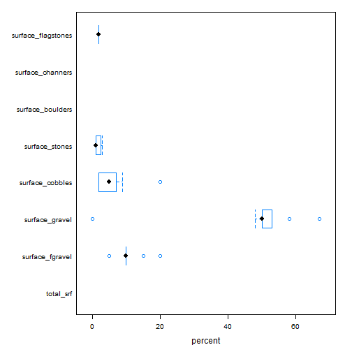
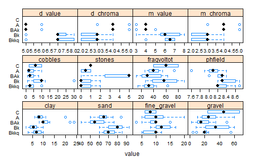
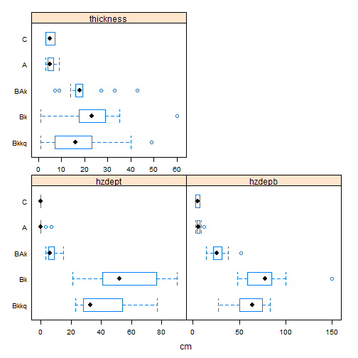
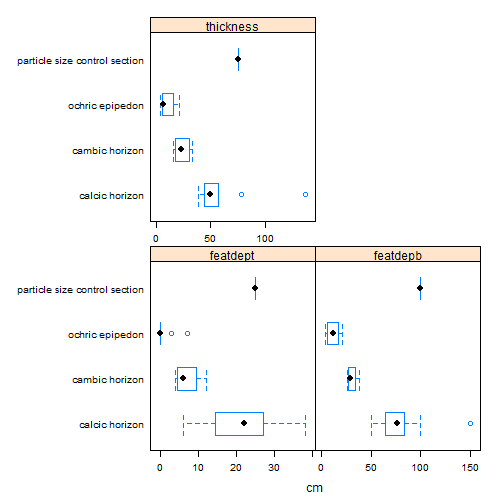

---
output:
  html_document:
    keep_md: yes
---
# Pedon report

```r
# Set soil series
series <- "Lecyr"
```


```
## Error in file(filename, "r", encoding = encoding): cannot open the connection
```

```
## converting Munsell to RGB ...
## replacing missing lower horizon depths with top depth + 1cm ... [2 horizons]
## finding horizonation errors ...
```


## Map of all pedons in selected set
Pedons that do not have their Std_Latitude and Std_Longitude columns populated in the NASIS Site table are currently not ploted on the map.

 


## Soil profile plots (depth, color by genhz, horizonation, and user pedon id)
 


# Summary of Sites

<!-- html table generated in R 3.1.1 by xtable 1.7-4 package -->
<!-- Fri Mar 06 11:13:53 2015 -->
<table border=1>
<tr> <th>  </th> <th> pedon_id </th> <th> taxonname </th> <th> tax_subgroup </th> <th> part_size_class </th> <th> pedon_type </th> <th> describer </th>  </tr>
  <tr> <td align="right"> 1 </td> <td> 1803-072-9 </td> <td> Lecyr </td> <td> petronodic ustic haplocalcids </td> <td> loamy-skeletal </td> <td> correlates to named soil </td> <td> Leon Lato, Stephen Roecker, Carrie-Ann Houdeshell </td> </tr>
  <tr> <td align="right"> 2 </td> <td> 2011CA795024 </td> <td> Lecyr </td> <td> petronodic ustic haplocalcids </td> <td> loamy-skeletal </td> <td> OSD pedon </td> <td> Stephen Roecker, Leon Lato, Carrie-Ann Houdeshell </td> </tr>
  <tr> <td align="right"> 3 </td> <td> 2013CA7950020 </td> <td> Lecyr </td> <td> ustic haplocalcids </td> <td> loamy-skeletal </td> <td> taxadjunct to the series </td> <td> Stephen Roecker </td> </tr>
  <tr> <td align="right"> 4 </td> <td> 1803-072-2 </td> <td> Lecyr </td> <td> petronodic ustic haplocalcids </td> <td> loamy-skeletal </td> <td> correlates to named soil </td> <td> Leon Lato </td> </tr>
  <tr> <td align="right"> 5 </td> <td> 2011CA795025 </td> <td> Lecyr </td> <td> ustic haplocalcids </td> <td> loamy-skeletal </td> <td> taxadjunct to the series </td> <td> Stephen Roecker </td> </tr>
  <tr> <td align="right"> 6 </td> <td> 2011CA795029 </td> <td> Lecyr </td> <td> petronodic ustic haplocalcids </td> <td> loamy-skeletal </td> <td> correlates to named soil </td> <td> Stephen Roecker </td> </tr>
  <tr> <td align="right"> 7 </td> <td> 11CA795134 </td> <td> Lecyr </td> <td> petronodic ustic haplocalcids </td> <td> loamy-skeletal </td> <td> correlates to named soil </td> <td> Emily Meirk </td> </tr>
  <tr> <td align="right"> 8 </td> <td> 2013CA7950022 </td> <td> Lecyr </td> <td> petronodic ustic haplocalcids </td> <td> coarse-loamy </td> <td> taxadjunct to the series </td> <td> Stephen Roecker </td> </tr>
  <tr> <td align="right"> 9 </td> <td> 11CA795135 </td> <td> Lecyr </td> <td> calcic petrocalcids </td> <td> sandy </td> <td> taxadjunct to the series </td> <td> Emily Meirk </td> </tr>
  <tr> <td align="right"> 10 </td> <td> 11CA795121 </td> <td> Lecyr </td> <td> calcic petrocalcids </td> <td> sandy </td> <td> taxadjunct to the series </td> <td> Emily Meirik </td> </tr>
  <tr> <td align="right"> 11 </td> <td> 11CA795123 </td> <td> Lecyr </td> <td> petronodic ustic haplocalcids </td> <td> coarse-loamy </td> <td> taxadjunct to the series </td> <td> Emily Meirik, Stephen Roecker </td> </tr>
   </table>

## Range in characteristics of geographic setting
Five number summary (min, 25th, median, 75th, max)(percentiles) and (n)(total number of observations)

<!-- html table generated in R 3.1.1 by xtable 1.7-4 package -->
<!-- Fri Mar 06 11:13:53 2015 -->
<table border=1>
<caption align="top"> Elevation and slope gradient </caption>
<tr> <th>  </th> <th> value </th> <th> elev_field </th> <th> slope_field </th>  </tr>
  <tr> <td align="right"> 1 </td> <td> (all) </td> <td> (1340, 1384, 1430, 1436, 1477)(11) </td> <td> (17, 20, 25, 26, 29)(11) </td> </tr>
   </table>
<!-- html table generated in R 3.1.1 by xtable 1.7-4 package -->
<!-- Fri Mar 06 11:13:53 2015 -->
<table border=1>
<caption align="top"> Slope aspect </caption>
<tr> <th>  </th> <th> value </th> <th> aspect_field </th>  </tr>
  <tr> <td align="right"> 1 </td> <td> (all) </td> <td> (15, 345, 225, 185, 68)(11) </td> </tr>
   </table>
<!-- html table generated in R 3.1.1 by xtable 1.7-4 package -->
<!-- Fri Mar 06 11:13:53 2015 -->
<table border=1>
<caption align="top"> Parent material vs landform </caption>
<tr> <th>  </th> <th> ballena </th> <th> Sum </th>  </tr>
  <tr> <td align="center"> andesite|limestone and dolomite alluvium|alluvium </td> <td align="center"> 3 </td> <td align="center"> 3 </td> </tr>
  <tr> <td align="center"> andesite|limestone and dolomite colluvium|alluvium </td> <td align="center"> 1 </td> <td align="center"> 1 </td> </tr>
  <tr> <td align="center"> andesite|limestone and dolomite colluvium|colluvium|alluvium|alluvium </td> <td align="center"> 2 </td> <td align="center"> 2 </td> </tr>
  <tr> <td align="center"> basalt|granitoid|limestone and dolomite alluvium|alluvium|alluvium </td> <td align="center"> 1 </td> <td align="center"> 1 </td> </tr>
  <tr> <td align="center"> limestone and dolomite alluvium </td> <td align="center"> 2 </td> <td align="center"> 2 </td> </tr>
  <tr> <td align="center"> limestone and dolomite|andesite alluvium|alluvium </td> <td align="center"> 2 </td> <td align="center"> 2 </td> </tr>
  <tr> <td align="center"> Sum </td> <td align="center"> 11 </td> <td align="center"> 11 </td> </tr>
   </table>
<!-- html table generated in R 3.1.1 by xtable 1.7-4 package -->
<!-- Fri Mar 06 11:13:53 2015 -->
<table border=1>
<caption align="top"> Down slope (y-axis) vs across slope (x-axis) </caption>
<tr> <th>  </th> <th> Convex </th> <th> Linear </th> <th> Concave </th> <th> NA </th> <th> Sum </th>  </tr>
  <tr> <td align="center"> Convex </td> <td align="center"> 1 </td> <td align="center"> 3 </td> <td align="center"> 0 </td> <td align="center"> 0 </td> <td align="center"> 4 </td> </tr>
  <tr> <td align="center"> Linear </td> <td align="center"> 1 </td> <td align="center"> 6 </td> <td align="center"> 0 </td> <td align="center"> 0 </td> <td align="center"> 7 </td> </tr>
  <tr> <td align="center"> Concave </td> <td align="center"> 0 </td> <td align="center"> 0 </td> <td align="center"> 0 </td> <td align="center"> 0 </td> <td align="center"> 0 </td> </tr>
  <tr> <td align="center"> NA </td> <td align="center"> 0 </td> <td align="center"> 0 </td> <td align="center"> 0 </td> <td align="center"> 0 </td> <td align="center"> 0 </td> </tr>
  <tr> <td align="center"> Sum </td> <td align="center"> 2 </td> <td align="center"> 9 </td> <td align="center"> 0 </td> <td align="center"> 0 </td> <td align="center"> 11 </td> </tr>
   </table>
<!-- html table generated in R 3.1.1 by xtable 1.7-4 package -->
<!-- Fri Mar 06 11:13:53 2015 -->
<table border=1>
<caption align="top"> Drainage class vs hillslope position </caption>
<tr> <th>  </th> <th> Summit </th> <th> Shoulder </th> <th> Backslope </th> <th> Footslope </th> <th> Toeslope </th> <th> NA </th> <th> Sum </th>  </tr>
  <tr> <td align="center"> Excessivelly drained </td> <td align="center"> 0 </td> <td align="center"> 0 </td> <td align="center"> 0 </td> <td align="center"> 0 </td> <td align="center"> 0 </td> <td align="center"> 0 </td> <td align="center"> 0 </td> </tr>
  <tr> <td align="center"> Well drained </td> <td align="center"> 0 </td> <td align="center"> 1 </td> <td align="center"> 10 </td> <td align="center"> 0 </td> <td align="center"> 0 </td> <td align="center"> 0 </td> <td align="center"> 11 </td> </tr>
  <tr> <td align="center"> Somewhat excessively well drained </td> <td align="center"> 0 </td> <td align="center"> 0 </td> <td align="center"> 0 </td> <td align="center"> 0 </td> <td align="center"> 0 </td> <td align="center"> 0 </td> <td align="center"> 0 </td> </tr>
  <tr> <td align="center"> Moderately well drained </td> <td align="center"> 0 </td> <td align="center"> 0 </td> <td align="center"> 0 </td> <td align="center"> 0 </td> <td align="center"> 0 </td> <td align="center"> 0 </td> <td align="center"> 0 </td> </tr>
  <tr> <td align="center"> Somewhat poorly drained </td> <td align="center"> 0 </td> <td align="center"> 0 </td> <td align="center"> 0 </td> <td align="center"> 0 </td> <td align="center"> 0 </td> <td align="center"> 0 </td> <td align="center"> 0 </td> </tr>
  <tr> <td align="center"> Poorly drained </td> <td align="center"> 0 </td> <td align="center"> 0 </td> <td align="center"> 0 </td> <td align="center"> 0 </td> <td align="center"> 0 </td> <td align="center"> 0 </td> <td align="center"> 0 </td> </tr>
  <tr> <td align="center"> Very poorly drained </td> <td align="center"> 0 </td> <td align="center"> 0 </td> <td align="center"> 0 </td> <td align="center"> 0 </td> <td align="center"> 0 </td> <td align="center"> 0 </td> <td align="center"> 0 </td> </tr>
  <tr> <td align="center"> Subaqueous drainage </td> <td align="center"> 0 </td> <td align="center"> 0 </td> <td align="center"> 0 </td> <td align="center"> 0 </td> <td align="center"> 0 </td> <td align="center"> 0 </td> <td align="center"> 0 </td> </tr>
  <tr> <td align="center"> NA </td> <td align="center"> 0 </td> <td align="center"> 0 </td> <td align="center"> 0 </td> <td align="center"> 0 </td> <td align="center"> 0 </td> <td align="center"> 0 </td> <td align="center"> 0 </td> </tr>
  <tr> <td align="center"> Sum </td> <td align="center"> 0 </td> <td align="center"> 1 </td> <td align="center"> 10 </td> <td align="center"> 0 </td> <td align="center"> 0 </td> <td align="center"> 0 </td> <td align="center"> 11 </td> </tr>
   </table>


## Range in characteristics of surface rock fragments
Five number summary (min, 25th, median, 75th, max)(percentiles) and (n)(total number of observations)

<!-- html table generated in R 3.1.1 by xtable 1.7-4 package -->
<!-- Fri Mar 06 11:13:53 2015 -->
<table border=1>
<tr> <th>  </th> <th> value </th> <th> total_srf </th> <th> surface_fgravel </th> <th> surface_gravel </th> <th> surface_cobbles </th> <th> surface_stones </th> <th> surface_boulders </th> <th> surface_channers </th> <th> surface_flagstones </th>  </tr>
  <tr> <td align="right"> 1 </td> <td> (all) </td> <td> (NA, NA, NA, NA, NA)(0) </td> <td> (5, 10, 10, 10, 20)(9) </td> <td> (0, 50, 50, 53, 67)(9) </td> <td> (2, 2, 5, 7, 20)(9) </td> <td> (1, 1, 1, 2, 3)(7) </td> <td> (NA, NA, NA, NA, NA)(0) </td> <td> (NA, NA, NA, NA, NA)(0) </td> <td> (2, 2, 2, 2, 2)(1) </td> </tr>
   </table>


## Box plots of surface rock fragments
Graphical five number summary plus outliers (outliers, 5th, 25th, median, 75th, 95th, outliers)

 


# Summary of Pedons
## Horizon designations by generic horizon
Contingency table (counts) 

<!-- html table generated in R 3.1.1 by xtable 1.7-4 package -->
<!-- Fri Mar 06 11:13:53 2015 -->
<table border=1>
<tr> <th>  </th> <th> A </th> <th> Ak </th> <th> B'kk </th> <th> B'kkq </th> <th> BA </th> <th> BAk </th> <th> BAkq </th> <th> Bk </th> <th> Bk1 </th> <th> Bk2 </th> <th> Bkk </th> <th> Bkkq </th> <th> Bkkq1 </th> <th> Bkkq2 </th> <th> Bkkqm </th> <th> Bkq </th> <th> Bkq1 </th> <th> Bkq2 </th> <th> C </th> <th> Sum </th>  </tr>
  <tr> <td align="right"> C </td> <td align="right"> 0 </td> <td align="right"> 0 </td> <td align="right"> 0 </td> <td align="right"> 0 </td> <td align="right"> 0 </td> <td align="right"> 0 </td> <td align="right"> 0 </td> <td align="right"> 0 </td> <td align="right"> 0 </td> <td align="right"> 0 </td> <td align="right"> 0 </td> <td align="right"> 0 </td> <td align="right"> 0 </td> <td align="right"> 0 </td> <td align="right"> 0 </td> <td align="right"> 0 </td> <td align="right"> 0 </td> <td align="right"> 0 </td> <td align="right"> 2 </td> <td align="right"> 2 </td> </tr>
  <tr> <td align="right"> A </td> <td align="right"> 10 </td> <td align="right"> 1 </td> <td align="right"> 0 </td> <td align="right"> 0 </td> <td align="right"> 0 </td> <td align="right"> 0 </td> <td align="right"> 0 </td> <td align="right"> 0 </td> <td align="right"> 0 </td> <td align="right"> 0 </td> <td align="right"> 0 </td> <td align="right"> 0 </td> <td align="right"> 0 </td> <td align="right"> 0 </td> <td align="right"> 0 </td> <td align="right"> 0 </td> <td align="right"> 0 </td> <td align="right"> 0 </td> <td align="right"> 0 </td> <td align="right"> 11 </td> </tr>
  <tr> <td align="right"> BAk </td> <td align="right"> 0 </td> <td align="right"> 0 </td> <td align="right"> 0 </td> <td align="right"> 0 </td> <td align="right"> 1 </td> <td align="right"> 8 </td> <td align="right"> 1 </td> <td align="right"> 3 </td> <td align="right"> 0 </td> <td align="right"> 0 </td> <td align="right"> 0 </td> <td align="right"> 0 </td> <td align="right"> 0 </td> <td align="right"> 0 </td> <td align="right"> 0 </td> <td align="right"> 0 </td> <td align="right"> 0 </td> <td align="right"> 0 </td> <td align="right"> 0 </td> <td align="right"> 13 </td> </tr>
  <tr> <td align="right"> Bk </td> <td align="right"> 0 </td> <td align="right"> 0 </td> <td align="right"> 1 </td> <td align="right"> 1 </td> <td align="right"> 0 </td> <td align="right"> 0 </td> <td align="right"> 0 </td> <td align="right"> 0 </td> <td align="right"> 1 </td> <td align="right"> 1 </td> <td align="right"> 1 </td> <td align="right"> 2 </td> <td align="right"> 0 </td> <td align="right"> 0 </td> <td align="right"> 0 </td> <td align="right"> 2 </td> <td align="right"> 1 </td> <td align="right"> 1 </td> <td align="right"> 0 </td> <td align="right"> 11 </td> </tr>
  <tr> <td align="right"> Bkkq </td> <td align="right"> 0 </td> <td align="right"> 0 </td> <td align="right"> 0 </td> <td align="right"> 0 </td> <td align="right"> 0 </td> <td align="right"> 0 </td> <td align="right"> 0 </td> <td align="right"> 1 </td> <td align="right"> 0 </td> <td align="right"> 0 </td> <td align="right"> 2 </td> <td align="right"> 4 </td> <td align="right"> 1 </td> <td align="right"> 1 </td> <td align="right"> 4 </td> <td align="right"> 0 </td> <td align="right"> 0 </td> <td align="right"> 0 </td> <td align="right"> 0 </td> <td align="right"> 13 </td> </tr>
  <tr> <td align="right"> Bkq </td> <td align="right"> 0 </td> <td align="right"> 0 </td> <td align="right"> 0 </td> <td align="right"> 0 </td> <td align="right"> 0 </td> <td align="right"> 0 </td> <td align="right"> 0 </td> <td align="right"> 0 </td> <td align="right"> 0 </td> <td align="right"> 0 </td> <td align="right"> 0 </td> <td align="right"> 0 </td> <td align="right"> 0 </td> <td align="right"> 0 </td> <td align="right"> 0 </td> <td align="right"> 0 </td> <td align="right"> 0 </td> <td align="right"> 0 </td> <td align="right"> 0 </td> <td align="right"> 0 </td> </tr>
  <tr> <td align="right"> Sum </td> <td align="right"> 10 </td> <td align="right"> 1 </td> <td align="right"> 1 </td> <td align="right"> 1 </td> <td align="right"> 1 </td> <td align="right"> 8 </td> <td align="right"> 1 </td> <td align="right"> 4 </td> <td align="right"> 1 </td> <td align="right"> 1 </td> <td align="right"> 3 </td> <td align="right"> 6 </td> <td align="right"> 1 </td> <td align="right"> 1 </td> <td align="right"> 4 </td> <td align="right"> 2 </td> <td align="right"> 1 </td> <td align="right"> 1 </td> <td align="right"> 2 </td> <td align="right"> 50 </td> </tr>
   </table>


## Range in characteristics for generic horizons 
Five number summary (min, 25th, median, 75th, max)(percentiles) and (n)(total number of observations)

<!-- html table generated in R 3.1.1 by xtable 1.7-4 package -->
<!-- Fri Mar 06 11:13:53 2015 -->
<table border=1>
<tr> <th> genhz </th> <th> clay </th> <th> sand </th> <th> fine_gravel </th> <th> gravel </th> <th> cobbles </th> <th> stones </th> <th> fragvoltot </th>  </tr>
  <tr> <td align="center"> C </td> <td align="center"> (NA, NA, NA, NA, NA)(0) </td> <td align="center"> (NA, NA, NA, NA, NA)(0) </td> <td align="center"> (6, 7, 8, 9, 10)(2) </td> <td align="center"> (24, 35, 46, 56, 67)(2) </td> <td align="center"> (2, 4, 6, 8, 10)(2) </td> <td align="center"> (1, 1, 1, 1, 1)(1) </td> <td align="center"> (40, 50, 60, 70, 80)(2) </td> </tr>
  <tr> <td align="center"> A </td> <td align="center"> (6, 8, 8, 10, 20)(11) </td> <td align="center"> (50, 60, 65, 68, 84)(11) </td> <td align="center"> (5, 6, 10, 12, 20)(11) </td> <td align="center"> (10, 16, 25, 35, 60)(11) </td> <td align="center"> (1, 1, 2, 4, 10)(10) </td> <td align="center"> (0, 0, 0, 1, 1)(2) </td> <td align="center"> (26, 32, 40, 48, 73)(11) </td> </tr>
  <tr> <td align="center"> BAk </td> <td align="center"> (8, 10, 10, 12, 24)(13) </td> <td align="center"> (40, 50, 55, 65, 76)(13) </td> <td align="center"> (3, 8, 10, 10, 15)(13) </td> <td align="center"> (2, 10, 15, 25, 50)(13) </td> <td align="center"> (1, 2, 2, 5, 8)(12) </td> <td align="center"> (0, 2, 5, 5, 5)(3) </td> <td align="center"> (12, 21, 30, 52, 63)(13) </td> </tr>
  <tr> <td align="center"> Bk </td> <td align="center"> (2, 4, 6, 7, 10)(10) </td> <td align="center"> (60, 70, 80, 84, 93)(10) </td> <td align="center"> (8, 10, 12, 15, 17)(11) </td> <td align="center"> (8, 21, 35, 52, 60)(11) </td> <td align="center"> (1, 5, 10, 10, 30)(11) </td> <td align="center"> (0, 0, 0, 1, 2)(3) </td> <td align="center"> (27, 38, 57, 78, 90)(11) </td> </tr>
  <tr> <td align="center"> Bkkq </td> <td align="center"> (3, 6, 7, 9, 10)(11) </td> <td align="center"> (60, 65, 70, 76, 85)(11) </td> <td align="center"> (5, 6, 10, 10, 12)(11) </td> <td align="center"> (4, 19, 20, 22, 55)(11) </td> <td align="center"> (0, 2, 2, 5, 10)(10) </td> <td align="center"> (0, 0, 0, 1, 2)(3) </td> <td align="center"> (15, 27, 33, 39, 63)(12) </td> </tr>
   </table>
<!-- html table generated in R 3.1.1 by xtable 1.7-4 package -->
<!-- Fri Mar 06 11:13:53 2015 -->
<table border=1>
<tr> <th> genhz </th> <th> phfield </th> <th> d_value </th> <th> d_chroma </th> <th> m_value </th> <th> m_chroma </th>  </tr>
  <tr> <td align="center"> C </td> <td align="center"> (NA, NA, NA, NA, NA)(0) </td> <td align="center"> (NA, NA, NA, NA, NA)(0) </td> <td align="center"> (NA, NA, NA, NA, NA)(0) </td> <td align="center"> (NA, NA, NA, NA, NA)(0) </td> <td align="center"> (NA, NA, NA, NA, NA)(0) </td> </tr>
  <tr> <td align="center"> A </td> <td align="center"> (7.6, 8, 8.1, 8.2, 8.4)(9) </td> <td align="center"> (5, 5, 5, 5, 6)(10) </td> <td align="center"> (3, 4, 4, 4, 5)(10) </td> <td align="center"> (3, 4, 4, 4, 4)(10) </td> <td align="center"> (3, 4, 4, 4, 5)(10) </td> </tr>
  <tr> <td align="center"> BAk </td> <td align="center"> (8, 8.2, 8.3, 8.3, 8.4)(10) </td> <td align="center"> (5, 5, 5, 5, 6)(12) </td> <td align="center"> (4, 4, 4, 4, 5)(12) </td> <td align="center"> (3, 4, 4, 4, 5)(12) </td> <td align="center"> (4, 4, 4, 4, 5)(12) </td> </tr>
  <tr> <td align="center"> Bk </td> <td align="center"> (8.2, 8.3, 8.3, 8.6, 8.7)(5) </td> <td align="center"> (5, 7, 7, 7, 8)(8) </td> <td align="center"> (2, 2, 3, 3, 4)(8) </td> <td align="center"> (3, 6, 6, 7, 8)(8) </td> <td align="center"> (2, 2, 3, 3, 4)(8) </td> </tr>
  <tr> <td align="center"> Bkkq </td> <td align="center"> (8.2, 8.2, 8.2, 8.4, 8.7)(9) </td> <td align="center"> (5, 7, 7, 8, 8)(13) </td> <td align="center"> (2, 2, 3, 3, 4)(13) </td> <td align="center"> (4, 6, 6, 7, 7)(12) </td> <td align="center"> (2, 2, 3, 3, 4)(13) </td> </tr>
   </table>


## Box plots of numeric variables by generic horizon
Graphical five number summary plus outliers (outliers, 5th, 25th, median, 75th, 95th, outliers)

 


## Texture by generic horizon
Contigency table (counts) 

<!-- html table generated in R 3.1.1 by xtable 1.7-4 package -->
<!-- Fri Mar 06 11:13:53 2015 -->
<table border=1>
<tr> <th>  </th> <th> cb </th> <th> gr </th> <th> l </th> <th> ls </th> <th> mat </th> <th> s </th> <th> sl </th> <th> Sum </th>  </tr>
  <tr> <td align="center"> C </td> <td align="center"> 0 </td> <td align="center"> 2 </td> <td align="center"> 0 </td> <td align="center"> 0 </td> <td align="center"> 0 </td> <td align="center"> 0 </td> <td align="center"> 0 </td> <td align="center"> 2 </td> </tr>
  <tr> <td align="center"> A </td> <td align="center"> 0 </td> <td align="center"> 0 </td> <td align="center"> 1 </td> <td align="center"> 1 </td> <td align="center"> 0 </td> <td align="center"> 0 </td> <td align="center"> 9 </td> <td align="center"> 11 </td> </tr>
  <tr> <td align="center"> BAk </td> <td align="center"> 0 </td> <td align="center"> 0 </td> <td align="center"> 3 </td> <td align="center"> 0 </td> <td align="center"> 0 </td> <td align="center"> 0 </td> <td align="center"> 10 </td> <td align="center"> 13 </td> </tr>
  <tr> <td align="center"> Bk </td> <td align="center"> 1 </td> <td align="center"> 0 </td> <td align="center"> 0 </td> <td align="center"> 4 </td> <td align="center"> 0 </td> <td align="center"> 2 </td> <td align="center"> 4 </td> <td align="center"> 11 </td> </tr>
  <tr> <td align="center"> Bkkq </td> <td align="center"> 0 </td> <td align="center"> 0 </td> <td align="center"> 0 </td> <td align="center"> 2 </td> <td align="center"> 2 </td> <td align="center"> 0 </td> <td align="center"> 9 </td> <td align="center"> 13 </td> </tr>
  <tr> <td align="center"> Bkq </td> <td align="center"> 0 </td> <td align="center"> 0 </td> <td align="center"> 0 </td> <td align="center"> 0 </td> <td align="center"> 0 </td> <td align="center"> 0 </td> <td align="center"> 0 </td> <td align="center"> 0 </td> </tr>
  <tr> <td align="center"> Sum </td> <td align="center"> 1 </td> <td align="center"> 2 </td> <td align="center"> 4 </td> <td align="center"> 7 </td> <td align="center"> 2 </td> <td align="center"> 2 </td> <td align="center"> 32 </td> <td align="center"> 50 </td> </tr>
   </table>


## Tex Mod & Class by generic horizon
Contigency table (counts) 

<!-- html table generated in R 3.1.1 by xtable 1.7-4 package -->
<!-- Fri Mar 06 11:13:53 2015 -->
<table border=1>
<tr> <th>  </th> <th> CB </th> <th> CEM-GR-LS </th> <th> CEM-GR-SL </th> <th> CEM-GRV-SL </th> <th> CEM-MAT </th> <th> GR </th> <th> GR-CEM-MAT </th> <th> GR-L </th> <th> GR-LS </th> <th> GR-SL </th> <th> GRV-L </th> <th> GRV-LS </th> <th> GRV-S </th> <th> GRV-SL </th> <th> GRX-LS </th> <th> GRX-S </th> <th> GRX-SL </th> <th> L </th> <th> Sum </th>  </tr>
  <tr> <td align="center"> C </td> <td align="center"> 0 </td> <td align="center"> 0 </td> <td align="center"> 0 </td> <td align="center"> 0 </td> <td align="center"> 0 </td> <td align="center"> 2 </td> <td align="center"> 0 </td> <td align="center"> 0 </td> <td align="center"> 0 </td> <td align="center"> 0 </td> <td align="center"> 0 </td> <td align="center"> 0 </td> <td align="center"> 0 </td> <td align="center"> 0 </td> <td align="center"> 0 </td> <td align="center"> 0 </td> <td align="center"> 0 </td> <td align="center"> 0 </td> <td align="center"> 2 </td> </tr>
  <tr> <td align="center"> A </td> <td align="center"> 0 </td> <td align="center"> 0 </td> <td align="center"> 0 </td> <td align="center"> 0 </td> <td align="center"> 0 </td> <td align="center"> 0 </td> <td align="center"> 0 </td> <td align="center"> 0 </td> <td align="center"> 1 </td> <td align="center"> 1 </td> <td align="center"> 1 </td> <td align="center"> 0 </td> <td align="center"> 0 </td> <td align="center"> 7 </td> <td align="center"> 0 </td> <td align="center"> 0 </td> <td align="center"> 1 </td> <td align="center"> 0 </td> <td align="center"> 11 </td> </tr>
  <tr> <td align="center"> BAk </td> <td align="center"> 0 </td> <td align="center"> 0 </td> <td align="center"> 0 </td> <td align="center"> 0 </td> <td align="center"> 0 </td> <td align="center"> 0 </td> <td align="center"> 0 </td> <td align="center"> 1 </td> <td align="center"> 0 </td> <td align="center"> 4 </td> <td align="center"> 1 </td> <td align="center"> 0 </td> <td align="center"> 0 </td> <td align="center"> 4 </td> <td align="center"> 0 </td> <td align="center"> 0 </td> <td align="center"> 2 </td> <td align="center"> 1 </td> <td align="center"> 13 </td> </tr>
  <tr> <td align="center"> Bk </td> <td align="center"> 1 </td> <td align="center"> 0 </td> <td align="center"> 0 </td> <td align="center"> 0 </td> <td align="center"> 0 </td> <td align="center"> 0 </td> <td align="center"> 0 </td> <td align="center"> 0 </td> <td align="center"> 1 </td> <td align="center"> 1 </td> <td align="center"> 0 </td> <td align="center"> 2 </td> <td align="center"> 1 </td> <td align="center"> 1 </td> <td align="center"> 1 </td> <td align="center"> 1 </td> <td align="center"> 2 </td> <td align="center"> 0 </td> <td align="center"> 11 </td> </tr>
  <tr> <td align="center"> Bkkq </td> <td align="center"> 0 </td> <td align="center"> 2 </td> <td align="center"> 1 </td> <td align="center"> 2 </td> <td align="center"> 1 </td> <td align="center"> 0 </td> <td align="center"> 1 </td> <td align="center"> 0 </td> <td align="center"> 0 </td> <td align="center"> 2 </td> <td align="center"> 0 </td> <td align="center"> 0 </td> <td align="center"> 0 </td> <td align="center"> 3 </td> <td align="center"> 0 </td> <td align="center"> 0 </td> <td align="center"> 1 </td> <td align="center"> 0 </td> <td align="center"> 13 </td> </tr>
  <tr> <td align="center"> Bkq </td> <td align="center"> 0 </td> <td align="center"> 0 </td> <td align="center"> 0 </td> <td align="center"> 0 </td> <td align="center"> 0 </td> <td align="center"> 0 </td> <td align="center"> 0 </td> <td align="center"> 0 </td> <td align="center"> 0 </td> <td align="center"> 0 </td> <td align="center"> 0 </td> <td align="center"> 0 </td> <td align="center"> 0 </td> <td align="center"> 0 </td> <td align="center"> 0 </td> <td align="center"> 0 </td> <td align="center"> 0 </td> <td align="center"> 0 </td> <td align="center"> 0 </td> </tr>
  <tr> <td align="center"> Sum </td> <td align="center"> 1 </td> <td align="center"> 2 </td> <td align="center"> 1 </td> <td align="center"> 2 </td> <td align="center"> 1 </td> <td align="center"> 2 </td> <td align="center"> 1 </td> <td align="center"> 1 </td> <td align="center"> 2 </td> <td align="center"> 8 </td> <td align="center"> 2 </td> <td align="center"> 2 </td> <td align="center"> 1 </td> <td align="center"> 15 </td> <td align="center"> 1 </td> <td align="center"> 1 </td> <td align="center"> 6 </td> <td align="center"> 1 </td> <td align="center"> 50 </td> </tr>
   </table>


## Dry hue by generic horizon
Contingency table (counts) 

<!-- html table generated in R 3.1.1 by xtable 1.7-4 package -->
<!-- Fri Mar 06 11:13:54 2015 -->
<table border=1>
<tr> <th>  </th> <th> 10YR </th> <th> NA </th> <th> Sum </th>  </tr>
  <tr> <td align="center"> C </td> <td align="center"> 0 </td> <td align="center"> 2 </td> <td align="center"> 2 </td> </tr>
  <tr> <td align="center"> A </td> <td align="center"> 10 </td> <td align="center"> 1 </td> <td align="center"> 11 </td> </tr>
  <tr> <td align="center"> BAk </td> <td align="center"> 12 </td> <td align="center"> 1 </td> <td align="center"> 13 </td> </tr>
  <tr> <td align="center"> Bk </td> <td align="center"> 8 </td> <td align="center"> 3 </td> <td align="center"> 11 </td> </tr>
  <tr> <td align="center"> Bkkq </td> <td align="center"> 13 </td> <td align="center"> 0 </td> <td align="center"> 13 </td> </tr>
  <tr> <td align="center"> Bkq </td> <td align="center"> 0 </td> <td align="center"> 0 </td> <td align="center"> 0 </td> </tr>
  <tr> <td align="center"> Sum </td> <td align="center"> 43 </td> <td align="center"> 7 </td> <td align="center"> 50 </td> </tr>
   </table>


## Moist hue by generic horizon
Contingency table (counts) 

<!-- html table generated in R 3.1.1 by xtable 1.7-4 package -->
<!-- Fri Mar 06 11:13:54 2015 -->
<table border=1>
<tr> <th>  </th> <th> 10YR </th> <th> 7.5YR </th> <th> NA </th> <th> Sum </th>  </tr>
  <tr> <td align="center"> C </td> <td align="center"> 0 </td> <td align="center"> 0 </td> <td align="center"> 2 </td> <td align="center"> 2 </td> </tr>
  <tr> <td align="center"> A </td> <td align="center"> 9 </td> <td align="center"> 1 </td> <td align="center"> 1 </td> <td align="center"> 11 </td> </tr>
  <tr> <td align="center"> BAk </td> <td align="center"> 10 </td> <td align="center"> 2 </td> <td align="center"> 1 </td> <td align="center"> 13 </td> </tr>
  <tr> <td align="center"> Bk </td> <td align="center"> 8 </td> <td align="center"> 0 </td> <td align="center"> 3 </td> <td align="center"> 11 </td> </tr>
  <tr> <td align="center"> Bkkq </td> <td align="center"> 12 </td> <td align="center"> 0 </td> <td align="center"> 1 </td> <td align="center"> 13 </td> </tr>
  <tr> <td align="center"> Bkq </td> <td align="center"> 0 </td> <td align="center"> 0 </td> <td align="center"> 0 </td> <td align="center"> 0 </td> </tr>
  <tr> <td align="center"> Sum </td> <td align="center"> 39 </td> <td align="center"> 3 </td> <td align="center"> 8 </td> <td align="center"> 50 </td> </tr>
   </table>


## Effervescence by generic horizon
Contingency table (counts) 

<!-- html table generated in R 3.1.1 by xtable 1.7-4 package -->
<!-- Fri Mar 06 11:13:54 2015 -->
<table border=1>
<tr> <th>  </th> <th> NA </th> <th> slight </th> <th> strong </th> <th> very slight </th> <th> violent </th> <th> Sum </th>  </tr>
  <tr> <td align="center"> C </td> <td align="center"> 2 </td> <td align="center"> 0 </td> <td align="center"> 0 </td> <td align="center"> 0 </td> <td align="center"> 0 </td> <td align="center"> 2 </td> </tr>
  <tr> <td align="center"> A </td> <td align="center"> 0 </td> <td align="center"> 0 </td> <td align="center"> 4 </td> <td align="center"> 1 </td> <td align="center"> 6 </td> <td align="center"> 11 </td> </tr>
  <tr> <td align="center"> BAk </td> <td align="center"> 0 </td> <td align="center"> 1 </td> <td align="center"> 0 </td> <td align="center"> 0 </td> <td align="center"> 12 </td> <td align="center"> 13 </td> </tr>
  <tr> <td align="center"> Bk </td> <td align="center"> 1 </td> <td align="center"> 0 </td> <td align="center"> 0 </td> <td align="center"> 0 </td> <td align="center"> 10 </td> <td align="center"> 11 </td> </tr>
  <tr> <td align="center"> Bkkq </td> <td align="center"> 1 </td> <td align="center"> 0 </td> <td align="center"> 1 </td> <td align="center"> 0 </td> <td align="center"> 11 </td> <td align="center"> 13 </td> </tr>
  <tr> <td align="center"> Bkq </td> <td align="center"> 0 </td> <td align="center"> 0 </td> <td align="center"> 0 </td> <td align="center"> 0 </td> <td align="center"> 0 </td> <td align="center"> 0 </td> </tr>
  <tr> <td align="center"> Sum </td> <td align="center"> 4 </td> <td align="center"> 1 </td> <td align="center"> 5 </td> <td align="center"> 1 </td> <td align="center"> 39 </td> <td align="center"> 50 </td> </tr>
   </table>


## Depths and thickness of generic horizons
Five number summary (min, 25th, median, 75th, max)(percentiles) and (n)(total number of observations)

<!-- html table generated in R 3.1.1 by xtable 1.7-4 package -->
<!-- Fri Mar 06 11:13:54 2015 -->
<table border=1>
<tr> <th>  </th> <th> genhz </th> <th> hzdept </th> <th> hzdepb </th> <th> thickness </th>  </tr>
  <tr> <td align="center"> 1 </td> <td align="center"> C </td> <td align="center"> (0, 0, 0, 0, 0)(2) </td> <td align="center"> (3, 4, 5, 6, 7)(2) </td> <td align="center"> (3, 4, 5, 6, 7)(2) </td> </tr>
  <tr> <td align="center"> 2 </td> <td align="center"> A </td> <td align="center"> (0, 0, 0, 0, 7)(11) </td> <td align="center"> (3, 4, 6, 7, 12)(11) </td> <td align="center"> (3, 4, 5, 6, 9)(11) </td> </tr>
  <tr> <td align="center"> 3 </td> <td align="center"> BAk </td> <td align="center"> (3, 5, 6, 9, 15)(13) </td> <td align="center"> (14, 22, 26, 31, 52)(13) </td> <td align="center"> (7, 16, 18, 19, 43)(13) </td> </tr>
  <tr> <td align="center"> 4 </td> <td align="center"> Bk </td> <td align="center"> (21, 41, 52, 76, 90)(11) </td> <td align="center"> (48, 59, 78, 85, 150)(11) </td> <td align="center"> (1, 18, 23, 29, 60)(11) </td> </tr>
  <tr> <td align="center"> 5 </td> <td align="center"> Bkkq </td> <td align="center"> (23, 28, 33, 54, 77)(13) </td> <td align="center"> (27, 50, 64, 75, 83)(13) </td> <td align="center"> (1, 7, 16, 23, 49)(13) </td> </tr>
   </table>


## Boxplot of generic horizon thicknesses
Graphical five number summary plus outliers (outliers, 5th, 25th, median, 75th, 95th, outliers)(percentiles)

 


## Depths and thickness of diagnostic horizons and features
Five number summary (min, 25th, median, 75th, max)(percentiles) and (n)(total number of observations)

<!-- html table generated in R 3.1.1 by xtable 1.7-4 package -->
<!-- Fri Mar 06 11:13:54 2015 -->
<table border=1>
<tr> <th>  </th> <th> diag_kind </th> <th> featdept </th> <th> featdepb </th> <th> thickness </th>  </tr>
  <tr> <td align="center"> 1 </td> <td align="center"> calcic horizon </td> <td align="center"> (6, 14, 22, 27, 38)(11) </td> <td align="center"> (50, 66, 76, 82, 150)(10) </td> <td align="center"> (39, 44, 50, 56, 136)(10) </td> </tr>
  <tr> <td align="center"> 2 </td> <td align="center"> cambic horizon </td> <td align="center"> (4, 5, 6, 8, 12)(4) </td> <td align="center"> (26, 28, 30, 33, 38)(4) </td> <td align="center"> (16, 18, 23, 28, 33)(4) </td> </tr>
  <tr> <td align="center"> 3 </td> <td align="center"> ochric epipedon </td> <td align="center"> (0, 0, 0, 0, 7)(11) </td> <td align="center"> (4, 6, 12, 16, 21)(11) </td> <td align="center"> (4, 6, 7, 16, 21)(11) </td> </tr>
  <tr> <td align="center"> 4 </td> <td align="center"> particle size control section </td> <td align="center"> (25, 25, 25, 25, 25)(10) </td> <td align="center"> (100, 100, 100, 100, 100)(10) </td> <td align="center"> (75, 75, 75, 75, 75)(10) </td> </tr>
   </table>


## Boxplot of diagnostic horizons and features depth
Graphical five number summary plus outliers (outliers, 5th, 25th, median, 75th, 95th, outliers)(percentiles)

 
