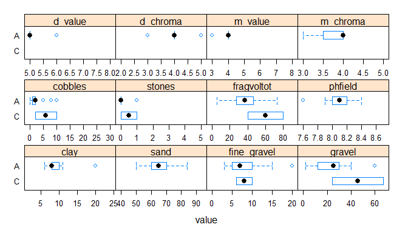
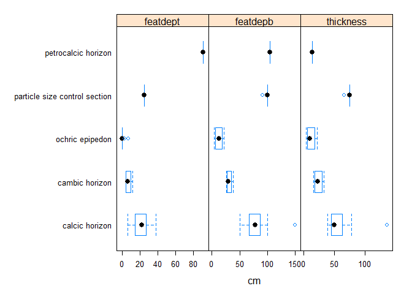

Pedon report
============

    # Set soil series
    series <- "Lecyr"

    ## converting Munsell to RGB ...
    ## replacing missing lower horizon depths with top depth + 1cm ... [2 horizons]
    ## finding horizonation errors ...

Map of all pedons in selected set
---------------------------------

Pedons that do not have their Std\_Latitude and Std\_Longitude columns
populated in the NASIS Site table are currently not ploted on the map.

Soil profile plots (depth, color by genhz, horizonation, and user pedon id)
---------------------------------------------------------------------------

Summary of Sites
================

<!-- html table generated in R 3.1.1 by xtable 1.7-4 package -->
<!-- Tue Mar 31 12:06:16 2015 -->
<table border=1>
<tr> <th>  </th> <th> 
pedon\_id
</th> <th> 
taxonname
</th> <th> 
tax\_subgroup
</th> <th> 
part\_size\_class
</th> <th> 
pedon\_type
</th> <th> 
describer
</th>  </tr>
  <tr> <td align="right"> 
1
</td> <td> 
1803-072-9
</td> <td> 
Lecyr
</td> <td> 
petronodic ustic haplocalcids
</td> <td> 
loamy-skeletal
</td> <td> 
correlates to named soil
</td> <td> 
Leon Lato, Stephen Roecker, Carrie-Ann Houdeshell
</td> </tr>
  <tr> <td align="right"> 
2
</td> <td> 
2011CA795024
</td> <td> 
Lecyr
</td> <td> 
petronodic ustic haplocalcids
</td> <td> 
loamy-skeletal
</td> <td> 
OSD pedon
</td> <td> 
Stephen Roecker, Leon Lato, Carrie-Ann Houdeshell
</td> </tr>
  <tr> <td align="right"> 
3
</td> <td> 
2011CA795055
</td> <td> 
Bluesnake
</td> <td> 
calcic petrocalcids
</td> <td> 
coarse-loamy
</td> <td> 
NA
</td> <td> 
Stephen Roecker
</td> </tr>
  <tr> <td align="right"> 
4
</td> <td> 
2013CA7950020
</td> <td> 
Lecyr
</td> <td> 
ustic haplocalcids
</td> <td> 
loamy-skeletal
</td> <td> 
taxadjunct to the series
</td> <td> 
Stephen Roecker
</td> </tr>
  <tr> <td align="right"> 
5
</td> <td> 
1803-072-2
</td> <td> 
Lecyr
</td> <td> 
petronodic ustic haplocalcids
</td> <td> 
loamy-skeletal
</td> <td> 
correlates to named soil
</td> <td> 
Leon Lato
</td> </tr>
  <tr> <td align="right"> 
6
</td> <td> 
2011CA795025
</td> <td> 
Lecyr
</td> <td> 
ustic haplocalcids
</td> <td> 
loamy-skeletal
</td> <td> 
taxadjunct to the series
</td> <td> 
Stephen Roecker
</td> </tr>
  <tr> <td align="right"> 
7
</td> <td> 
2011CA795029
</td> <td> 
Lecyr
</td> <td> 
petronodic ustic haplocalcids
</td> <td> 
loamy-skeletal
</td> <td> 
correlates to named soil
</td> <td> 
Stephen Roecker
</td> </tr>
  <tr> <td align="right"> 
8
</td> <td> 
11CA795134
</td> <td> 
Lecyr
</td> <td> 
petronodic ustic haplocalcids
</td> <td> 
loamy-skeletal
</td> <td> 
correlates to named soil
</td> <td> 
Emily Meirk
</td> </tr>
  <tr> <td align="right"> 
9
</td> <td> 
2013CA7950022
</td> <td> 
Lecyr
</td> <td> 
petronodic ustic haplocalcids
</td> <td> 
coarse-loamy
</td> <td> 
taxadjunct to the series
</td> <td> 
Stephen Roecker
</td> </tr>
  <tr> <td align="right"> 
10
</td> <td> 
11CA795135
</td> <td> 
Lecyr
</td> <td> 
calcic petrocalcids
</td> <td> 
sandy
</td> <td> 
taxadjunct to the series
</td> <td> 
Emily Meirk
</td> </tr>
  <tr> <td align="right"> 
11
</td> <td> 
11CA795121
</td> <td> 
Lecyr
</td> <td> 
calcic petrocalcids
</td> <td> 
sandy
</td> <td> 
taxadjunct to the series
</td> <td> 
Emily Meirik
</td> </tr>
  <tr> <td align="right"> 
12
</td> <td> 
11CA795123
</td> <td> 
Lecyr
</td> <td> 
petronodic ustic haplocalcids
</td> <td> 
coarse-loamy
</td> <td> 
taxadjunct to the series
</td> <td> 
Emily Meirik, Stephen Roecker
</td> </tr>
   </table>

Range in characteristics of geographic setting
----------------------------------------------

Five number summary (min, 25th, median, 75th, max)(percentiles) and
(n)(total number of observations)

<!-- html table generated in R 3.1.1 by xtable 1.7-4 package -->
<!-- Tue Mar 31 12:06:16 2015 -->
<table border=1>
<caption align="top"> 
Elevation and slope gradient
</caption>
<tr> <th>  </th> <th> 
value
</th> <th> 
elev\_field
</th> <th> 
slope\_field
</th>  </tr>
  <tr> <td align="right"> 
1
</td> <td> 
(all)
</td> <td> 
(1340, 1396, 1422, 1436, 1477)(12)
</td> <td> 
(2, 19, 25, 26, 29)(12)
</td> </tr>
   </table>
<!-- html table generated in R 3.1.1 by xtable 1.7-4 package -->
<!-- Tue Mar 31 12:06:16 2015 -->
<table border=1>
<caption align="top"> 
Slope aspect
</caption>
<tr> <th>  </th> <th> 
value
</th> <th> 
aspect\_field
</th>  </tr>
  <tr> <td align="right"> 
1
</td> <td> 
(all)
</td> <td> 
(15, 340, 236, 185, 68)(12)
</td> </tr>
   </table>
<!-- html table generated in R 3.1.1 by xtable 1.7-4 package -->
<!-- Tue Mar 31 12:06:16 2015 -->
<table border=1>
<caption align="top"> 
Parent material vs landform
</caption>
<tr> <th>  </th> <th> 
ballena
</th> <th> 
fan remnant
</th> <th> 
Sum
</th>  </tr>
  <tr> <td align="center"> 
andesite|limestone and dolomite alluvium|alluvium
</td> <td align="center"> 
5
</td> <td align="center"> 
0
</td> <td align="center"> 
5
</td> </tr>
  <tr> <td align="center"> 
andesite|limestone and dolomite colluvium|alluvium
</td> <td align="center"> 
1
</td> <td align="center"> 
0
</td> <td align="center"> 
1
</td> </tr>
  <tr> <td align="center"> 
andesite|limestone and dolomite colluvium|colluvium|alluvium|alluvium
</td> <td align="center"> 
2
</td> <td align="center"> 
0
</td> <td align="center"> 
2
</td> </tr>
  <tr> <td align="center"> 
basalt|dolomite (dolostone) alluvium|alluvium
</td> <td align="center"> 
0
</td> <td align="center"> 
1
</td> <td align="center"> 
1
</td> </tr>
  <tr> <td align="center"> 
basalt|granitoid|limestone and dolomite alluvium|alluvium|alluvium
</td> <td align="center"> 
1
</td> <td align="center"> 
0
</td> <td align="center"> 
1
</td> </tr>
  <tr> <td align="center"> 
limestone and dolomite alluvium
</td> <td align="center"> 
2
</td> <td align="center"> 
0
</td> <td align="center"> 
2
</td> </tr>
  <tr> <td align="center"> 
Sum
</td> <td align="center"> 
11
</td> <td align="center"> 
1
</td> <td align="center"> 
12
</td> </tr>
   </table>
<!-- html table generated in R 3.1.1 by xtable 1.7-4 package -->
<!-- Tue Mar 31 12:06:16 2015 -->
<table border=1>
<caption align="top"> 
Down slope (y-axis) vs across slope (x-axis)
</caption>
<tr> <th>  </th> <th> 
Convex
</th> <th> 
Linear
</th> <th> 
Concave
</th> <th> 
NA
</th> <th> 
Sum
</th>  </tr>
  <tr> <td align="center"> 
Convex
</td> <td align="center"> 
1
</td> <td align="center"> 
4
</td> <td align="center"> 
0
</td> <td align="center"> 
0
</td> <td align="center"> 
5
</td> </tr>
  <tr> <td align="center"> 
Linear
</td> <td align="center"> 
1
</td> <td align="center"> 
6
</td> <td align="center"> 
0
</td> <td align="center"> 
0
</td> <td align="center"> 
7
</td> </tr>
  <tr> <td align="center"> 
Concave
</td> <td align="center"> 
0
</td> <td align="center"> 
0
</td> <td align="center"> 
0
</td> <td align="center"> 
0
</td> <td align="center"> 
0
</td> </tr>
  <tr> <td align="center"> 
NA
</td> <td align="center"> 
0
</td> <td align="center"> 
0
</td> <td align="center"> 
0
</td> <td align="center"> 
0
</td> <td align="center"> 
0
</td> </tr>
  <tr> <td align="center"> 
Sum
</td> <td align="center"> 
2
</td> <td align="center"> 
10
</td> <td align="center"> 
0
</td> <td align="center"> 
0
</td> <td align="center"> 
12
</td> </tr>
   </table>
<!-- html table generated in R 3.1.1 by xtable 1.7-4 package -->
<!-- Tue Mar 31 12:06:16 2015 -->
<table border=1>
<caption align="top"> 
Drainage class vs hillslope position
</caption>
<tr> <th>  </th> <th> 
Summit
</th> <th> 
Shoulder
</th> <th> 
Backslope
</th> <th> 
Footslope
</th> <th> 
Toeslope
</th> <th> 
NA
</th> <th> 
Sum
</th>  </tr>
  <tr> <td align="center"> 
Excessivelly drained
</td> <td align="center"> 
0
</td> <td align="center"> 
0
</td> <td align="center"> 
0
</td> <td align="center"> 
0
</td> <td align="center"> 
0
</td> <td align="center"> 
0
</td> <td align="center"> 
0
</td> </tr>
  <tr> <td align="center"> 
Well drained
</td> <td align="center"> 
1
</td> <td align="center"> 
1
</td> <td align="center"> 
10
</td> <td align="center"> 
0
</td> <td align="center"> 
0
</td> <td align="center"> 
0
</td> <td align="center"> 
12
</td> </tr>
  <tr> <td align="center"> 
Somewhat excessively well drained
</td> <td align="center"> 
0
</td> <td align="center"> 
0
</td> <td align="center"> 
0
</td> <td align="center"> 
0
</td> <td align="center"> 
0
</td> <td align="center"> 
0
</td> <td align="center"> 
0
</td> </tr>
  <tr> <td align="center"> 
Moderately well drained
</td> <td align="center"> 
0
</td> <td align="center"> 
0
</td> <td align="center"> 
0
</td> <td align="center"> 
0
</td> <td align="center"> 
0
</td> <td align="center"> 
0
</td> <td align="center"> 
0
</td> </tr>
  <tr> <td align="center"> 
Somewhat poorly drained
</td> <td align="center"> 
0
</td> <td align="center"> 
0
</td> <td align="center"> 
0
</td> <td align="center"> 
0
</td> <td align="center"> 
0
</td> <td align="center"> 
0
</td> <td align="center"> 
0
</td> </tr>
  <tr> <td align="center"> 
Poorly drained
</td> <td align="center"> 
0
</td> <td align="center"> 
0
</td> <td align="center"> 
0
</td> <td align="center"> 
0
</td> <td align="center"> 
0
</td> <td align="center"> 
0
</td> <td align="center"> 
0
</td> </tr>
  <tr> <td align="center"> 
Very poorly drained
</td> <td align="center"> 
0
</td> <td align="center"> 
0
</td> <td align="center"> 
0
</td> <td align="center"> 
0
</td> <td align="center"> 
0
</td> <td align="center"> 
0
</td> <td align="center"> 
0
</td> </tr>
  <tr> <td align="center"> 
Subaqueous drainage
</td> <td align="center"> 
0
</td> <td align="center"> 
0
</td> <td align="center"> 
0
</td> <td align="center"> 
0
</td> <td align="center"> 
0
</td> <td align="center"> 
0
</td> <td align="center"> 
0
</td> </tr>
  <tr> <td align="center"> 
NA
</td> <td align="center"> 
0
</td> <td align="center"> 
0
</td> <td align="center"> 
0
</td> <td align="center"> 
0
</td> <td align="center"> 
0
</td> <td align="center"> 
0
</td> <td align="center"> 
0
</td> </tr>
  <tr> <td align="center"> 
Sum
</td> <td align="center"> 
1
</td> <td align="center"> 
1
</td> <td align="center"> 
10
</td> <td align="center"> 
0
</td> <td align="center"> 
0
</td> <td align="center"> 
0
</td> <td align="center"> 
12
</td> </tr>
   </table>

Range in characteristics of surface rock fragments
--------------------------------------------------

Five number summary (min, 25th, median, 75th, max)(percentiles) and
(n)(total number of observations)

<!-- html table generated in R 3.1.1 by xtable 1.7-4 package -->
<!-- Tue Mar 31 12:06:16 2015 -->
<table border=1>
<tr> <th>  </th> <th> 
value
</th> <th> 
total\_srf
</th> <th> 
surface\_fgravel
</th> <th> 
surface\_gravel
</th> <th> 
surface\_cobbles
</th> <th> 
surface\_stones
</th> <th> 
surface\_boulders
</th> <th> 
surface\_channers
</th> <th> 
surface\_flagstones
</th>  </tr>
  <tr> <td align="right"> 
1
</td> <td> 
(all)
</td> <td> 
(10, 64, 70, 77, 85)(12)
</td> <td> 
(0, 9, 10, 11, 20)(12)
</td> <td> 
(0, 50, 50, 60, 75)(12)
</td> <td> 
(0, 2, 2, 7, 20)(12)
</td> <td> 
(0, 0, 1, 1, 3)(12)
</td> <td> 
(0, 0, 0, 0, 0)(12)
</td> <td> 
(0, 0, 0, 0, 0)(12)
</td> <td> 
(0, 0, 0, 0, 2)(12)
</td> </tr>
   </table>

Box plots of surface rock fragments
-----------------------------------

Graphical five number summary plus outliers (outliers, 5th, 25th,
median, 75th, 95th, outliers)

Summary of Pedons
=================

Horizon designations by generic horizon
---------------------------------------

Contingency table (counts)

<!-- html table generated in R 3.1.1 by xtable 1.7-4 package -->
<!-- Tue Mar 31 12:06:17 2015 -->
<table border=1>
<tr> <th>  </th> <th> 
A
</th> <th> 
A1
</th> <th> 
A2
</th> <th> 
Ak
</th> <th> 
B'kk
</th> <th> 
B'kkq
</th> <th> 
BA
</th> <th> 
BAk
</th> <th> 
BAkq
</th> <th> 
Bk
</th> <th> 
Bk1
</th> <th> 
Bk2
</th> <th> 
Bkk
</th> <th> 
Bkkq
</th> <th> 
Bkkq1
</th> <th> 
Bkkq2
</th> <th> 
Bkkqm
</th> <th> 
Bkq
</th> <th> 
Bkq1
</th> <th> 
Bkq2
</th> <th> 
C
</th> <th> 
Sum
</th>  </tr>
  <tr> <td align="right"> 
C
</td> <td align="right"> 
0
</td> <td align="right"> 
0
</td> <td align="right"> 
0
</td> <td align="right"> 
0
</td> <td align="right"> 
0
</td> <td align="right"> 
0
</td> <td align="right"> 
0
</td> <td align="right"> 
0
</td> <td align="right"> 
0
</td> <td align="right"> 
0
</td> <td align="right"> 
0
</td> <td align="right"> 
0
</td> <td align="right"> 
0
</td> <td align="right"> 
0
</td> <td align="right"> 
0
</td> <td align="right"> 
0
</td> <td align="right"> 
0
</td> <td align="right"> 
0
</td> <td align="right"> 
0
</td> <td align="right"> 
0
</td> <td align="right"> 
2
</td> <td align="right"> 
2
</td> </tr>
  <tr> <td align="right"> 
A
</td> <td align="right"> 
10
</td> <td align="right"> 
1
</td> <td align="right"> 
1
</td> <td align="right"> 
1
</td> <td align="right"> 
0
</td> <td align="right"> 
0
</td> <td align="right"> 
0
</td> <td align="right"> 
0
</td> <td align="right"> 
0
</td> <td align="right"> 
0
</td> <td align="right"> 
0
</td> <td align="right"> 
0
</td> <td align="right"> 
0
</td> <td align="right"> 
0
</td> <td align="right"> 
0
</td> <td align="right"> 
0
</td> <td align="right"> 
0
</td> <td align="right"> 
0
</td> <td align="right"> 
0
</td> <td align="right"> 
0
</td> <td align="right"> 
0
</td> <td align="right"> 
13
</td> </tr>
  <tr> <td align="right"> 
BAk
</td> <td align="right"> 
0
</td> <td align="right"> 
0
</td> <td align="right"> 
0
</td> <td align="right"> 
0
</td> <td align="right"> 
0
</td> <td align="right"> 
0
</td> <td align="right"> 
1
</td> <td align="right"> 
8
</td> <td align="right"> 
1
</td> <td align="right"> 
3
</td> <td align="right"> 
0
</td> <td align="right"> 
0
</td> <td align="right"> 
0
</td> <td align="right"> 
0
</td> <td align="right"> 
0
</td> <td align="right"> 
0
</td> <td align="right"> 
0
</td> <td align="right"> 
0
</td> <td align="right"> 
0
</td> <td align="right"> 
0
</td> <td align="right"> 
0
</td> <td align="right"> 
13
</td> </tr>
  <tr> <td align="right"> 
Bk
</td> <td align="right"> 
0
</td> <td align="right"> 
0
</td> <td align="right"> 
0
</td> <td align="right"> 
0
</td> <td align="right"> 
1
</td> <td align="right"> 
1
</td> <td align="right"> 
0
</td> <td align="right"> 
0
</td> <td align="right"> 
0
</td> <td align="right"> 
1
</td> <td align="right"> 
1
</td> <td align="right"> 
1
</td> <td align="right"> 
1
</td> <td align="right"> 
2
</td> <td align="right"> 
0
</td> <td align="right"> 
0
</td> <td align="right"> 
0
</td> <td align="right"> 
2
</td> <td align="right"> 
1
</td> <td align="right"> 
1
</td> <td align="right"> 
0
</td> <td align="right"> 
12
</td> </tr>
  <tr> <td align="right"> 
Bkkq
</td> <td align="right"> 
0
</td> <td align="right"> 
0
</td> <td align="right"> 
0
</td> <td align="right"> 
0
</td> <td align="right"> 
0
</td> <td align="right"> 
0
</td> <td align="right"> 
0
</td> <td align="right"> 
0
</td> <td align="right"> 
0
</td> <td align="right"> 
1
</td> <td align="right"> 
0
</td> <td align="right"> 
0
</td> <td align="right"> 
2
</td> <td align="right"> 
4
</td> <td align="right"> 
1
</td> <td align="right"> 
1
</td> <td align="right"> 
4
</td> <td align="right"> 
1
</td> <td align="right"> 
0
</td> <td align="right"> 
0
</td> <td align="right"> 
0
</td> <td align="right"> 
14
</td> </tr>
  <tr> <td align="right"> 
Bkq
</td> <td align="right"> 
0
</td> <td align="right"> 
0
</td> <td align="right"> 
0
</td> <td align="right"> 
0
</td> <td align="right"> 
0
</td> <td align="right"> 
0
</td> <td align="right"> 
0
</td> <td align="right"> 
0
</td> <td align="right"> 
0
</td> <td align="right"> 
0
</td> <td align="right"> 
0
</td> <td align="right"> 
0
</td> <td align="right"> 
0
</td> <td align="right"> 
1
</td> <td align="right"> 
0
</td> <td align="right"> 
0
</td> <td align="right"> 
0
</td> <td align="right"> 
0
</td> <td align="right"> 
0
</td> <td align="right"> 
0
</td> <td align="right"> 
0
</td> <td align="right"> 
1
</td> </tr>
  <tr> <td align="right"> 
Sum
</td> <td align="right"> 
10
</td> <td align="right"> 
1
</td> <td align="right"> 
1
</td> <td align="right"> 
1
</td> <td align="right"> 
1
</td> <td align="right"> 
1
</td> <td align="right"> 
1
</td> <td align="right"> 
8
</td> <td align="right"> 
1
</td> <td align="right"> 
5
</td> <td align="right"> 
1
</td> <td align="right"> 
1
</td> <td align="right"> 
3
</td> <td align="right"> 
7
</td> <td align="right"> 
1
</td> <td align="right"> 
1
</td> <td align="right"> 
4
</td> <td align="right"> 
3
</td> <td align="right"> 
1
</td> <td align="right"> 
1
</td> <td align="right"> 
2
</td> <td align="right"> 
55
</td> </tr>
   </table>

Range in characteristics for generic horizons
---------------------------------------------

Five number summary (min, 25th, median, 75th, max)(percentiles) and
(n)(total number of observations)

<!-- html table generated in R 3.1.1 by xtable 1.7-4 package -->
<!-- Tue Mar 31 12:06:17 2015 -->
<table border=1>
<tr> <th> 
genhz
</th> <th> 
clay
</th> <th> 
sand
</th> <th> 
fine\_gravel
</th> <th> 
gravel
</th> <th> 
cobbles
</th> <th> 
stones
</th> <th> 
fragvoltot
</th>  </tr>
  <tr> <td align="center"> 
C
</td> <td align="center"> 
(NA, NA, NA, NA, NA)(0)
</td> <td align="center"> 
(NA, NA, NA, NA, NA)(0)
</td> <td align="center"> 
(6, 7, 8, 9, 10)(2)
</td> <td align="center"> 
(24, 35, 46, 56, 67)(2)
</td> <td align="center"> 
(2, 4, 6, 8, 10)(2)
</td> <td align="center"> 
(0, 0, 0, 1, 1)(2)
</td> <td align="center"> 
(40, 50, 60, 70, 80)(2)
</td> </tr>
  <tr> <td align="center"> 
A
</td> <td align="center"> 
(6, 8, 8, 10, 20)(13)
</td> <td align="center"> 
(50, 60, 65, 70, 84)(13)
</td> <td align="center"> 
(3, 5, 7, 10, 20)(13)
</td> <td align="center"> 
(2, 12, 25, 30, 60)(13)
</td> <td align="center"> 
(0, 1, 2, 2, 10)(13)
</td> <td align="center"> 
(0, 0, 0, 0, 1)(13)
</td> <td align="center"> 
(5, 27, 37, 46, 73)(13)
</td> </tr>
  <tr> <td align="center"> 
BAk
</td> <td align="center"> 
(8, 10, 10, 12, 24)(13)
</td> <td align="center"> 
(40, 50, 55, 65, 76)(13)
</td> <td align="center"> 
(3, 8, 10, 10, 15)(13)
</td> <td align="center"> 
(2, 10, 15, 25, 50)(13)
</td> <td align="center"> 
(0, 2, 2, 5, 8)(13)
</td> <td align="center"> 
(0, 0, 0, 0, 5)(13)
</td> <td align="center"> 
(12, 21, 30, 52, 63)(13)
</td> </tr>
  <tr> <td align="center"> 
Bk
</td> <td align="center"> 
(2, 4, 6, 7, 10)(11)
</td> <td align="center"> 
(60, 68, 80, 82, 93)(11)
</td> <td align="center"> 
(6, 10, 11, 15, 17)(12)
</td> <td align="center"> 
(4, 18, 30, 51, 60)(12)
</td> <td align="center"> 
(1, 4, 8, 10, 30)(12)
</td> <td align="center"> 
(0, 0, 0, 0, 2)(12)
</td> <td align="center"> 
(11, 36, 51, 76, 90)(12)
</td> </tr>
  <tr> <td align="center"> 
Bkkq
</td> <td align="center"> 
(3, 6, 7, 8, 10)(12)
</td> <td align="center"> 
(60, 68, 70, 76, 85)(12)
</td> <td align="center"> 
(0, 5, 10, 10, 14)(14)
</td> <td align="center"> 
(0, 14, 20, 20, 55)(14)
</td> <td align="center"> 
(0, 0, 2, 4, 10)(14)
</td> <td align="center"> 
(0, 0, 0, 0, 2)(14)
</td> <td align="center"> 
(0, 24, 31, 37, 63)(14)
</td> </tr>
  <tr> <td align="center"> 
Bkq
</td> <td align="center"> 
(3, 3, 3, 3, 3)(1)
</td> <td align="center"> 
(77, 77, 77, 77, 77)(1)
</td> <td align="center"> 
(9, 9, 9, 9, 9)(1)
</td> <td align="center"> 
(3, 3, 3, 3, 3)(1)
</td> <td align="center"> 
(1, 1, 1, 1, 1)(1)
</td> <td align="center"> 
(0, 0, 0, 0, 0)(1)
</td> <td align="center"> 
(13, 13, 13, 13, 13)(1)
</td> </tr>
   </table>
<!-- html table generated in R 3.1.1 by xtable 1.7-4 package -->
<!-- Tue Mar 31 12:06:17 2015 -->
<table border=1>
<tr> <th> 
genhz
</th> <th> 
phfield
</th> <th> 
d\_value
</th> <th> 
d\_chroma
</th> <th> 
m\_value
</th> <th> 
m\_chroma
</th>  </tr>
  <tr> <td align="center"> 
C
</td> <td align="center"> 
(NA, NA, NA, NA, NA)(0)
</td> <td align="center"> 
(NA, NA, NA, NA, NA)(0)
</td> <td align="center"> 
(NA, NA, NA, NA, NA)(0)
</td> <td align="center"> 
(NA, NA, NA, NA, NA)(0)
</td> <td align="center"> 
(NA, NA, NA, NA, NA)(0)
</td> </tr>
  <tr> <td align="center"> 
A
</td> <td align="center"> 
(7.6, 8, 8.1, 8.2, 8.4)(11)
</td> <td align="center"> 
(5, 5, 5, 5, 6)(12)
</td> <td align="center"> 
(3, 4, 4, 4, 5)(12)
</td> <td align="center"> 
(3, 4, 4, 4, 4)(12)
</td> <td align="center"> 
(3, 4, 4, 4, 4)(12)
</td> </tr>
  <tr> <td align="center"> 
BAk
</td> <td align="center"> 
(8, 8.2, 8.3, 8.3, 8.4)(10)
</td> <td align="center"> 
(5, 5, 5, 5, 6)(12)
</td> <td align="center"> 
(4, 4, 4, 4, 5)(12)
</td> <td align="center"> 
(3, 4, 4, 4, 5)(12)
</td> <td align="center"> 
(4, 4, 4, 4, 5)(12)
</td> </tr>
  <tr> <td align="center"> 
Bk
</td> <td align="center"> 
(8.2, 8.3, 8.3, 8.6, 8.7)(6)
</td> <td align="center"> 
(5, 7, 7, 7, 8)(9)
</td> <td align="center"> 
(2, 2, 3, 3, 4)(9)
</td> <td align="center"> 
(3, 5, 6, 7, 8)(9)
</td> <td align="center"> 
(3, 3, 4, 4, 5)(9)
</td> </tr>
  <tr> <td align="center"> 
Bkkq
</td> <td align="center"> 
(8.2, 8.2, 8.2, 8.5, 8.7)(10)
</td> <td align="center"> 
(5, 7, 7, 8, 8)(14)
</td> <td align="center"> 
(2, 2, 3, 3, 4)(14)
</td> <td align="center"> 
(4, 6, 6, 7, 7)(13)
</td> <td align="center"> 
(3, 3, 4, 4, 5)(13)
</td> </tr>
  <tr> <td align="center"> 
Bkq
</td> <td align="center"> 
(8.4, 8.4, 8.4, 8.4, 8.4)(1)
</td> <td align="center"> 
(8, 8, 8, 8, 8)(1)
</td> <td align="center"> 
(3, 3, 3, 3, 3)(1)
</td> <td align="center"> 
(7, 7, 7, 7, 7)(1)
</td> <td align="center"> 
(5, 5, 5, 5, 5)(1)
</td> </tr>
   </table>

Box plots of numeric variables by generic horizon
-------------------------------------------------

Graphical five number summary plus outliers (outliers, 5th, 25th,
median, 75th, 95th, outliers)

Texture by generic horizon
--------------------------

Contigency table (counts)

<!-- html table generated in R 3.1.1 by xtable 1.7-4 package -->
<!-- Tue Mar 31 12:06:17 2015 -->
<table border=1>
<tr> <th>  </th> <th> 
cb
</th> <th> 
gr
</th> <th> 
l
</th> <th> 
ls
</th> <th> 
mat
</th> <th> 
s
</th> <th> 
sl
</th> <th> 
Sum
</th>  </tr>
  <tr> <td align="center"> 
C
</td> <td align="center"> 
0
</td> <td align="center"> 
2
</td> <td align="center"> 
0
</td> <td align="center"> 
0
</td> <td align="center"> 
0
</td> <td align="center"> 
0
</td> <td align="center"> 
0
</td> <td align="center"> 
2
</td> </tr>
  <tr> <td align="center"> 
A
</td> <td align="center"> 
0
</td> <td align="center"> 
0
</td> <td align="center"> 
1
</td> <td align="center"> 
1
</td> <td align="center"> 
0
</td> <td align="center"> 
0
</td> <td align="center"> 
11
</td> <td align="center"> 
13
</td> </tr>
  <tr> <td align="center"> 
BAk
</td> <td align="center"> 
0
</td> <td align="center"> 
0
</td> <td align="center"> 
3
</td> <td align="center"> 
0
</td> <td align="center"> 
0
</td> <td align="center"> 
0
</td> <td align="center"> 
10
</td> <td align="center"> 
13
</td> </tr>
  <tr> <td align="center"> 
Bk
</td> <td align="center"> 
1
</td> <td align="center"> 
0
</td> <td align="center"> 
0
</td> <td align="center"> 
4
</td> <td align="center"> 
0
</td> <td align="center"> 
2
</td> <td align="center"> 
5
</td> <td align="center"> 
12
</td> </tr>
  <tr> <td align="center"> 
Bkkq
</td> <td align="center"> 
0
</td> <td align="center"> 
0
</td> <td align="center"> 
0
</td> <td align="center"> 
2
</td> <td align="center"> 
2
</td> <td align="center"> 
0
</td> <td align="center"> 
10
</td> <td align="center"> 
14
</td> </tr>
  <tr> <td align="center"> 
Bkq
</td> <td align="center"> 
0
</td> <td align="center"> 
0
</td> <td align="center"> 
0
</td> <td align="center"> 
1
</td> <td align="center"> 
0
</td> <td align="center"> 
0
</td> <td align="center"> 
0
</td> <td align="center"> 
1
</td> </tr>
  <tr> <td align="center"> 
Sum
</td> <td align="center"> 
1
</td> <td align="center"> 
2
</td> <td align="center"> 
4
</td> <td align="center"> 
8
</td> <td align="center"> 
2
</td> <td align="center"> 
2
</td> <td align="center"> 
36
</td> <td align="center"> 
55
</td> </tr>
   </table>

Tex Mod & Class by generic horizon
----------------------------------

Contigency table (counts)

<!-- html table generated in R 3.1.1 by xtable 1.7-4 package -->
<!-- Tue Mar 31 12:06:17 2015 -->
<table border=1>
<tr> <th>  </th> <th> 
CB
</th> <th> 
CEM-GR-LS
</th> <th> 
CEM-GR-SL
</th> <th> 
CEM-GRV-SL
</th> <th> 
CEM-LS
</th> <th> 
CEM-MAT
</th> <th> 
GR
</th> <th> 
GR-CEM-MAT
</th> <th> 
GR-L
</th> <th> 
GR-LS
</th> <th> 
GR-SL
</th> <th> 
GRV-L
</th> <th> 
GRV-LS
</th> <th> 
GRV-S
</th> <th> 
GRV-SL
</th> <th> 
GRX-LS
</th> <th> 
GRX-S
</th> <th> 
GRX-SL
</th> <th> 
L
</th> <th> 
SL
</th> <th> 
Sum
</th>  </tr>
  <tr> <td align="center"> 
C
</td> <td align="center"> 
0
</td> <td align="center"> 
0
</td> <td align="center"> 
0
</td> <td align="center"> 
0
</td> <td align="center"> 
0
</td> <td align="center"> 
0
</td> <td align="center"> 
2
</td> <td align="center"> 
0
</td> <td align="center"> 
0
</td> <td align="center"> 
0
</td> <td align="center"> 
0
</td> <td align="center"> 
0
</td> <td align="center"> 
0
</td> <td align="center"> 
0
</td> <td align="center"> 
0
</td> <td align="center"> 
0
</td> <td align="center"> 
0
</td> <td align="center"> 
0
</td> <td align="center"> 
0
</td> <td align="center"> 
0
</td> <td align="center"> 
2
</td> </tr>
  <tr> <td align="center"> 
A
</td> <td align="center"> 
0
</td> <td align="center"> 
0
</td> <td align="center"> 
0
</td> <td align="center"> 
0
</td> <td align="center"> 
0
</td> <td align="center"> 
0
</td> <td align="center"> 
0
</td> <td align="center"> 
0
</td> <td align="center"> 
0
</td> <td align="center"> 
1
</td> <td align="center"> 
1
</td> <td align="center"> 
1
</td> <td align="center"> 
0
</td> <td align="center"> 
0
</td> <td align="center"> 
7
</td> <td align="center"> 
0
</td> <td align="center"> 
0
</td> <td align="center"> 
1
</td> <td align="center"> 
0
</td> <td align="center"> 
2
</td> <td align="center"> 
13
</td> </tr>
  <tr> <td align="center"> 
BAk
</td> <td align="center"> 
0
</td> <td align="center"> 
0
</td> <td align="center"> 
0
</td> <td align="center"> 
0
</td> <td align="center"> 
0
</td> <td align="center"> 
0
</td> <td align="center"> 
0
</td> <td align="center"> 
0
</td> <td align="center"> 
1
</td> <td align="center"> 
0
</td> <td align="center"> 
4
</td> <td align="center"> 
1
</td> <td align="center"> 
0
</td> <td align="center"> 
0
</td> <td align="center"> 
4
</td> <td align="center"> 
0
</td> <td align="center"> 
0
</td> <td align="center"> 
2
</td> <td align="center"> 
1
</td> <td align="center"> 
0
</td> <td align="center"> 
13
</td> </tr>
  <tr> <td align="center"> 
Bk
</td> <td align="center"> 
1
</td> <td align="center"> 
0
</td> <td align="center"> 
0
</td> <td align="center"> 
0
</td> <td align="center"> 
0
</td> <td align="center"> 
0
</td> <td align="center"> 
0
</td> <td align="center"> 
0
</td> <td align="center"> 
0
</td> <td align="center"> 
1
</td> <td align="center"> 
1
</td> <td align="center"> 
0
</td> <td align="center"> 
2
</td> <td align="center"> 
1
</td> <td align="center"> 
1
</td> <td align="center"> 
1
</td> <td align="center"> 
1
</td> <td align="center"> 
2
</td> <td align="center"> 
0
</td> <td align="center"> 
1
</td> <td align="center"> 
12
</td> </tr>
  <tr> <td align="center"> 
Bkkq
</td> <td align="center"> 
0
</td> <td align="center"> 
2
</td> <td align="center"> 
1
</td> <td align="center"> 
2
</td> <td align="center"> 
0
</td> <td align="center"> 
1
</td> <td align="center"> 
0
</td> <td align="center"> 
1
</td> <td align="center"> 
0
</td> <td align="center"> 
0
</td> <td align="center"> 
3
</td> <td align="center"> 
0
</td> <td align="center"> 
0
</td> <td align="center"> 
0
</td> <td align="center"> 
3
</td> <td align="center"> 
0
</td> <td align="center"> 
0
</td> <td align="center"> 
1
</td> <td align="center"> 
0
</td> <td align="center"> 
0
</td> <td align="center"> 
14
</td> </tr>
  <tr> <td align="center"> 
Bkq
</td> <td align="center"> 
0
</td> <td align="center"> 
0
</td> <td align="center"> 
0
</td> <td align="center"> 
0
</td> <td align="center"> 
1
</td> <td align="center"> 
0
</td> <td align="center"> 
0
</td> <td align="center"> 
0
</td> <td align="center"> 
0
</td> <td align="center"> 
0
</td> <td align="center"> 
0
</td> <td align="center"> 
0
</td> <td align="center"> 
0
</td> <td align="center"> 
0
</td> <td align="center"> 
0
</td> <td align="center"> 
0
</td> <td align="center"> 
0
</td> <td align="center"> 
0
</td> <td align="center"> 
0
</td> <td align="center"> 
0
</td> <td align="center"> 
1
</td> </tr>
  <tr> <td align="center"> 
Sum
</td> <td align="center"> 
1
</td> <td align="center"> 
2
</td> <td align="center"> 
1
</td> <td align="center"> 
2
</td> <td align="center"> 
1
</td> <td align="center"> 
1
</td> <td align="center"> 
2
</td> <td align="center"> 
1
</td> <td align="center"> 
1
</td> <td align="center"> 
2
</td> <td align="center"> 
9
</td> <td align="center"> 
2
</td> <td align="center"> 
2
</td> <td align="center"> 
1
</td> <td align="center"> 
15
</td> <td align="center"> 
1
</td> <td align="center"> 
1
</td> <td align="center"> 
6
</td> <td align="center"> 
1
</td> <td align="center"> 
3
</td> <td align="center"> 
55
</td> </tr>
   </table>

Dry hue by generic horizon
--------------------------

Contingency table (counts)

<!-- html table generated in R 3.1.1 by xtable 1.7-4 package -->
<!-- Tue Mar 31 12:06:17 2015 -->
<table border=1>
<tr> <th>  </th> <th> 
10YR
</th> <th> 
NA
</th> <th> 
Sum
</th>  </tr>
  <tr> <td align="center"> 
C
</td> <td align="center"> 
0
</td> <td align="center"> 
2
</td> <td align="center"> 
2
</td> </tr>
  <tr> <td align="center"> 
A
</td> <td align="center"> 
12
</td> <td align="center"> 
1
</td> <td align="center"> 
13
</td> </tr>
  <tr> <td align="center"> 
BAk
</td> <td align="center"> 
12
</td> <td align="center"> 
1
</td> <td align="center"> 
13
</td> </tr>
  <tr> <td align="center"> 
Bk
</td> <td align="center"> 
9
</td> <td align="center"> 
3
</td> <td align="center"> 
12
</td> </tr>
  <tr> <td align="center"> 
Bkkq
</td> <td align="center"> 
14
</td> <td align="center"> 
0
</td> <td align="center"> 
14
</td> </tr>
  <tr> <td align="center"> 
Bkq
</td> <td align="center"> 
1
</td> <td align="center"> 
0
</td> <td align="center"> 
1
</td> </tr>
  <tr> <td align="center"> 
Sum
</td> <td align="center"> 
48
</td> <td align="center"> 
7
</td> <td align="center"> 
55
</td> </tr>
   </table>

Moist hue by generic horizon
----------------------------

Contingency table (counts)

<!-- html table generated in R 3.1.1 by xtable 1.7-4 package -->
<!-- Tue Mar 31 12:06:17 2015 -->
<table border=1>
<tr> <th>  </th> <th> 
10YR
</th> <th> 
7.5YR
</th> <th> 
NA
</th> <th> 
Sum
</th>  </tr>
  <tr> <td align="center"> 
C
</td> <td align="center"> 
0
</td> <td align="center"> 
0
</td> <td align="center"> 
2
</td> <td align="center"> 
2
</td> </tr>
  <tr> <td align="center"> 
A
</td> <td align="center"> 
11
</td> <td align="center"> 
1
</td> <td align="center"> 
1
</td> <td align="center"> 
13
</td> </tr>
  <tr> <td align="center"> 
BAk
</td> <td align="center"> 
10
</td> <td align="center"> 
2
</td> <td align="center"> 
1
</td> <td align="center"> 
13
</td> </tr>
  <tr> <td align="center"> 
Bk
</td> <td align="center"> 
9
</td> <td align="center"> 
0
</td> <td align="center"> 
3
</td> <td align="center"> 
12
</td> </tr>
  <tr> <td align="center"> 
Bkkq
</td> <td align="center"> 
13
</td> <td align="center"> 
0
</td> <td align="center"> 
1
</td> <td align="center"> 
14
</td> </tr>
  <tr> <td align="center"> 
Bkq
</td> <td align="center"> 
1
</td> <td align="center"> 
0
</td> <td align="center"> 
0
</td> <td align="center"> 
1
</td> </tr>
  <tr> <td align="center"> 
Sum
</td> <td align="center"> 
44
</td> <td align="center"> 
3
</td> <td align="center"> 
8
</td> <td align="center"> 
55
</td> </tr>
   </table>

Effervescence by generic horizon
--------------------------------

Contingency table (counts)

<!-- html table generated in R 3.1.1 by xtable 1.7-4 package -->
<!-- Tue Mar 31 12:06:17 2015 -->
<table border=1>
<tr> <th>  </th> <th> 
NA
</th> <th> 
slight
</th> <th> 
strong
</th> <th> 
very slight
</th> <th> 
violent
</th> <th> 
Sum
</th>  </tr>
  <tr> <td align="center"> 
C
</td> <td align="center"> 
2
</td> <td align="center"> 
0
</td> <td align="center"> 
0
</td> <td align="center"> 
0
</td> <td align="center"> 
0
</td> <td align="center"> 
2
</td> </tr>
  <tr> <td align="center"> 
A
</td> <td align="center"> 
0
</td> <td align="center"> 
0
</td> <td align="center"> 
4
</td> <td align="center"> 
1
</td> <td align="center"> 
8
</td> <td align="center"> 
13
</td> </tr>
  <tr> <td align="center"> 
BAk
</td> <td align="center"> 
0
</td> <td align="center"> 
1
</td> <td align="center"> 
0
</td> <td align="center"> 
0
</td> <td align="center"> 
12
</td> <td align="center"> 
13
</td> </tr>
  <tr> <td align="center"> 
Bk
</td> <td align="center"> 
1
</td> <td align="center"> 
0
</td> <td align="center"> 
0
</td> <td align="center"> 
0
</td> <td align="center"> 
11
</td> <td align="center"> 
12
</td> </tr>
  <tr> <td align="center"> 
Bkkq
</td> <td align="center"> 
1
</td> <td align="center"> 
0
</td> <td align="center"> 
1
</td> <td align="center"> 
0
</td> <td align="center"> 
12
</td> <td align="center"> 
14
</td> </tr>
  <tr> <td align="center"> 
Bkq
</td> <td align="center"> 
0
</td> <td align="center"> 
0
</td> <td align="center"> 
0
</td> <td align="center"> 
0
</td> <td align="center"> 
1
</td> <td align="center"> 
1
</td> </tr>
  <tr> <td align="center"> 
Sum
</td> <td align="center"> 
4
</td> <td align="center"> 
1
</td> <td align="center"> 
5
</td> <td align="center"> 
1
</td> <td align="center"> 
44
</td> <td align="center"> 
55
</td> </tr>
   </table>

Depths and thickness of generic horizons
----------------------------------------

Five number summary (min, 25th, median, 75th, max)(percentiles) and
(n)(total number of observations)

<!-- html table generated in R 3.1.1 by xtable 1.7-4 package -->
<!-- Tue Mar 31 12:06:18 2015 -->
<table border=1>
<tr> <th>  </th> <th> 
genhz
</th> <th> 
hzdept
</th> <th> 
hzdepb
</th> <th> 
thickness
</th>  </tr>
  <tr> <td align="center"> 
1
</td> <td align="center"> 
C
</td> <td align="center"> 
(0, 0, 0, 0, 0)(2)
</td> <td align="center"> 
(3, 4, 5, 6, 7)(2)
</td> <td align="center"> 
(3, 4, 5, 6, 7)(2)
</td> </tr>
  <tr> <td align="center"> 
2
</td> <td align="center"> 
A
</td> <td align="center"> 
(0, 0, 0, 0, 7)(13)
</td> <td align="center"> 
(3, 4, 6, 7, 22)(13)
</td> <td align="center"> 
(3, 4, 5, 7, 19)(13)
</td> </tr>
  <tr> <td align="center"> 
3
</td> <td align="center"> 
BAk
</td> <td align="center"> 
(3, 5, 6, 9, 15)(13)
</td> <td align="center"> 
(14, 22, 26, 31, 52)(13)
</td> <td align="center"> 
(7, 16, 18, 19, 43)(13)
</td> </tr>
  <tr> <td align="center"> 
4
</td> <td align="center"> 
Bk
</td> <td align="center"> 
(21, 34, 50, 76, 90)(12)
</td> <td align="center"> 
(45, 55, 76, 82, 150)(12)
</td> <td align="center"> 
(1, 19, 23, 28, 60)(12)
</td> </tr>
  <tr> <td align="center"> 
5
</td> <td align="center"> 
Bkkq
</td> <td align="center"> 
(23, 28, 34, 54, 77)(14)
</td> <td align="center"> 
(27, 51, 66, 76, 91)(14)
</td> <td align="center"> 
(1, 8, 18, 29, 49)(14)
</td> </tr>
  <tr> <td align="center"> 
6
</td> <td align="center"> 
Bkq
</td> <td align="center"> 
(91, 91, 91, 91, 91)(1)
</td> <td align="center"> 
(105, 105, 105, 105, 105)(1)
</td> <td align="center"> 
(14, 14, 14, 14, 14)(1)
</td> </tr>
   </table>

Boxplot of generic horizon thicknesses
--------------------------------------

Graphical five number summary plus outliers (outliers, 5th, 25th,
median, 75th, 95th, outliers)(percentiles)

Depths and thickness of diagnostic horizons and features
--------------------------------------------------------

Five number summary (min, 25th, median, 75th, max)(percentiles) and
(n)(total number of observations)

<!-- html table generated in R 3.1.1 by xtable 1.7-4 package -->
<!-- Tue Mar 31 12:06:18 2015 -->
<table border=1>
<tr> <th>  </th> <th> 
diag\_kind
</th> <th> 
featdept
</th> <th> 
featdepb
</th> <th> 
thickness
</th>  </tr>
  <tr> <td align="center"> 
1
</td> <td align="center"> 
calcic horizon
</td> <td align="center"> 
(6, 15, 22, 26, 38)(12)
</td> <td align="center"> 
(50, 67, 78, 87, 150)(11)
</td> <td align="center"> 
(39, 44, 50, 63, 136)(11)
</td> </tr>
  <tr> <td align="center"> 
2
</td> <td align="center"> 
cambic horizon
</td> <td align="center"> 
(4, 5, 6, 8, 12)(4)
</td> <td align="center"> 
(26, 28, 30, 33, 38)(4)
</td> <td align="center"> 
(16, 18, 23, 28, 33)(4)
</td> </tr>
  <tr> <td align="center"> 
3
</td> <td align="center"> 
ochric epipedon
</td> <td align="center"> 
(0, 0, 0, 0, 7)(12)
</td> <td align="center"> 
(4, 6, 13, 18, 22)(12)
</td> <td align="center"> 
(4, 6, 10, 18, 22)(12)
</td> </tr>
  <tr> <td align="center"> 
4
</td> <td align="center"> 
particle size control section
</td> <td align="center"> 
(25, 25, 25, 25, 25)(11)
</td> <td align="center"> 
(91, 100, 100, 100, 100)(11)
</td> <td align="center"> 
(66, 75, 75, 75, 75)(11)
</td> </tr>
  <tr> <td align="center"> 
5
</td> <td align="center"> 
petrocalcic horizon
</td> <td align="center"> 
(91, 91, 91, 91, 91)(1)
</td> <td align="center"> 
(105, 105, 105, 105, 105)(1)
</td> <td align="center"> 
(14, 14, 14, 14, 14)(1)
</td> </tr>
   </table>

Boxplot of diagnostic horizons and features depth
-------------------------------------------------

Graphical five number summary plus outliers (outliers, 5th, 25th,
median, 75th, 95th, outliers)(percentiles)

