# Lab pedon report

```r
# Set soil series
series <- "Millsdale"

# Set percentiles
p <- c(0, 0.25, 0.5, 0.75, 1)
```


```
## finding horizonation errors ...
```

```
## horizon errors detected, use `get('bad.labpedon.ids', envir=soilDB.env)` for a list of pedon IDs
```

```
## NOTICE: multiple `labsampnum` values / horizons; see pedon IDs:
## 1954IL111001
```

```
## mixing dry colors ... [3 of 48 horizons]
```

```
## mixing moist colors ... [74 of 969 horizons]
```

```
## replacing missing lower horizon depths with top depth + 1cm ... [1 horizons]
```

```
## -> QC: horizon errors detected, use `get('bad.pedon.ids', envir=soilDB.env)` for related userpedonid values
```


## Brief summary of NCSS lab pedon data
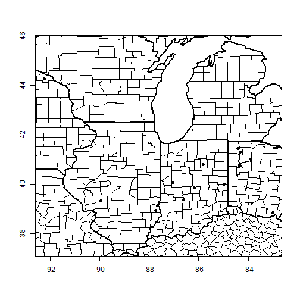


|pedon_id       |taxonname |tax_subgroup        |part_size_class |pedon_type                         |describer                                                                                                                          |
|:--------------|:---------|:-------------------|:---------------|:----------------------------------|:----------------------------------------------------------------------------------------------------------------------------------|
|1998IN011001   |Miami     |oxyaquic hapludalfs |fine-loamy      |correlates to named soil           |Scot Haley USDA-NRCS Resource Soil Scientist, Jerry Larson USDA-NRCS Soil Data Quality Specialist, Bennie Clark MLRA Project Lader |
|1992IN0350935  |Miami     |typic hapludalfs    |fine-loamy      |correlates to named soil           |Gary R. Struben                                                                                                                    |
|S1953IN177002  |MIAMI     |NA                  |NA              |NA                                 |NA                                                                                                                                 |
|S1982IL029040  |MIAMI     |typic hapludalfs    |fine-loamy      |NA                                 |NA                                                                                                                                 |
|S1981IN011002  |Miami     |oxyaquic hapludalfs |fine-loamy      |NA                                 |NA                                                                                                                                 |
|S1981IN011006  |Miami     |oxyaquic hapludalfs |fine-loamy      |NA                                 |NA                                                                                                                                 |
|S1981IN011012  |Miami     |oxyaquic hapludalfs |fine-loamy      |NA                                 |NA                                                                                                                                 |
|S1981IN011016  |Miami     |oxyaquic hapludalfs |fine-loamy      |NA                                 |NA                                                                                                                                 |
|S1982IN107001  |Miami     |oxyaquic hapludalfs |fine-loamy      |NA                                 |Bill Hosteter                                                                                                                      |
|S1982IN107002  |Miami     |oxyaquic hapludalfs |fine-loamy      |NA                                 |Bill Hosteter                                                                                                                      |
|S1982IN107005  |Miami     |oxyaquic hapludalfs |fine-loamy      |NA                                 |Bill Hosteter and Doug Wolf                                                                                                        |
|S1982IN107006  |Miami     |oxyaquic hapludalfs |fine-loamy      |NA                                 |Bill Hosteter and Doug Wolf                                                                                                        |
|78IN177007     |Miami     |typic hapludalfs    |fine-loamy      |NA                                 |Williams and Blank                                                                                                                 |
|78IN177008     |Miami     |typic hapludalfs    |fine-loamy      |NA                                 |Williams and Blank                                                                                                                 |
|84IN157023     |Miami     |typic hapludalfs    |fine-loamy      |NA                                 |Mark McClain                                                                                                                       |
|84IN157024     |Miami     |typic hapludalfs    |fine-loamy      |NA                                 |Tom Ziegler                                                                                                                        |
|83IL039008     |Miami     |typic hapludalfs    |fine-loamy      |NA                                 |NA                                                                                                                                 |
|84IN015011     |Miami     |typic hapludalfs    |fine-loamy      |NA                                 |Bill Hosteter and Earnie Jensen                                                                                                    |
|87IN107001     |Miami     |oxyaquic hapludalfs |fine-loamy      |NA                                 |WD Hosteter, Douglas Wolfe                                                                                                         |
|87IN107008     |Miami     |typic hapludalfs    |fine-loamy      |NA                                 |B. Hostetler, J. Shively                                                                                                           |
|88MI059003     |Miami     |oxyaquic hapludalfs |fine-loamy      |NA                                 |NA                                                                                                                                 |
|90IL045001     |Miami     |oxyaquic hapludalfs |fine-loamy      |NA                                 |R. Leeper and J. Brewbaker.                                                                                                        |
|S2001IN005002  |Miami     |oxyaquic hapludalfs |fine-loamy      |map unit inclusion                 |Bill Hosteter, Norm Stephens, Don Franzmeier                                                                                       |
|1968IN011001   |Miami     |NA                  |NA              |NA                                 |Sanders and Franzmeier                                                                                                             |
|1968IN011007   |Miami     |NA                  |NA              |NA                                 |Sanders and Langlois                                                                                                               |
|1968IN113001   |Miami     |NA                  |NA              |NA                                 |Franzmeier                                                                                                                         |
|1968IN139001   |Miami     |NA                  |NA              |NA                                 |Zachary                                                                                                                            |
|1969IN157001   |Miami     |NA                  |NA              |NA                                 |Meyers and Harlan                                                                                                                  |
|1969IN157002   |Miami     |NA                  |NA              |NA                                 |Meyers and Harlan                                                                                                                  |
|1977IN031004   |Miami     |typic hapludalfs    |fine-loamy      |NA                                 |Shively                                                                                                                            |
|1976IN151004   |Miami     |typic hapludalfs    |fine-loamy      |NA                                 |Farmer                                                                                                                             |
|1977IN177004   |Miami     |typic hapludalfs    |fine-loamy      |NA                                 |Blank                                                                                                                              |
|1977IN177008   |Miami     |typic hapludalfs    |fine-loamy      |NA                                 |Blank and Meland                                                                                                                   |
|1977IN177007   |Miami     |typic hapludalfs    |fine            |NA                                 |Blank and Meland                                                                                                                   |
|1975IN023002   |Miami     |NA                  |NA              |NA                                 |Hosteter and Fink                                                                                                                  |
|1976IN033003   |Miami     |NA                  |NA              |NA                                 |Sanders and Jensen                                                                                                                 |
|1974IN151002   |Miami     |NA                  |NA              |NA                                 |Farmer and Hillis                                                                                                                  |
|1975IN169004   |Miami     |NA                  |NA              |NA                                 |Landrum and Langer                                                                                                                 |
|1975IN169009   |Miami     |NA                  |NA              |NA                                 |Ruesch and Landrum                                                                                                                 |
|1978IN065004   |Miami     |typic hapludalfs    |fine-loamy      |NA                                 |Hillis and Le masters                                                                                                              |
|1978IN031001   |Miami     |typic hapludalfs    |fine-loamy      |NA                                 |Shively                                                                                                                            |
|1979IN135033   |Miami     |typic hapludalfs    |fine-loamy      |NA                                 |Neely and Houghtby                                                                                                                 |
|1979IN135034   |Miami     |typic hapludalfs    |fine            |NA                                 |Neely and Latowski                                                                                                                 |
|1978IN139008   |Miami     |typic hapludalfs    |fine-loamy      |NA                                 |Brock and Rohleder                                                                                                                 |
|1977IN169017   |Miami     |typic hapludalfs    |fine-loamy      |NA                                 |Langer and Schumacher                                                                                                              |
|1978IN177007   |Miami     |typic hapludalfs    |fine-loamy      |NA                                 |Williams and Blank                                                                                                                 |
|1978IN177008   |Miami     |typic hapludalfs    |fine-loamy      |NA                                 |Williams and Blank                                                                                                                 |
|1980IN135063   |Miami     |typic hapludalfs    |fine-loamy      |NA                                 |Neely and Latowski                                                                                                                 |
|1980IN139009   |Miami     |typic hapludalfs    |fine-loamy      |NA                                 |Brock and Dalton                                                                                                                   |
|1981IN085010   |Miami     |typic hapludalfs    |fine-loamy      |NA                                 |Staley                                                                                                                             |
|1983IN157001   |Miami     |typic hapludalfs    |NA              |NA                                 |Ziegler and Franzmeier                                                                                                             |
|1984IN171025   |Miami     |typic hapludalfs    |fine-loamy      |NA                                 |Shively                                                                                                                            |
|1981IN007027   |Miami     |typic hapludalfs    |fine-loamy      |NA                                 |Barnes and Plank                                                                                                                   |
|1981IN047014   |Miami     |typic hapludalfs    |fine-loamy      |NA                                 |Shively                                                                                                                            |
|1984IN157023   |Miami     |typic hapludalfs    |fine-loamy      |NA                                 |Mcclain and Ziegler                                                                                                                |
|1984IN157024   |Miami     |typic hapludalfs    |fine-loamy      |NA                                 |Ziegler and Hosteter                                                                                                               |
|1986IL113004   |Miami     |oxyaquic hapludalfs |fine-loamy      |map unit inclusion                 |CLL                                                                                                                                |
|1986IL113001   |Miami     |oxyaquic hapludalfs |fine-loamy      |map unit inclusion                 |CLL                                                                                                                                |
|1984IL029003   |Miami     |oxyaquic hapludalfs |fine-loamy      |representative pedon for component |RGD, SCM                                                                                                                           |
|1984IL029109   |Miami     |oxyaquic hapludalfs |fine-loamy      |NA                                 |AP, GH                                                                                                                             |
|1984IL147022   |Miami     |oxyaquic hapludalfs |fine-loamy      |NA                                 |NA                                                                                                                                 |
|07IN123027     |Miami     |oxyaquic hapludalfs |fine-loamy      |OSD pedon                          |Unknown                                                                                                                            |
|P2000IN005159  |Miami     |oxyaquic hapludalfs |fine-loamy      |representative pedon for component |Jerry Shivley                                                                                                                      |
|P2001IN005049  |Miami     |oxyaquic hapludalfs |fine-loamy      |representative pedon for component |Norm Stephens                                                                                                                      |
|1955-OH141-010 |Miami     |NA                  |NA              |NA                                 |Petro & Finney                                                                                                                     |
|1954-OH141-005 |Miami     |NA                  |NA              |NA                                 |Petro, Garner, Baldridge                                                                                                           |
|1955-OH141-012 |Miami     |NA                  |NA              |NA                                 |Petro & Finney                                                                                                                     |
|1954-OH027-013 |Miami     |oxyaquic hapludalfs |fine-loamy      |NA                                 |bone                                                                                                                               |
|1953-OH049-S21 |Miami     |oxyaquic hapludalfs |fine-loamy      |NA                                 |n. holowaychuk                                                                                                                     |
|1955-OH027-036 |Miami     |oxyaquic hapludalfs |fine-loamy      |NA                                 |wiseman, bone                                                                                                                      |
|1955-OH027-037 |Miami     |oxyaquic hapludalfs |fine-loamy      |NA                                 |bone, siemond, schafer                                                                                                             |
|1954-OH097-002 |Miami     |oxyaquic hapludalfs |fine-loamy      |NA                                 |meeker, reese                                                                                                                      |
|1955-OH097-003 |Miami     |oxyaquic hapludalfs |fine-loamy      |NA                                 |schafer, reese                                                                                                                     |
|1955-OH027-043 |Miami     |oxyaquic hapludalfs |fine-loamy      |NA                                 |bone, wiseman                                                                                                                      |
|1954-OH071-S16 |Miami     |oxyaquic hapludalfs |fine-loamy      |NA                                 |dotson                                                                                                                             |
|1954-OH057-001 |Miami     |oxyaquic hapludalfs |fine-loamy      |NA                                 |evans, roseler                                                                                                                     |
|1954-OH057-002 |Miami     |oxyaquic hapludalfs |fine-loamy      |NA                                 |evans, roseler                                                                                                                     |
|1954-OH023-S01 |Miami     |oxyaquic hapludalfs |fine-loamy      |NA                                 |dotson, horse, holowaychuk                                                                                                         |
|1954-OH021-S01 |Miami     |oxyaquic hapludalfs |fine-loamy      |NA                                 |holowaychuk, dotson, morse                                                                                                         |
|1955-OH141-013 |Miami     |oxyaquic hapludalfs |fine-loamy      |NA                                 |petro, finney                                                                                                                      |
|1959-OH017-S11 |Miami     |oxyaquic hapludalfs |fine-loamy      |NA                                 |roseler, carner, reeder                                                                                                            |
|1957-OH049-S32 |Miami     |oxyaquic hapludalfs |fine-loamy      |NA                                 |n. holowaychuk, n. reeder                                                                                                          |
|1960-OH165-041 |Miami     |oxyaquic hapludalfs |fine-loamy      |NA                                 |garner, ernst                                                                                                                      |
|1960-OH047-007 |Miami     |oxyaquic hapludalfs |fine-loamy      |NA                                 |evans, reeder, donaoldson, petro                                                                                                   |
|1959-OH135-016 |Miami     |oxyaquic hapludalfs |fine-loamy      |NA                                 |schafer, lerch, hayhurst, Tornes, mcloda                                                                                           |
|1958-OH021-005 |Miami     |oxyaquic hapludalfs |fine-loamy      |NA                                 |ritchie                                                                                                                            |
|1958-OH021-007 |Miami     |oxyaquic hapludalfs |fine-loamy      |NA                                 |ritchie, evans                                                                                                                     |
|1957-OH021-001 |Miami     |oxyaquic hapludalfs |fine-loamy      |NA                                 |ritchie                                                                                                                            |
|1958-OH021-004 |Miami     |oxyaquic hapludalfs |fine-loamy      |NA                                 |ritchie                                                                                                                            |
|1960-OH021-037 |Miami     |oxyaquic hapludalfs |fine-loamy      |NA                                 |ritchie, dubford                                                                                                                   |
|1960-OH135-056 |Miami     |oxyaquic hapludalfs |fine-loamy      |NA                                 |mcloda, tornes, davis,                                                                                                             |
|1959-OH021-015 |Miami     |oxyaquic hapludalfs |fine-loamy      |NA                                 |ritchie, evans, powell, donaldson                                                                                                  |
|1959-OH021-026 |Miami     |oxyaquic hapludalfs |fine-loamy      |NA                                 |ritchie, powell                                                                                                                    |
|1957-OH037-015 |Miami     |oxyaquic hapludalfs |fine-loamy      |NA                                 |heffner, siegenthaler                                                                                                              |
|1959-OH135-014 |Miami     |oxyaquic hapludalfs |fine-loamy      |NA                                 |lerch, mcloda, tornes                                                                                                              |
|1956-OH135-003 |Miami     |oxyaquic hapludalfs |fine-loamy      |NA                                 |lerch, schafer                                                                                                                     |
|1956-OH135-004 |Miami     |oxyaquic hapludalfs |fine-loamy      |NA                                 |lerch, schafer                                                                                                                     |
|1956-OH135-005 |Miami     |oxyaquic hapludalfs |fine-loamy      |NA                                 |lerch, schafer                                                                                                                     |
|1956-OH135-006 |Miami     |oxyaquic hapludalfs |fine-loamy      |NA                                 |lerch, shcafer                                                                                                                     |
|1956-OH141-018 |Miami     |oxyaquic hapludalfs |fine-loamy      |NA                                 |evans, petro                                                                                                                       |
|1956-OH141-027 |Miami     |oxyaquic hapludalfs |fine-loamy      |NA                                 |r. h. jones                                                                                                                        |
|1959-OH149-006 |Miami     |oxyaquic hapludalfs |fine-loamy      |NA                                 |heffner, siegenthaler                                                                                                              |
|1961-OH165-057 |Miami     |oxyaquic hapludalfs |fine-loamy      |NA                                 |garner, ernst                                                                                                                      |
|1963-OH113-010 |Miami     |oxyaquic hapludalfs |fine-loamy      |NA                                 |lerch, davis, smeck                                                                                                                |
|1961-OH021-047 |Miami     |oxyaquic hapludalfs |fine-loamy      |NA                                 |ritchie, powell, siegenthaler                                                                                                      |
|1961-OH091-011 |Miami     |oxyaquic hapludalfs |fine-loamy      |NA                                 |heffner, siegenthaler, urban                                                                                                       |
|1963-OH113-007 |Miami     |oxyaquic hapludalfs |fine-loamy      |NA                                 |lerch, smeck, steiger, davis                                                                                                       |
|1962-OH113-003 |Miami     |oxyaquic hapludalfs |fine-loamy      |NA                                 |davis, lerch, calhoun                                                                                                              |
|1971-OH017-002 |Miami     |oxyaquic hapludalfs |fine-loamy      |NA                                 |lerch, & hale                                                                                                                      |
|1967-OH049-007 |Miami     |oxyaquic hapludalfs |fine-loamy      |NA                                 |r. l. blevens                                                                                                                      |
|1969-OH047-003 |Miami     |oxyaquic hapludalfs |fine-loamy      |NA                                 |petro                                                                                                                              |
|1968-OH109-018 |Miami     |oxyaquic hapludalfs |fine-loamy      |NA                                 |lehman, bottrell                                                                                                                   |
|1968-OH109-021 |Miami     |oxyaquic hapludalfs |fine-loamy      |NA                                 |lehman, bottrell                                                                                                                   |
|1971-OH129-023 |Miami     |oxyaquic hapludalfs |fine-loamy      |NA                                 |hall, williams, kerr, jones, mc kinney, le master                                                                                  |
|1961IN003020   |Miami     |typic hapludalfs    |fine-loamy      |TUD pedon                          |soil survey staff                                                                                                                  |
|1983IN085022   |Miami     |typic hapludalfs    |fine-loamy      |TUD pedon                          |soil survey staff                                                                                                                  |
|1974IN113017   |Miami     |typic hapludalfs    |fine-loamy      |TUD pedon                          |soil survey staff                                                                                                                  |
|1979IN151021   |Miami     |oxyaquic hapludalfs |fine-loamy      |TUD pedon                          |soil survey staff                                                                                                                  |
|1979IN169020   |Miami     |typic hapludalfs    |fine-loamy      |TUD pedon                          |soil survey staff                                                                                                                  |
|S1974IN151002  |Miami     |typic hapludalfs    |fine-loamy      |taxadjunct to the series           |Farmer and Hillis                                                                                                                  |
|S1977IN169017  |Miami     |typic hapludalfs    |fine-loamy      |correlates to named soil           |Langer and Schumacher                                                                                                              |
|S1981IN085010  |Miami     |typic hapludalfs    |fine-loamy      |correlates to named soil           |Staley                                                                                                                             |
|S1976IN033003  |Miami     |typic hapludalfs    |fine-loamy      |undefined observation              |Sanders and Jensen                                                                                                                 |

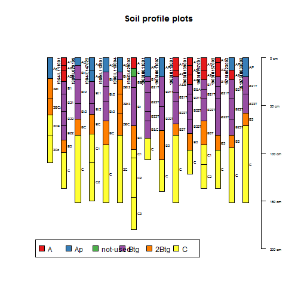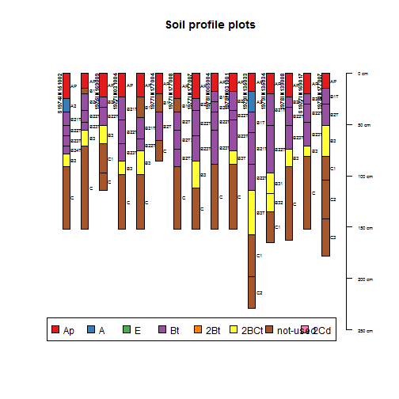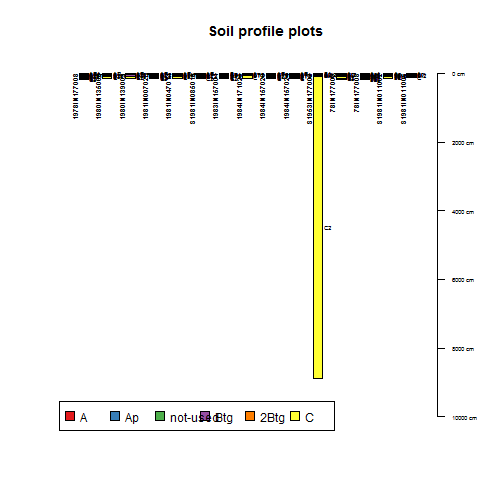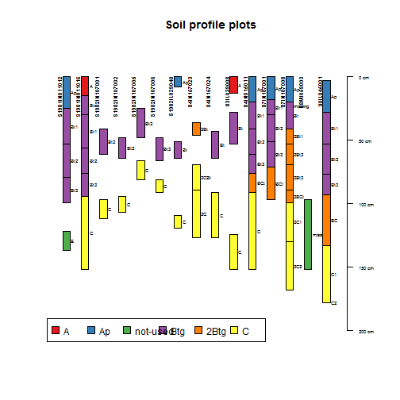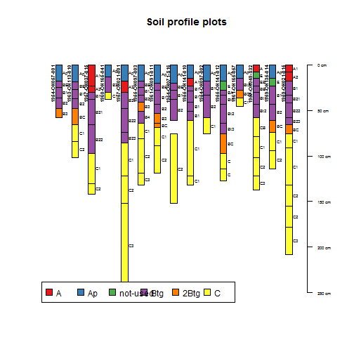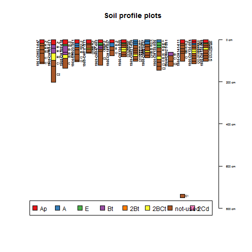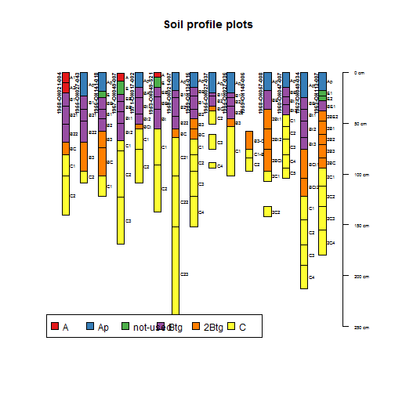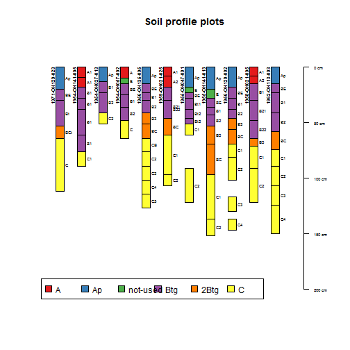


## Range in characteristics for NCSS pedon lab data
### Summary of soil profiles
Five number summary (min, 25th, median, 75th, max)(percentiles)

|      variable      |          range           |
|:------------------:|:------------------------:|
|  noncarbclaywtavg  | (23, 27, 30, 32, 35)(16) |
|    claytotwtavg    | (23, 27, 30, 32, 35)(16) |
|      le0to100      |    (0, 2, 2, 2, 3)(4)    |
|   wf0175wtavgpsc   |  (0, 0, 23, 32, 41)(16)  |
|  volfractgt2wtavg  |   (0, 1, 2, 4, 6)(12)    |
| cec7clayratiowtavg | (45, 48, 50, 52, 54)(7)  |


|  variable   |          range           |
|:-----------:|:------------------------:|
| psctopdepth | (15, 19, 20, 24, 48)(23) |
| pscbotdepth | (51, 70, 70, 74, 98)(23) |
|  thickness  | (35, 50, 50, 50, 51)(23) |

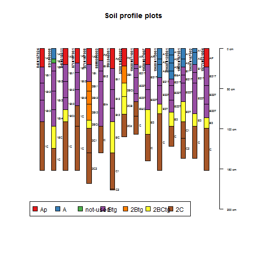


### Summary of soil horizons


|         | 2B1 | 2B2 | 2B3 | 2BC | 2BCt | 2BE2 | 2Bt | 2Bt1 | 2Bt2 | 2Bt3 | 2C | 2C1 | 2C2 | 2C3 | 2C4 |
|:--------|:---:|:---:|:---:|:---:|:----:|:----:|:---:|:----:|:----:|:----:|:--:|:---:|:---:|:---:|:---:|
|A        |  0  |  0  |  0  |  0  |  0   |  0   |  0  |  0   |  0   |  0   | 0  |  0  |  0  |  0  |  0  |
|Ap       |  0  |  0  |  0  |  0  |  0   |  0   |  0  |  0   |  0   |  0   | 0  |  0  |  0  |  0  |  0  |
|not-used |  0  |  0  |  0  |  0  |  0   |  0   |  0  |  0   |  0   |  0   | 0  |  0  |  0  |  0  |  0  |
|Btg      |  0  |  0  |  0  |  0  |  0   |  0   |  0  |  0   |  0   |  0   | 0  |  0  |  0  |  0  |  0  |
|2Btg     |  2  |  2  |  1  |  2  |  3   |  1   |  2  |  3   |  4   |  3   | 0  |  0  |  0  |  0  |  0  |
|C        |  0  |  0  |  0  |  0  |  0   |  0   |  0  |  0   |  0   |  0   | 3  |  4  |  4  |  2  |  1  |
|Sum      |  2  |  2  |  1  |  2  |  3   |  1   |  2  |  3   |  4   |  3   | 3  |  4  |  4  |  2  |  1  |


|         | 2CB | 2CBt | 2Cd | A  | A&B | A1 | A2 | A2/B1 | A21 | A22 | A3 | AB | Ap | AP | Ap1 |
|:--------|:---:|:----:|:---:|:--:|:---:|:--:|:--:|:-----:|:---:|:---:|:--:|:--:|:--:|:--:|:---:|
|A        |  0  |  0   |  0  | 10 |  0  | 16 | 14 |   0   |  2  |  2  | 2  | 0  | 0  | 0  |  0  |
|Ap       |  0  |  0   |  0  | 0  |  0  | 0  | 0  |   0   |  0  |  0  | 0  | 0  | 53 | 26 |  3  |
|not-used |  0  |  0   |  0  | 0  |  0  | 0  | 0  |   0   |  0  |  0  | 0  | 0  | 0  | 0  |  0  |
|Btg      |  0  |  0   |  0  | 0  |  1  | 0  | 0  |   1   |  0  |  0  | 0  | 1  | 0  | 0  |  0  |
|2Btg     |  0  |  0   |  0  | 0  |  0  | 0  | 0  |   0   |  0  |  0  | 0  | 0  | 0  | 0  |  0  |
|C        |  1  |  1   |  1  | 0  |  0  | 0  | 0  |   0   |  0  |  0  | 0  | 0  | 0  | 0  |  0  |
|Sum      |  1  |  1   |  1  | 10 |  1  | 16 | 14 |   1   |  2  |  2  | 2  | 1  | 53 | 26 |  3  |


|         | AP1 | Ap2 | AP2 | B | B&A | B&C | B/C1 | B1 | B1T | B2 | B21 | B21T | B21T1 | B21T2 | B22 |
|:--------|:---:|:---:|:---:|:-:|:---:|:---:|:----:|:--:|:---:|:--:|:---:|:----:|:-----:|:-----:|:---:|
|A        |  0  |  0  |  0  | 0 |  0  |  0  |  0   | 0  |  0  | 0  |  0  |  0   |   0   |   0   |  0  |
|Ap       |  1  |  3  |  1  | 0 |  0  |  0  |  0   | 0  |  0  | 0  |  0  |  0   |   0   |   0   |  0  |
|not-used |  0  |  0  |  0  | 0 |  0  |  0  |  0   | 0  |  0  | 0  |  0  |  0   |   0   |   0   |  0  |
|Btg      |  0  |  0  |  0  | 4 |  1  |  1  |  1   | 53 |  3  | 24 | 12  |  23  |   1   |   1   | 14  |
|2Btg     |  0  |  0  |  0  | 0 |  0  |  0  |  0   | 0  |  0  | 0  |  0  |  0   |   0   |   0   |  0  |
|C        |  0  |  0  |  0  | 0 |  0  |  0  |  0   | 0  |  0  | 0  |  0  |  0   |   0   |   0   |  0  |
|Sum      |  1  |  3  |  1  | 4 |  1  |  1  |  1   | 53 |  3  | 24 | 12  |  23  |   1   |   1   | 14  |


|         | B22T | B23 | B23T | B24T | B2T | B2T1 | B2T2 | B2T3 | B3 | B3-C1 | B31 | B32 | B3T | B4 | BA |
|:--------|:----:|:---:|:----:|:----:|:---:|:----:|:----:|:----:|:--:|:-----:|:---:|:---:|:---:|:--:|:--:|
|A        |  0   |  0  |  0   |  0   |  0  |  0   |  0   |  0   | 0  |   0   |  0  |  0  |  0  | 0  | 0  |
|Ap       |  0   |  0  |  0   |  0   |  0  |  0   |  0   |  0   | 0  |   0   |  0  |  0  |  0  | 0  | 0  |
|not-used |  0   |  0  |  0   |  0   |  0  |  0   |  0   |  0   | 0  |   0   |  0  |  0  |  0  | 0  | 0  |
|Btg      |  23  |  3  |  12  |  1   |  2  |  1   |  1   |  1   | 0  |   0   |  0  |  0  |  0  | 1  | 4  |
|2Btg     |  0   |  0  |  0   |  0   |  0  |  0   |  0   |  0   | 28 |   1   |  2  |  2  |  6  | 0  | 0  |
|C        |  0   |  0  |  0   |  0   |  0  |  0   |  0   |  0   | 0  |   0   |  0  |  0  |  0  | 0  | 0  |
|Sum      |  23  |  3  |  12  |  1   |  2  |  1   |  1   |  1   | 28 |   1   |  2  |  2  |  6  | 1  | 4  |


|         | BC | BC3 | BCt | BCT | BCt1 | BCt2 | BE | BE1 | BEt | Bt | Bt1 | BT1 | Bt2 | BT2 | Bt3 |
|:--------|:--:|:---:|:---:|:---:|:----:|:----:|:--:|:---:|:---:|:--:|:---:|:---:|:---:|:---:|:---:|
|A        | 0  |  0  |  0  |  0  |  0   |  0   | 0  |  0  |  0  | 0  |  0  |  0  |  0  |  0  |  0  |
|Ap       | 0  |  0  |  0  |  0  |  0   |  0   | 0  |  0  |  0  | 0  |  0  |  0  |  0  |  0  |  0  |
|not-used | 0  |  0  |  0  |  0  |  0   |  0   | 0  |  0  |  0  | 0  |  0  |  0  |  0  |  0  |  0  |
|Btg      | 0  |  0  |  0  |  0  |  0   |  0   | 25 |  1  |  2  | 9  | 23  |  6  | 26  |  6  | 12  |
|2Btg     | 28 |  1  |  5  |  1  |  1   |  1   | 0  |  0  |  0  | 0  |  0  |  0  |  0  |  0  |  0  |
|C        | 0  |  0  |  0  |  0  |  0   |  0   | 0  |  0  |  0  | 0  |  0  |  0  |  0  |  0  |  0  |
|Sum      | 28 |  1  |  5  |  1  |  1   |  1   | 25 |  1  |  2  | 9  | 23  |  6  | 26  |  6  | 12  |


|         | BT3 | Bw | C  | C1 | C1-B3 | C11 | C12 | C2 | C21 | C22 | C23 | C3 | C4 | C5 | CB |
|:--------|:---:|:--:|:--:|:--:|:-----:|:---:|:---:|:--:|:---:|:---:|:---:|:--:|:--:|:--:|:--:|
|A        |  0  | 0  | 0  | 0  |   0   |  0  |  0  | 0  |  0  |  0  |  0  | 0  | 0  | 0  | 0  |
|Ap       |  0  | 0  | 0  | 0  |   0   |  0  |  0  | 0  |  0  |  0  |  0  | 0  | 0  | 0  | 0  |
|not-used |  0  | 0  | 0  | 0  |   0   |  0  |  0  | 0  |  0  |  0  |  0  | 0  | 0  | 0  | 0  |
|Btg      |  7  | 1  | 0  | 0  |   0   |  0  |  0  | 0  |  0  |  0  |  0  | 0  | 0  | 0  | 0  |
|2Btg     |  0  | 0  | 0  | 0  |   0   |  0  |  0  | 0  |  0  |  0  |  0  | 0  | 0  | 0  | 0  |
|C        |  0  | 0  | 44 | 56 |   1   |  1  |  1  | 52 |  1  |  1  |  1  | 21 | 9  | 3  | 3  |
|Sum      |  7  | 1  | 44 | 56 |   1   |  1  |  1  | 52 |  1  |  1  |  1  | 21 | 9  | 3  | 3  |


|         | CBT | E  | E1 | E2 | EB | missing | Sum |
|:--------|:---:|:--:|:--:|:--:|:--:|:-------:|:---:|
|A        |  0  | 0  | 0  | 0  | 0  |    0    | 46  |
|Ap       |  0  | 0  | 0  | 0  | 0  |    0    | 87  |
|not-used |  0  | 14 | 1  | 1  | 0  |    2    | 18  |
|Btg      |  0  | 0  | 0  | 0  | 4  |    0    | 312 |
|2Btg     |  0  | 0  | 0  | 0  | 0  |    0    | 99  |
|C        |  1  | 0  | 0  | 0  | 0  |    0    | 212 |
|Sum      |  1  | 14 | 1  | 1  | 4  |    2    | 774 |


|  genhz   |           hzdept            |            hzdepb             |         thickness          |
|:--------:|:---------------------------:|:-----------------------------:|:--------------------------:|
|    A     |    (0, 0, 0, 12, 28)(46)    |    (5, 9, 14, 23, 38)(46)     |  (5, 10, 15, 20, 30)(30)   |
|    Ap    |    (0, 0, 0, 0, 20)(87)     |    (8, 15, 18, 20, 30)(87)    |  (8, 15, 18, 20, 30)(83)   |
| not-used |  (5, 10, 16, 20, 122)(18)   |   (15, 20, 23, 28, 152)(18)   |   (5, 7, 10, 10, 55)(17)   |
|   Btg    |  (8, 23, 30, 46, 89)(312)   |  (20, 36, 48, 64, 114)(312)   |  (8, 28, 44, 56, 79)(112)  |
|   2Btg   |  (22, 51, 64, 76, 117)(99)  |   (36, 62, 80, 96, 157)(99)   |  (5, 12, 16, 26, 61)(74)   |
|    C     | (30, 74, 91, 107, 732)(212) | (38, 97, 122, 152, 8888)(212) | (8, 33, 53, 71, 8809)(112) |

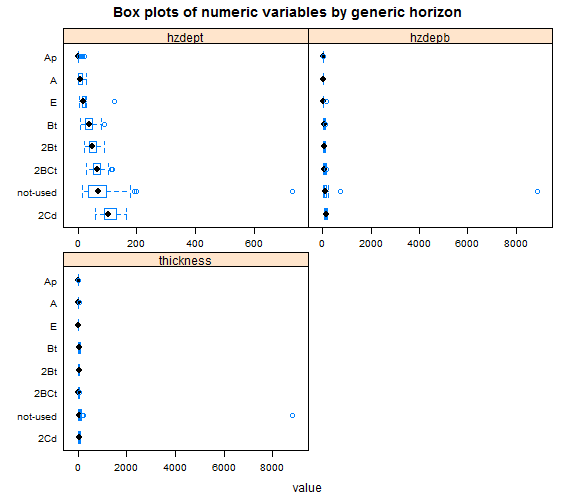


## Range in characteristics for generic horizons 
Five number summary (min, 25th, median, 75th, max)(percentiles) and total number of observations (n)


|  genhz   |            sandvc             |            sandco             |             sandmed             |             sandfine              |
|:--------:|:-----------------------------:|:-----------------------------:|:-------------------------------:|:---------------------------------:|
|    A     |   (0, 0.6, 1, 1.6, 5.8)(40)   |  (1, 1.7, 2.6, 3.1, 7.7)(41)  | (1.2, 2.8, 3.6, 5.6, 14.7)(41)  |  (2.2, 5.3, 7.3, 11.7, 21.5)(41)  |
|    Ap    |  (0, 0.9, 1.2, 1.6, 3.3)(67)  |  (0, 2.1, 2.7, 3.5, 6.5)(68)  | (0.8, 3.2, 4.8, 7.1, 21.4)(68)  |   (1, 6.5, 8.6, 12.1, 21.9)(68)   |
| not-used |  (0.2, 0.6, 1, 1.6, 4.6)(8)   | (0.8, 1.8, 2.7, 3.9, 4.7)(9)  |       (2, 3, 3, 6, 10)(9)       |   (1.8, 5.4, 6.1, 8.2, 17.6)(9)   |
|   Btg    |  (0, 1, 1.5, 2.2, 12.6)(244)  | (0.4, 2.4, 3.1, 4, 12.7)(249) | (0.8, 3.3, 5.9, 8.6, 19.8)(249) | (1.5, 6.9, 9.9, 13.9, 25.6)(249)  |
|   2Btg   |      (0, 2, 2, 3, 9)(85)      | (1.1, 3.3, 4.1, 5, 11.2)(85)  | (1.4, 4.3, 5.4, 8.6, 28.1)(85)  | (3.7, 8.7, 10.7, 14.8, 26.2)(85)  |
|    C     | (0.3, 3.1, 4, 5.1, 12.3)(169) |  (0.8, 5, 6, 7.3, 31.7)(172)  | (1.5, 4.8, 6.5, 9.4, 28.9)(172) | (2.7, 9.1, 11.7, 15.3, 21.5)(172) |


|  genhz   |              sandvf              |              sandtot               |               siltco               |              siltfine              |
|:--------:|:--------------------------------:|:----------------------------------:|:----------------------------------:|:----------------------------------:|
|    A     |   (2.4, 4.5, 6.3, 9, 14.8)(41)   | (7.8, 16.1, 25.3, 32.4, 55.6)(46)  | (12.9, 18.6, 20.5, 22.8, 28.7)(12) | (28.9, 32.8, 36.5, 41.5, 53.5)(12) |
|    Ap    |   (1, 4.5, 6.4, 8.1, 14.8)(68)   | (4.2, 18.7, 24.4, 31.8, 56.2)(84)  | (8.9, 15.2, 19.1, 23.7, 36.7)(40)  | (18.4, 30.4, 35.9, 41.2, 53.3)(40) |
| not-used |  (1.4, 5.1, 5.9, 7.6, 11.4)(9)   |  (6.4, 15, 18.2, 27.4, 48.3)(16)   | (13.4, 13.8, 15.6, 19.9, 27.4)(4)  |      (24, 32, 37, 41, 48)(4)       |
|   Btg    |  (1, 5.4, 6.9, 8.9, 17.4)(249)   | (4.8, 20.4, 27.1, 34.6, 58.4)(304) | (3.2, 10.1, 11.7, 14.2, 31.5)(132) |      (8, 19, 24, 29, 52)(132)      |
|   2Btg   |  (2, 6.3, 8.6, 10.6, 21.4)(85)   | (11.2, 24.8, 32.4, 39.8, 72.6)(96) | (0.5, 10.8, 13.2, 15.3, 27.4)(41)  |  (4.2, 19, 22.2, 25.2, 33.4)(41)   |
|    C     | (1.2, 7.9, 9.9, 11.2, 40.9)(172) |   (0, 31.7, 38, 45.4, 86.6)(203)   |  (3.8, 13.8, 15.2, 17, 28.4)(69)   |      (6, 20, 23, 26, 31)(70)       |


|  genhz   |               silttot               |           claycarb           |             clayfine             |              claytot               |
|:--------:|:-----------------------------------:|:----------------------------:|:--------------------------------:|:----------------------------------:|
|    A     | (32.3, 54.7, 57.6, 65.8, 73.9)(46)  |   (NA, NA, NA, NA, NA)(0)    |    (0.8, 3, 4, 5.3, 11.5)(24)    |  (7.5, 13, 16.7, 18.7, 28.2)(46)   |
|    Ap    | (28.1, 50.7, 56.1, 64.9, 72.7)(84)  |   (NA, NA, NA, NA, NA)(0)    |       (2, 3, 5, 7, 15)(32)       |      (7, 16, 18, 20, 29)(84)       |
| not-used | (37.7, 52.6, 60.4, 66.7, 73.5)(16)  | (1.7, 1.7, 1.7, 1.7, 1.7)(1) |    (3, 3.2, 3.6, 4.4, 9.3)(6)    |  (11, 14.7, 18.4, 21.5, 27.2)(16)  |
|   Btg    | (13.3, 31.7, 36.9, 44.9, 68.5)(304) |   (NA, NA, NA, NA, NA)(0)    | (2.2, 12.1, 17.4, 21, 29.7)(112) | (11.5, 28, 32.6, 38.6, 54.4)(304)  |
|   2Btg   |       (5, 33, 38, 42, 55)(96)       |  (0, 0.3, 0.6, 0.8, 1.1)(2)  | (6, 11.1, 14.1, 18.1, 23.7)(49)  | (14.3, 23.7, 30.1, 33.8, 50.9)(96) |
|    C     |      (8, 39, 42, 44, 100)(203)      |  (0, 0.8, 1.1, 2, 2.5)(12)   |  (2.9, 5.5, 7, 8.4, 15.8)(111)   |      (3, 16, 19, 23, 39)(202)      |


|  genhz   |          carbonorganicpct          |           carbontotalpct           |      fragwt25       |      fragwt520      |
|:--------:|:----------------------------------:|:----------------------------------:|:-------------------:|:-------------------:|
|    A     |   (0.3, 0.8, 1.3, 3.1, 5.6)(20)    | (0.23, 0.7, 1.28, 3.19, 4.41)(25)  | (0, 0, 0, 0, 1)(3)  | (0, 0, 0, 0, 1)(3)  |
|    Ap    | (0.4, 0.96, 1.11, 1.25, 3.12)(38)  |    (0.7, 1, 1.3, 1.5, 4.3)(41)     | (0, 1, 1, 1, 2)(9)  | (0, 1, 1, 3, 3)(9)  |
| not-used | (0.71, 0.74, 0.76, 0.79, 0.82)(2)  | (0.46, 0.64, 0.75, 1.05, 1.62)(12) | (0, 0, 0, 0, 0)(2)  | (0, 0, 0, 0, 0)(2)  |
|   Btg    | (0.16, 0.36, 0.44, 0.54, 1.12)(91) | (0.06, 0.41, 0.48, 0.61, 1.68)(94) | (0, 1, 2, 3, 6)(32) | (0, 1, 2, 2, 6)(32) |
|   2Btg   |   (0, 0.2, 0.3, 0.44, 0.59)(17)    | (0.23, 0.36, 0.48, 0.62, 0.95)(8)  | (2, 3, 3, 4, 8)(12) | (1, 1, 2, 3, 5)(12) |
|    C     |  (0, 0.15, 0.24, 0.29, 0.36)(22)   |  (2.93, 3.2, 3.48, 3.75, 4.02)(2)  | (0, 3, 4, 5, 9)(17) | (0, 2, 4, 5, 8)(17) |


|  genhz   |     fragwt2075      |       fragwt275       |        wtpct0175         |      wtpctgt2ws       |
|:--------:|:-------------------:|:---------------------:|:------------------------:|:---------------------:|
|    A     | (0, 0, 0, 0, 0)(3)  |  (0, 0, 1, 1, 1)(3)   | (12, 16, 19, 22, 24)(3)  |  (0, 0, 1, 1, 1)(3)   |
|    Ap    | (0, 0, 0, 0, 5)(9)  |  (0, 2, 3, 5, 7)(9)   |  (2, 19, 21, 30, 52)(9)  |  (0, 2, 3, 5, 7)(9)   |
| not-used | (0, 0, 0, 0, 0)(2)  |  (0, 0, 0, 0, 0)(2)   | (24, 27, 30, 34, 37)(2)  |  (0, 0, 0, 0, 0)(2)   |
|   Btg    | (0, 0, 0, 0, 3)(32) |  (0, 2, 4, 6, 9)(32)  | (4, 29, 32, 37, 50)(32)  |  (0, 2, 4, 6, 9)(32)  |
|   2Btg   | (0, 0, 0, 2, 6)(12) | (3, 4, 8, 8, 14)(12)  | (28, 32, 34, 39, 41)(12) | (3, 4, 8, 8, 14)(12)  |
|    C     | (0, 0, 0, 1, 3)(17) | (0, 6, 9, 10, 20)(17) | (30, 36, 39, 45, 54)(17) | (0, 6, 9, 10, 20)(17) |


|  genhz   |           ph1to1h2o            |          ph01mcacl2           |            resistivity            |                ec                 |
|:--------:|:------------------------------:|:-----------------------------:|:---------------------------------:|:---------------------------------:|
|    A     |  (4.5, 5.5, 6, 6.5, 7.5)(46)   |  (4.7, 5.5, 5.6, 6, 7.1)(7)   |      (NA, NA, NA, NA, NA)(0)      |      (NA, NA, NA, NA, NA)(0)      |
|    Ap    | (4.7, 5.7, 6.1, 6.8, 7.7)(84)  | (4.5, 5.2, 5.6, 6.1, 7.3)(35) |      (NA, NA, NA, NA, NA)(0)      |      (NA, NA, NA, NA, NA)(0)      |
| not-used | (4.8, 5.1, 5.6, 6.8, 8.2)(16)  |   (5, 5.7, 6.3, 7, 7.7)(2)    |      (NA, NA, NA, NA, NA)(0)      |      (NA, NA, NA, NA, NA)(0)      |
|   Btg    | (4.4, 5.2, 5.8, 6.7, 8.3)(305) |     (4, 5, 6, 6, 8)(108)      |      (NA, NA, NA, NA, NA)(0)      |      (NA, NA, NA, NA, NA)(0)      |
|   2Btg   | (4.6, 6.1, 7.4, 7.8, 8.6)(96)  | (4.2, 6.2, 7.3, 7.5, 8.1)(33) |      (NA, NA, NA, NA, NA)(0)      | (0.33, 0.33, 0.33, 0.33, 0.33)(1) |
|    C     |  (5.3, 7.8, 8, 8.2, 8.6)(203)  | (6.2, 7.5, 7.6, 7.7, 8.2)(57) | (6300, 6300, 6300, 6300, 6300)(1) | (0.27, 0.27, 0.28, 0.28, 0.28)(2) |


|  genhz   |         esp          |           sar           |           cecsumcations           |               cec7                |
|:--------:|:--------------------:|:-----------------------:|:---------------------------------:|:---------------------------------:|
|    A     | (0, 0, 0, 0, 5)(14)  | (NA, NA, NA, NA, NA)(0) | (7.3, 11.1, 13.6, 17.6, 29.2)(26) |  (5, 10.4, 11.3, 20.9, 29.2)(14)  |
|    Ap    | (0, 0, 0, 2, 14)(18) | (NA, NA, NA, NA, NA)(0) | (10.3, 12, 13.8, 16.5, 20.9)(36)  | (10.3, 11.2, 12.2, 15, 16.4)(18)  |
| not-used |  (0, 0, 0, 0, 0)(5)  | (NA, NA, NA, NA, NA)(0) | (10.4, 11.6, 11.9, 13.7, 24.9)(7) | (11.3, 11.8, 11.9, 12.1, 15.3)(5) |
|   Btg    | (0, 0, 0, 1, 16)(63) | (NA, NA, NA, NA, NA)(0) | (7.2, 15.3, 18.8, 22, 31.4)(131)  | (8.4, 14.2, 16.9, 21.2, 31.4)(63) |
|   2Btg   | (0, 0, 1, 2, 19)(17) |   (0, 0, 0, 0, 0)(1)    | (10.8, 15.8, 18, 19.9, 29.5)(20)  |  (8, 12.2, 17.6, 20.1, 24.6)(17)  |
|    C     | (0, 2, 3, 4, 12)(11) |   (0, 0, 0, 0, 0)(2)    | (12.8, 15.2, 17.6, 19.4, 21.3)(3) |    (5.4, 6, 6.5, 7.2, 9.1)(11)    |


|  genhz   |             ecec              |             sumbases              |      basesatsumcations      |        basesatnh4oac        |
|:--------:|:-----------------------------:|:---------------------------------:|:---------------------------:|:---------------------------:|
|    A     |    (NA, NA, NA, NA, NA)(0)    |       (2, 6, 9, 16, 21)(15)       |  (23, 49, 63, 70, 85)(26)   |   (2, 6, 24, 62, 88)(28)    |
|    Ap    | (9.8, 9.8, 9.8, 9.8, 9.8)(1)  |  (4.8, 7.8, 9.7, 11.5, 15.7)(18)  |  (34, 52, 60, 68, 84)(36)   |   (4, 7, 15, 68, 100)(38)   |
| not-used |    (NA, NA, NA, NA, NA)(0)    |   (2.6, 4.4, 6.9, 9.1, 15.1)(6)   |   (22, 35, 52, 66, 79)(7)   |   (5, 25, 36, 63, 79)(6)    |
|   Btg    | (9, 10.1, 12.1, 13, 15.4)(11) | (1.1, 8.8, 11.6, 14.4, 23.5)(66)  | (11, 51, 60, 73, 100)(133)  |  (4, 10, 17, 68, 100)(134)  |
|   2Btg   | (9.8, 9.9, 10.1, 11, 12.7)(4) |  (7.8, 9, 15.7, 16.5, 36.9)(13)   |  (44, 51, 68, 82, 100)(24)  |  (6, 14, 66, 95, 100)(26)   |
|    C     |    (NA, NA, NA, NA, NA)(0)    | (20.7, 28.2, 28.6, 50.4, 50.9)(5) | (63, 98, 100, 100, 100)(10) | (8, 100, 100, 100, 100)(13) |


|  genhz   |       caco3equiv        |             feoxalate             |        feextractable         |                fetotal                 |
|:--------:|:-----------------------:|:---------------------------------:|:----------------------------:|:--------------------------------------:|
|    A     | (NA, NA, NA, NA, NA)(0) |      (NA, NA, NA, NA, NA)(0)      |   (NA, NA, NA, NA, NA)(0)    |        (NA, NA, NA, NA, NA)(0)         |
|    Ap    | (NA, NA, NA, NA, NA)(0) | (0.46, 0.5, 0.54, 0.57, 0.61)(2)  | (1.2, 1.3, 1.4, 1.6, 1.9)(3) | (21092, 22100, 23108, 24116, 25124)(2) |
| not-used | (29, 29, 29, 29, 29)(1) |      (NA, NA, NA, NA, NA)(0)      |   (NA, NA, NA, NA, NA)(0)    |        (NA, NA, NA, NA, NA)(0)         |
|   Btg    |  (0, 2, 6, 14, 45)(8)   | (0.69, 0.69, 0.69, 0.69, 0.69)(1) | (1.4, 1.6, 1.7, 1.7, 1.8)(4) | (25609, 27708, 29808, 31907, 34006)(2) |
|   2Btg   | (0, 10, 18, 24, 49)(24) | (0.22, 0.29, 0.42, 0.66, 0.76)(6) | (1.3, 1.6, 1.8, 1.9, 2.2)(7) | (25871, 30227, 32532, 33506, 33872)(4) |
|    C     | (5, 26, 30, 35, 50)(63) | (0.07, 0.09, 0.11, 0.12, 0.14)(4) |   (0.8, 0.9, 1, 1, 1.2)(6)   | (15477, 15724, 15971, 17602, 19234)(3) |


|  genhz   |             sioxalate             |            extracid            |            extral             |             aloxalate             |
|:--------:|:---------------------------------:|:------------------------------:|:-----------------------------:|:---------------------------------:|
|    A     |      (NA, NA, NA, NA, NA)(0)      | (2.4, 4.4, 5.4, 6.1, 10.8)(26) |    (NA, NA, NA, NA, NA)(0)    |      (NA, NA, NA, NA, NA)(0)      |
|    Ap    | (0.04, 0.04, 0.04, 0.04, 0.04)(2) | (2.4, 4.3, 5.7, 6.4, 9.5)(36)  | (0.3, 0.3, 0.3, 0.3, 0.3)(1)  | (0.15, 0.15, 0.16, 0.16, 0.16)(2) |
| not-used |      (NA, NA, NA, NA, NA)(0)      |   (2.5, 4.1, 8, 9.4, 9.8)(7)   |    (NA, NA, NA, NA, NA)(0)    |      (NA, NA, NA, NA, NA)(0)      |
|   Btg    | (0.05, 0.05, 0.05, 0.05, 0.05)(1) | (0.9, 5.4, 7, 9.4, 14.7)(132)  | (0.5, 0.9, 1.2, 1.8, 2.7)(11) |   (0.2, 0.2, 0.2, 0.2, 0.2)(1)    |
|   2Btg   | (0.05, 0.06, 0.07, 0.07, 0.07)(6) |  (1, 3.7, 5.5, 8.3, 10.6)(24)  | (0.7, 1.3, 1.7, 1.9, 2.1)(4)  | (0.07, 0.12, 0.15, 0.17, 0.18)(6) |
|    C     | (0.04, 0.04, 0.04, 0.05, 0.05)(4) |  (0.6, 2.6, 4.7, 5.3, 5.9)(3)  |    (NA, NA, NA, NA, NA)(0)    | (0.02, 0.02, 0.03, 0.04, 0.06)(4) |


|  genhz   |                altotal                 |                poxalate                |            ptotal            |             dbthirdbar             |
|:--------:|:--------------------------------------:|:--------------------------------------:|:----------------------------:|:----------------------------------:|
|    A     |        (NA, NA, NA, NA, NA)(0)         |        (NA, NA, NA, NA, NA)(0)         |   (NA, NA, NA, NA, NA)(0)    | (1.23, 1.31, 1.39, 1.48, 1.56)(2)  |
|    Ap    | (26484, 32800, 39115, 45430, 51746)(2) | (293.5, 293.5, 293.5, 293.5, 293.5)(1) | (427, 451, 474, 498, 522)(2) |   (1.3, 1.5, 1.5, 1.6, 1.7)(12)    |
| not-used |        (NA, NA, NA, NA, NA)(0)         |        (NA, NA, NA, NA, NA)(0)         |   (NA, NA, NA, NA, NA)(0)    |  (1.42, 1.58, 1.74, 1.9, 2.06)(2)  |
|   Btg    | (31040, 39304, 47568, 55832, 64096)(2) |        (NA, NA, NA, NA, NA)(0)         | (295, 318, 342, 366, 389)(2) | (1.45, 1.54, 1.58, 1.63, 1.87)(30) |
|   2Btg   | (47938, 57326, 61226, 62457, 63838)(4) | (116.1, 123.8, 131.5, 139.2, 146.9)(2) | (387, 392, 440, 491, 505)(4) | (1.42, 1.51, 1.59, 1.62, 1.87)(14) |
|    C     | (34129, 34131, 34133, 36070, 38006)(3) |      (104, 117, 130, 144, 157)(2)      | (305, 316, 326, 340, 354)(3) | (1.62, 1.81, 1.85, 1.95, 2.02)(27) |


|  genhz   |             dbovendry              |       aggstabpct        |           wthirdbarclod            |           wfifteenbar           |
|:--------:|:----------------------------------:|:-----------------------:|:----------------------------------:|:-------------------------------:|
|    A     |    (1.1, 1.2, 1.4, 1.5, 1.6)(4)    | (NA, NA, NA, NA, NA)(0) | (21.5, 22.7, 23.9, 25.2, 26.4)(2)  | (8.4, 9.3, 10.2, 11.8, 14.4)(6) |
|    Ap    | (1.35, 1.56, 1.63, 1.72, 1.77)(12) |  (3, 8, 14, 20, 25)(2)  | (16.5, 17.5, 20.4, 22.8, 24.7)(12) | (7.5, 9.2, 10.3, 11, 14.7)(14)  |
| not-used |  (1.57, 1.7, 1.83, 1.95, 2.08)(2)  | (NA, NA, NA, NA, NA)(0) |  (9.7, 13.7, 17.8, 21.8, 25.9)(2)  |  (6.1, 7.3, 8.5, 9.6, 10.8)(2)  |
|   Btg    | (1.56, 1.64, 1.69, 1.73, 1.93)(32) | (NA, NA, NA, NA, NA)(0) |  (12.9, 18, 19.3, 21.2, 24.8)(30)  |     (8, 11, 12, 17, 29)(45)     |
|   2Btg   | (1.52, 1.68, 1.73, 1.76, 1.95)(14) |   (3, 3, 3, 3, 3)(1)    |      (14, 18, 20, 21, 22)(14)      | (8, 9.6, 11.5, 14.5, 23.7)(17)  |
|    C     | (1.73, 1.86, 1.9, 1.98, 2.07)(28)  | (NA, NA, NA, NA, NA)(0) |  (10.7, 11.9, 13, 15.2, 19.9)(27)  | (4.8, 6.6, 7.8, 9.6, 19.2)(27)  |


|  genhz   |          wretentiondiffws          |         wfifteenbartoclay         |                  adod                   |             lep              |
|:--------:|:----------------------------------:|:---------------------------------:|:---------------------------------------:|:----------------------------:|
|    A     |    (0.2, 0.2, 0.2, 0.2, 0.2)(2)    | (0.4, 0.47, 0.61, 0.82, 1.92)(6)  | (1.009, 1.011, 1.013, 1.016, 1.018)(2)  |   (NA, NA, NA, NA, NA)(0)    |
|    Ap    |    (0.1, 0.1, 0.2, 0.2, 0.2)(7)    |   (0.4, 0.4, 0.5, 0.5, 0.9)(14)   |  (1.006, 1.008, 1.01, 1.012, 1.015)(9)  | (2.7, 2.7, 2.7, 2.7, 2.7)(1) |
| not-used |      (NA, NA, NA, NA, NA)(0)       | (0.44, 0.47, 0.5, 0.53, 0.56)(2)  | (1.004, 1.004, 1.004, 1.004, 1.004)(1)  |   (NA, NA, NA, NA, NA)(0)    |
|   Btg    | (0.08, 0.11, 0.13, 0.14, 0.18)(21) | (0.33, 0.4, 0.43, 0.51, 0.64)(44) | (1.01, 1.013, 1.015, 1.018, 1.024)(28)  |   (NA, NA, NA, NA, NA)(0)    |
|   2Btg   | (0.06, 0.09, 0.14, 0.15, 0.17)(10) |   (0.4, 0.4, 0.4, 0.5, 0.8)(16)   | (1.006, 1.011, 1.013, 1.017, 1.025)(13) |  (3.4, 3.7, 4, 4.4, 4.7)(2)  |
|    C     | (0.06, 0.09, 0.11, 0.14, 0.16)(16) | (0.3, 0.43, 0.45, 0.49, 0.89)(24) | (1.004, 1.006, 1.007, 1.008, 1.018)(19) | (1.4, 1.4, 1.5, 1.6, 1.6)(2) |


|  genhz   |                  cole                   |       liquidlimit       |           pi            |             cec7clay              |
|:--------:|:---------------------------------------:|:-----------------------:|:-----------------------:|:---------------------------------:|
|    A     | (0.008, 0.011, 0.013, 0.016, 0.019)(2)  | (NA, NA, NA, NA, NA)(0) | (NA, NA, NA, NA, NA)(0) |      (NA, NA, NA, NA, NA)(0)      |
|    Ap    |  (0.009, 0.015, 0.02, 0.023, 0.027)(7)  | (33, 33, 34, 34, 34)(2) | (13, 14, 16, 17, 18)(2) |      (NA, NA, NA, NA, NA)(0)      |
| not-used |         (NA, NA, NA, NA, NA)(0)         | (NA, NA, NA, NA, NA)(0) | (NA, NA, NA, NA, NA)(0) |      (NA, NA, NA, NA, NA)(0)      |
|   Btg    | (0.013, 0.019, 0.024, 0.026, 0.043)(21) | (34, 35, 36, 38, 39)(2) | (20, 20, 20, 21, 21)(2) |      (NA, NA, NA, NA, NA)(0)      |
|   2Btg   | (0.013, 0.019, 0.021, 0.031, 0.048)(10) | (36, 36, 36, 36, 36)(1) | (22, 22, 22, 22, 22)(1) | (0.53, 0.53, 0.53, 0.53, 0.53)(1) |
|    C     | (0.003, 0.007, 0.009, 0.014, 0.021)(16) | (20, 21, 22, 22, 23)(2) |  (8, 8, 9, 10, 10)(2)   | (0.36, 0.42, 0.43, 0.46, 0.48)(7) |

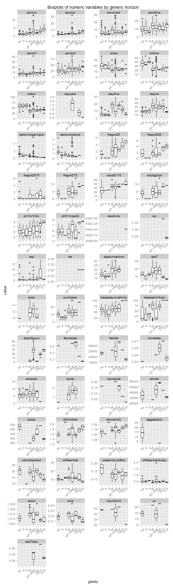


|         | cos| sl| fsl|   l| sil| si| scl|  cl| sicl| sc| sic|  c| Sum|
|:--------|---:|--:|---:|---:|---:|--:|---:|---:|----:|--:|---:|--:|---:|
|A        |   0|  0|   1|   4|  40|  0|   0|   0|    1|  0|   0|  0|  46|
|Ap       |   0|  1|   1|  13|  64|  0|   1|   3|    1|  0|   0|  0|  84|
|not-used |   0|  0|   0|   2|  13|  0|   0|   0|    1|  0|   0|  0|  16|
|Btg      |   0|  0|   2|  38|  24|  0|   7| 137|   35|  0|   8| 53| 304|
|2Btg     |   0|  0|   3|  30|   1|  0|   4|  42|    7|  0|   1|  8|  96|
|C        |   1|  2|  15| 152|   8|  1|   2|  19|    2|  1|   0|  0| 203|
|Sum      |   1|  3|  22| 239| 150|  1|  14| 201|   47|  1|   9| 61| 749|


