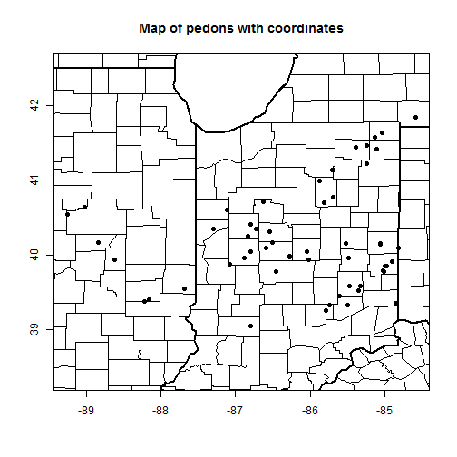
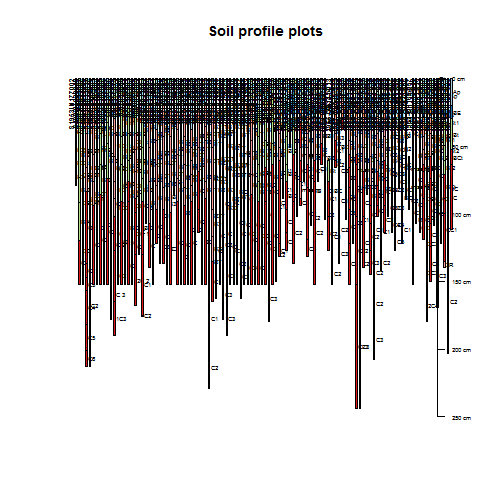
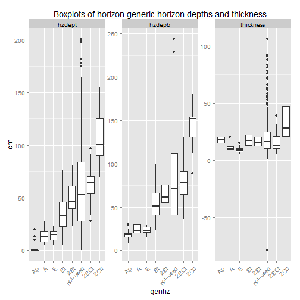
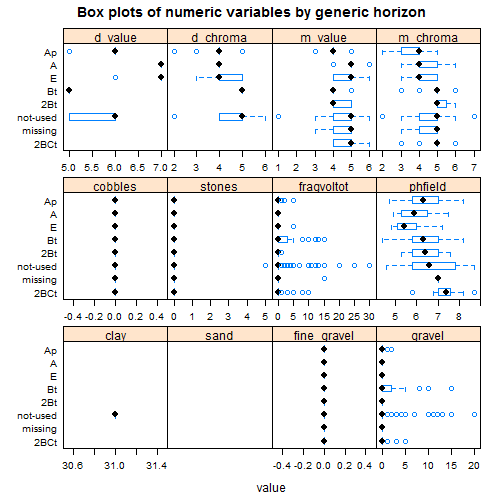

---
output:
  html_document: default
---
# Pedon report

```r
# Set soil series
series <- "Miami"
```


```
## NOTICE: duplicate horizons in query results, matching pedons:
## 1954IL111001
## converting Munsell to RGB ...
## mixing dry colors ... [3 of 41 horizons]
## mixing moist colors ... [74 of 878 horizons]
## replacing missing lower horizon depths with top depth + 1cm ... [1 horizons]
```

```
## Error in llply(.data = .data, .fun = .fun, ..., .progress = .progress, : object '.pickBestTaxHistory' not found
```


## Brief summary of pedon data

 


|pedon_id      |taxonname  |tax_subgroup         |part_size_class |pedon_type |describer                            |
|:-------------|:----------|:--------------------|:---------------|:----------|:------------------------------------|
|S1992IN079003 |Cincinnati |oxyaquic fragiudalfs |fine-loamy      |missing    |Bill Hosteter, Shane McBurnett       |
|S1982IN013001 |Cincinnati |typic fragiudalfs    |fine-silty      |missing    |missing                              |
|89IN119014    |Cincinnati |typic fragiudalfs    |fine-silty      |missing    |Paul McCarter, Jr. and Jerry Shively |
|87IN119003    |Cincinnati |typic fragiudalfs    |fine-silty      |missing    |P. McCarter, Jr.                     |
|1977IN021036  |Cincinnati |typic fragiudults    |fine-silty      |missing    |Mccarter and Neely                   |
|1977IN021037  |Cincinnati |typic fragiudalfs    |fine-silty      |missing    |Mccarter and Neely                   |
|1976IN031023  |Cincinnati |typic fragiudalfs    |fine-silty      |missing    |Shively                              |
|1976IN077006  |Cincinnati |typic fragiudalfs    |fine-silty      |missing    |Nickell and Koleszar                 |
|1978IN031013  |Cincinnati |typic fragiudalfs    |fine-silty      |missing    |Shively                              |
|1977IN021005  |Cincinnati |typic fragiudalfs    |fine-silty      |missing    |Mccarter                             |
|1978IN137004  |Cincinnati |typic fragiudalfs    |fine-silty      |missing    |Harkenrider and Shadis               |
|1979IN055010  |Cincinnati |typic fragiudalfs    |fine-silty      |missing    |Mc carter and Langer                 |
|1979IN055012  |Cincinnati |typic fragiudalfs    |fine-silty      |missing    |Langer and Lefforge                  |
|1981IN047002  |Cincinnati |typic fragiudalfs    |fine-silty      |missing    |Shively                              |
|1981IN155004  |Cincinnati |typic fragiudalfs    |fine-silty      |missing    |Nickell and Stephenson               |


 


## Range in characteristics

### Summary of the soil surface


| value |      total_srf      |       fgravel       |       gravel        |       cobbles       |       stones        |      boulders       |      channers       |     flagstones      |
|:-----:|:-------------------:|:-------------------:|:-------------------:|:-------------------:|:-------------------:|:-------------------:|:-------------------:|:-------------------:|
| (all) | (0, 0, 0, 0, 0)(27) | (0, 0, 0, 0, 0)(27) | (0, 0, 0, 0, 0)(27) | (0, 0, 0, 0, 0)(27) | (0, 0, 0, 0, 0)(27) | (0, 0, 0, 0, 0)(27) | (0, 0, 0, 0, 0)(27) | (0, 0, 0, 0, 0)(27) |


### Summary of diagnostic horizons and soil characteristics


|           diag_kind           |        featdept         |          featdepb           |         thickness          |
|:-----------------------------:|:-----------------------:|:---------------------------:|:--------------------------:|
|       argillic horizon        | (15, 19, 20, 24, 38)(4) | (20, 138, 190, 218, 264)(4) | (0, 122, 173, 194, 226)(4) |
|           fragipan            | (43, 50, 58, 60, 61)(3) | (99, 108, 117, 152, 188)(3) |  (56, 58, 59, 93, 127)(3)  |
|        ochric epipedon        |   (0, 0, 0, 0, 0)(4)    |   (15, 19, 20, 20, 20)(4)   |  (15, 19, 20, 20, 20)(4)   |
| particle size control section | (15, 19, 20, 36, 38)(7) |   (61, 67, 69, 70, 88)(7)   |  (33, 37, 50, 50, 51)(7)   |


### Summary of soil horizons


|         | 2B tx2| 2B24X| 2B3| 2BC1| 2BC2| 2Bt| 2Bt1| 2Bt2| 2Bt22| 2Bt23| 2Btb1| 2Btb2| 2Btx| 2Btx1| 2Btx2| 2Btx3| 2Bxt1| 2Bxt2| 2C| 2C1| 2C2| 3B t3| 3B tb1| 3B tb2| 3B tb3| 3B tx3| 3B25TB| 3B326B| 3BC| 3BCb| 3Bt| 3Btb| 3Btb1| 3Btb2| 3Btb3| 3C| 4B tb| 4BC| 4BC1| 4BC2| 4Btb3| 4Btb4| 4C| 4CR| 5Btb|  A| A p| A1| A2| Ap| AP| B t1| B t2| B tx1| B1| B1T| B21| B21T| B22| B22T| B23T| B23X| B24T| B2T| B3| B31| B31TB| B32| B32TB| B3T| B3T1| B3T2| B3T3| BA| BC| BCT11| BCT12| BCT13| BCT21| BCT22| BE| BET| Bt| BT| Bt1| BT1| Bt2| BT2| Bt21| Bt3| Btx| BTX1| BTX2| BTX3| Bx1| BX1| BX11| BX12| Bx2| BX2| BX21| BX22| BX3|  C| C1| C2| Cr|  E| IIB23T| IIB24T| IIB3| IIBX1T| IIIB1TB| IIIB21T| IIIB22T| IIIBX1| IIIBX2| IIIC|  R| Sum|
|:--------|------:|-----:|---:|----:|----:|---:|----:|----:|-----:|-----:|-----:|-----:|----:|-----:|-----:|-----:|-----:|-----:|--:|---:|---:|-----:|------:|------:|------:|------:|------:|------:|---:|----:|---:|----:|-----:|-----:|-----:|--:|-----:|---:|----:|----:|-----:|-----:|--:|---:|----:|--:|---:|--:|--:|--:|--:|----:|----:|-----:|--:|---:|---:|----:|---:|----:|----:|----:|----:|---:|--:|---:|-----:|---:|-----:|---:|----:|----:|----:|--:|--:|-----:|-----:|-----:|-----:|-----:|--:|---:|--:|--:|---:|---:|---:|---:|----:|---:|---:|----:|----:|----:|---:|---:|----:|----:|---:|---:|----:|----:|---:|--:|--:|--:|--:|--:|------:|------:|----:|------:|-------:|-------:|-------:|------:|------:|----:|--:|---:|
|Ap       |      0|     0|   0|    0|    0|   0|    0|    0|     0|     0|     0|     0|    0|     0|     0|     0|     0|     0|  0|   0|   0|     0|      0|      0|      0|      0|      0|      0|   0|    0|   0|    0|     0|     0|     0|  0|     0|   0|    0|    0|     0|     0|  0|   0|    0|  0|   2|  0|  0| 10| 11|    0|    0|     0|  0|   0|   0|    0|   0|    0|    0|    0|    0|   0|  0|   0|     0|   0|     0|   0|    0|    0|    0|  0|  0|     0|     0|     0|     0|     0|  0|   0|  0|  0|   0|   0|   0|   0|    0|   0|   0|    0|    0|    0|   0|   0|    0|    0|   0|   0|    0|    0|   0|  0|  0|  0|  0|  0|      0|      0|    0|      0|       0|       0|       0|      0|      0|    0|  0|  23|
|A        |      0|     0|   0|    0|    0|   0|    0|    0|     0|     0|     0|     0|    0|     0|     0|     0|     0|     0|  0|   0|   0|     0|      0|      0|      0|      0|      0|      0|   0|    0|   0|    0|     0|     0|     0|  0|     0|   0|    0|    0|     0|     0|  0|   0|    0|  2|   0|  3|  5|  0|  0|    0|    0|     0|  0|   0|   0|    0|   0|    0|    0|    0|    0|   0|  0|   0|     0|   0|     0|   0|    0|    0|    0|  0|  0|     0|     0|     0|     0|     0|  0|   0|  0|  0|   0|   0|   0|   0|    0|   0|   0|    0|    0|    0|   0|   0|    0|    0|   0|   0|    0|    0|   0|  0|  0|  0|  0|  0|      0|      0|    0|      0|       0|       0|       0|      0|      0|    0|  0|  10|
|Bt       |      0|     0|   0|    0|    0|   0|    0|    0|     0|     0|     0|     0|    0|     0|     0|     0|     0|     0|  0|   0|   0|     0|      0|      0|      0|      0|      0|      0|   0|    0|   0|    0|     0|     0|     0|  0|     0|   0|    0|    0|     0|     0|  0|   0|    0|  0|   0|  0|  0|  0|  0|    0|    0|     0|  0|   0|   0|    0|   0|   11|    0|    0|    0|   0|  0|   0|     0|   0|     0|   0|    0|    0|    0|  0|  0|     0|     0|     0|     0|     0|  0|   0|  4|  0|   5|   0|   2|   0|    1|   1|   0|    0|    0|    0|   0|   0|    0|    0|   0|   0|    0|    0|   0|  0|  0|  0|  0|  0|      0|      0|    0|      0|       0|       0|       0|      0|      0|    0|  0|  24|
|2Btx     |      0|     0|   0|    0|    0|   0|    0|    0|     0|     0|     0|     0|    1|     3|     3|     1|     1|     1|  0|   0|   0|     0|      0|      0|      0|      0|      0|      0|   0|    0|   0|    0|     0|     0|     0|  0|     0|   0|    0|    0|     0|     0|  0|   0|    0|  0|   0|  0|  0|  0|  0|    0|    0|     0|  0|   0|   0|    0|   0|    0|    0|    0|    0|   0|  0|   0|     0|   0|     0|   0|    0|    0|    0|  0|  0|     0|     0|     0|     0|     0|  0|   0|  0|  0|   0|   0|   0|   0|    0|   0|   1|    0|    0|    0|   1|  10|    1|    1|   1|   9|    1|    1|   5|  0|  0|  0|  0|  0|      2|      1|    1|      1|       0|       0|       0|      0|      0|    0|  0|  46|
|2Bt      |      0|     0|   0|    0|    0|   0|    0|    0|     0|     0|     0|     0|    0|     1|     2|     0|     0|     0|  0|   0|   0|     0|      0|      0|      0|      0|      0|      0|   0|    0|   0|    0|     0|     0|     0|  0|     0|   0|    0|    0|     0|     0|  0|   0|    0|  0|   0|  0|  0|  0|  0|    0|    0|     0|  0|   0|   0|    0|   0|    0|    0|    0|    0|   0|  0|   0|     0|   0|     0|   0|    0|    0|    0|  0|  0|     0|     0|     0|     0|     0|  0|   0|  0|  0|   0|   0|   0|   0|    0|   0|   0|    0|    0|    0|   0|   0|    0|    0|   0|   0|    0|    0|   0|  0|  0|  0|  0|  0|      0|      0|    0|      0|       0|       0|       0|      0|      0|    0|  0|   3|
|not-used |      2|     1|   1|    1|    1|   1|    1|    1|     1|     1|     0|     0|    0|     0|     0|     0|     0|     0|  0|   0|   0|     0|      0|      0|      0|      0|      1|      1|   0|    0|   0|    0|     0|     0|     0|  0|     1|   0|    0|    0|     1|     1|  1|   1|    1|  0|   0|  0|  0|  0|  0|    2|    2|     2|  5|   2|   4|   12|   8|    0|    4|    1|    2|   1|  4|   3|     1|   3|     1|   3|    1|    1|    1|  2|  1|     1|     1|     1|     1|     1|  3|   1|  0|  1|   0|   1|   0|   1|    0|   0|   0|    1|    1|    1|   0|   0|    0|    0|   0|   0|    0|    0|   0|  0|  0|  0|  1|  2|      0|      0|    0|      0|       0|       0|       0|      0|      0|    0|  1| 104|
|2Btb     |      0|     0|   0|    0|    0|   0|    0|    0|     0|     0|     1|     1|    0|     0|     0|     0|     0|     0|  0|   0|   0|     0|      0|      0|      0|      0|      0|      0|   0|    0|   0|    0|     0|     0|     0|  0|     0|   0|    0|    0|     0|     0|  0|   0|    0|  0|   0|  0|  0|  0|  0|    0|    0|     0|  0|   0|   0|    0|   0|    0|    0|    0|    0|   0|  0|   0|     0|   0|     0|   0|    0|    0|    0|  0|  0|     0|     0|     0|     0|     0|  0|   0|  0|  0|   0|   0|   0|   0|    0|   0|   0|    0|    0|    0|   0|   0|    0|    0|   0|   0|    0|    0|   0|  0|  0|  0|  0|  0|      0|      0|    0|      0|       0|       0|       0|      0|      0|    0|  0|   2|
|3BCt'    |      0|     0|   0|    0|    0|   0|    0|    0|     0|     0|     0|     0|    0|     0|     0|     0|     0|     0|  0|   0|   0|     1|      1|      1|      1|      1|      0|      0|   1|    1|   1|    3|     3|     3|     1|  0|     0|   1|    1|    1|     0|     0|  0|   0|    0|  0|   0|  0|  0|  0|  0|    0|    0|     0|  0|   0|   0|    0|   0|    0|    0|    0|    0|   0|  0|   0|     0|   0|     0|   0|    0|    0|    0|  0|  0|     0|     0|     0|     0|     0|  0|   0|  0|  0|   0|   0|   0|   0|    0|   0|   0|    0|    0|    0|   0|   0|    0|    0|   0|   0|    0|    0|   0|  0|  0|  0|  0|  0|      0|      0|    0|      0|       1|       1|       1|      1|      1|    0|  0|  26|
|3C       |      0|     0|   0|    0|    0|   0|    0|    0|     0|     0|     0|     0|    0|     0|     0|     0|     0|     0|  1|   1|   1|     0|      0|      0|      0|      0|      0|      0|   0|    0|   0|    0|     0|     0|     0|  1|     0|   0|    0|    0|     0|     0|  0|   0|    0|  0|   0|  0|  0|  0|  0|    0|    0|     0|  0|   0|   0|    0|   0|    0|    0|    0|    0|   0|  0|   0|     0|   0|     0|   0|    0|    0|    0|  0|  0|     0|     0|     0|     0|     0|  0|   0|  0|  0|   0|   0|   0|   0|    0|   0|   0|    0|    0|    0|   0|   0|    0|    0|   0|   0|    0|    0|   0|  3|  2|  2|  0|  0|      0|      0|    0|      0|       0|       0|       0|      0|      0|    2|  0|  13|
|Sum      |      2|     1|   1|    1|    1|   1|    1|    1|     1|     1|     1|     1|    1|     4|     5|     1|     1|     1|  1|   1|   1|     1|      1|      1|      1|      1|      1|      1|   1|    1|   1|    3|     3|     3|     1|  1|     1|   1|    1|    1|     1|     1|  1|   1|    1|  2|   2|  3|  5| 10| 11|    2|    2|     2|  5|   2|   4|   12|   8|   11|    4|    1|    2|   1|  4|   3|     1|   3|     1|   3|    1|    1|    1|  2|  1|     1|     1|     1|     1|     1|  3|   1|  4|  1|   5|   1|   2|   1|    1|   1|   1|    1|    1|    1|   1|  10|    1|    1|   1|   9|    1|    1|   5|  3|  2|  2|  1|  2|      2|      1|    1|      1|       1|       1|       1|      1|      1|    2|  1| 251|


|  genhz   |            hzdept             |            hzdepb             |         thickness         |
|:--------:|:-----------------------------:|:-----------------------------:|:-------------------------:|
|    Ap    |      (0, 0, 0, 0, 0)(23)      |   (15, 15, 18, 20, 25)(23)    | (15, 15, 18, 20, 25)(23)  |
|    A     |     (0, 0, 9, 17, 25)(10)     |    (8, 11, 18, 24, 43)(10)    |   (7, 8, 8, 10, 18)(10)   |
|    Bt    |   (18, 32, 40, 50, 132)(24)   |   (33, 52, 56, 70, 175)(24)   |  (8, 15, 18, 29, 56)(24)  |
|   2Btx   |  (25, 64, 80, 107, 175)(46)   |  (51, 91, 108, 132, 297)(46)  | (13, 21, 26, 33, 122)(46) |
|   2Bt    |   (65, 78, 90, 98, 107)(3)    |  (90, 98, 107, 118, 130)(3)   |  (17, 20, 23, 24, 25)(3)  |
| not-used |  (8, 28, 94, 152, 305)(104)   | (20, 52, 131, 184, 356)(104)  | (5, 16, 25, 31, 77)(104)  |
|   2Btb   | (130, 136, 142, 149, 155)(2)  | (155, 166, 178, 189, 200)(2)  |  (25, 30, 35, 40, 45)(2)  |
|  3BCt'   | (74, 119, 156, 187, 310)(26)  | (97, 149, 183, 228, 366)(26)  | (11, 15, 28, 38, 71)(26)  |
|    3C    | (152, 188, 229, 241, 366)(13) | (178, 203, 241, 292, 396)(13) | (12, 15, 26, 36, 64)(13)  |

 


|  genhz   |          clay           |          sand           |     fine_gravel      |         gravel          |
|:--------:|:-----------------------:|:-----------------------:|:--------------------:|:-----------------------:|
|    Ap    | (NA, NA, NA, NA, NA)(0) | (NA, NA, NA, NA, NA)(0) | (0, 0, 0, 0, 0)(23)  |   (0, 0, 0, 0, 0)(23)   |
|    A     | (NA, NA, NA, NA, NA)(0) | (NA, NA, NA, NA, NA)(0) | (0, 0, 0, 0, 0)(10)  |   (0, 0, 0, 0, 0)(10)   |
|    Bt    | (NA, NA, NA, NA, NA)(0) | (NA, NA, NA, NA, NA)(0) | (0, 0, 0, 0, 0)(24)  |   (0, 0, 0, 0, 5)(24)   |
|   2Btx   | (NA, NA, NA, NA, NA)(0) | (NA, NA, NA, NA, NA)(0) | (0, 0, 0, 0, 0)(46)  |   (0, 0, 0, 0, 8)(46)   |
|   2Bt    | (NA, NA, NA, NA, NA)(0) | (NA, NA, NA, NA, NA)(0) |  (0, 0, 0, 0, 0)(3)  | (10, 10, 10, 10, 10)(3) |
| not-used | (NA, NA, NA, NA, NA)(0) | (NA, NA, NA, NA, NA)(0) | (0, 0, 0, 0, 0)(104) |  (0, 0, 0, 0, 20)(104)  |
|   2Btb   | (NA, NA, NA, NA, NA)(0) | (NA, NA, NA, NA, NA)(0) |  (0, 0, 0, 0, 0)(2)  |   (0, 0, 0, 0, 0)(2)    |
|  3BCt'   | (NA, NA, NA, NA, NA)(0) | (NA, NA, NA, NA, NA)(0) | (0, 0, 0, 0, 0)(26)  |  (0, 0, 0, 2, 34)(26)   |
|    3C    | (NA, NA, NA, NA, NA)(0) | (NA, NA, NA, NA, NA)(0) | (0, 0, 0, 0, 0)(13)  |  (0, 0, 0, 0, 70)(13)   |


|  genhz   |       cobbles        |        stones        |       fragvoltot        |            phfield            |
|:--------:|:--------------------:|:--------------------:|:-----------------------:|:-----------------------------:|
|    Ap    | (0, 0, 0, 0, 0)(23)  | (0, 0, 0, 0, 0)(23)  |   (0, 0, 0, 0, 1)(23)   |   (4.6, 5, 5.9, 6.4, 7)(16)   |
|    A     | (0, 0, 0, 0, 0)(10)  | (0, 0, 0, 0, 0)(10)  |   (0, 0, 0, 0, 0)(10)   | (5.6, 5.8, 6.2, 6.6, 6.8)(4)  |
|    Bt    | (0, 0, 0, 0, 0)(24)  | (0, 0, 0, 0, 0)(24)  |   (0, 0, 0, 0, 5)(24)   | (4.1, 4.8, 4.9, 5.4, 6.6)(16) |
|   2Btx   | (0, 0, 0, 0, 0)(46)  | (0, 0, 0, 0, 0)(46)  |  (0, 0, 0, 2, 10)(46)   |  (4, 4.4, 4.8, 5.1, 6.2)(36)  |
|   2Bt    |  (0, 0, 0, 0, 0)(3)  |  (0, 0, 0, 0, 0)(3)  | (10, 10, 10, 10, 10)(3) | (4.8, 5.1, 5.3, 5.3, 5.3)(3)  |
| not-used | (0, 0, 0, 0, 2)(104) | (0, 0, 0, 0, 0)(104) |  (0, 0, 0, 0, 20)(104)  |   (4, 4.7, 5, 5.8, 7.8)(70)   |
|   2Btb   |  (0, 0, 0, 0, 0)(2)  |  (0, 0, 0, 0, 0)(2)  |   (0, 0, 0, 0, 0)(2)    | (5.8, 5.9, 6.1, 6.2, 6.3)(2)  |
|  3BCt'   | (0, 0, 0, 0, 34)(26) | (0, 0, 0, 0, 0)(26)  |  (0, 0, 2, 6, 34)(26)   |  (4.3, 4.4, 4.5, 5, 5.6)(7)   |
|    3C    | (0, 0, 0, 0, 0)(13)  | (0, 0, 0, 0, 0)(13)  |  (0, 0, 0, 0, 70)(13)   |  (4.6, 6, 6.4, 7.3, 7.9)(6)   |


|  genhz   |         d_value         |        d_chroma         |       m_value        |       m_chroma       |
|:--------:|:-----------------------:|:-----------------------:|:--------------------:|:--------------------:|
|    Ap    |   (6, 6, 6, 7, 7)(7)    |   (4, 4, 5, 5, 5)(7)    | (4, 4, 4, 5, 5)(23)  | (4, 4, 4, 4, 6)(23)  |
|    A     |   (6, 6, 6, 6, 6)(3)    |   (4, 4, 4, 4, 4)(3)    | (3, 4, 4, 5, 6)(10)  | (3, 4, 4, 5, 6)(10)  |
|    Bt    | (NA, NA, NA, NA, NA)(0) | (NA, NA, NA, NA, NA)(0) | (4, 5, 5, 5, 5)(24)  | (5, 5, 6, 6, 7)(24)  |
|   2Btx   | (NA, NA, NA, NA, NA)(0) | (NA, NA, NA, NA, NA)(0) | (4, 5, 5, 5, 6)(46)  | (4, 5, 6, 6, 6)(46)  |
|   2Bt    | (NA, NA, NA, NA, NA)(0) | (NA, NA, NA, NA, NA)(0) |  (5, 5, 5, 5, 5)(3)  |  (5, 5, 5, 6, 6)(3)  |
| not-used | (NA, NA, NA, NA, NA)(0) | (NA, NA, NA, NA, NA)(0) | (3, 5, 5, 5, 6)(102) | (2, 5, 6, 6, 7)(102) |
|   2Btb   | (NA, NA, NA, NA, NA)(0) | (NA, NA, NA, NA, NA)(0) |  (5, 5, 5, 5, 5)(2)  |  (6, 6, 6, 7, 7)(2)  |
|  3BCt'   | (NA, NA, NA, NA, NA)(0) | (NA, NA, NA, NA, NA)(0) | (3, 5, 5, 5, 7)(21)  | (2, 5, 6, 6, 7)(21)  |
|    3C    | (NA, NA, NA, NA, NA)(0) | (NA, NA, NA, NA, NA)(0) | (4, 4, 5, 5, 7)(10)  | (2, 4, 5, 5, 6)(10)  |

 
</p>


|         | br|  c| cl| fsl|  l| missing| scl| si| sic| sicl| sil| sl| Sum|
|:--------|--:|--:|--:|---:|--:|-------:|---:|--:|---:|----:|---:|--:|---:|
|Ap       |  0|  0|  0|   0|  0|       0|   0|  1|   0|    0|  22|  0|  23|
|A        |  0|  0|  0|   0|  0|       0|   0|  0|   0|    0|  10|  0|  10|
|Bt       |  0|  0|  1|   0|  1|       0|   0|  0|   0|   16|   6|  0|  24|
|2Btx     |  0|  2| 11|   0| 11|       0|   0|  0|   0|    4|  18|  0|  46|
|2Bt      |  0|  0|  0|   0|  0|       0|   0|  0|   0|    1|   2|  0|   3|
|not-used |  1|  5| 28|   1|  6|       2|   2|  0|   1|   17|  41|  0| 104|
|2Btb     |  0|  0|  2|   0|  0|       0|   0|  0|   0|    0|   0|  0|   2|
|3BCt'    |  0|  1| 13|   0|  5|       4|   0|  0|   2|    0|   0|  1|  26|
|3C       |  0|  3|  4|   0|  4|       1|   1|  0|   0|    0|   0|  0|  13|
|Sum      |  1| 11| 59|   1| 27|       7|   3|  1|   3|   38|  99|  1| 251|


|         | BR|  C| C                             | CL| CL                            | clay| clay loam| CN-CL| CN-L| FSL| gravelly sandy clay loam| heavy clay loam| heavy loam| heavy silt loam|  L| L                             | light clay loam| loam| missing| SCL| SCL                           | SI| SIC| SIC                           | SICL| SICL                          | SIL| SIL                           | silt loam| silty clay loam| SL                            | Sum|
|:--------|--:|--:|------------------------------:|--:|------------------------------:|----:|---------:|-----:|----:|---:|------------------------:|---------------:|----------:|---------------:|--:|------------------------------:|---------------:|----:|-------:|---:|------------------------------:|--:|---:|------------------------------:|----:|------------------------------:|---:|------------------------------:|---------:|---------------:|------------------------------:|---:|
|Ap       |  0|  0|                              0|  0|                              0|    0|         0|     0|    0|   0|                        0|               0|          0|               0|  0|                              0|               0|    0|       0|   0|                              0|  1|   0|                              0|    0|                              0|  14|                              2|         6|               0|                              0|  23|
|A        |  0|  0|                              0|  0|                              0|    0|         0|     0|    0|   0|                        0|               0|          0|               0|  0|                              0|               0|    0|       0|   0|                              0|  0|   0|                              0|    0|                              0|   4|                              1|         5|               0|                              0|  10|
|Bt       |  0|  0|                              0|  0|                              0|    0|         1|     0|    0|   0|                        0|               0|          0|               1|  1|                              0|               0|    0|       0|   0|                              0|  0|   0|                              0|   11|                              0|   3|                              1|         1|               5|                              0|  24|
|2Btx     |  0|  2|                              0|  5|                              0|    0|         4|     0|    0|   0|                        0|               0|          1|               0|  9|                              0|               2|    1|       0|   0|                              0|  0|   0|                              0|    4|                              0|  15|                              1|         2|               0|                              0|  46|
|2Bt      |  0|  0|                              0|  0|                              0|    0|         0|     0|    0|   0|                        0|               0|          0|               0|  0|                              0|               0|    0|       0|   0|                              0|  0|   0|                              0|    1|                              0|   2|                              0|         0|               0|                              0|   3|
|not-used |  1|  3|                              0| 14|                              1|    2|        12|     1|    0|   1|                        0|               0|          0|               2|  6|                              0|               0|    0|       2|   1|                              1|  0|   1|                              0|    9|                              2|  23|                              9|         7|               6|                              0| 104|
|2Btb     |  0|  0|                              0|  2|                              0|    0|         0|     0|    0|   0|                        0|               0|          0|               0|  0|                              0|               0|    0|       0|   0|                              0|  0|   0|                              0|    0|                              0|   0|                              0|         0|               0|                              0|   2|
|3BCt'    |  0|  0|                              1|  5|                              6|    0|         1|     0|    0|   0|                        0|               1|          1|               0|  1|                              1|               0|    2|       4|   0|                              0|  0|   1|                              1|    0|                              0|   0|                              0|         0|               0|                              1|  26|
|3C       |  0|  0|                              0|  1|                              0|    3|         3|     0|    1|   0|                        1|               0|          0|               0|  2|                              0|               0|    1|       1|   0|                              0|  0|   0|                              0|    0|                              0|   0|                              0|         0|               0|                              0|  13|
|Sum      |  1|  5|                              1| 27|                              7|    5|        21|     1|    1|   1|                        1|               1|          2|               3| 19|                              1|               2|    4|       7|   1|                              1|  1|   2|                              1|   25|                              2|  61|                             14|        21|              11|                              1| 251|


|         | 10YR| missing| Sum|
|:--------|----:|-------:|---:|
|Ap       |    7|      16|  23|
|A        |    3|       7|  10|
|Bt       |    0|      24|  24|
|2Btx     |    0|      46|  46|
|2Bt      |    0|       3|   3|
|not-used |    0|     104| 104|
|2Btb     |    0|       2|   2|
|3BCt'    |    0|      26|  26|
|3C       |    0|      13|  13|
|Sum      |   10|     241| 251|


|         | 10YR| 2.5Y| 2.5YR| 5Y| 5YR| 7.5YR| missing| Sum|
|:--------|----:|----:|-----:|--:|---:|-----:|-------:|---:|
|Ap       |   23|    0|     0|  0|   0|     0|       0|  23|
|A        |    7|    0|     1|  1|   0|     1|       0|  10|
|Bt       |   20|    0|     0|  0|   0|     4|       0|  24|
|2Btx     |   39|    0|     0|  0|   0|     7|       0|  46|
|2Bt      |    3|    0|     0|  0|   0|     0|       0|   3|
|not-used |   82|    0|     2|  1|   1|    16|       2| 104|
|2Btb     |    0|    0|     0|  0|   0|     2|       0|   2|
|3BCt'    |   13|    1|     0|  0|   1|     6|       5|  26|
|3C       |    7|    1|     0|  0|   0|     2|       3|  13|
|Sum      |  194|    2|     3|  2|   2|    38|      10| 251|


|         | violent| strong| slight| very slight| none| missing| Sum|
|:--------|-------:|------:|------:|-----------:|----:|-------:|---:|
|Ap       |       0|      0|      0|           0|    0|      23|  23|
|A        |       0|      0|      0|           0|    0|      10|  10|
|Bt       |       0|      0|      0|           0|    0|      24|  24|
|2Btx     |       0|      0|      0|           0|    0|      46|  46|
|2Bt      |       0|      0|      0|           0|    0|       3|   3|
|not-used |       0|      0|      0|           0|    0|     104| 104|
|2Btb     |       0|      0|      0|           0|    0|       2|   2|
|3BCt'    |       0|      0|      0|           0|    0|      26|  26|
|3C       |       0|      1|      1|           0|    0|      11|  13|
|Sum      |       0|      1|      1|           0|    0|     249| 251|


## Geographic setting


|value |elev_field                   |slope_field          |aspect_field                |
|:-----|:----------------------------|:--------------------|:---------------------------|
|(all) |(19, 206, 244, 297, 341)(11) |(1, 3, 7, 9, 14)(21) |(225, 225, 180, 113, 45)(4) |


|                                                                                                             | ground moraine| hill| hillside or mountainside| missing| rise&#124;till plain| Sum|
|:------------------------------------------------------------------------------------------------------------|--------------:|----:|------------------------:|-------:|--------------------:|---:|
|igneous and sedimentary&#124;mixed-noncalcareous till, unspecified&#124;eolian deposits&#124;eolian deposits |              0|    0|                        0|       1|                    0|   1|
|limestone, unspecified residuum                                                                              |              1|    0|                        0|       0|                    0|   1|
|limestone, unspecified&#124;NA residuum&#124;glaciofluvial deposits&#124;loess                               |              0|    0|                        0|       2|                    0|   2|
|missing drift&#124;loess&#124;loess&#124;outwash                                                             |              0|    0|                        0|       1|                    0|   1|
|missing loess                                                                                                |              0|    0|                        0|       1|                    0|   1|
|missing loess&#124;loess&#124;till, unspecified                                                              |              0|    2|                        0|       0|                    0|   2|
|missing loess&#124;till, unspecified                                                                         |              0|    7|                        0|       0|                    2|   9|
|missing loess&#124;till, unspecified&#124;sandstone-shale                                                    |              0|    1|                        0|       0|                    0|   1|
|missing till, unspecified                                                                                    |              5|    1|                        0|       0|                    0|   6|
|mixed-calcareous drift&#124;loess&#124;loess                                                                 |              0|    0|                        0|       1|                    0|   1|
|mixed&#124;mixed-calcareous&#124;mixed-noncalcareous loess&#124;till, unspecified&#124;loess                 |              0|    0|                        1|       0|                    0|   1|
|shale, unspecified residuum                                                                                  |              1|    0|                        0|       0|                    0|   1|
|Sum                                                                                                          |              7|   11|                        1|       6|                    2|  27|


|        | Convex| Linear| Concave| missing| Sum|
|:-------|------:|------:|-------:|-------:|---:|
|Convex  |      0|      0|       0|       2|   2|
|Linear  |      0|      0|       0|       0|   0|
|Concave |      0|      0|       0|       0|   0|
|missing |      0|      0|       0|      25|  25|
|Sum     |      0|      0|       0|      27|  27|


|                                  | Summit| Shoulder| Backslope| Footslope| Toeslope| missing| Sum|
|:---------------------------------|------:|--------:|---------:|---------:|--------:|-------:|---:|
|Excessivelly drained              |      0|        0|         0|         0|        0|       0|   0|
|Well drained                      |      0|        1|         2|         0|        0|      19|  22|
|Somewhat excessively well drained |      0|        0|         0|         0|        0|       0|   0|
|Moderately well drained           |      0|        1|         0|         0|        0|       1|   2|
|Somewhat poorly drained           |      0|        0|         0|         0|        0|       0|   0|
|Poorly drained                    |      0|        0|         0|         0|        0|       0|   0|
|Very poorly drained               |      0|        0|         0|         0|        0|       0|   0|
|Subaqueous drainage               |      0|        0|         0|         0|        0|       0|   0|
|missing                           |      2|        0|         0|         0|        0|       1|   3|
|Sum                               |      2|        2|         2|         0|        0|      21|  27|
