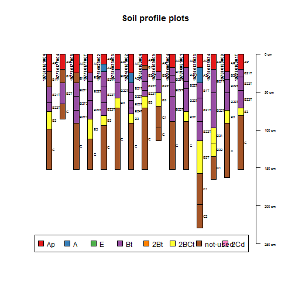
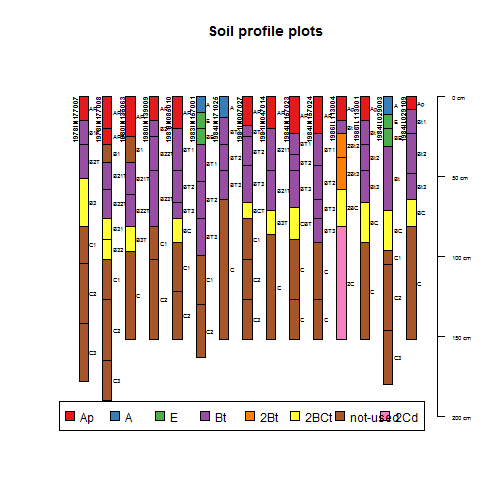
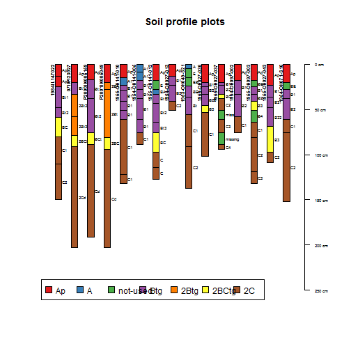
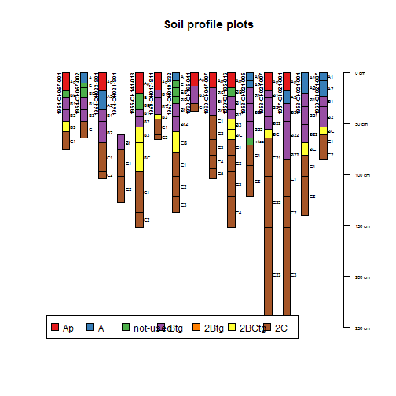
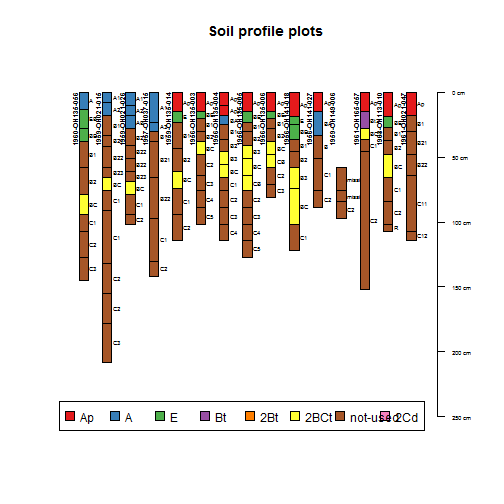
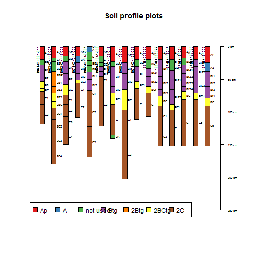
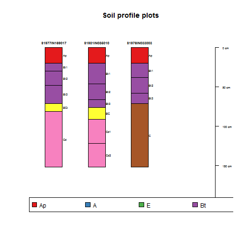
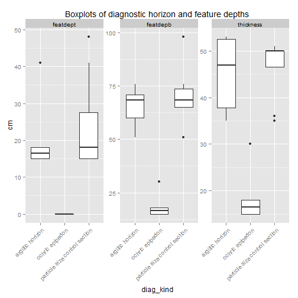

---
output:
  html_document: default
---
# Pedon report

```r
# Set soil series
series <- "Treaty"

# Set percentiles
p <- c(0, 0.25, 0.5, 0.75, 1)
```


```
## NOTICE: multiple `labsampnum` values / horizons; see pedon IDs:
## 1954IL111001
```

```
## mixing dry colors ... [3 of 48 horizons]
```

```
## mixing moist colors ... [74 of 969 horizons]
```

```
## replacing missing lower horizon depths with top depth + 1cm ... [1 horizons]
```

```
## -> QC: horizon errors detected, use `get('bad.pedon.ids', envir=soilDB.env)` for related userpedonid values
```


## Brief summary of pedon data


|pedon_id       |taxonname |tax_subgroup        |part_size_class |pedon_type                         |describer                                                                                                                          |
|:--------------|:---------|:-------------------|:---------------|:----------------------------------|:----------------------------------------------------------------------------------------------------------------------------------|
|1998IN011001   |Miami     |oxyaquic hapludalfs |fine-loamy      |correlates to named soil           |Scot Haley USDA-NRCS Resource Soil Scientist, Jerry Larson USDA-NRCS Soil Data Quality Specialist, Bennie Clark MLRA Project Lader |
|1992IN0350935  |Miami     |typic hapludalfs    |fine-loamy      |correlates to named soil           |Gary R. Struben                                                                                                                    |
|S1953IN177002  |MIAMI     |missing             |missing         |missing                            |missing                                                                                                                            |
|S1982IL029040  |MIAMI     |typic hapludalfs    |fine-loamy      |missing                            |missing                                                                                                                            |
|S1981IN011002  |Miami     |oxyaquic hapludalfs |fine-loamy      |missing                            |missing                                                                                                                            |
|S1981IN011006  |Miami     |oxyaquic hapludalfs |fine-loamy      |missing                            |missing                                                                                                                            |
|S1981IN011012  |Miami     |oxyaquic hapludalfs |fine-loamy      |missing                            |missing                                                                                                                            |
|S1981IN011016  |Miami     |oxyaquic hapludalfs |fine-loamy      |missing                            |missing                                                                                                                            |
|S1982IN107001  |Miami     |oxyaquic hapludalfs |fine-loamy      |missing                            |Bill Hosteter                                                                                                                      |
|S1982IN107002  |Miami     |oxyaquic hapludalfs |fine-loamy      |missing                            |Bill Hosteter                                                                                                                      |
|S1982IN107005  |Miami     |oxyaquic hapludalfs |fine-loamy      |missing                            |Bill Hosteter and Doug Wolf                                                                                                        |
|S1982IN107006  |Miami     |oxyaquic hapludalfs |fine-loamy      |missing                            |Bill Hosteter and Doug Wolf                                                                                                        |
|78IN177007     |Miami     |typic hapludalfs    |fine-loamy      |missing                            |Williams and Blank                                                                                                                 |
|78IN177008     |Miami     |typic hapludalfs    |fine-loamy      |missing                            |Williams and Blank                                                                                                                 |
|84IN157023     |Miami     |typic hapludalfs    |fine-loamy      |missing                            |Mark McClain                                                                                                                       |
|84IN157024     |Miami     |typic hapludalfs    |fine-loamy      |missing                            |Tom Ziegler                                                                                                                        |
|83IL039008     |Miami     |typic hapludalfs    |fine-loamy      |missing                            |missing                                                                                                                            |
|84IN015011     |Miami     |typic hapludalfs    |fine-loamy      |missing                            |Bill Hosteter and Earnie Jensen                                                                                                    |
|87IN107001     |Miami     |oxyaquic hapludalfs |fine-loamy      |missing                            |WD Hosteter, Douglas Wolfe                                                                                                         |
|87IN107008     |Miami     |typic hapludalfs    |fine-loamy      |missing                            |B. Hostetler, J. Shively                                                                                                           |
|88MI059003     |Miami     |oxyaquic hapludalfs |fine-loamy      |missing                            |missing                                                                                                                            |
|90IL045001     |Miami     |oxyaquic hapludalfs |fine-loamy      |missing                            |R. Leeper and J. Brewbaker.                                                                                                        |
|S2001IN005002  |Miami     |oxyaquic hapludalfs |fine-loamy      |map unit inclusion                 |Bill Hosteter, Norm Stephens, Don Franzmeier                                                                                       |
|1968IN011001   |Miami     |missing             |missing         |missing                            |Sanders and Franzmeier                                                                                                             |
|1968IN011007   |Miami     |missing             |missing         |missing                            |Sanders and Langlois                                                                                                               |
|1968IN113001   |Miami     |missing             |missing         |missing                            |Franzmeier                                                                                                                         |
|1968IN139001   |Miami     |missing             |missing         |missing                            |Zachary                                                                                                                            |
|1969IN157001   |Miami     |missing             |missing         |missing                            |Meyers and Harlan                                                                                                                  |
|1969IN157002   |Miami     |missing             |missing         |missing                            |Meyers and Harlan                                                                                                                  |
|1977IN031004   |Miami     |typic hapludalfs    |fine-loamy      |missing                            |Shively                                                                                                                            |
|1976IN151004   |Miami     |typic hapludalfs    |fine-loamy      |missing                            |Farmer                                                                                                                             |
|1977IN177004   |Miami     |typic hapludalfs    |fine-loamy      |missing                            |Blank                                                                                                                              |
|1977IN177008   |Miami     |typic hapludalfs    |fine-loamy      |missing                            |Blank and Meland                                                                                                                   |
|1977IN177007   |Miami     |typic hapludalfs    |fine            |missing                            |Blank and Meland                                                                                                                   |
|1975IN023002   |Miami     |missing             |missing         |missing                            |Hosteter and Fink                                                                                                                  |
|1976IN033003   |Miami     |missing             |missing         |missing                            |Sanders and Jensen                                                                                                                 |
|1974IN151002   |Miami     |missing             |missing         |missing                            |Farmer and Hillis                                                                                                                  |
|1975IN169004   |Miami     |missing             |missing         |missing                            |Landrum and Langer                                                                                                                 |
|1975IN169009   |Miami     |missing             |missing         |missing                            |Ruesch and Landrum                                                                                                                 |
|1978IN065004   |Miami     |typic hapludalfs    |fine-loamy      |missing                            |Hillis and Le masters                                                                                                              |
|1978IN031001   |Miami     |typic hapludalfs    |fine-loamy      |missing                            |Shively                                                                                                                            |
|1979IN135033   |Miami     |typic hapludalfs    |fine-loamy      |missing                            |Neely and Houghtby                                                                                                                 |
|1979IN135034   |Miami     |typic hapludalfs    |fine            |missing                            |Neely and Latowski                                                                                                                 |
|1978IN139008   |Miami     |typic hapludalfs    |fine-loamy      |missing                            |Brock and Rohleder                                                                                                                 |
|1977IN169017   |Miami     |typic hapludalfs    |fine-loamy      |missing                            |Langer and Schumacher                                                                                                              |
|1978IN177007   |Miami     |typic hapludalfs    |fine-loamy      |missing                            |Williams and Blank                                                                                                                 |
|1978IN177008   |Miami     |typic hapludalfs    |fine-loamy      |missing                            |Williams and Blank                                                                                                                 |
|1980IN135063   |Miami     |typic hapludalfs    |fine-loamy      |missing                            |Neely and Latowski                                                                                                                 |
|1980IN139009   |Miami     |typic hapludalfs    |fine-loamy      |missing                            |Brock and Dalton                                                                                                                   |
|1981IN085010   |Miami     |typic hapludalfs    |fine-loamy      |missing                            |Staley                                                                                                                             |
|1983IN157001   |Miami     |typic hapludalfs    |missing         |missing                            |Ziegler and Franzmeier                                                                                                             |
|1984IN171025   |Miami     |typic hapludalfs    |fine-loamy      |missing                            |Shively                                                                                                                            |
|1981IN007027   |Miami     |typic hapludalfs    |fine-loamy      |missing                            |Barnes and Plank                                                                                                                   |
|1981IN047014   |Miami     |typic hapludalfs    |fine-loamy      |missing                            |Shively                                                                                                                            |
|1984IN157023   |Miami     |typic hapludalfs    |fine-loamy      |missing                            |Mcclain and Ziegler                                                                                                                |
|1984IN157024   |Miami     |typic hapludalfs    |fine-loamy      |missing                            |Ziegler and Hosteter                                                                                                               |
|1986IL113004   |Miami     |oxyaquic hapludalfs |fine-loamy      |map unit inclusion                 |CLL                                                                                                                                |
|1986IL113001   |Miami     |oxyaquic hapludalfs |fine-loamy      |map unit inclusion                 |CLL                                                                                                                                |
|1984IL029003   |Miami     |oxyaquic hapludalfs |fine-loamy      |representative pedon for component |RGD, SCM                                                                                                                           |
|1984IL029109   |Miami     |oxyaquic hapludalfs |fine-loamy      |missing                            |AP, GH                                                                                                                             |
|1984IL147022   |Miami     |oxyaquic hapludalfs |fine-loamy      |missing                            |missing                                                                                                                            |
|07IN123027     |Miami     |oxyaquic hapludalfs |fine-loamy      |OSD pedon                          |Unknown                                                                                                                            |
|P2000IN005159  |Miami     |oxyaquic hapludalfs |fine-loamy      |representative pedon for component |Jerry Shivley                                                                                                                      |
|P2001IN005049  |Miami     |oxyaquic hapludalfs |fine-loamy      |representative pedon for component |Norm Stephens                                                                                                                      |
|1955-OH141-010 |Miami     |missing             |missing         |missing                            |Petro & Finney                                                                                                                     |
|1954-OH141-005 |Miami     |missing             |missing         |missing                            |Petro, Garner, Baldridge                                                                                                           |
|1955-OH141-012 |Miami     |missing             |missing         |missing                            |Petro & Finney                                                                                                                     |
|1954-OH027-013 |Miami     |oxyaquic hapludalfs |fine-loamy      |missing                            |bone                                                                                                                               |
|1953-OH049-S21 |Miami     |oxyaquic hapludalfs |fine-loamy      |missing                            |n. holowaychuk                                                                                                                     |
|1955-OH027-036 |Miami     |oxyaquic hapludalfs |fine-loamy      |missing                            |wiseman, bone                                                                                                                      |
|1955-OH027-037 |Miami     |oxyaquic hapludalfs |fine-loamy      |missing                            |bone, siemond, schafer                                                                                                             |
|1954-OH097-002 |Miami     |oxyaquic hapludalfs |fine-loamy      |missing                            |meeker, reese                                                                                                                      |
|1955-OH097-003 |Miami     |oxyaquic hapludalfs |fine-loamy      |missing                            |schafer, reese                                                                                                                     |
|1955-OH027-043 |Miami     |oxyaquic hapludalfs |fine-loamy      |missing                            |bone, wiseman                                                                                                                      |
|1954-OH071-S16 |Miami     |oxyaquic hapludalfs |fine-loamy      |missing                            |dotson                                                                                                                             |
|1954-OH057-001 |Miami     |oxyaquic hapludalfs |fine-loamy      |missing                            |evans, roseler                                                                                                                     |
|1954-OH057-002 |Miami     |oxyaquic hapludalfs |fine-loamy      |missing                            |evans, roseler                                                                                                                     |
|1954-OH023-S01 |Miami     |oxyaquic hapludalfs |fine-loamy      |missing                            |dotson, horse, holowaychuk                                                                                                         |
|1954-OH021-S01 |Miami     |oxyaquic hapludalfs |fine-loamy      |missing                            |holowaychuk, dotson, morse                                                                                                         |
|1955-OH141-013 |Miami     |oxyaquic hapludalfs |fine-loamy      |missing                            |petro, finney                                                                                                                      |
|1959-OH017-S11 |Miami     |oxyaquic hapludalfs |fine-loamy      |missing                            |roseler, carner, reeder                                                                                                            |
|1957-OH049-S32 |Miami     |oxyaquic hapludalfs |fine-loamy      |missing                            |n. holowaychuk, n. reeder                                                                                                          |
|1960-OH165-041 |Miami     |oxyaquic hapludalfs |fine-loamy      |missing                            |garner, ernst                                                                                                                      |
|1960-OH047-007 |Miami     |oxyaquic hapludalfs |fine-loamy      |missing                            |evans, reeder, donaoldson, petro                                                                                                   |
|1959-OH135-016 |Miami     |oxyaquic hapludalfs |fine-loamy      |missing                            |schafer, lerch, hayhurst, Tornes, mcloda                                                                                           |
|1958-OH021-005 |Miami     |oxyaquic hapludalfs |fine-loamy      |missing                            |ritchie                                                                                                                            |
|1958-OH021-007 |Miami     |oxyaquic hapludalfs |fine-loamy      |missing                            |ritchie, evans                                                                                                                     |
|1957-OH021-001 |Miami     |oxyaquic hapludalfs |fine-loamy      |missing                            |ritchie                                                                                                                            |
|1958-OH021-004 |Miami     |oxyaquic hapludalfs |fine-loamy      |missing                            |ritchie                                                                                                                            |
|1960-OH021-037 |Miami     |oxyaquic hapludalfs |fine-loamy      |missing                            |ritchie, dubford                                                                                                                   |
|1960-OH135-056 |Miami     |oxyaquic hapludalfs |fine-loamy      |missing                            |mcloda, tornes, davis,                                                                                                             |
|1959-OH021-015 |Miami     |oxyaquic hapludalfs |fine-loamy      |missing                            |ritchie, evans, powell, donaldson                                                                                                  |
|1959-OH021-026 |Miami     |oxyaquic hapludalfs |fine-loamy      |missing                            |ritchie, powell                                                                                                                    |
|1957-OH037-015 |Miami     |oxyaquic hapludalfs |fine-loamy      |missing                            |heffner, siegenthaler                                                                                                              |
|1959-OH135-014 |Miami     |oxyaquic hapludalfs |fine-loamy      |missing                            |lerch, mcloda, tornes                                                                                                              |
|1956-OH135-003 |Miami     |oxyaquic hapludalfs |fine-loamy      |missing                            |lerch, schafer                                                                                                                     |
|1956-OH135-004 |Miami     |oxyaquic hapludalfs |fine-loamy      |missing                            |lerch, schafer                                                                                                                     |
|1956-OH135-005 |Miami     |oxyaquic hapludalfs |fine-loamy      |missing                            |lerch, schafer                                                                                                                     |
|1956-OH135-006 |Miami     |oxyaquic hapludalfs |fine-loamy      |missing                            |lerch, shcafer                                                                                                                     |
|1956-OH141-018 |Miami     |oxyaquic hapludalfs |fine-loamy      |missing                            |evans, petro                                                                                                                       |
|1956-OH141-027 |Miami     |oxyaquic hapludalfs |fine-loamy      |missing                            |r. h. jones                                                                                                                        |
|1959-OH149-006 |Miami     |oxyaquic hapludalfs |fine-loamy      |missing                            |heffner, siegenthaler                                                                                                              |
|1961-OH165-057 |Miami     |oxyaquic hapludalfs |fine-loamy      |missing                            |garner, ernst                                                                                                                      |
|1963-OH113-010 |Miami     |oxyaquic hapludalfs |fine-loamy      |missing                            |lerch, davis, smeck                                                                                                                |
|1961-OH021-047 |Miami     |oxyaquic hapludalfs |fine-loamy      |missing                            |ritchie, powell, siegenthaler                                                                                                      |
|1961-OH091-011 |Miami     |oxyaquic hapludalfs |fine-loamy      |missing                            |heffner, siegenthaler, urban                                                                                                       |
|1963-OH113-007 |Miami     |oxyaquic hapludalfs |fine-loamy      |missing                            |lerch, smeck, steiger, davis                                                                                                       |
|1962-OH113-003 |Miami     |oxyaquic hapludalfs |fine-loamy      |missing                            |davis, lerch, calhoun                                                                                                              |
|1971-OH017-002 |Miami     |oxyaquic hapludalfs |fine-loamy      |missing                            |lerch, & hale                                                                                                                      |
|1967-OH049-007 |Miami     |oxyaquic hapludalfs |fine-loamy      |missing                            |r. l. blevens                                                                                                                      |
|1969-OH047-003 |Miami     |oxyaquic hapludalfs |fine-loamy      |missing                            |petro                                                                                                                              |
|1968-OH109-018 |Miami     |oxyaquic hapludalfs |fine-loamy      |missing                            |lehman, bottrell                                                                                                                   |
|1968-OH109-021 |Miami     |oxyaquic hapludalfs |fine-loamy      |missing                            |lehman, bottrell                                                                                                                   |
|1971-OH129-023 |Miami     |oxyaquic hapludalfs |fine-loamy      |missing                            |hall, williams, kerr, jones, mc kinney, le master                                                                                  |
|1961IN003020   |Miami     |typic hapludalfs    |fine-loamy      |TUD pedon                          |soil survey staff                                                                                                                  |
|1983IN085022   |Miami     |typic hapludalfs    |fine-loamy      |TUD pedon                          |soil survey staff                                                                                                                  |
|1974IN113017   |Miami     |typic hapludalfs    |fine-loamy      |TUD pedon                          |soil survey staff                                                                                                                  |
|1979IN151021   |Miami     |oxyaquic hapludalfs |fine-loamy      |TUD pedon                          |soil survey staff                                                                                                                  |
|1979IN169020   |Miami     |typic hapludalfs    |fine-loamy      |TUD pedon                          |soil survey staff                                                                                                                  |
|S1974IN151002  |Miami     |typic hapludalfs    |fine-loamy      |taxadjunct to the series           |Farmer and Hillis                                                                                                                  |
|S1977IN169017  |Miami     |typic hapludalfs    |fine-loamy      |correlates to named soil           |Langer and Schumacher                                                                                                              |
|S1981IN085010  |Miami     |typic hapludalfs    |fine-loamy      |correlates to named soil           |Staley                                                                                                                             |
|S1976IN033003  |Miami     |typic hapludalfs    |fine-loamy      |undefined observation              |Sanders and Jensen                                                                                                                 |





## Range in characteristics

### Summary of the soil surface


|  variable  |        range         |
|:----------:|:--------------------:|
| total_srf  | (0, 0, 0, 0, 0)(123) |
|  fgravel   | (0, 0, 0, 0, 0)(123) |
|   gravel   | (0, 0, 0, 0, 0)(123) |
|  cobbles   | (0, 0, 0, 0, 0)(123) |
|   stones   | (0, 0, 0, 0, 0)(123) |
|  boulders  | (0, 0, 0, 0, 0)(123) |
|  channers  | (0, 0, 0, 0, 0)(123) |
| flagstones | (0, 0, 0, 0, 0)(123) |


### Summary of diagnostic horizons and soil characteristics


|           diag_kind           |         featdept         |           featdepb           |        thickness         |
|:-----------------------------:|:------------------------:|:----------------------------:|:------------------------:|
|       argillic horizon        | (15, 18, 20, 27, 41)(18) |   (51, 70, 71, 80, 97)(18)   | (35, 41, 51, 60, 71)(18) |
|        densic contact         | (71, 71, 71, 71, 71)(1)  | (152, 152, 152, 152, 152)(1) | (81, 81, 81, 81, 81)(1)  |
|        ochric epipedon        |   (0, 0, 0, 0, 0)(17)    |   (15, 18, 20, 28, 38)(17)   | (15, 18, 20, 28, 38)(17) |
| particle size control section | (15, 20, 20, 32, 48)(22) |   (51, 69, 70, 78, 98)(22)   | (25, 50, 50, 50, 61)(22) |




### Summary of soil horizons


|         | 1A | 1Ap | 1Ap1 | 1Ap2 | 1B1 | 1B1t | 1B21t | 1B22t | 1B2t | 1B3 | 1B31 | 1B32 | 1BC | 1BCt | 1Bt |
|:--------|:--:|:---:|:----:|:----:|:---:|:----:|:-----:|:-----:|:----:|:---:|:----:|:----:|:---:|:----:|:---:|
|Ap       | 0  |  6  |  1   |  1   |  0  |  0   |   0   |   0   |  0   |  0  |  0   |  0   |  0  |  0   |  0  |
|A        | 1  |  0  |  0   |  0   |  0  |  0   |   0   |   0   |  0   |  0  |  0   |  0   |  0  |  0   |  0  |
|not-used | 0  |  0  |  0   |  0   |  0  |  0   |   0   |   0   |  0   |  0  |  0   |  0   |  0  |  0   |  0  |
|Btg      | 0  |  0  |  0   |  0   |  1  |  1   |   1   |   1   |  1   |  0  |  0   |  0   |  0  |  0   |  1  |
|2Btg     | 0  |  0  |  0   |  0   |  0  |  0   |   0   |   0   |  0   |  0  |  0   |  0   |  0  |  0   |  0  |
|2BCtg    | 0  |  0  |  0   |  0   |  0  |  0   |   0   |   0   |  0   |  1  |  1   |  1   |  1  |  1   |  0  |
|2C       | 0  |  0  |  0   |  0   |  0  |  0   |   0   |   0   |  0   |  0  |  0   |  0   |  0  |  0   |  0  |
|Sum      | 1  |  6  |  1   |  1   |  1  |  1   |   1   |   1   |  1   |  1  |  1   |  1   |  1  |  1   |  1  |


|         | 1Bt1 | 1Bt2 | 1Bt3 | 1Bt4 | 1C | 1C1 | 1C2 | 1C3 | 1E | 2B1 | 2B2 | 2B22T | 2B23T | 2B24T | 2B3 |
|:--------|:----:|:----:|:----:|:----:|:--:|:---:|:---:|:---:|:--:|:---:|:---:|:-----:|:-----:|:-----:|:---:|
|Ap       |  0   |  0   |  0   |  0   | 0  |  0  |  0  |  0  | 0  |  0  |  0  |   0   |   0   |   0   |  0  |
|A        |  0   |  0   |  0   |  0   | 0  |  0  |  0  |  0  | 0  |  0  |  0  |   0   |   0   |   0   |  0  |
|not-used |  0   |  0   |  0   |  0   | 0  |  0  |  0  |  0  | 1  |  0  |  0  |   0   |   0   |   0   |  0  |
|Btg      |  5   |  4   |  4   |  1   | 0  |  0  |  0  |  0  | 0  |  0  |  0  |   0   |   0   |   0   |  0  |
|2Btg     |  0   |  0   |  0   |  0   | 0  |  0  |  0  |  0  | 0  |  1  |  1  |   1   |   1   |   1   |  0  |
|2BCtg    |  0   |  0   |  0   |  0   | 0  |  0  |  0  |  0  | 0  |  0  |  0  |   0   |   0   |   0   |  1  |
|2C       |  0   |  0   |  0   |  0   | 5  |  2  |  2  |  2  | 0  |  0  |  0  |   0   |   0   |   0   |  0  |
|Sum      |  5   |  4   |  4   |  1   | 5  |  2  |  2  |  2  | 1  |  1  |  1  |   1   |   1   |   1   |  1  |


|         | 2BA | 2BC | 2BCt | 2BE2 | 2Bt | 2Bt1 | 2Bt2 | 2Bt3 | 2C | 2C1 | 2C2 | 2C3 | 2C4 | 2CB | 2CBt |
|:--------|:---:|:---:|:----:|:----:|:---:|:----:|:----:|:----:|:--:|:---:|:---:|:---:|:---:|:---:|:----:|
|Ap       |  0  |  0  |  0   |  0   |  0  |  0   |  0   |  0   | 0  |  0  |  0  |  0  |  0  |  0  |  0   |
|A        |  0  |  0  |  0   |  0   |  0  |  0   |  0   |  0   | 0  |  0  |  0  |  0  |  0  |  0  |  0   |
|not-used |  0  |  0  |  0   |  0   |  0  |  0   |  0   |  0   | 0  |  0  |  0  |  0  |  0  |  0  |  0   |
|Btg      |  0  |  0  |  0   |  0   |  0  |  0   |  0   |  0   | 0  |  0  |  0  |  0  |  0  |  0  |  0   |
|2Btg     |  1  |  0  |  0   |  1   |  2  |  1   |  5   |  5   | 0  |  0  |  0  |  0  |  0  |  0  |  0   |
|2BCtg    |  0  |  3  |  3   |  0   |  0  |  0   |  0   |  0   | 0  |  0  |  0  |  0  |  0  |  1  |  1   |
|2C       |  0  |  0  |  0   |  0   |  0  |  0   |  0   |  0   | 3  |  2  |  2  |  1  |  1  |  0  |  0   |
|Sum      |  1  |  3  |  3   |  1   |  2  |  1   |  5   |  5   | 3  |  2  |  2  |  1  |  1  |  1  |  1   |


|         | 2Cd | 2R | A  | A&B | A1 | A2 | A21 | A22 | A3 | A3-B1 | AB | Ap | AP | Ap1 | AP1 |
|:--------|:---:|:--:|:--:|:---:|:--:|:--:|:---:|:---:|:--:|:-----:|:--:|:--:|:--:|:---:|:---:|
|Ap       |  0  | 0  | 0  |  0  | 0  | 0  |  0  |  0  | 0  |   0   | 0  | 55 | 30 |  2  |  1  |
|A        |  0  | 0  | 12 |  1  | 16 | 15 |  1  |  1  | 2  |   0   | 1  | 0  | 0  |  0  |  0  |
|not-used |  0  | 1  | 0  |  0  | 0  | 0  |  0  |  0  | 0  |   0   | 0  | 0  | 0  |  0  |  0  |
|Btg      |  0  | 0  | 0  |  0  | 0  | 0  |  0  |  0  | 0  |   1   | 0  | 0  | 0  |  0  |  0  |
|2Btg     |  0  | 0  | 0  |  0  | 0  | 0  |  0  |  0  | 0  |   0   | 0  | 0  | 0  |  0  |  0  |
|2BCtg    |  0  | 0  | 0  |  0  | 0  | 0  |  0  |  0  | 0  |   0   | 0  | 0  | 0  |  0  |  0  |
|2C       |  3  | 0  | 0  |  0  | 0  | 0  |  0  |  0  | 0  |   0   | 0  | 0  | 0  |  0  |  0  |
|Sum      |  3  | 1  | 12 |  1  | 16 | 15 |  1  |  1  | 2  |   1   | 1  | 55 | 30 |  2  |  1  |


|         | Ap2 | AP2 | B | B&A | B&C | B1 | B1T | B2 | B21 | B21t | B21T | B21T1 | B21T2 | B22 | B22t |
|:--------|:---:|:---:|:-:|:---:|:---:|:--:|:---:|:--:|:---:|:----:|:----:|:-----:|:-----:|:---:|:----:|
|Ap       |  2  |  1  | 0 |  0  |  0  | 0  |  0  | 0  |  0  |  0   |  0   |   0   |   0   |  0  |  0   |
|A        |  0  |  0  | 0 |  1  |  0  | 0  |  0  | 0  |  0  |  0   |  0   |   0   |   0   |  0  |  0   |
|not-used |  0  |  0  | 1 |  0  |  0  | 0  |  0  | 0  |  0  |  0   |  0   |   0   |   0   |  0  |  0   |
|Btg      |  0  |  0  | 0 |  0  |  0  | 47 |  3  | 23 | 10  |  1   |  27  |   1   |   1   | 11  |  2   |
|2Btg     |  0  |  0  | 0 |  0  |  0  | 0  |  0  | 0  |  0  |  0   |  0   |   0   |   0   |  0  |  0   |
|2BCtg    |  0  |  0  | 0 |  0  |  0  | 0  |  0  | 0  |  0  |  0   |  0   |   0   |   0   |  0  |  0   |
|2C       |  0  |  0  | 0 |  0  |  1  | 0  |  0  | 0  |  0  |  0   |  0   |   0   |   0   |  0  |  0   |
|Sum      |  2  |  1  | 1 |  1  |  1  | 47 |  3  | 23 | 10  |  1   |  27  |   1   |   1   | 11  |  2   |


|         | B22T | B23 | B23T | B24T | B2T | B2T1 | B2T2 | B2T3 | B3 | B3-C1 | B31 | B32 | B3T | B4 | BA |
|:--------|:----:|:---:|:----:|:----:|:---:|:----:|:----:|:----:|:--:|:-----:|:---:|:---:|:---:|:--:|:--:|
|Ap       |  0   |  0  |  0   |  0   |  0  |  0   |  0   |  0   | 0  |   0   |  0  |  0  |  0  | 0  | 0  |
|A        |  0   |  0  |  0   |  0   |  0  |  0   |  0   |  0   | 0  |   0   |  0  |  0  |  0  | 0  | 5  |
|not-used |  0   |  0  |  0   |  0   |  0  |  0   |  0   |  0   | 0  |   0   |  0  |  0  |  0  | 1  | 0  |
|Btg      |  26  |  3  |  14  |  1   |  2  |  1   |  1   |  1   | 0  |   0   |  0  |  0  |  0  | 0  | 0  |
|2Btg     |  0   |  0  |  0   |  0   |  0  |  0   |  0   |  0   | 0  |   0   |  0  |  0  |  0  | 0  | 0  |
|2BCtg    |  0   |  0  |  0   |  0   |  0  |  0   |  0   |  0   | 26 |   1   |  2  |  2  |  6  | 0  | 0  |
|2C       |  0   |  0  |  0   |  0   |  0  |  0   |  0   |  0   | 0  |   0   |  0  |  0  |  0  | 0  | 0  |
|Sum      |  26  |  3  |  14  |  1   |  2  |  1   |  1   |  1   | 26 |   1   |  2  |  2  |  6  | 1  | 5  |


|         | BC | BC3 | BCd | BCt | BCT | BE | BE1 | BEt | Bt | Bt1 | BT1 | Bt2 | BT2 | Bt21 | Bt22 |
|:--------|:--:|:---:|:---:|:---:|:---:|:--:|:---:|:---:|:--:|:---:|:---:|:---:|:---:|:----:|:----:|
|Ap       | 0  |  0  |  0  |  0  |  0  | 0  |  0  |  0  | 0  |  0  |  0  |  0  |  0  |  0   |  0   |
|A        | 0  |  0  |  0  |  0  |  0  | 0  |  0  |  0  | 0  |  0  |  0  |  0  |  0  |  0   |  0   |
|not-used | 0  |  0  |  0  |  0  |  0  | 24 |  1  |  0  | 0  |  0  |  0  |  0  |  0  |  0   |  0   |
|Btg      | 0  |  0  |  0  |  0  |  0  | 0  |  0  |  2  | 4  | 28  |  6  | 26  |  6  |  4   |  4   |
|2Btg     | 0  |  0  |  0  |  0  |  0  | 0  |  0  |  0  | 0  |  0  |  0  |  0  |  0  |  0   |  0   |
|2BCtg    | 32 |  1  |  1  |  8  |  1  | 0  |  0  |  0  | 0  |  0  |  0  |  0  |  0  |  0   |  0   |
|2C       | 0  |  0  |  0  |  0  |  0  | 0  |  0  |  0  | 0  |  0  |  0  |  0  |  0  |  0   |  0   |
|Sum      | 32 |  1  |  1  |  8  |  1  | 24 |  1  |  2  | 4  | 28  |  6  | 26  |  6  |  4   |  4   |


|         | Bt23 | Bt24 | Bt3 | BT3 | Bt4 | Btk | BW | C  | C1 | C11 | C12 | C2 | C21 | C22 | C23 |
|:--------|:----:|:----:|:---:|:---:|:---:|:---:|:--:|:--:|:--:|:---:|:---:|:--:|:---:|:---:|:---:|
|Ap       |  0   |  0   |  0  |  0  |  0  |  0  | 0  | 0  | 0  |  0  |  0  | 0  |  0  |  0  |  0  |
|A        |  0   |  0   |  0  |  0  |  0  |  0  | 0  | 0  | 0  |  0  |  0  | 0  |  0  |  0  |  0  |
|not-used |  0   |  0   |  0  |  0  |  0  |  0  | 1  | 0  | 0  |  0  |  0  | 0  |  0  |  0  |  0  |
|Btg      |  2   |  1   | 12  |  7  |  2  |  1  | 0  | 0  | 0  |  0  |  0  | 0  |  0  |  0  |  0  |
|2Btg     |  0   |  0   |  0  |  0  |  0  |  0  | 0  | 0  | 0  |  0  |  0  | 0  |  0  |  0  |  0  |
|2BCtg    |  0   |  0   |  0  |  0  |  0  |  0  | 0  | 0  | 0  |  0  |  0  | 0  |  0  |  0  |  0  |
|2C       |  0   |  0   |  0  |  0  |  0  |  0  | 0  | 45 | 54 |  1  |  1  | 52 |  1  |  1  |  1  |
|Sum      |  2   |  1   | 12  |  7  |  2  |  1  | 1  | 45 | 54 |  1  |  1  | 52 |  1  |  1  |  1  |


|         | C3 | C4 | C5 | C6 | CB | CBT | Cd | Cd1 | Cd2 | E  | E1 | E2 | EB | missing | Oi |
|:--------|:--:|:--:|:--:|:--:|:--:|:---:|:--:|:---:|:---:|:--:|:--:|:--:|:--:|:-------:|:--:|
|Ap       | 0  | 0  | 0  | 0  | 0  |  0  | 0  |  0  |  0  | 0  | 0  | 0  | 0  |    0    | 0  |
|A        | 0  | 0  | 0  | 0  | 0  |  0  | 0  |  0  |  0  | 0  | 0  | 0  | 0  |    0    | 0  |
|not-used | 0  | 0  | 0  | 0  | 0  |  0  | 0  |  0  |  0  | 13 | 1  | 1  | 4  |    5    | 1  |
|Btg      | 0  | 0  | 0  | 0  | 0  |  0  | 0  |  0  |  0  | 0  | 0  | 0  | 0  |    0    | 0  |
|2Btg     | 0  | 0  | 0  | 0  | 0  |  0  | 0  |  0  |  0  | 0  | 0  | 0  | 0  |    0    | 0  |
|2BCtg    | 0  | 0  | 0  | 0  | 3  |  1  | 0  |  0  |  0  | 0  | 0  | 0  | 0  |    0    | 0  |
|2C       | 19 | 8  | 4  | 1  | 0  |  0  | 5  |  1  |  1  | 0  | 0  | 0  | 0  |    0    | 0  |
|Sum      | 19 | 8  | 4  | 1  | 3  |  1  | 5  |  1  |  1  | 13 | 1  | 1  | 4  |    5    | 1  |


|         | R | Sum |
|:--------|:-:|:---:|
|Ap       | 0 | 99  |
|A        | 0 | 56  |
|not-used | 1 | 56  |
|Btg      | 0 | 301 |
|2Btg     | 0 | 20  |
|2BCtg    | 0 | 98  |
|2C       | 0 | 219 |
|Sum      | 1 | 849 |


|  genhz   |           hzdept            |            hzdepb             |         thickness         |
|:--------:|:---------------------------:|:-----------------------------:|:-------------------------:|
|    Ap    |    (0, 0, 0, 0, 20)(99)     |    (8, 15, 20, 20, 30)(99)    |  (8, 15, 20, 20, 25)(99)  |
|    A     |    (0, 0, 8, 15, 28)(56)    |    (5, 10, 18, 26, 38)(56)    |  (5, 8, 10, 13, 23)(56)   |
| not-used |  (0, 15, 20, 26, 135)(56)   |   (1, 23, 28, 36, 140)(56)    |   (1, 7, 8, 10, 18)(56)   |
|   Btg    |  (5, 23, 36, 48, 92)(301)   |  (20, 41, 51, 66, 120)(301)   | (3, 10, 16, 21, 56)(301)  |
|   2Btg   |  (20, 35, 44, 59, 81)(20)   |   (28, 52, 62, 80, 102)(20)   |  (8, 13, 20, 21, 53)(20)  |
|  2BCtg   |  (28, 56, 69, 76, 117)(98)  |   (36, 69, 81, 94, 157)(98)   |  (5, 10, 13, 18, 43)(98)  |
|    2C    | (30, 76, 91, 107, 201)(219) | (38, 102, 127, 152, 244)(219) | (0, 16, 26, 46, 117)(219) |


|  genhz   |          clay           |          sand           |     fine_gravel      |        gravel         |
|:--------:|:-----------------------:|:-----------------------:|:--------------------:|:---------------------:|
|    Ap    | (NA, NA, NA, NA, NA)(0) | (NA, NA, NA, NA, NA)(0) | (0, 0, 0, 0, 1)(99)  |  (0, 0, 0, 0, 2)(99)  |
|    A     | (NA, NA, NA, NA, NA)(0) | (NA, NA, NA, NA, NA)(0) | (0, 0, 0, 0, 0)(56)  |  (0, 0, 0, 0, 3)(56)  |
| not-used | (NA, NA, NA, NA, NA)(0) | (NA, NA, NA, NA, NA)(0) | (0, 0, 0, 0, 1)(56)  |  (0, 0, 0, 0, 2)(56)  |
|   Btg    | (NA, NA, NA, NA, NA)(0) | (NA, NA, NA, NA, NA)(0) | (0, 0, 0, 0, 2)(301) | (0, 0, 0, 0, 15)(301) |
|   2Btg   | (31, 31, 31, 31, 31)(1) | (NA, NA, NA, NA, NA)(0) | (0, 0, 0, 0, 0)(20)  |  (0, 0, 0, 0, 5)(20)  |
|  2BCtg   | (NA, NA, NA, NA, NA)(0) | (NA, NA, NA, NA, NA)(0) | (0, 0, 0, 0, 2)(98)  | (0, 0, 0, 0, 20)(98)  |
|    2C    | (NA, NA, NA, NA, NA)(0) | (NA, NA, NA, NA, NA)(0) | (0, 0, 0, 0, 5)(219) | (0, 0, 0, 0, 15)(219) |


|  genhz   |       cobbles        |        stones        |      fragvoltot       |            phfield             |
|:--------:|:--------------------:|:--------------------:|:---------------------:|:------------------------------:|
|    Ap    | (0, 0, 0, 0, 0)(99)  | (0, 0, 0, 0, 0)(99)  |  (0, 0, 0, 0, 5)(99)  |  (4.7, 5.8, 6.3, 7, 8.2)(73)   |
|    A     | (0, 0, 0, 0, 0)(56)  | (0, 0, 0, 0, 0)(56)  |  (0, 0, 0, 0, 5)(56)  | (4.8, 5.8, 6.3, 6.6, 7.5)(43)  |
| not-used | (0, 0, 0, 0, 0)(56)  | (0, 0, 0, 0, 0)(56)  | (0, 0, 0, 0, 15)(56)  | (4.7, 5.3, 5.8, 6.6, 7.5)(36)  |
|   Btg    | (0, 0, 0, 0, 0)(301) | (0, 0, 0, 0, 0)(301) | (0, 0, 0, 0, 15)(301) | (4.4, 5.5, 6.2, 6.8, 8.1)(235) |
|   2Btg   | (0, 0, 0, 0, 0)(20)  | (0, 0, 0, 0, 0)(20)  |  (0, 0, 0, 1, 5)(20)  |  (5.2, 5.5, 5.8, 7, 7.6)(15)   |
|  2BCtg   | (0, 0, 0, 0, 0)(98)  | (0, 0, 0, 0, 0)(98)  | (0, 0, 0, 1, 25)(98)  | (5.5, 6.8, 7.4, 7.8, 8.7)(66)  |
|    2C    | (0, 0, 0, 0, 0)(219) | (0, 0, 0, 0, 5)(219) | (0, 0, 0, 2, 30)(219) | (6.6, 7.9, 8.1, 8.2, 8.7)(84)  |


|  genhz   |         d_value         |        d_chroma         |       m_value        |       m_chroma       |
|:--------:|:-----------------------:|:-----------------------:|:--------------------:|:--------------------:|
|    Ap    |   (5, 6, 6, 6, 7)(24)   |   (2, 4, 4, 4, 5)(24)   | (3, 4, 4, 4, 5)(99)  | (2, 3, 4, 4, 5)(98)  |
|    A     |   (5, 5, 5, 6, 7)(5)    |   (2, 2, 2, 4, 4)(5)    | (1, 3, 4, 5, 6)(56)  | (2, 3, 4, 4, 6)(56)  |
| not-used |   (6, 6, 7, 7, 7)(6)    |   (3, 4, 4, 5, 5)(6)    | (3, 4, 5, 5, 6)(51)  | (3, 4, 5, 5, 7)(50)  |
|   Btg    |   (5, 5, 5, 5, 6)(4)    |   (5, 5, 5, 5, 6)(4)    | (3, 4, 4, 5, 6)(298) | (3, 5, 5, 5, 7)(299) |
|   2Btg   | (NA, NA, NA, NA, NA)(0) | (NA, NA, NA, NA, NA)(0) | (4, 4, 4, 5, 5)(20)  | (4, 5, 5, 5, 6)(20)  |
|  2BCtg   |   (6, 6, 6, 6, 6)(1)    |   (5, 5, 5, 5, 5)(1)    | (3, 4, 5, 5, 6)(98)  | (3, 5, 5, 5, 6)(98)  |
|    2C    |   (6, 6, 6, 6, 6)(5)    |   (5, 5, 5, 5, 5)(5)    | (3, 5, 5, 5, 6)(208) | (3, 4, 5, 5, 6)(206) |


</p>


|         | cos|  s| ls| sl| fsl|   l| sil| scl|  cl| sicl| sc| sic|  c| NA| Sum|
|:--------|---:|--:|--:|--:|---:|---:|---:|---:|---:|----:|--:|---:|--:|--:|---:|
|Ap       |   0|  0|  0|  0|   2|  17|  72|   2|   6|    0|  0|   0|  0|  0|  99|
|A        |   0|  0|  0|  0|   2|   7|  42|   0|   1|    3|  0|   0|  0|  1|  56|
|not-used |   0|  0|  0|  0|   0|   9|  21|   0|   3|   16|  0|   1|  1|  5|  56|
|Btg      |   0|  0|  0|  0|   1|  33|  16|   4| 152|   49|  0|   6| 40|  0| 301|
|2Btg     |   0|  0|  0|  0|   0|   3|   0|   0|  15|    2|  0|   0|  0|  0|  20|
|2BCtg    |   0|  0|  0|  0|   2|  43|   1|   4|  32|   11|  0|   0|  5|  0|  98|
|2C       |   1|  1|  1|  4|  11| 174|   7|   2|  12|    0|  1|   0|  0|  5| 219|
|NA       |   0|  0|  0|  0|   0|   0|   0|   0|   0|    0|  0|   0|  0|  0|   0|
|Sum      |   1|  1|  1|  4|  18| 286| 159|  12| 221|   81|  1|   7| 46| 11| 849|


|         | and calcareous loam till | and fine silty clay loam | C | calcareous loamy till | CL  | CL                             | clay | clay loam | coarse silty clay loam | fine clay loam | fine clay loam or clay | fine loam | fine silty clay loam | FSL | GR-CL |
|:--------|:------------------------:|:------------------------:|:-:|:---------------------:|:---:|:------------------------------:|:----:|:---------:|:----------------------:|:--------------:|:----------------------:|:---------:|:--------------------:|:---:|:-----:|
|Ap       |            0             |            0             | 0 |           0           |  2  |               2                |  0   |     2     |           0            |       0        |           0            |     0     |          0           |  2  |   0   |
|A        |            0             |            0             | 0 |           0           |  0  |               0                |  0   |     1     |           0            |       0        |           0            |     0     |          0           |  2  |   0   |
|not-used |            0             |            0             | 0 |           0           |  1  |               0                |  0   |     2     |           1            |       0        |           0            |     0     |          0           |  0  |   0   |
|Btg      |            0             |            1             | 1 |           0           | 97  |               29               |  38  |    20     |           0            |       1        |           2            |     0     |          2           |  1  |   1   |
|2Btg     |            0             |            0             | 0 |           0           |  6  |               7                |  0   |     2     |           0            |       0        |           0            |     0     |          0           |  0  |   0   |
|2BCtg    |            0             |            0             | 0 |           0           | 13  |               2                |  4   |    14     |           0            |       1        |           0            |     1     |          0           |  2  |   0   |
|2C       |            1             |            0             | 0 |           1           |  1  |               1                |  0   |     8     |           0            |       0        |           0            |     2     |          0           | 11  |   0   |
|Sum      |            1             |            1             | 1 |           1           | 120 |               41               |  42  |    49     |           1            |       2        |           2            |     3     |          2           | 18  |   1   |


|         | GR-COS | GR-L | GR-SL                          | heavy clay loam | heavy loam | heavy loam or clay loam | heavy silt loam | heavy silty clay loam |  L  | L                              | light clay | light clay loam | light loam | light silty clay loam | loam |
|:--------|:------:|:----:|:------------------------------:|:---------------:|:----------:|:-----------------------:|:---------------:|:---------------------:|:---:|:------------------------------:|:----------:|:---------------:|:----------:|:---------------------:|:----:|
|Ap       |   0    |  0   |               0                |        0        |     0      |            0            |        1        |           0           | 14  |               3                |     0      |        0        |     0      |           0           |  0   |
|A        |   0    |  0   |               0                |        0        |     0      |            0            |        0        |           0           |  6  |               1                |     0      |        0        |     0      |           0           |  0   |
|not-used |   0    |  0   |               0                |        0        |     0      |            0            |        2        |           0           |  6  |               1                |     1      |        0        |     0      |           3           |  2   |
|Btg      |   0    |  2   |               0                |        1        |     0      |            0            |        2        |           6           | 27  |               4                |     1      |        1        |     0      |           1           |  0   |
|2Btg     |   0    |  0   |               0                |        0        |     0      |            0            |        0        |           0           |  2  |               1                |     0      |        0        |     0      |           0           |  0   |
|2BCtg    |   0    |  1   |               0                |        0        |     1      |            0            |        1        |           1           | 28  |               8                |     1      |        2        |     0      |           0           |  4   |
|2C       |   1    |  0   |               1                |        0        |     1      |            1            |        0        |           0           | 61  |               21               |     0      |        1        |     2      |           0           |  85  |
|Sum      |   1    |  3   |               1                |        1        |     2      |            1            |        6        |           7           | 144 |               39               |     3      |        4        |     2      |           4           |  91  |


|         | loam glacial till | LS                             | medium silty clay loam | missing | S                              | SC | SCL | SICL | SICL                           | SIL | SIL                            | silt loam | silt loam or loam | silty clay | silty clay loam |
|:--------|:-----------------:|:------------------------------:|:----------------------:|:-------:|:------------------------------:|:--:|:---:|:----:|:------------------------------:|:---:|:------------------------------:|:---------:|:-----------------:|:----------:|:---------------:|
|Ap       |         0         |               0                |           0            |    0    |               0                | 0  |  2  |  0   |               0                | 29  |               8                |    34     |         0         |     0      |        0        |
|A        |         0         |               0                |           0            |    1    |               0                | 0  |  0  |  0   |               0                | 16  |               3                |    23     |         0         |     0      |        3        |
|not-used |         0         |               0                |           1            |    5    |               0                | 0  |  0  |  0   |               0                |  2  |               1                |    16     |         0         |     1      |       11        |
|Btg      |         0         |               0                |           0            |    0    |               0                | 0  |  4  |  12  |               3                |  9  |               3                |     2     |         0         |     6      |       23        |
|2Btg     |         0         |               0                |           0            |    0    |               0                | 0  |  0  |  1   |               0                |  0  |               0                |     0     |         0         |     0      |        1        |
|2BCtg    |         0         |               0                |           0            |    0    |               0                | 0  |  4  |  0   |               0                |  0  |               0                |     0     |         0         |     0      |       10        |
|2C       |         1         |               1                |           0            |    4    |               1                | 1  |  2  |  0   |               0                |  0  |               0                |     6     |         1         |     0      |        0        |
|Sum      |         1         |               1                |           1            |   10    |               1                | 1  | 12  |  13  |               3                | 56  |               15               |    81     |         1         |     7      |       48        |


|         | silty clay loam to silty clay | SL | SL                             | Sum |
|:--------|:-----------------------------:|:--:|:------------------------------:|:---:|
|Ap       |               0               | 0  |               0                | 99  |
|A        |               0               | 0  |               0                | 56  |
|not-used |               0               | 0  |               0                | 56  |
|Btg      |               1               | 0  |               0                | 301 |
|2Btg     |               0               | 0  |               0                | 20  |
|2BCtg    |               0               | 0  |               0                | 98  |
|2C       |               0               | 1  |               2                | 219 |
|Sum      |               1               | 1  |               2                | 849 |


|         | 10YR| 2.5Y| 5YR| missing| Sum|
|:--------|----:|----:|---:|-------:|---:|
|Ap       |   24|    0|   0|      75|  99|
|A        |    5|    0|   0|      51|  56|
|not-used |    5|    0|   1|      50|  56|
|Btg      |    3|    1|   0|     297| 301|
|2Btg     |    0|    0|   0|      20|  20|
|2BCtg    |    0|    1|   0|      97|  98|
|2C       |    0|    5|   0|     214| 219|
|Sum      |   37|    7|   1|     804| 849|


|         | 10Y| 10YR| 2.5Y| 2.5YR| 5Y| 5YR| 7.5Y| 7.5YR| missing| Sum|
|:--------|---:|----:|----:|-----:|--:|---:|----:|-----:|-------:|---:|
|Ap       |   0|   89|    0|     2|  3|   1|    0|     4|       0|  99|
|A        |   0|   51|    0|     0|  1|   0|    1|     3|       0|  56|
|not-used |   0|   46|    0|     0|  2|   0|    0|     3|       5|  56|
|Btg      |   1|  221|    4|     0|  4|   7|    0|    62|       2| 301|
|2Btg     |   0|   19|    1|     0|  0|   0|    0|     0|       0|  20|
|2BCtg    |   0|   86|    5|     0|  0|   2|    0|     5|       0|  98|
|2C       |   0|  177|   20|     0|  4|   4|    0|     3|      11| 219|
|Sum      |   1|  689|   30|     2| 14|  14|    1|    80|      18| 849|


|         | violent| strong| slight| very slight| none| missing| Sum|
|:--------|-------:|------:|------:|-----------:|----:|-------:|---:|
|Ap       |       0|      0|      1|           2|    1|      95|  99|
|A        |       0|      0|      0|           0|    0|      56|  56|
|not-used |       0|      0|      2|           0|    0|      54|  56|
|Btg      |       1|      3|      4|           2|    2|     289| 301|
|2Btg     |       0|      0|      1|           0|    0|      19|  20|
|2BCtg    |       1|     18|     25|           0|    1|      53|  98|
|2C       |       7|    114|     40|           0|    0|      58| 219|
|Sum      |       9|    135|     73|           4|    4|     624| 849|


## Geographic setting


|   variable   |                 range                 |
|:------------:|:-------------------------------------:|
|  elev_field  | (197.4, 243.8, 285, 329.2, 387.1)(48) |
| slope_field  |         (0, 3, 4, 4, 40)(112)         |
| aspect_field |      (315, 225, 180, 90, 0)(21)       |


|                                                      | dead ice moraine| end moraine| flat & knoll & ridge| flat & till plain| ground moraine| hill| knoll| missing| moraine| outwash plain| plain| rise & moraine| rise & till plain| stream terrace| till plain| till plain & end moraine & ground moraine| upland slope| Sum|
|:-----------------------------------------------------|----------------:|-----------:|--------------------:|-----------------:|--------------:|----:|-----:|-------:|-------:|-------------:|-----:|--------------:|-----------------:|--------------:|----------:|-----------------------------------------:|------------:|---:|
|limestone, unspecified residuum                       |                0|           0|                    0|                 0|              2|    0|     0|       0|       0|             0|     0|              0|                 0|              0|          0|                                         0|            0|   2|
|missing drift                                         |                0|           0|                    0|                 0|              0|    0|     0|       2|       1|             0|     0|              0|                 0|              0|          0|                                         0|            0|   3|
|missing loess                                         |                0|           0|                    0|                 0|              0|    0|     0|       1|       0|             0|     0|              0|                 0|              0|          0|                                         0|            0|   1|
|missing loess & outwash                               |                0|           0|                    0|                 0|              0|    0|     0|       0|       0|             0|     0|              0|                 0|              1|          0|                                         0|            0|   1|
|missing loess & till, unspecified                     |                1|           0|                    0|                 2|              0|    4|     0|       5|       1|             0|     0|              0|                 3|              0|          1|                                         0|            0|  17|
|missing loess & till, unspecified & till, unspecified |                0|           0|                    0|                 0|              0|    0|     0|       0|       0|             0|     0|              0|                 1|              0|          0|                                         0|            0|   1|
|missing missing                                       |                0|           0|                    0|                 0|              0|    0|     1|       7|       0|             0|     0|              0|                 0|              0|          3|                                         0|            0|  11|
|missing outwash & till, unspecified                   |                0|           0|                    0|                 0|              0|    0|     0|       0|       0|             1|     0|              0|                 0|              0|          0|                                         0|            0|   1|
|missing till, ablation                                |                0|           1|                    1|                 0|              0|    0|     0|       0|       0|             0|     0|              0|                 0|              0|          1|                                         2|            0|   5|
|missing till, unspecified                             |                0|           0|                    0|                 0|             43|    2|     0|       6|       4|             0|     0|              8|                 7|              0|          2|                                         0|            0|  72|
|missing till, unspecified & till, unspecified         |                0|           0|                    0|                 0|              0|    0|     0|       0|       0|             0|     0|              0|                 1|              0|          0|                                         0|            0|   1|
|mixed-calcareous till, unspecified                    |                0|           0|                    0|                 0|              1|    0|     0|       1|       0|             0|     0|              0|                 0|              0|          0|                                         0|            1|   3|
|mixed & mixed-calcareous loess & till, unspecified    |                0|           0|                    0|                 0|              0|    0|     0|       0|       0|             0|     0|              0|                 0|              0|          0|                                         0|            2|   2|
|mixed loess & till, unspecified                       |                0|           0|                    0|                 0|              1|    0|     0|       0|       0|             0|     1|              0|                 0|              0|          0|                                         0|            0|   2|
|mixed till, unspecified                               |                0|           0|                    0|                 0|              0|    0|     0|       0|       0|             0|     1|              0|                 0|              0|          0|                                         0|            0|   1|
|Sum                                                   |                1|           1|                    1|                 2|             47|    6|     1|      22|       6|             1|     2|              8|                12|              1|          7|                                         2|            3| 123|


|        | Convex| Linear| Concave| missing| Sum|
|:-------|------:|------:|-------:|-------:|---:|
|Convex  |      1|      1|       0|       3|   5|
|Linear  |      0|      1|       0|       0|   1|
|Concave |      0|      0|       0|       0|   0|
|missing |      0|      0|       0|     117| 117|
|Sum     |      1|      2|       0|     120| 123|


|                                  | Summit| Shoulder| Backslope| Footslope| Toeslope| missing| Sum|
|:---------------------------------|------:|--------:|---------:|---------:|--------:|-------:|---:|
|Excessivelly drained              |      0|        0|         0|         0|        0|       0|   0|
|Well drained                      |      1|        2|         0|         1|        0|       0|   4|
|Somewhat excessively well drained |      0|        0|         0|         0|        0|       0|   0|
|Moderately well drained           |      0|        1|         2|         0|        0|       0|   3|
|Somewhat poorly drained           |      0|        0|         0|         0|        0|       0|   0|
|Poorly drained                    |      0|        0|         0|         0|        0|       0|   0|
|Very poorly drained               |      0|        0|         0|         0|        0|       0|   0|
|Subaqueous drainage               |      0|        0|         0|         0|        0|       0|   0|
|missing                           |      0|        0|         0|         1|        0|       0|   1|
|Sum                               |      1|        3|         2|         2|        0|       0|   8|
