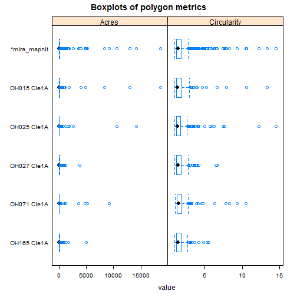
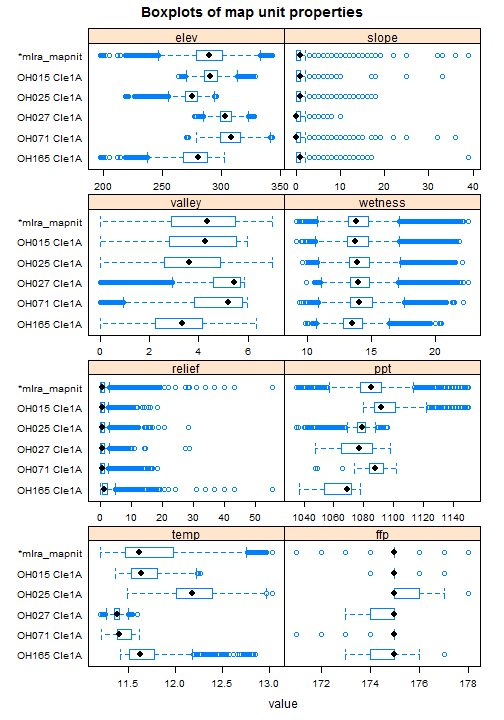

# Map Unit Spatial Summary Report

This report summarizes the geographic setting of a list of MUKEY within a file geodatabase. It is intented to be used to compare and contrast map units, and suggest possible Low, RV, and High values for components. 


### Project Name

```
## [1] "SDJR - MLRA 111A - Miamian silt loam, 2 to 6 percent slopes, eroded"
```


### Variables


|Abbreviation |Measures                            |Unit                                 |Source                                                           |
|:------------|:-----------------------------------|:------------------------------------|:----------------------------------------------------------------|
|elev         |elevation                           |meters                               |30-meter USGS National Elevation Dataset (NED)                   |
|slope        |slope gradient                      |percent                              |10-meter NED                                                     |
|aspect       |slope aspect                        |degrees                              |10-meter NED                                                     |
|valley       |multiresolution valley bottom index |unitless                             |30-meter NED                                                     |
|wetness      |topographic Wetness index           |unitless                             |30-meter NED                                                     |
|relief       |height above channel                |meters                               |30-meter NED                                                     |
|ppt          |annual precipitation                |millimeters                          |800-meter 30-year normals (1981-2010) from PRISM Climate Dataset |
|temp         |annual air temperature              |degrees Celsius                      |800-meter 30-year normals (1981-2010) from PRISM Climate Dataset |
|ffp          |frost free period                   |days                                 |1000-meter 30-year normals (1961-1990) from USFS RMRS            |
|lulc         |land use and land cover             |landcover class (e.g. Wood Wetlands) |2011 National Land Cover Dataset (NLCD)                          |


## Map of soil polygons
Don't be concerned if the soil map units don't line up with the counties. The county layer being used is an internal R layer that is highly generalized.

 

## Soil polygon metrics
Five number summary (min, 25th, median, 75th, max)(percentiles) and contingency table (counts)(n) 
Circularity is an estimate of shape complexity (Hole and Campbell, 1975), computed as a ratio of mupolygon length / mupolygon circumference. The shape complexity of a perfect circle would equal 1.


|     SSA_MUSYM     | variable |        range        | nArces | nPolygons |
|:-----------------:|:--------:|:-------------------:|:------:|:---------:|
| *new_mlra_mapunit |  Acres   | (0, 2, 5, 11, 1292) | 117774 |   10578   |
|    OH017 MlB2     |  Acres   | (0, 3, 5, 18, 1292) |  4943  |    111    |
|    OH021 MnB2     |  Acres   |   (6, 6, 6, 6, 6)   |   6    |     1     |
|    OH023 MhB2     |  Acres   | (1, 4, 7, 16, 229)  |  5106  |    351    |
|    OH027 MhB2     |  Acres   | (0, 2, 5, 10, 420)  |  5186  |    475    |
|    OH045 MkB2     |  Acres   | (1, 4, 8, 17, 297)  |  3605  |    231    |
|    OH047 MlB2     |  Acres   |  (0, 2, 3, 7, 155)  | 23959  |   3667    |
|    OH057 MhB2     |  Acres   | (1, 3, 6, 14, 183)  | 11422  |    942    |
|    OH071 MlB2     |  Acres   | (0, 4, 7, 15, 229)  | 11662  |    794    |
|    OH097 MlB2     |  Acres   |   (0, 1, 1, 4, 7)   |   18   |     7     |
|    OH109 MhB2     |  Acres   | (0, 3, 6, 13, 282)  |  7543  |    621    |
|    OH113 MlB2     |  Acres   | (0, 3, 5, 12, 231)  | 21255  |   1913    |
|    OH129 MfB2     |  Acres   | (0, 3, 6, 15, 466)  | 11816  |    766    |
|    OH141 MhB2     |  Acres   | (1, 4, 8, 16, 701)  | 11254  |    699    |

 

## Contingency tables (percent) 


|                  | 0-2 | 2-6 | 6-12 | 12-18 | 18-30 | 30-50 | 50-75 | 75-350 |
|:-----------------|:---:|:---:|:----:|:-----:|:-----:|:-----:|:-----:|:------:|
|*new_mlra_mapunit | 19  | 71  |  10  |   1   |   0   |   0   |   0   |   0    |
|OH017 MlB2        |  7  | 68  |  21  |   3   |   1   |   0   |   0   |   0    |
|OH021 MnB2        |  0  | 100 |  0   |   0   |   0   |   0   |   0   |   0    |
|OH023 MhB2        | 20  | 74  |  6   |   0   |   0   |   0   |   0   |   0    |
|OH027 MhB2        | 22  | 72  |  6   |   0   |   0   |   0   |   0   |   0    |
|OH045 MkB2        | 18  | 71  |  10  |   1   |   0   |   0   |   0   |   0    |
|OH047 MlB2        | 31  | 66  |  3   |   0   |   0   |   0   |   0   |   0    |
|OH057 MhB2        | 15  | 72  |  12  |   1   |   0   |   0   |   0   |   0    |
|OH071 MlB2        | 10  | 76  |  12  |   1   |   0   |   0   |   0   |   0    |
|OH097 MlB2        |  7  | 79  |  14  |   0   |   0   |   0   |   0   |   0    |
|OH109 MhB2        | 22  | 72  |  6   |   0   |   0   |   0   |   0   |   0    |
|OH113 MlB2        | 15  | 71  |  12  |   1   |   1   |   0   |   0   |   0    |
|OH129 MfB2        | 17  | 72  |  9   |   1   |   0   |   0   |   0   |   0    |
|OH141 MhB2        | 14  | 69  |  15  |   1   |   1   |   0   |   0   |   0    |


|                  | N  | NE | E  | SE | S  | SW | W  | NW |
|:-----------------|:--:|:--:|:--:|:--:|:--:|:--:|:--:|:--:|
|*new_mlra_mapunit | 10 | 13 | 14 | 13 | 13 | 14 | 13 | 11 |
|OH017 MlB2        | 8  | 11 | 16 | 18 | 16 | 14 | 9  | 7  |
|OH021 MnB2        | 0  | 0  | 0  | 33 | 0  | 33 | 33 | 0  |
|OH023 MhB2        | 11 | 11 | 12 | 13 | 12 | 12 | 14 | 14 |
|OH027 MhB2        | 13 | 13 | 12 | 12 | 12 | 14 | 12 | 12 |
|OH045 MkB2        | 8  | 8  | 9  | 11 | 15 | 20 | 17 | 12 |
|OH047 MlB2        | 11 | 16 | 17 | 14 | 12 | 12 | 10 | 9  |
|OH057 MhB2        | 10 | 11 | 12 | 13 | 13 | 13 | 15 | 12 |
|OH071 MlB2        | 11 | 15 | 16 | 14 | 13 | 12 | 10 | 10 |
|OH097 MlB2        | 7  | 14 | 14 | 14 | 14 | 0  | 21 | 14 |
|OH109 MhB2        | 9  | 11 | 11 | 12 | 13 | 16 | 17 | 12 |
|OH113 MlB2        | 10 | 13 | 15 | 13 | 12 | 15 | 13 | 9  |
|OH129 MfB2        | 10 | 9  | 8  | 9  | 12 | 20 | 20 | 12 |
|OH141 MhB2        | 12 | 15 | 14 | 12 | 12 | 12 | 11 | 11 |


|                  | upland | lowland |
|:-----------------|:------:|:-------:|
|*new_mlra_mapunit |   17   |   83    |
|OH017 MlB2        |   46   |   54    |
|OH021 MnB2        |   67   |   33    |
|OH023 MhB2        |   17   |   83    |
|OH027 MhB2        |   15   |   85    |
|OH045 MkB2        |   14   |   86    |
|OH047 MlB2        |   6    |   94    |
|OH057 MhB2        |   18   |   82    |
|OH071 MlB2        |   24   |   76    |
|OH097 MlB2        |   0    |   100   |
|OH109 MhB2        |   7    |   93    |
|OH113 MlB2        |   17   |   83    |
|OH129 MfB2        |   19   |   81    |
|OH141 MhB2        |   25   |   75    |


|                  | Unclassified | NA | Open Water | Perennial Snow/Ice | Developed, Open Space | Developed, Low Intensity | Developed, Medium Intensity | Developed, High Intensity | Barren Land | Deciduous Forest | Evergreen Forest | Mixed Forest | Shrub/Scrub | Herbaceuous | Hay/Pasture | Cultivated Crops | Woody Wetlands | Emergent Herbaceuous Wetlands | Sum  |
|:-----------------|:------------:|:--:|:----------:|:------------------:|:---------------------:|:------------------------:|:---------------------------:|:-------------------------:|:-----------:|:----------------:|:----------------:|:------------:|:-----------:|:-----------:|:-----------:|:----------------:|:--------------:|:-----------------------------:|:----:|
|*new_mlra_mapunit |      0       | 0  |     0      |         0          |           8           |            4             |              1              |             0             |      0      |        7         |        0         |      0       |      0      |      1      |     16      |        61        |       0        |               0               | 100  |
|OH017 MlB2        |      0       | 0  |     0      |         0          |          11           |            3             |              0              |             0             |      0      |        22        |        3         |      1       |      0      |      0      |     42      |        17        |       0        |               0               | 100  |
|OH021 MnB2        |      0       | 0  |     0      |         0          |           0           |            0             |              0              |             0             |      0      |        0         |        0         |      0       |      0      |      0      |      0      |       100        |       0        |               0               | 100  |
|OH023 MhB2        |      0       | 0  |     0      |         0          |           9           |            4             |              1              |             0             |      0      |        5         |        0         |      0       |      0      |      3      |     14      |        65        |       0        |               0               | 100  |
|OH027 MhB2        |      0       | 0  |     0      |         0          |           4           |            2             |              0              |             0             |      0      |        1         |        0         |      4       |      0      |      0      |      3      |        86        |       0        |               0               | 100  |
|OH045 MkB2        |      0       | 0  |     0      |         0          |           8           |            3             |              1              |             0             |      0      |        5         |        0         |      0       |      0      |      0      |     16      |        67        |       0        |               0               | 100  |
|OH047 MlB2        |      0       | 0  |     0      |         0          |           5           |            2             |              1              |             0             |      0      |        2         |        0         |      0       |      0      |      0      |      7      |        82        |       0        |               0               | 100  |
|OH057 MhB2        |      0       | 0  |     0      |         0          |          12           |            7             |              3              |             1             |      0      |        5         |        0         |      1       |      0      |      1      |     14      |        57        |       0        |               0               | 100  |
|OH071 MlB2        |      0       | 0  |     0      |         0          |           6           |            1             |              0              |             0             |      0      |        9         |        0         |      0       |      1      |      0      |     20      |        62        |       0        |               0               | 100  |
|OH097 MlB2        |      0       | 0  |     0      |         0          |           7           |            0             |              0              |            14             |      0      |        0         |        0         |      0       |      0      |      7      |      0      |        71        |       0        |               0               | 100  |
|OH109 MhB2        |      0       | 0  |     0      |         0          |           7           |            3             |              1              |             0             |      0      |        4         |        0         |      0       |      0      |      2      |      9      |        74        |       0        |               0               | 100  |
|OH113 MlB2        |      0       | 0  |     0      |         0          |          14           |            13            |              3              |             1             |      0      |        10        |        1         |      0       |      0      |      0      |     19      |        38        |       0        |               0               | 100  |
|OH129 MfB2        |      0       | 0  |     0      |         0          |           6           |            2             |              0              |             0             |      0      |        8         |        0         |      0       |      0      |      0      |     19      |        63        |       0        |               0               | 100  |
|OH141 MhB2        |      0       | 0  |     0      |         0          |           6           |            1             |              0              |             0             |      0      |        14        |        0         |      0       |      0      |      3      |     20      |        54        |       0        |               0               | 100  |
|Sum               |      0       | 0  |     0      |         0          |          104          |            43            |             13              |            19             |      0      |        91        |        6         |      7       |      2      |     19      |     200     |       897        |       0        |               0               | 1400 |

## Quantile breaks
Five number summary (min, 25th, median, 75th, max)(percentiles) and number of random samples (n)


|     SSA_MUSYM     |           elev            |      slope       |      valley      |       wetness        |      relief       |   n   |
|:-----------------:|:-------------------------:|:----------------:|:----------------:|:--------------------:|:-----------------:|:-----:|
| *new_mlra_mapunit | (205, 268, 292, 313, 386) | (0, 2, 3, 4, 49) | (0, 1, 3, 5, 10) | (9, 11, 12, 13, 23)  | (0, 1, 3, 5, 119) | 79650 |
|    OH017 MlB2     | (211, 249, 262, 275, 302) | (0, 3, 4, 5, 33) | (0, 0, 1, 2, 5)  | (9, 11, 11, 12, 20)  | (0, 3, 6, 10, 35) | 3384  |
|    OH021 MnB2     | (344, 345, 347, 347, 347) | (2, 2, 3, 3, 3)  | (0, 0, 0, 1, 1)  | (12, 12, 12, 12, 13) |  (3, 3, 3, 3, 4)  |   3   |
|    OH023 MhB2     | (259, 326, 337, 353, 386) | (0, 2, 3, 4, 23) | (0, 1, 3, 4, 7)  | (10, 11, 12, 12, 20) | (0, 1, 3, 4, 28)  | 3422  |
|    OH027 MhB2     | (268, 320, 330, 335, 364) | (0, 2, 2, 3, 19) | (0, 1, 3, 5, 6)  | (9, 11, 12, 13, 21)  | (0, 1, 2, 4, 23)  | 3483  |
|    OH045 MkB2     | (234, 276, 290, 302, 332) | (0, 2, 3, 4, 21) | (0, 1, 3, 4, 6)  | (9, 11, 12, 13, 22)  | (0, 1, 3, 5, 21)  | 2438  |
|    OH047 MlB2     | (255, 295, 308, 318, 342) | (0, 1, 2, 3, 24) | (0, 3, 5, 6, 7)  | (9, 12, 12, 13, 23)  | (0, 1, 2, 3, 30)  | 16308 |
|    OH057 MhB2     | (246, 289, 307, 323, 342) | (0, 2, 3, 4, 31) | (0, 1, 3, 4, 7)  | (9, 11, 12, 13, 21)  | (0, 1, 3, 5, 42)  | 7655  |
|    OH071 MlB2     | (244, 293, 309, 332, 367) | (0, 2, 3, 5, 49) | (0, 1, 2, 4, 7)  | (9, 11, 12, 12, 20)  | (0, 2, 4, 6, 44)  | 7859  |
|    OH097 MlB2     | (321, 326, 328, 335, 338) | (1, 2, 3, 4, 6)  | (2, 4, 5, 5, 5)  | (11, 11, 12, 12, 15) |  (0, 2, 3, 3, 7)  |  14   |
|    OH109 MhB2     | (243, 279, 290, 300, 353) | (0, 2, 2, 4, 33) | (0, 2, 4, 5, 10) | (10, 12, 12, 13, 22) | (0, 1, 2, 4, 19)  | 5178  |
|    OH113 MlB2     | (218, 259, 276, 293, 326) | (0, 2, 3, 4, 43) | (0, 1, 2, 4, 7)  | (9, 11, 12, 13, 23)  | (0, 1, 3, 6, 55)  | 14326 |
|    OH129 MfB2     | (206, 233, 248, 263, 330) | (0, 2, 3, 4, 30) | (0, 1, 2, 4, 8)  | (9, 11, 12, 13, 20)  | (0, 2, 4, 7, 39)  | 7996  |
|    OH141 MhB2     | (205, 235, 261, 285, 347) | (0, 2, 3, 5, 33) | (0, 1, 2, 5, 8)  | (9, 11, 12, 13, 22)  | (0, 2, 4, 8, 119) | 7584  |


|     SSA_MUSYM     |              ppt               |         temp         |            ffp            |          aspect           |   n   |
|:-----------------:|:------------------------------:|:--------------------:|:-------------------------:|:-------------------------:|:-----:|
| *new_mlra_mapunit | (984, 1009, 1022, 1032, 1080)  | (10, 11, 11, 11, 12) | (165, 169, 170, 172, 175) | (337, 243, 158, 73, 338)  | 79650 |
|    OH017 MlB2     | (1009, 1013, 1016, 1020, 1033) | (11, 11, 12, 12, 12) | (170, 171, 172, 173, 173) | (325, 212, 145, 80, 326)  | 3384  |
|    OH021 MnB2     | (1026, 1026, 1026, 1026, 1027) | (10, 10, 10, 11, 11) | (166, 166, 166, 166, 166) | (253, 247, 241, 184, 127) |   3   |
|    OH023 MhB2     | (1007, 1015, 1023, 1031, 1048) | (10, 11, 11, 11, 12) | (166, 167, 168, 168, 170) |  (92, 351, 272, 182, 93)  | 3422  |
|    OH027 MhB2     | (1024, 1036, 1039, 1042, 1074) | (11, 11, 11, 11, 12) | (170, 171, 172, 172, 173) |   (94, 6, 275, 191, 95)   | 3483  |
|    OH045 MkB2     |   (985, 986, 988, 993, 995)    | (11, 11, 11, 11, 12) | (168, 169, 170, 170, 171) |  (46, 287, 227, 159, 47)  | 2438  |
|    OH047 MlB2     | (990, 1007, 1015, 1021, 1044)  | (11, 11, 11, 11, 11) | (168, 169, 170, 171, 173) |  (273, 174, 94, 27, 274)  | 16308 |
|    OH057 MhB2     | (1017, 1030, 1033, 1037, 1044) | (11, 11, 11, 11, 12) | (168, 170, 171, 172, 175) |  (30, 289, 210, 123, 31)  | 7655  |
|    OH071 MlB2     | (1027, 1039, 1047, 1062, 1080) | (11, 11, 11, 11, 11) | (171, 172, 172, 173, 174) |  (279, 181, 99, 27, 280)  | 7859  |
|    OH097 MlB2     | (1006, 1006, 1008, 1014, 1018) | (11, 11, 11, 11, 11) | (169, 169, 169, 169, 169) | (138, 68, 342, 274, 193)  |  14   |
|    OH109 MhB2     | (988, 1022, 1025, 1028, 1039)  | (10, 11, 11, 11, 12) | (165, 168, 169, 169, 172) |  (53, 303, 234, 151, 54)  | 5178  |
|    OH113 MlB2     | (1010, 1020, 1023, 1026, 1033) | (11, 11, 11, 12, 12) | (168, 170, 171, 172, 175) | (327, 233, 148, 68, 328)  | 14326 |
|    OH129 MfB2     |   (984, 986, 989, 992, 996)    | (11, 11, 11, 11, 12) | (169, 170, 170, 171, 173) |  (69, 314, 250, 189, 70)  | 7996  |
|    OH141 MhB2     |  (988, 995, 1005, 1020, 1044)  | (11, 11, 11, 11, 12) | (168, 169, 170, 171, 173) | (253, 159, 74, 355, 254)  | 7584  |

 
