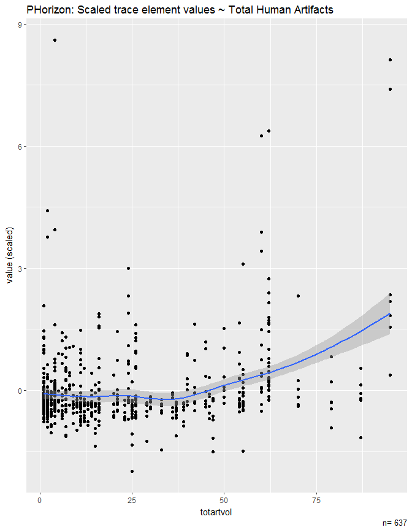
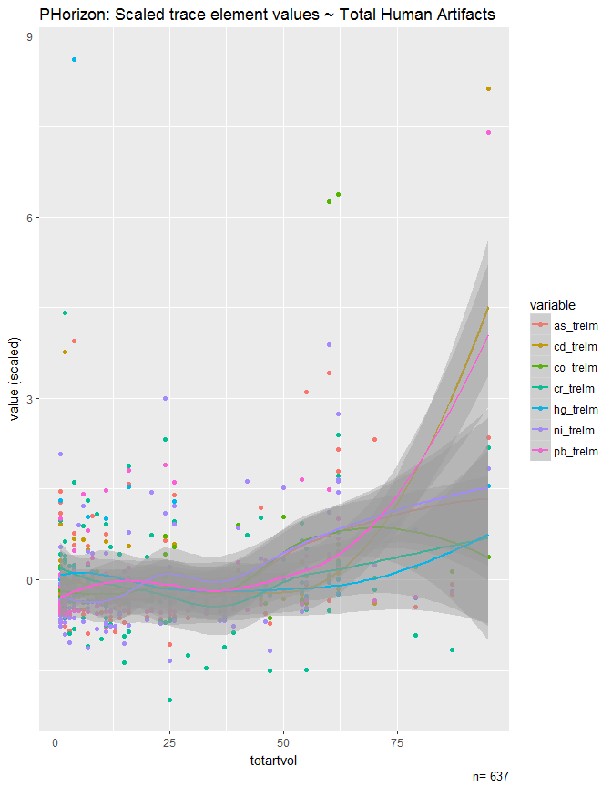
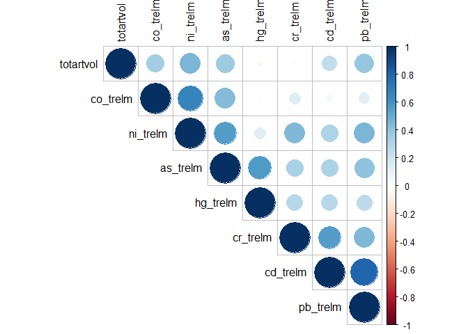
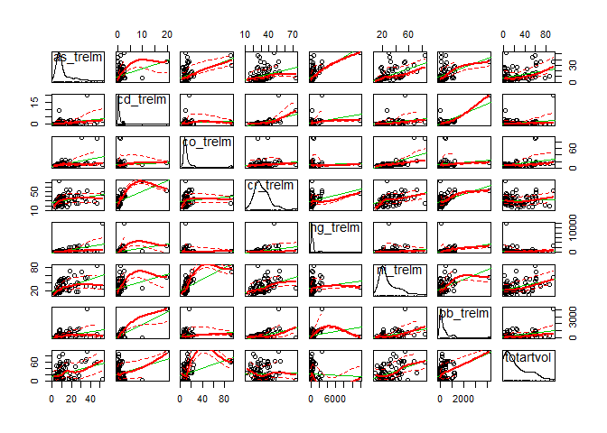
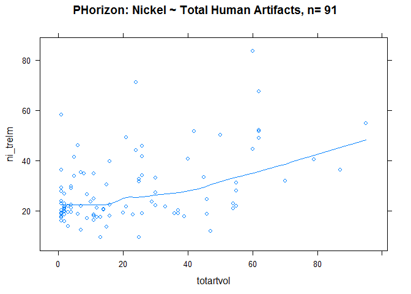
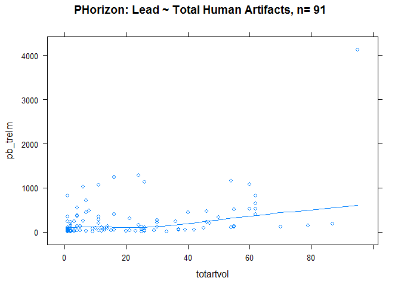
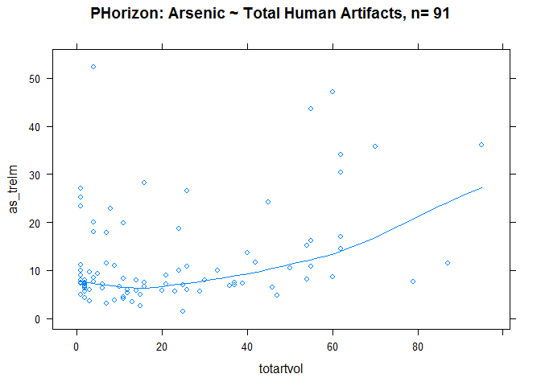

# R analysis script


```r
# Author:Jacob Isleib
# Data exploration of artifacts and trace elements in pedon data from NYC and Hudson Co NJ

setwd("C:/workspace/sandbox/jacob/artifact_analysis")

# Import table queried from KSSL MSAccess database with select measured soil physical and chemical data (including major and trace element geochemistry data).

ksslraw <- read.csv("ALL_geochemistry.csv", header=TRUE)

# remove any duplicate rows of data
ksslraw.uniq <- unique(ksslraw)
#subset raw KSSL export to rows that have Pb geochemistry data (i.e. measured trace metals) and total sand content (to remove data measured on pure artifacts; this also removes O horizon data, which should not affect the analysis)
ksslgeochem <- ksslraw.uniq[complete.cases(ksslraw.uniq$pb_trelm, ksslraw.uniq$sand_tot_psa),]
write.csv(ksslgeochem, file="ksslgeochem.csv", col.names = TRUE)
```

```
## Warning in write.csv(ksslgeochem, file = "ksslgeochem.csv", col.names =
## TRUE): attempt to set 'col.names' ignored
```

```r
# generate concatenated list of pedon lab numbers for querying in NASIS

ksslgeochemuniq <- unique(ksslgeochem$pedlabsampnum1)
dput(ksslgeochemuniq, file="NASIS_ALL.txt")

# The txt file create contains a comma-delimited list of lab pedon numbers for use in a NASIS query
# after querying the KSSL pedons with geochemistry data in NASIS, export the pedon horizon human artifacts 
#don't worry about duplicate phorizon data yet

phhuarts <- read.csv("phhuarts.csv", header = TRUE)

# ..and pedon sample tables

phsample <- read.csv("phsample.csv", header = TRUE)

# new data frame of only phorizon.rec.id and lab.sample..
phsample1 <- phsample[, c(13,15)]
# QC data
phsample1[phsample1==""] <- NA
# remove incomplete data
phsample1 <- phsample1[complete.cases(phsample1$Lab.Sample..), ]
phsample1 <- phsample1[order(phsample1$Phorizon.Rec.ID),]
# optional QC
#write.csv(phsample1, file = "phsample1.csv", col.names = TRUE)

#merge the phsample numbers with the phhuarts data
library(dplyr)
```

```
## Warning: package 'dplyr' was built under R version 3.4.2
```

```
## 
## Attaching package: 'dplyr'
```

```
## The following objects are masked from 'package:stats':
## 
##     filter, lag
```

```
## The following objects are masked from 'package:base':
## 
##     intersect, setdiff, setequal, union
```

```r
merge <- merge(x = phhuarts, y= phsample1, by="Phorizon.Rec.ID")#, all.x = TRUE)

#remove duplicate values with same vol.., Low, and High, Kind, and lab sample number
phhuarts.uniq <- merge %>% distinct(Top.Depth..RV., Vol.., Low, High, Kind, Lab.Sample..)

phhuarts1 <- phhuarts.uniq[, c(2,6)]
phhuarts1[phhuarts1==""] <- NA

library(plyr)
```

```
## Warning: package 'plyr' was built under R version 3.4.4
```

```
## -------------------------------------------------------------------------
```

```
## You have loaded plyr after dplyr - this is likely to cause problems.
## If you need functions from both plyr and dplyr, please load plyr first, then dplyr:
## library(plyr); library(dplyr)
```

```
## -------------------------------------------------------------------------
```

```
## 
## Attaching package: 'plyr'
```

```
## The following objects are masked from 'package:dplyr':
## 
##     arrange, count, desc, failwith, id, mutate, rename, summarise,
##     summarize
```

```r
phhuartsagg <- ddply(phhuarts1, ~Lab.Sample.., summarise, totartvol=sum(Vol..))
# optional QC
#write.csv(phhuartsagg, file = "phhuartsagg.csv", col.names = TRUE)

#Quality control: find na cases of lab sample numbers
qc1 <- merge[!complete.cases(merge$Lab.Sample..), ]
qc1uniq <- unique(qc1$User.Site.ID)
dput(qc1uniq, file="qc1uniq.txt")
#Review of na values confirms that these are partially sampled pedons.  NA rows can be dropped as there's no geochemistry data to join them to

nasismergecomplete <- phhuartsagg[complete.cases(phhuartsagg$Lab.Sample..), ]
#column names housekeeping
colnames(nasismergecomplete)[1] <- "labsampnum1"
write.csv(nasismergecomplete, file = "nasismergecomplete.csv", col.names = TRUE)
```

```
## Warning in write.csv(nasismergecomplete, file = "nasismergecomplete.csv", :
## attempt to set 'col.names' ignored
```

```r
#inner join between KSSL data with geochem and artifact data
geochemart <- merge(x=ksslgeochem, y=nasismergecomplete, by="labsampnum1")
which( colnames(geochemart)=="labsampnum1" )
```

```
## [1] 1
```

```r
#1
which( colnames(geochemart)=="totartvol" )
```

```
## [1] 130
```

```r
#130
#select key trace elements
geochemart2 <- geochemart[, c(107, 110:112, 114, 119, 121, 130)]

#scale data, since trace element values range orders of magnitube between elements
geochemart2.complete <- geochemart2[complete.cases(geochemart2),]
geochemart2.scaled <- geochemart2.complete
geochemart2.scaled[, 1:7] <- scale(geochemart2.scaled[, 1:7])

#reshape data to create 1 scatterplot with all trace elements
library(reshape2)
```

```
## Warning: package 'reshape2' was built under R version 3.4.4
```

```r
geochemartmelt <- melt(geochemart2.scaled, id.var= 'totartvol')
library(ggplot2)
```

```
## Warning: package 'ggplot2' was built under R version 3.4.1
```

## Combined and scale data plots


```r
# plot all scaled data, no groups
ggplot(geochemartmelt, aes(x=totartvol, y=value)) + 
  labs( y ="value (scaled)", title= "PHorizon: Scaled trace element values ~ Total Human Artifacts", caption = paste("n=", length(geochemartmelt$value))) + 
  geom_point() + 
  geom_smooth() + 
  xlab('totartvol')
```

```
## `geom_smooth()` using method = 'loess'
```

<!-- -->
  
Figure 1 All scaled data, no groups

```r
# plot all scaled data, with trace element groups
ggplot(geochemartmelt, aes(x=totartvol, y=value, colour=variable)) + 
  labs( y ="value (scaled)", title= "PHorizon: Scaled trace element values ~ Total Human Artifacts", caption = paste("n=", length(geochemartmelt$value))) + 
  geom_point() + 
  geom_smooth() + 
  xlab('totartvol')
```

```
## `geom_smooth()` using method = 'loess'
```

<!-- -->
  
Figure 2 All scaled data, with trace element groups

```r
library(Hmisc)
```

```
## Warning: package 'Hmisc' was built under R version 3.4.4
```

```
## Loading required package: lattice
```

```
## Loading required package: survival
```

```
## Loading required package: Formula
```

```
## Warning: package 'Formula' was built under R version 3.4.1
```

```
## 
## Attaching package: 'Hmisc'
```

```
## The following objects are masked from 'package:plyr':
## 
##     is.discrete, summarize
```

```
## The following objects are masked from 'package:dplyr':
## 
##     src, summarize
```

```
## The following objects are masked from 'package:base':
## 
##     format.pval, units
```

```r
rcorr(as.matrix(geochemartmelt[,-2]))
```

```
##           totartvol value
## totartvol      1.00  0.25
## value          0.25  1.00
## 
## n= 637 
## 
## 
## P
##           totartvol value
## totartvol            0   
## value      0
```
  
Table 1 Correlation matrix for all scaled data
  
This is a relatively low correlation coefficient (Pearson's r), suggesting that grouping all selected trace elements values together may not be the best way to explore the relationship between artifacts and trace elements.

## Individual trace metals plots


```r
rcorr(as.matrix(geochemart2.complete))
```

```
##           as_trelm cd_trelm co_trelm cr_trelm hg_trelm ni_trelm pb_trelm
## as_trelm      1.00     0.31     0.44     0.32     0.56     0.56     0.41
## cd_trelm      0.31     1.00     0.05     0.55     0.28     0.30     0.80
## co_trelm      0.44     0.05     1.00     0.14     0.01     0.67     0.12
## cr_trelm      0.32     0.55     0.14     1.00     0.29     0.44     0.44
## hg_trelm      0.56     0.28     0.01     0.29     1.00     0.14     0.27
## ni_trelm      0.56     0.30     0.67     0.44     0.14     1.00     0.45
## pb_trelm      0.41     0.80     0.12     0.44     0.27     0.45     1.00
## totartvol     0.35     0.24     0.34     0.03    -0.04     0.45     0.39
##           totartvol
## as_trelm       0.35
## cd_trelm       0.24
## co_trelm       0.34
## cr_trelm       0.03
## hg_trelm      -0.04
## ni_trelm       0.45
## pb_trelm       0.39
## totartvol      1.00
## 
## n= 91 
## 
## 
## P
##           as_trelm cd_trelm co_trelm cr_trelm hg_trelm ni_trelm pb_trelm
## as_trelm           0.0025   0.0000   0.0020   0.0000   0.0000   0.0000  
## cd_trelm  0.0025            0.6089   0.0000   0.0080   0.0038   0.0000  
## co_trelm  0.0000   0.6089            0.1948   0.9181   0.0000   0.2397  
## cr_trelm  0.0020   0.0000   0.1948            0.0057   0.0000   0.0000  
## hg_trelm  0.0000   0.0080   0.9181   0.0057            0.1899   0.0097  
## ni_trelm  0.0000   0.0038   0.0000   0.0000   0.1899            0.0000  
## pb_trelm  0.0000   0.0000   0.2397   0.0000   0.0097   0.0000           
## totartvol 0.0006   0.0194   0.0009   0.7780   0.7169   0.0000   0.0001  
##           totartvol
## as_trelm  0.0006   
## cd_trelm  0.0194   
## co_trelm  0.0009   
## cr_trelm  0.7780   
## hg_trelm  0.7169   
## ni_trelm  0.0000   
## pb_trelm  0.0001   
## totartvol
```
  
Table 2 correlation matrix of original (non-scaled, non-reshaped) to explore relationships between individual elements and artifacts

```r
# correlation matrix plot for visualization
geochemcor <- cor(geochemart2.complete)
round(geochemcor, 2)
```

```
##           as_trelm cd_trelm co_trelm cr_trelm hg_trelm ni_trelm pb_trelm
## as_trelm      1.00     0.31     0.44     0.32     0.56     0.56     0.41
## cd_trelm      0.31     1.00     0.05     0.55     0.28     0.30     0.80
## co_trelm      0.44     0.05     1.00     0.14     0.01     0.67     0.12
## cr_trelm      0.32     0.55     0.14     1.00     0.29     0.44     0.44
## hg_trelm      0.56     0.28     0.01     0.29     1.00     0.14     0.27
## ni_trelm      0.56     0.30     0.67     0.44     0.14     1.00     0.45
## pb_trelm      0.41     0.80     0.12     0.44     0.27     0.45     1.00
## totartvol     0.35     0.24     0.34     0.03    -0.04     0.45     0.39
##           totartvol
## as_trelm       0.35
## cd_trelm       0.24
## co_trelm       0.34
## cr_trelm       0.03
## hg_trelm      -0.04
## ni_trelm       0.45
## pb_trelm       0.39
## totartvol      1.00
```

```r
library(corrplot)
```

```
## Warning: package 'corrplot' was built under R version 3.4.3
```

```
## corrplot 0.84 loaded
```

```r
corrplot(geochemcor, type = "upper", order = "hclust", 
         tl.col = "black")#, tl.srt = 45)
```

<!-- -->
  
Figure 3 Correlation matrix plot

None of the correlation coefficients are very strong (i.e., >=0.7); the highest are Nickel (Ni), Lead (Pb), and Arsenic (As) which are higher than the r value of the group scaled data (0.25 from Table 1 above).

```r
# scatterplot matrix
library(car)
```

```
## Warning: package 'car' was built under R version 3.4.4
```

```
## 
## Attaching package: 'car'
```

```
## The following object is masked from 'package:dplyr':
## 
##     recode
```

```r
scatterplotMatrix(geochemart2)
```

<!-- -->
  
Figure 4 Scatterplot matrix of all covariates

Right column of scatterplot matrix illustrates the relationship between total artifact volume (x-axis) and the individual trace elements (y-axis).  Visually, Arsenic and Nickel appear to have loess curves suggesting a  logistic regression may be a best fit.  Further, logistic regression curves contain an "elbow" (also "knee"; value where derivative of loess curve jumps in value) that, in this case, could be interpreted as the artifact value that represents a change point where trace element content drastically increases

###Nickel


```r
library(lattice)
xyplot(ni_trelm ~ totartvol, data=geochemart2, type = c("p","smooth"), main = paste("PHorizon: Nickel ~ Total Human Artifacts, n=", length(geochemart2.complete$ni_trelm)))
```

<!-- -->
  
Figure 5

The Loess smooth line for Ni ~ artifacts appears to "elbow" between 15 and 20 percent artifacts

### Lead

```r
xyplot(pb_trelm ~ totartvol, data=geochemart2, type = c("p","smooth"), main = paste("PHorizon: Lead ~ Total Human Artifacts, n=", length(geochemart2.complete$pb_trelm)))
```

<!-- -->
  
Figure 6

The Loess smooth line for Pb ~ artifacts appears to "elbow" somewhere between 15-30 percent artifacts.

### Arsenic

```r
xyplot(as_trelm ~ totartvol, data=geochemart2, type = c("p","smooth"), main = paste("PHorizon: Arsenic ~ Total Human Artifacts, n=", length(geochemart2.complete$as_trelm)))
```

<!-- -->
  
Figure 7

The Loess smooth line for As ~ artifacts appears to "elbow" at around 30 percent artifacts.

###Cobalt

```r
xyplot(co_trelm ~ totartvol, data=geochemart2.complete, type = c("p","smooth"), main = paste("PHorizon: Cobalt ~ Total Human Artifacts, n=", length(geochemart2.complete$co_trelm)))
```

<!-- -->
  
Figure 8  

The Loess smooth line for Co ~ artifacts appears to "elbow" at around 30 percent artifacts, although the change in slope appears slight 

# Discussion

This exploration of trace element data against human artifact content in National Cooperative Soil Survey data can be interpreted in multiple ways.  Fitting regression lines to the grouped and scaled element content values suggests that artifact content between 38 to 50 percent may represents a range in which trace element content significantly increases (Figures 1 and 2).  Select non-scaled individual element values suggest that artifact content of somewhere between 15 to 30 percent may represent a range where trace element content significantly increases (Figures 5 through 8). Alternatively, "high" trace element values have been measured in pedon horizons with extremely low artifact contents (Figure 1).  These samples (along with related dataset measures like correlation coefficients that scored low) suggests that artifact content alone does not adequately explain variability in trace element content (Table 2).  It is possible that the grouped data of 637 samples and element-specific analysis of 91 samples may represent too small of a sample size to properly evaluate these relationships.  This is the entirety of available pedon data in the USDA KSSL and NASIS databases for New York City (Bronx, Kings, New York, Queens, and Richmond Counties NY), Hudson County New Jersey, Los Angeles County CA, and Wayne County MI.  Technologies like pXRF instruments promise to drastically increase the amount of available data. As more data becomes available, the larger dataset should be reevaluated.

The draft criteria of a new diagnostic artifactic horizon to the Keys to Soil Taxonomy currently proposes the following criteria:

The artifactic horizon is made of human-transported material with either:
    a) a layer (one or more adjacent horizons) > 15 cm thick starting < 50 cm from the soil surface, with > 35%  (by volume) artifacts; or
    b) a layer (one or more adjacent horizons) > 15 cm thick starting 50 to 200 cm from the soil surface, with > 50% (by volume) artifacts.

For the purpose of using artifact content to characterize a diagnostic horizon, the 35% and 50% threshold values seem to be reasonable, according to the results of the analysis an scaled data.  Lower depth values were not used in the analysis and could be added in subsequent analysis to evaluate the depth criteria.

One conclusion to be drawn from this analysis is that artifact content alone should not define a new HAHT soil order.  This conclusion is made by the assumption that the rationale behind establishing such an order would be to separate soils based, in part, on their chemical hazard to health of humans and other life forms.  If elemental contamination cannot be identified based on artifact content alone, other criteria are needed.  The current proposed criteria of the Anthrusols order is:

A.   Soils that have :
    1.   One or more of the following:
        a. Subaqueous human-transported material 50 cm or more thick; or
        b. Anthropollic material in the upper 50 cm; or
        c. 10% or more (by volume, weighted average) artifacts in human-altered or human-transported material between 25 cm and the shallowest of:
            (i) 100 cm, or
            (ii) a cemented or indurated root-limiting layer; or
            (iii) contact with material not human-altered or human-transported; or
        d. An artifactic horizon; or
        e. A continuous, manufactured layer (e.g., geomembrane) starting < 100 cm from the soil surface; or
        f. A sulfuric horizon created by human activity or sulfidic material transported by human activity starting < 50 cm from the soil surface; or
        g. Anthraquic conditions; or
        h. Hillslope terraces with terrace risers of 100 cm or more in height, or a combination of excavated and deposited material 50 cm or more thick that makes up more than 50% of the pedon; or
        i. Evidence of excavation followed by burial of human remains, or
        j. Anthropic, Anthromollic, Pretic, or Plaggen epipedon (or WRB hortic or terric horizon) alone or in combination that total > 50 cm thick; or
        k. Excavic contact is 200 cm or more in 50% or more of the pedon underneath less than 50 cm of reclaimed or replaced human-altered or human-transported material; or
        l. Human-altered or human-transported material 200 cm or more thick.

Artifact content contributes to criteria b., c., d., and j. (i.e. as co-criteria of a Anthropic epipedon).  The other criteria represent a justified first draft of non-artifact-related criteria that should capture low-artifact content HAHT material that could present a chemical health hazard.  The need for non-artifact related criteria should be considered during revision of the Anthrusols order.
