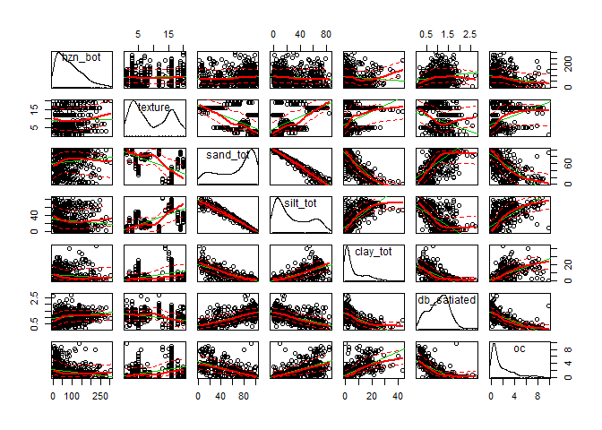
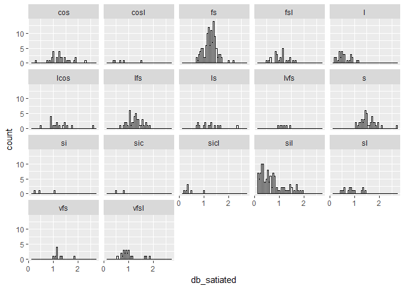
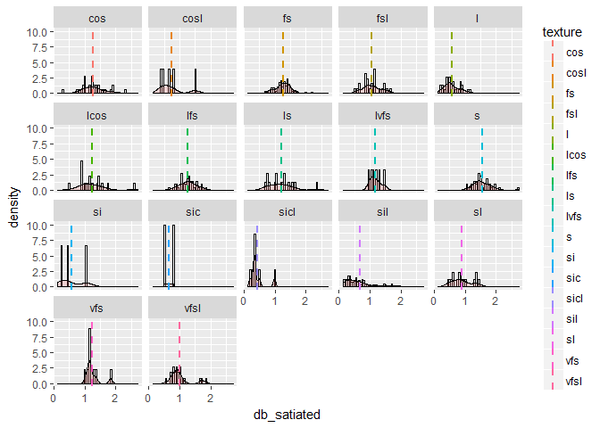
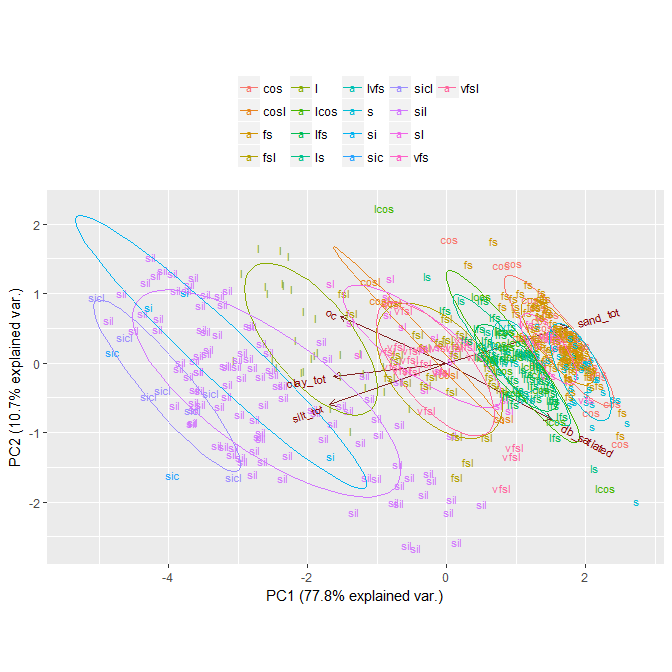
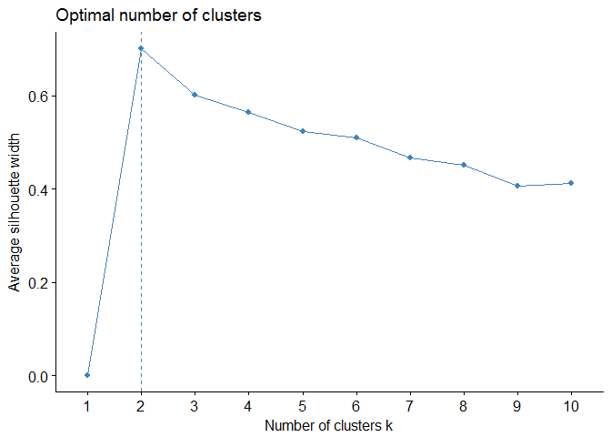
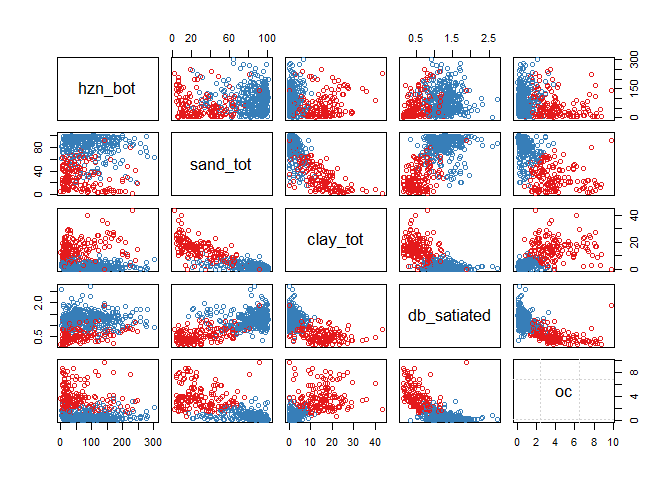
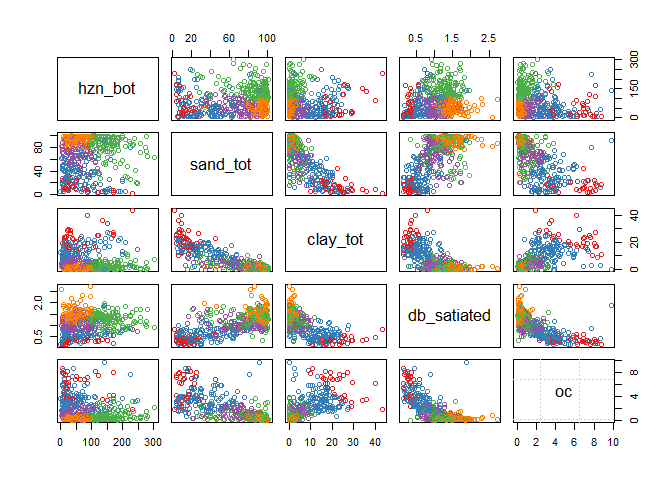
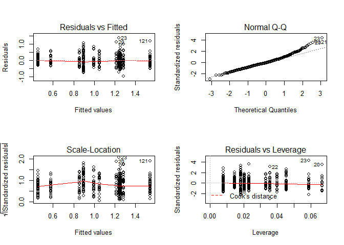

# Objective

Explore existing SAS soil property data to determine statistically significant groupings of soil properties that explain the variability in bulk density.  We will only use SAS data from marine and estuarine areas and will exclude freshwater SAS data.

# Research question
To explain variability in bulk density, should SAS data be summarized by individual USDA texture classes or groupings of texture classes?

# Introduction

"Bulk density, satiated" (*p*bsat) is the oven-dry weight of the less than 2 mm soil material per unit volume of soil at a water tension of 0 bar. The measurement is only used for subaqueous soils. (NSSH Part 618.9)  With increased interest in carbon stocks in coastal ecosystems (termed *coastal blue carbon*), it is neccesary to provide as accurate bulk density data as possible to allow subaqueous soil carbon stocks to be calculated along with measured soil organic carbon content.  The majority of available organic carbon data in soil survey management area 12-TOL (i.e., southern New England area and eastern New York) comes from Dr. Mark Stolt's lab at the University of Rhode Island and is available through National Cooperative Soil Survey and MapCoast partnership projects.  A small amount of data is available from samples measured at the USDA-NRCS Kellogg Soil Survey Laboratory in Lincoln NE.

# R Analysis

## Bulk Density, satiated

### Exploratory Analysis


```r
setwd("C:/workspace/sandbox/jacob/sas_db_analysis")

library(ggplot2)
```

```
## Warning: package 'ggplot2' was built under R version 3.4.1
```

```r
library(car)
```

```
## Warning: package 'car' was built under R version 3.4.4
```

```r
# load csv of available SAS Db data
data <- read.csv("C:/workspace/sas_db_analysis/sas_db_analysis.csv")

# subset data to hzn_bot, texture class, total sand/silt/clay, satiated Db, and SOC%
# and only include mineral or mucky mineral textures
data1 <- subset(data[ which(data$oc_qc!="organic"),c(7, 9:14)])
## subset data1 for complete cases
datacomplete <- data1[complete.cases(data1),]

# Create scatterplot matrix of subset data
spm(datacomplete)
```

<!-- -->
  
*Figure 1 Scatter plot matrix of all covariates in data frame "datacomplete"*
  
One question prompted by this scatter plot matrix is whether horizon depth should be used to subset data.  Depth seems to have a positive linear relationship to bulk density to a depth of ~75cm, after which depth does not appear to explain variability in bulk density values.


```r
# Run prcomp, sca, and correlation matrix

## run pca (exclude texture class FACTOR data)
datacomplete.cont <- datacomplete[, c(3:7)]
datacomplete.cat <- datacomplete[, c(2)]

datapca <- prcomp(datacomplete.cont, scale = TRUE)
print(datapca)
```

```
## Standard deviations (1, .., p=5):
## [1] 1.972622e+00 7.318641e-01 5.591400e-01 5.103918e-01 2.238526e-16
## 
## Rotation (n x k) = (5 x 5):
##                    PC1        PC2         PC3        PC4           PC5
## sand_tot     0.4833942  0.3967124 -0.06948874  0.1375398  7.649859e-01
## silt_tot    -0.4633497 -0.4484898  0.25668491 -0.3729979  6.157510e-01
## clay_tot    -0.4474551 -0.1447067 -0.55557926  0.6591876  1.888049e-01
## db_satiated  0.4157370 -0.6090810  0.43592348  0.5159010 -5.551115e-17
## oc          -0.4225918  0.4995562  0.65619096  0.3758632  0.000000e+00
```

```r
summary(datapca)
```

```
## Importance of components%s:
##                           PC1    PC2     PC3    PC4       PC5
## Standard deviation     1.9726 0.7319 0.55914 0.5104 2.239e-16
## Proportion of Variance 0.7782 0.1071 0.06253 0.0521 0.000e+00
## Cumulative Proportion  0.7782 0.8854 0.94790 1.0000 1.000e+00
```

```r
x <- predict(datapca, datacomplete.cont)
```

### Summary statistics by USDA texture class


```r
library(plyr)
```

```
## Warning: package 'plyr' was built under R version 3.4.4
```

```r
library(dplyr)
```

```
## Warning: package 'dplyr' was built under R version 3.4.2
```

```
## 
## Attaching package: 'dplyr'
```

```
## The following objects are masked from 'package:plyr':
## 
##     arrange, count, desc, failwith, id, mutate, rename, summarise,
##     summarize
```

```
## The following object is masked from 'package:car':
## 
##     recode
```

```
## The following objects are masked from 'package:stats':
## 
##     filter, lag
```

```
## The following objects are masked from 'package:base':
## 
##     intersect, setdiff, setequal, union
```

```r
datacomplete2 <- datacomplete[, c(2,3:7)]
data.tex.sum <- ddply(datacomplete2, ~texture, summarise, 
                      n=n(),
                      min=min(db_satiated), 
                      min2sigma=round(((mean(db_satiated))-(2*(sd(db_satiated)))), 2),
                      sd=sd(db_satiated, 2),
                      mean=round(mean(db_satiated), 2),
                      median=median(db_satiated),
                      max2sigma=round(((mean(db_satiated))+(2*(sd(db_satiated)))), 2),
                      max=max(db_satiated),
                      range=((max(db_satiated))-(min(db_satiated))))
```

```
## Warning: package 'bindrcpp' was built under R version 3.4.4
```

```r
data.tex.sum
```

```
##    texture   n  min min2sigma        sd mean median max2sigma  max range
## 1      cos  28 0.32      0.47 0.4044022 1.28  1.260      2.09 2.28  1.96
## 2     cosl   5 0.42     -0.12 0.4350862 0.75  0.640      1.62 1.48  1.06
## 3       fs 116 0.69      0.75 0.2553370 1.26  1.275      1.77 2.18  1.49
## 4      fsl  25 0.50      0.45 0.3007141 1.05  1.040      1.65 1.63  1.13
## 5        l  30 0.22      0.08 0.2477255 0.58  0.520      1.07 1.16  0.94
## 6     lcos  17 0.52      0.32 0.4620590 1.24  1.160      2.17 2.60  2.08
## 7      lfs  43 0.67      0.72 0.2685031 1.26  1.270      1.79 1.83  1.16
## 8       ls  15 0.71      0.36 0.4270296 1.21  1.180      2.07 2.33  1.62
## 9     lvfs   6 0.96      0.81 0.1814111 1.18  1.135      1.54 1.47  0.51
## 10       s  43 1.03      0.94 0.3040052 1.54  1.480      2.15 2.72  1.69
## 11      si   3 0.25     -0.27 0.4253234 0.58  0.430      1.43 1.06  0.81
## 12     sic   2 0.48      0.19 0.2262742 0.64  0.640      1.09 0.80  0.32
## 13    sicl   7 0.20     -0.08 0.2567749 0.43  0.340      0.94 0.98  0.78
## 14     sil 111 0.13     -0.24 0.4516662 0.67  0.550      1.57 1.96  1.83
## 15      sl  17 0.45      0.26 0.3148763 0.89  0.850      1.52 1.46  1.01
## 16     vfs   9 1.02      0.76 0.2414597 1.25  1.150      1.73 1.83  0.81
## 17    vfsl  22 0.55      0.33 0.3310092 0.99  0.910      1.66 1.83  1.28
```
  
*Table 1 Summary statistics of samples by USDA texture class.*
  
Some of the texture groups have very low sample numbers as indicated in the n column.

### Evaluate Db distribution by texture group

```r
## Basic histogram from the vector "db_satiated".
# Draw with black outline, white fill

ggplot(datacomplete2, aes(x=db_satiated)) +
  geom_histogram(binwidth=.05,
                 colour="black", fill="white") +
  facet_wrap(~ texture)
```

<!-- -->
  
*Figure 2 Histogram matrix of Db, satiated value counts by USDA texture class*
  

```r
# Histogram overlaid with kernel density curve

# Find the mean of each group
library(plyr)
cdat <- ddply(datacomplete2, "texture", summarise, db_satiated.mean=mean(db_satiated))

# plot with vertical mean line
ggplot(datacomplete2, aes(x=db_satiated)) + 
  geom_histogram(aes(y=..density..),      # Histogram with density instead of count on y-axis
                 binwidth=.05,
                 colour="black", fill="white") +
  geom_density(alpha=.2, fill="#FF6666") +   # Overlay with transparent density plot
  facet_wrap(~ texture) +
  geom_vline(data=cdat, aes(xintercept=db_satiated.mean,  colour=texture),
             linetype="dashed", size=1)
```

<!-- -->
  
*Figure 3 Histogram matrix of Db, satiated kernal density estimates by USDA texture class.  Mean Db, satiated values are indicated for each texture class with a vertical dashed line.*

The majority of distribution curves that appear to be bimodal are also texture groups that have very low number of samples.

### Principle Components Analysis

Data exploration for combinations of texture groups or other kinds of data subsets.


```r
# PCA biplot
library(devtools)
```

```
## Warning: package 'devtools' was built under R version 3.4.3
```

```r
#install_github("vqv/ggbiplot")
library(ggbiplot)
```

```
## Loading required package: scales
```

```
## Warning: package 'scales' was built under R version 3.4.1
```

```
## Loading required package: grid
```

```r
g <- ggbiplot(datapca, obs.scale = 1, var.scale = 1, 
              groups = datacomplete.cat, ellipse = TRUE, 
              labels = datacomplete.cat, circle = FALSE)
g <- g + scale_color_discrete(name = '')
g <- g + theme(legend.direction = 'horizontal', 
               legend.position = 'top')
print(g)
```

<!-- -->
  
*Figure 4 Principal components analysis biplot with normal probability ellipses for each USDA texture class*

The 4 or 5 groups of overlapping ellipses appear to be mostly associated with texture groups with similar sand/silt ranges.  The shape of the ellipses illustrates the variability in Db ranges by texture class.


```r
# Create correlation matrix
round(cor(datacomplete[,-2]), 2)
```

```
##             hzn_bot sand_tot silt_tot clay_tot db_satiated    oc
## hzn_bot        1.00     0.11    -0.10    -0.10        0.20 -0.19
## sand_tot       0.11     1.00    -0.99    -0.84        0.66 -0.69
## silt_tot      -0.10    -0.99     1.00     0.73       -0.62  0.66
## clay_tot      -0.10    -0.84     0.73     1.00       -0.66  0.65
## db_satiated    0.20     0.66    -0.62    -0.66        1.00 -0.71
## oc            -0.19    -0.69     0.66     0.65       -0.71  1.00
```

```r
round(cor(datacomplete[,-2], method= "spearman"), 2)
```

```
##             hzn_bot sand_tot silt_tot clay_tot db_satiated    oc
## hzn_bot        1.00     0.15    -0.15    -0.18        0.23 -0.20
## sand_tot       0.15     1.00    -0.99    -0.79        0.63 -0.78
## silt_tot      -0.15    -0.99     1.00     0.72       -0.59  0.76
## clay_tot      -0.18    -0.79     0.72     1.00       -0.63  0.70
## db_satiated    0.23     0.63    -0.59    -0.63        1.00 -0.72
## oc            -0.20    -0.78     0.76     0.70       -0.72  1.00
```
  
The correlation matrix shows that sand and silt have an extremely high correlation coefficient, suggesting that one could be dropped. 

Another important note from this correlation matrix is the low corr coefficient between oc and hzn_bot.  We suggest not developing oc subsets of db_satiated data as component horizon data should maintain a full oc range regardless of depth.

The total sand and clay data approach what is considered "strong" value of |0.7|.   Organic carbon is strong at |0.71|.

### Clustering


```r
# Perform hard clustering and evaluate silhouette widths to aid in determining appropriate number of clusters
library(cluster)
library(factoextra)
```

```
## Warning: package 'factoextra' was built under R version 3.4.3
```

```
## Welcome! Related Books: `Practical Guide To Cluster Analysis in R` at https://goo.gl/13EFCZ
```

```r
data.std <- data.frame(datacomplete.cont, scale(datacomplete.cont))
fviz_nbclust(data.std, pam, method = "silhouette")
```

<!-- -->
  
*Figure 5 Plot of silhouette width against number of clusters*

The mean silhouette width is a useful index of "cluster compactness" relative to neighbor clusters (P. Rousseeuw 1987). Larger silhouette widths suggest tighter grouping


```r
# Explore scatterplots with cluster groups

library(ape)
```

```
## Warning: package 'ape' was built under R version 3.4.3
```

```r
library(RColorBrewer)
```

```
## Warning: package 'RColorBrewer' was built under R version 3.4.1
```

```r
# nice colors for later
col.set <- brewer.pal(9, 'Set1')

# remove texture class and silt columns
datacomplete3 <- datacomplete[, c(-2, -4)]
datacomplete4 <- datacomplete[, c(-2)]

# check structure
str(datacomplete3)
```

```
## 'data.frame':	499 obs. of  5 variables:
##  $ hzn_bot    : int  20 32 57 99 134 144 152 15 27 39 ...
##  $ sand_tot   : num  28.9 41.2 29.9 63.7 74.6 54.8 62.6 30 29.2 29.7 ...
##  $ clay_tot   : num  20.3 15.7 14.6 6.7 2.7 6 4.9 17.1 17.5 14.7 ...
##  $ db_satiated: num  0.15 0.23 0.27 0.45 0.8 0.77 0.78 0.17 0.18 0.3 ...
##  $ oc         : num  5.38 4.4 4.08 2.63 0.18 0.19 0.12 5.3 4.93 4.29 ...
```

```r
# k medoid, k=2
par(mfrow=c(2,3), mar=c(1,1,1,1))

for(i in 2:7) {
  cl <- clara(datacomplete3, k = 2, stand = TRUE)
  plot(datacomplete3, col = col.set[cl$clustering])
  grid()
  points(cl$medoids, col = col.set, pch = 0, cex = 2, lwd=2)
  #  box()
  }
```

<!-- --><!-- -->
  
*Figure 6 Scatterplot matrix of all numeric covariates with 2 clusters labeled by color*
  
Covariates on this k=2 plot with the clearest vertical separation of clusters along the value range (in respect to db_satiated) are oc (at ~ 2%) and clay_tot (at ~8 percent)
  

```r
# k medoid, k=3

par(mfrow=c(2,3), mar=c(1,1,1,1))

for(i in 2:7) {
  cl <- clara(datacomplete3, k = 5, stand = TRUE)
  plot(datacomplete3, col = col.set[cl$clustering])
  grid()
  points(cl$medoids, col = col.set, pch = 0, cex = 2, lwd=2)
  #  box()
}
```

<!-- --><!-- -->
  
*Figure 7 Scatterplot matrix of all numeric covariates with 3 clusters labeled by color*

At k=3, the 3rd cluster is comingled with the 2nd for most covariates except hzn_bot, suggesting that depth is the largest factor in this 3rd cluster.  The cluster depth change point is at ~ 100cm.

k medoids for k=4:6 were evaluated, however the only non-comingled groups plot on the hzn_bot ~ db_satiated scatterplot, but do not change at a break on the hzn_bot axis suggesting they are clusters of bulk densities that may be explained by another covariate not accounted for in the scatterplot matrix.


```r
# subset data by horizon depth, break at 100cm

data.upper <- subset(datacomplete, hzn_bot <100)
data.lower <- subset(datacomplete, hzn_bot >=100)
```

### Subset Silty textures by clay content

Tacit knowledge suggests that bulkdensity for silty textures may be very dependent upon horizon depth.  Very fluid (low bulk density) horizons are generally found higher in the soil profile.


```r
# evaluate silt textured horizons

silty <- c("si","sic","sicl","sil")
data.silty <- datacomplete[datacomplete$texture %in% silty, ]
round(cor(data.silty[, -2]), 2)
```

```
##             hzn_bot sand_tot silt_tot clay_tot db_satiated    oc
## hzn_bot        1.00    -0.05    -0.02     0.09        0.40 -0.36
## sand_tot      -0.05     1.00    -0.66    -0.70        0.50 -0.35
## silt_tot      -0.02    -0.66     1.00    -0.07       -0.16  0.15
## clay_tot       0.09    -0.70    -0.07     1.00       -0.51  0.33
## db_satiated    0.40     0.50    -0.16    -0.51        1.00 -0.73
## oc            -0.36    -0.35     0.15     0.33       -0.73  1.00
```

```r
spm(data.silty[, -2])
```

<!-- -->

*Figure 10 Scatter plot matrix of all covariates in data frame "data.silty".  Scatter plot of clay_tot against db_satiated emphasized with green rectangle.*

The corr coefficient betwee db_satiated ~ hzn_bot is 0.40.  The correlation coefficient between db_satiated and clay_tot is 0.51 and the plot suggests there is a change point at around ~15%.  


```r
data.silty.lowclay <- subset(data.silty, clay_tot <15)
data.silty.highclay <- subset(data.silty, clay_tot >=15)

# generate correlation matrix of silty subset data
round(cor(data.silty.lowclay[, -2]), 2)
```

```
##             hzn_bot sand_tot silt_tot clay_tot db_satiated    oc
## hzn_bot        1.00     0.27    -0.22    -0.17        0.45 -0.38
## sand_tot       0.27     1.00    -0.90    -0.47        0.49 -0.47
## silt_tot      -0.22    -0.90     1.00     0.04       -0.30  0.37
## clay_tot      -0.17    -0.47     0.04     1.00       -0.52  0.33
## db_satiated    0.45     0.49    -0.30    -0.52        1.00 -0.74
## oc            -0.38    -0.47     0.37     0.33       -0.74  1.00
```

```r
round(cor(data.silty.highclay[, -2]), 2)
```

```
##             hzn_bot sand_tot silt_tot clay_tot db_satiated    oc
## hzn_bot        1.00    -0.48     0.21     0.39        0.55 -0.39
## sand_tot      -0.48     1.00    -0.68    -0.52       -0.23  0.22
## silt_tot       0.21    -0.68     1.00    -0.26        0.12 -0.13
## clay_tot       0.39    -0.52    -0.26     1.00        0.17 -0.14
## db_satiated    0.55    -0.23     0.12     0.17        1.00 -0.64
## oc            -0.39     0.22    -0.13    -0.14       -0.64  1.00
```

```r
# Add new grouped-texture variables to account for low sample size in lvfs, vfs, and cosl textures

lfs.lvfs <- c("lfs","lvfs")
fs.vfs <- c("fs", "vfs")
sl.cosl <- c("sl", "cosl")

library(dplyr)
datamutant <- mutate(datacomplete, texgrp = ifelse(texture %in% silty & clay_tot <15, "silty.lowclay",
                              ifelse(texture %in% silty & clay_tot >=15, "silty.highclay",
                              ifelse(texture %in% lfs.lvfs, "lfs.lvfs",
                              ifelse(texture %in% fs.vfs, "fs.vfs",
                              ifelse(texture %in% sl.cosl, "sl.cosl",
                              as.character(texture))))))) 

datamutant.summary <- ddply(datamutant, ~texgrp, summarise, 
                            n=n(),
                            min=min(db_satiated), 
                            min2sigma=round(((mean(db_satiated))-(2*(sd(db_satiated)))), 2),
                            sd=sd(db_satiated, 2),
                            mean=round(mean(db_satiated), 2),
                            median=median(db_satiated),
                            max2sigma=round(((mean(db_satiated))+(2*(sd(db_satiated)))), 2),
                            max=max(db_satiated))

datamutant.summary
```

```
##            texgrp   n  min min2sigma        sd mean median max2sigma  max
## 1             cos  28 0.32      0.47 0.4044022 1.28  1.260      2.09 2.28
## 2          fs.vfs 125 0.69      0.75 0.2534451 1.26  1.260      1.76 2.18
## 3             fsl  25 0.50      0.45 0.3007141 1.05  1.040      1.65 1.63
## 4               l  30 0.22      0.08 0.2477255 0.58  0.520      1.07 1.16
## 5            lcos  17 0.52      0.32 0.4620590 1.24  1.160      2.17 2.60
## 6        lfs.lvfs  49 0.67      0.73 0.2593131 1.25  1.250      1.77 1.83
## 7              ls  15 0.71      0.36 0.4270296 1.21  1.180      2.07 2.33
## 8               s  43 1.03      0.94 0.3040052 1.54  1.480      2.15 2.72
## 9  silty.highclay  68 0.13      0.00 0.2243968 0.45  0.405      0.90 1.13
## 10  silty.lowclay  55 0.15     -0.13 0.5144968 0.89  0.790      1.92 1.96
## 11        sl.cosl  22 0.42      0.18 0.3391960 0.86  0.795      1.53 1.48
## 12           vfsl  22 0.55      0.33 0.3310092 0.99  0.910      1.66 1.83
```
  
*Table 2 Summarized satiated bulk density data by new texture groups.*


```r
# plot histograms to analyze distribution by new texture groups

cdat <- ddply(datamutant, "texgrp", summarise, db_satiated.mean=mean(db_satiated))
ggplot(datamutant, aes(x=db_satiated)) + 
  geom_histogram(aes(y=..density..),      # Histogram with density instead of count on y-axis
                 binwidth=.05,
                 colour="black", fill="white") +
  geom_density(alpha=.2, fill="#FF6666") +   # Overlay with transparent density plot
  facet_wrap(~ texgrp) +
  geom_vline(data=cdat, aes(xintercept=db_satiated.mean,  colour=texgrp),
             linetype="dashed", size=1)
```

<!-- -->
  
*Figure 11 Density histogram of new texture groups*

### ANOVA and Tukey Range test

```r
#ANOVA and Tukey Honest Significant Differences will be used to evaluate potential groupings of texture classes 

amod <- aov(db_satiated ~ texgrp, data=datamutant)
amod
```

```
## Call:
##    aov(formula = db_satiated ~ texgrp, data = datamutant)
## 
## Terms:
##                   texgrp Residuals
## Sum of Squares  53.40301  51.79379
## Deg. of Freedom       11       487
## 
## Residual standard error: 0.3261177
## Estimated effects may be unbalanced
```

```r
summary(amod)
```

```
##              Df Sum Sq Mean Sq F value Pr(>F)    
## texgrp       11  53.40   4.855   45.65 <2e-16 ***
## Residuals   487  51.79   0.106                   
## ---
## Signif. codes:  0 '***' 0.001 '**' 0.01 '*' 0.05 '.' 0.1 ' ' 1
```

```r
print(model.tables(amod, "effects", se = TRUE))
```

```
## Design is unbalanced - use se.contrast() for se's
```

```
## Tables of effects
## 
##  texgrp 
##         cos   fs.vfs     fsl      l    lcos lfs.lvfs     ls       s
##      0.2332   0.2057  0.0004 -0.471  0.1912   0.1967  0.164  0.4937
## rep 28.0000 125.0000 25.0000 30.000 17.0000  49.0000 15.000 43.0000
##     silty.highclay silty.lowclay sl.cosl     vfsl
##            -0.5979       -0.1551 -0.1941 -0.05636
## rep        68.0000       55.0000 22.0000 22.00000
```

```r
tukey <- TukeyHSD(amod, "texgrp")
hsd.table <- as.data.frame(tukey$texgrp)
hsd.table
```

```
##                                      diff           lwr           upr
## fs.vfs-cos                   -0.027534286 -0.2514575605  0.1963889891
## fsl-cos                      -0.232814286 -0.5275117903  0.0618832189
## l-cos                        -0.704214286 -0.9856387820 -0.4227897895
## lcos-cos                     -0.042037815 -0.3713367486  0.2872611184
## lfs.lvfs-cos                 -0.036479592 -0.2902002624  0.2172410787
## ls-cos                       -0.069214286 -0.4119008885  0.2734723171
## s-cos                         0.260506645  0.0004287297  0.5205845593
## silty.highclay-cos           -0.831155462 -1.0716414009 -0.5906695235
## silty.lowclay-cos            -0.388305195 -0.6369424652 -0.1396679244
## sl.cosl-cos                  -0.427305195 -0.7324332842 -0.1221771054
## vfsl-cos                     -0.289577922 -0.5947060115  0.0155501674
## fsl-fs.vfs                   -0.205280000 -0.4399233024  0.0293633024
## l-fs.vfs                     -0.676680000 -0.8944197695 -0.4589402305
## lcos-fs.vfs                  -0.014503529 -0.2913584512  0.2623513924
## lfs.lvfs-fs.vfs              -0.008945306 -0.1894585710  0.1715679588
## ls-fs.vfs                    -0.041680000 -0.3343316152  0.2509716152
## s-fs.vfs                      0.288040930  0.0986963187  0.4773855417
## silty.highclay-fs.vfs        -0.803621176 -0.9650037866 -0.6422385663
## silty.lowclay-fs.vfs         -0.360770909 -0.5340664727 -0.1874753455
## sl.cosl-fs.vfs               -0.399770909 -0.6473875707 -0.1521542475
## vfsl-fs.vfs                  -0.262043636 -0.5096602980 -0.0144269748
## l-fsl                        -0.471400000 -0.7614268840 -0.1813731160
## lcos-fsl                      0.190776471 -0.1459038436  0.5274567848
## lfs.lvfs-fsl                  0.196334694 -0.0668952912  0.4595646789
## ls-fsl                        0.163600000 -0.1861855831  0.5133855831
## s-fsl                         0.493320930  0.2239580372  0.7626838233
## silty.highclay-fsl           -0.598341176 -0.8488393463 -0.3478430066
## silty.lowclay-fsl            -0.155490909 -0.4138246827  0.1028428646
## sl.cosl-fsl                  -0.194490909 -0.5075707668  0.1185889487
## vfsl-fsl                     -0.056763636 -0.3698434941  0.2563162214
## lcos-l                        0.662176471  0.3370507075  0.9873022337
## lfs.lvfs-l                    0.667734694  0.4194543022  0.9160150856
## ls-l                          0.635000000  0.2963215655  0.9736784345
## s-l                           0.964720930  0.7099475093  1.2194943512
## silty.highclay-l             -0.126941176 -0.3616803103  0.1077979574
## silty.lowclay-l               0.315909091  0.0728258408  0.5589923410
## sl.cosl-l                     0.276909091 -0.0237104780  0.5775286598
## vfsl-l                        0.414636364  0.1140167947  0.7152559325
## lfs.lvfs-lcos                 0.005558223 -0.2959068550  0.3070233015
## ls-lcos                      -0.027176471 -0.4065722039  0.3522192628
## s-lcos                        0.302544460 -0.0042902459  0.6093791652
## silty.highclay-lcos          -0.789117647 -1.0795320087 -0.4987032854
## silty.lowclay-lcos           -0.346267380 -0.6434668194 -0.0490679399
## sl.cosl-lcos                 -0.385267380 -0.7311144061 -0.0394203532
## vfsl-lcos                    -0.247540107 -0.5933871334  0.0983069195
## ls-lfs.lvfs                  -0.032734694 -0.3487687325  0.2832993447
## s-lfs.lvfs                    0.296986236  0.0731918495  0.5207806232
## silty.highclay-lfs.lvfs      -0.794675870 -0.9953669078 -0.5939848328
## silty.lowclay-lfs.lvfs       -0.351825603 -0.5622154745 -0.1414357314
## sl.cosl-lfs.lvfs             -0.390825603 -0.6656829419 -0.1159682640
## vfsl-lfs.lvfs                -0.253098330 -0.5279556692  0.0217590087
## s-ls                          0.329720930  0.0085607573  0.6508811031
## silty.highclay-ls            -0.761941176 -1.0674519318 -0.4564304212
## silty.lowclay-ls             -0.319090909 -0.6310585791 -0.0071232391
## sl.cosl-ls                   -0.358090909 -0.7167083736  0.0005265554
## vfsl-ls                      -0.220363636 -0.5789811009  0.1382538282
## silty.highclay-s             -1.091662107 -1.3003322666 -0.8829919468
## silty.lowclay-s              -0.648811839 -0.8668261534 -0.4307975252
## sl.cosl-s                    -0.687811839 -0.9685481923 -0.4070754863
## vfsl-s                       -0.550084567 -0.8308209196 -0.2693482136
## silty.lowclay-silty.highclay  0.442850267  0.2486256394  0.6370748953
## sl.cosl-silty.highclay        0.403850267  0.1411605934  0.6665399414
## vfsl-silty.highclay           0.541577540  0.2788878661  0.8042672141
## sl.cosl-silty.lowclay        -0.039000000 -0.3091719274  0.2311719274
## vfsl-silty.lowclay            0.098727273 -0.1714446547  0.3688992001
## vfsl-sl.cosl                  0.137727273 -0.1851899443  0.4606444898
##                                     p adj
## fs.vfs-cos                   9.999997e-01
## fsl-cos                      2.856803e-01
## l-cos                        7.718937e-11
## lcos-cos                     9.999996e-01
## lfs.lvfs-cos                 9.999986e-01
## ls-cos                       9.999543e-01
## s-cos                        4.918707e-02
## silty.highclay-cos           7.696743e-11
## silty.lowclay-cos            2.705193e-05
## sl.cosl-cos                  3.355397e-04
## vfsl-cos                     8.137520e-02
## fsl-fs.vfs                   1.539609e-01
## l-fs.vfs                     7.705037e-11
## lcos-fs.vfs                  1.000000e+00
## lfs.lvfs-fs.vfs              1.000000e+00
## ls-fs.vfs                    9.999988e-01
## s-fs.vfs                     5.213034e-05
## silty.highclay-fs.vfs        7.693690e-11
## silty.lowclay-fs.vfs         1.679765e-09
## sl.cosl-fs.vfs               1.124250e-05
## vfsl-fs.vfs                  2.736613e-02
## l-fsl                        9.347687e-06
## lcos-fsl                     7.827480e-01
## lfs.lvfs-fsl                 3.748806e-01
## ls-fsl                       9.298996e-01
## s-fsl                        2.325706e-07
## silty.highclay-fsl           7.888712e-11
## silty.lowclay-fsl            7.091432e-01
## sl.cosl-fsl                  6.655810e-01
## vfsl-fsl                     9.999847e-01
## lcos-l                       4.160864e-09
## lfs.lvfs-l                   7.704559e-11
## ls-l                         1.017374e-07
## s-l                          7.693701e-11
## silty.highclay-l             8.304254e-01
## silty.lowclay-l              1.412805e-03
## sl.cosl-l                    1.044976e-01
## vfsl-l                       4.576772e-04
## lfs.lvfs-lcos                1.000000e+00
## ls-lcos                      1.000000e+00
## s-lcos                       5.736711e-02
## silty.highclay-lcos          7.704815e-11
## silty.lowclay-lcos           8.049072e-03
## sl.cosl-lcos                 1.472501e-02
## vfsl-lcos                    4.421532e-01
## ls-lfs.lvfs                  1.000000e+00
## s-lfs.lvfs                   9.655492e-04
## silty.highclay-lfs.lvfs      7.693690e-11
## silty.lowclay-lfs.lvfs       4.170553e-06
## sl.cosl-lfs.lvfs             2.435012e-04
## vfsl-lfs.lvfs                1.047653e-01
## s-ls                         3.817556e-02
## silty.highclay-ls            7.721890e-11
## silty.lowclay-ls             3.970628e-02
## sl.cosl-ls                   5.073366e-02
## vfsl-ls                      6.809787e-01
## silty.highclay-s             7.693690e-11
## silty.lowclay-s              7.705347e-11
## sl.cosl-s                    7.749912e-11
## vfsl-s                       1.955217e-08
## silty.lowclay-silty.highclay 9.884427e-11
## sl.cosl-silty.highclay       4.022607e-05
## vfsl-silty.highclay          2.515629e-09
## sl.cosl-silty.lowclay        9.999986e-01
## vfsl-silty.lowclay           9.888290e-01
## vfsl-sl.cosl                 9.631078e-01
```
  
*Table 4 Tukey Honestly Significant Differences (HSD) table*

Adjusted p values higher than 0.05 will be combined into new texture groups.

grp1           |grp2     |grp3 |grp4          |
---------------|---------|-----|--------------|
l              |lfs.lvfs |s    |vfsl          |
silty.highclay |lcos     |     |silty.lowclay |
-              |fs.vfs   |     |sl.cosl       |
-              |ls       |     |fsl*          |
-              |cos      |     |              |

*fsl texture also had a high p value along with grp2 textures; it is assigned to grp4 manually

All groups will be named by concatenating their consituent texture group names for easy referencing.

*Table 5 New texture groups of statistically insignificant pairings*


```r
write.csv(hsd.table, file="hsdtable.csv", row.names = TRUE)

# standard error table
test0 <- lm(db_satiated ~ texgrp, data=datamutant, contrasts = list(texgrp = contr.treatment))
anova(test0)
```

```
## Analysis of Variance Table
## 
## Response: db_satiated
##            Df Sum Sq Mean Sq F value    Pr(>F)    
## texgrp     11 53.403  4.8548  45.648 < 2.2e-16 ***
## Residuals 487 51.794  0.1064                      
## ---
## Signif. codes:  0 '***' 0.001 '**' 0.01 '*' 0.05 '.' 0.1 ' ' 1
```

```r
par(mfrow=c(2,2))
plot(test0)
```

<!-- -->

```r
summary(test0)
```

```
## 
## Call:
## lm(formula = db_satiated ~ texgrp, data = datamutant, contrasts = list(texgrp = contr.treatment))
## 
## Residuals:
##      Min       1Q   Median       3Q      Max 
## -0.96321 -0.19206 -0.03568  0.16971  1.35882 
## 
## Coefficients:
##             Estimate Std. Error t value Pr(>|t|)    
## (Intercept)  1.28321    0.06163  20.821  < 2e-16 ***
## texgrp2     -0.02753    0.06818  -0.404  0.68652    
## texgrp3     -0.23281    0.08974  -2.594  0.00976 ** 
## texgrp4     -0.70421    0.08569  -8.218 1.89e-15 ***
## texgrp5     -0.04204    0.10027  -0.419  0.67523    
## texgrp6     -0.03648    0.07726  -0.472  0.63701    
## texgrp7     -0.06921    0.10435  -0.663  0.50745    
## texgrp8      0.26051    0.07919   3.289  0.00108 ** 
## texgrp9     -0.83116    0.07323 -11.350  < 2e-16 ***
## texgrp10    -0.38831    0.07571  -5.129 4.22e-07 ***
## texgrp11    -0.42731    0.09291  -4.599 5.42e-06 ***
## texgrp12    -0.28958    0.09291  -3.117  0.00194 ** 
## ---
## Signif. codes:  0 '***' 0.001 '**' 0.01 '*' 0.05 '.' 0.1 ' ' 1
## 
## Residual standard error: 0.3261 on 487 degrees of freedom
## Multiple R-squared:  0.5076,	Adjusted R-squared:  0.4965 
## F-statistic: 45.65 on 11 and 487 DF,  p-value: < 2.2e-16
```

```r
contr.treatment(unique(datamutant$texgrp)) # for reference
```

```
##                l silty.lowclay sl.cosl ls fsl lcos cos s lfs.lvfs vfsl
## silty.highclay 0             0       0  0   0    0   0 0        0    0
## l              1             0       0  0   0    0   0 0        0    0
## silty.lowclay  0             1       0  0   0    0   0 0        0    0
## sl.cosl        0             0       1  0   0    0   0 0        0    0
## ls             0             0       0  1   0    0   0 0        0    0
## fsl            0             0       0  0   1    0   0 0        0    0
## lcos           0             0       0  0   0    1   0 0        0    0
## cos            0             0       0  0   0    0   1 0        0    0
## s              0             0       0  0   0    0   0 1        0    0
## lfs.lvfs       0             0       0  0   0    0   0 0        1    0
## vfsl           0             0       0  0   0    0   0 0        0    1
## fs.vfs         0             0       0  0   0    0   0 0        0    0
##                fs.vfs
## silty.highclay      0
## l                   0
## silty.lowclay       0
## sl.cosl             0
## ls                  0
## fsl                 0
## lcos                0
## cos                 0
## s                   0
## lfs.lvfs            0
## vfsl                0
## fs.vfs              1
```

```r
# Create new texture groups based on ANOVA
l.silty.highclay <- c("l", "silty.highclay")
lfs.lvfs.lcos.fs.vfs.ls.cos <- c("lfs.lvfs", "lcos", "fs.vfs", "ls", "cos")
vfsl.silty.lowclay.sl.cosl.fsl <- c("vfsl", "silty.lowclay", "sl.cosl", "fsl")

datamutant2 <- mutate(datamutant, texgrp2 = 
                  ifelse(texgrp %in% l.silty.highclay, "l.silty.highclay",
                  ifelse(texgrp %in% lfs.lvfs.lcos.fs.vfs.ls.cos, "lfs.lvfs.lcos.fs.vfs.ls.cos",
                  ifelse(texgrp %in% vfsl.silty.lowclay.sl.cosl.fsl, "vfsl.silty.lowclay.sl.cosl.fsl",
                  as.character(texgrp))))) 

datamutant2.summary <- ddply(datamutant2, ~texgrp2, summarise, 
                            n=n(),
                            min=min(db_satiated),
                            fifth=quantile(db_satiated, .05),
                            min2sigma=round(((mean(db_satiated))-(2*(sd(db_satiated)))), 2),
                            sd=sd(db_satiated, 2),
                            mean=round(mean(db_satiated), 2),
                            median=median(db_satiated),
                            ninetyfifth=quantile(db_satiated, .95),
                            max2sigma=round(((mean(db_satiated))+(2*(sd(db_satiated)))), 2),
                            max=max(db_satiated))

datamutant2.summary
```

```
##                          texgrp2   n  min  fifth min2sigma        sd mean
## 1               l.silty.highclay  98 0.13 0.1785      0.02 0.2378776 0.49
## 2    lfs.lvfs.lcos.fs.vfs.ls.cos 234 0.32 0.8065      0.64 0.3046903 1.25
## 3                              s  43 1.03 1.1640      0.94 0.3040052 1.54
## 4 vfsl.silty.lowclay.sl.cosl.fsl 124 0.15 0.2800      0.09 0.4211451 0.94
##   median ninetyfifth max2sigma  max
## 1  0.465       0.880      0.97 1.16
## 2  1.250       1.724      1.86 2.60
## 3  1.480       1.957      2.15 2.72
## 4  0.895       1.700      1.78 1.96
```
  
*Table 6 Summary statistics of Db satiated by new texture groups.*


```r
# plot histograms to analyse distribution by new texture groups

cdat2 <- ddply(datamutant2, "texgrp2", summarise, db_satiated.mean=mean(db_satiated))
ggplot(datamutant2, aes(x=db_satiated)) + 
  geom_histogram(aes(y=..density..),      # Histogram with density instead of count on y-axis
                 binwidth=.05,
                 colour="black", fill="white") +
  geom_density(alpha=.2, fill="#FF6666") +   # Overlay with transparent density plot
  facet_wrap(~ texgrp2) +
  geom_vline(data=cdat2, aes(xintercept=db_satiated.mean,  colour=texgrp2),
             linetype="dashed", size=1)
```

<!-- -->
  
Figure 12. Density histograms of updated texture groups.

### Add depth groups

Evaluate whether subsetting the new texture group data by depth groups creates significant texture*depth groups.


```r
# add a depth factor to data for 2x2 ANOVA; 0-50, 50-100, and 100+cm will be used at depth groups for exploratory analysis
datamutant3 <- mutate(datamutant2, depth_cl = 
                        ifelse(hzn_bot < 50, "0to<50cm",
                        ifelse(hzn_bot >=50 & hzn_bot<100, "50to<100cm",
                        ifelse(hzn_bot >=100, "100to200+cm",
                        hzn_bot)))) 

amod2 <- aov(db_satiated ~ texgrp2 * depth_cl, data=datamutant3)
amod2
```

```
## Call:
##    aov(formula = db_satiated ~ texgrp2 * depth_cl, data = datamutant3)
## 
## Terms:
##                  texgrp2 depth_cl texgrp2:depth_cl Residuals
## Sum of Squares  52.37987  1.41761          2.11012  49.28919
## Deg. of Freedom        3        2                6       487
## 
## Residual standard error: 0.3181349
## Estimated effects may be unbalanced
```

```r
summary(amod2)
```

```
##                   Df Sum Sq Mean Sq F value  Pr(>F)    
## texgrp2            3  52.38  17.460 172.512 < 2e-16 ***
## depth_cl           2   1.42   0.709   7.003 0.00100 ** 
## texgrp2:depth_cl   6   2.11   0.352   3.475 0.00226 ** 
## Residuals        487  49.29   0.101                    
## ---
## Signif. codes:  0 '***' 0.001 '**' 0.01 '*' 0.05 '.' 0.1 ' ' 1
```

```r
print(model.tables(amod2, "means", se = TRUE))
```

```
## Design is unbalanced - use se.contrast() for se's
```

```
## Tables of means
## Grand mean
##      
## 1.05 
## 
##  texgrp2 
##     l.silty.highclay lfs.lvfs.lcos.fs.vfs.ls.cos      s
##               0.4909                       1.253  1.544
## rep          98.0000                     234.000 43.000
##     vfsl.silty.lowclay.sl.cosl.fsl
##                             0.9369
## rep                       124.0000
## 
##  depth_cl 
##     0to<50cm 100to200+cm 50to<100cm
##       0.9843       1.106      1.067
## rep 184.0000     175.000    140.000
## 
##  texgrp2:depth_cl 
##                                 depth_cl
## texgrp2                          0to<50cm 100to200+cm 50to<100cm
##   l.silty.highclay                0.43     0.62        0.48     
##   rep                            51.00    27.00       20.00     
##   lfs.lvfs.lcos.fs.vfs.ls.cos     1.26     1.24        1.27     
##   rep                            71.00    96.00       67.00     
##   s                               1.47     1.57        1.60     
##   rep                            16.00    11.00       16.00     
##   vfsl.silty.lowclay.sl.cosl.fsl  0.76     1.12        0.95     
##   rep                            46.00    41.00       37.00
```

```r
tukey2 <- TukeyHSD(amod2, "depth_cl")
tukey2.1 <- TukeyHSD(amod2, "texgrp2:depth_cl")
hsd.table2 <- as.data.frame(tukey2$`depth_cl`)
hsd.table2.1 <- as.data.frame(tukey2.1$`texgrp2:depth_cl`)
write.csv(hsd.table2.1, file="hsdtable2.1.csv", row.names = TRUE)
hsd.table2
```

```
##                               diff          lwr        upr        p adj
## 100to200+cm-0to<50cm    0.12153766  0.042567182 0.20050814 0.0009545573
## 50to<100cm-0to<50cm     0.08230176 -0.001575659 0.16617918 0.0558012624
## 50to<100cm-100to200+cm -0.03923590 -0.124040173 0.04556837 0.5221666033
```

```r
hsd.table2.1
```

```
##                                                                                              diff
## lfs.lvfs.lcos.fs.vfs.ls.cos:0to<50cm-l.silty.highclay:0to<50cm                        0.829119028
## s:0to<50cm-l.silty.highclay:0to<50cm                                                  1.039497549
## vfsl.silty.lowclay.sl.cosl.fsl:0to<50cm-l.silty.highclay:0to<50cm                     0.333981245
## l.silty.highclay:100to200+cm-l.silty.highclay:0to<50cm                                0.186557734
## lfs.lvfs.lcos.fs.vfs.ls.cos:100to200+cm-l.silty.highclay:0to<50cm                     0.812101716
## s:100to200+cm-l.silty.highclay:0to<50cm                                               1.139554367
## vfsl.silty.lowclay.sl.cosl.fsl:100to200+cm-l.silty.highclay:0to<50cm                  0.687714012
## l.silty.highclay:50to<100cm-l.silty.highclay:0to<50cm                                 0.053372549
## lfs.lvfs.lcos.fs.vfs.ls.cos:50to<100cm-l.silty.highclay:0to<50cm                      0.838238221
## s:50to<100cm-l.silty.highclay:0to<50cm                                                1.173872549
## vfsl.silty.lowclay.sl.cosl.fsl:50to<100cm-l.silty.highclay:0to<50cm                   0.525967144
## s:0to<50cm-lfs.lvfs.lcos.fs.vfs.ls.cos:0to<50cm                                       0.210378521
## vfsl.silty.lowclay.sl.cosl.fsl:0to<50cm-lfs.lvfs.lcos.fs.vfs.ls.cos:0to<50cm         -0.495137783
## l.silty.highclay:100to200+cm-lfs.lvfs.lcos.fs.vfs.ls.cos:0to<50cm                    -0.642561294
## lfs.lvfs.lcos.fs.vfs.ls.cos:100to200+cm-lfs.lvfs.lcos.fs.vfs.ls.cos:0to<50cm         -0.017017312
## s:100to200+cm-lfs.lvfs.lcos.fs.vfs.ls.cos:0to<50cm                                    0.310435339
## vfsl.silty.lowclay.sl.cosl.fsl:100to200+cm-lfs.lvfs.lcos.fs.vfs.ls.cos:0to<50cm      -0.141405015
## l.silty.highclay:50to<100cm-lfs.lvfs.lcos.fs.vfs.ls.cos:0to<50cm                     -0.775746479
## lfs.lvfs.lcos.fs.vfs.ls.cos:50to<100cm-lfs.lvfs.lcos.fs.vfs.ls.cos:0to<50cm           0.009119193
## s:50to<100cm-lfs.lvfs.lcos.fs.vfs.ls.cos:0to<50cm                                     0.344753521
## vfsl.silty.lowclay.sl.cosl.fsl:50to<100cm-lfs.lvfs.lcos.fs.vfs.ls.cos:0to<50cm       -0.303151884
## vfsl.silty.lowclay.sl.cosl.fsl:0to<50cm-s:0to<50cm                                   -0.705516304
## l.silty.highclay:100to200+cm-s:0to<50cm                                              -0.852939815
## lfs.lvfs.lcos.fs.vfs.ls.cos:100to200+cm-s:0to<50cm                                   -0.227395833
## s:100to200+cm-s:0to<50cm                                                              0.100056818
## vfsl.silty.lowclay.sl.cosl.fsl:100to200+cm-s:0to<50cm                                -0.351783537
## l.silty.highclay:50to<100cm-s:0to<50cm                                               -0.986125000
## lfs.lvfs.lcos.fs.vfs.ls.cos:50to<100cm-s:0to<50cm                                    -0.201259328
## s:50to<100cm-s:0to<50cm                                                               0.134375000
## vfsl.silty.lowclay.sl.cosl.fsl:50to<100cm-s:0to<50cm                                 -0.513530405
## l.silty.highclay:100to200+cm-vfsl.silty.lowclay.sl.cosl.fsl:0to<50cm                 -0.147423510
## lfs.lvfs.lcos.fs.vfs.ls.cos:100to200+cm-vfsl.silty.lowclay.sl.cosl.fsl:0to<50cm       0.478120471
## s:100to200+cm-vfsl.silty.lowclay.sl.cosl.fsl:0to<50cm                                 0.805573123
## vfsl.silty.lowclay.sl.cosl.fsl:100to200+cm-vfsl.silty.lowclay.sl.cosl.fsl:0to<50cm    0.353732768
## l.silty.highclay:50to<100cm-vfsl.silty.lowclay.sl.cosl.fsl:0to<50cm                  -0.280608696
## lfs.lvfs.lcos.fs.vfs.ls.cos:50to<100cm-vfsl.silty.lowclay.sl.cosl.fsl:0to<50cm        0.504256976
## s:50to<100cm-vfsl.silty.lowclay.sl.cosl.fsl:0to<50cm                                  0.839891304
## vfsl.silty.lowclay.sl.cosl.fsl:50to<100cm-vfsl.silty.lowclay.sl.cosl.fsl:0to<50cm     0.191985899
## lfs.lvfs.lcos.fs.vfs.ls.cos:100to200+cm-l.silty.highclay:100to200+cm                  0.625543981
## s:100to200+cm-l.silty.highclay:100to200+cm                                            0.952996633
## vfsl.silty.lowclay.sl.cosl.fsl:100to200+cm-l.silty.highclay:100to200+cm               0.501156278
## l.silty.highclay:50to<100cm-l.silty.highclay:100to200+cm                             -0.133185185
## lfs.lvfs.lcos.fs.vfs.ls.cos:50to<100cm-l.silty.highclay:100to200+cm                   0.651680486
## s:50to<100cm-l.silty.highclay:100to200+cm                                             0.987314815
## vfsl.silty.lowclay.sl.cosl.fsl:50to<100cm-l.silty.highclay:100to200+cm                0.339409409
## s:100to200+cm-lfs.lvfs.lcos.fs.vfs.ls.cos:100to200+cm                                 0.327452652
## vfsl.silty.lowclay.sl.cosl.fsl:100to200+cm-lfs.lvfs.lcos.fs.vfs.ls.cos:100to200+cm   -0.124387703
## l.silty.highclay:50to<100cm-lfs.lvfs.lcos.fs.vfs.ls.cos:100to200+cm                  -0.758729167
## lfs.lvfs.lcos.fs.vfs.ls.cos:50to<100cm-lfs.lvfs.lcos.fs.vfs.ls.cos:100to200+cm        0.026136505
## s:50to<100cm-lfs.lvfs.lcos.fs.vfs.ls.cos:100to200+cm                                  0.361770833
## vfsl.silty.lowclay.sl.cosl.fsl:50to<100cm-lfs.lvfs.lcos.fs.vfs.ls.cos:100to200+cm    -0.286134572
## vfsl.silty.lowclay.sl.cosl.fsl:100to200+cm-s:100to200+cm                             -0.451840355
## l.silty.highclay:50to<100cm-s:100to200+cm                                            -1.086181818
## lfs.lvfs.lcos.fs.vfs.ls.cos:50to<100cm-s:100to200+cm                                 -0.301316147
## s:50to<100cm-s:100to200+cm                                                            0.034318182
## vfsl.silty.lowclay.sl.cosl.fsl:50to<100cm-s:100to200+cm                              -0.613587224
## l.silty.highclay:50to<100cm-vfsl.silty.lowclay.sl.cosl.fsl:100to200+cm               -0.634341463
## lfs.lvfs.lcos.fs.vfs.ls.cos:50to<100cm-vfsl.silty.lowclay.sl.cosl.fsl:100to200+cm     0.150524208
## s:50to<100cm-vfsl.silty.lowclay.sl.cosl.fsl:100to200+cm                               0.486158537
## vfsl.silty.lowclay.sl.cosl.fsl:50to<100cm-vfsl.silty.lowclay.sl.cosl.fsl:100to200+cm -0.161746869
## lfs.lvfs.lcos.fs.vfs.ls.cos:50to<100cm-l.silty.highclay:50to<100cm                    0.784865672
## s:50to<100cm-l.silty.highclay:50to<100cm                                              1.120500000
## vfsl.silty.lowclay.sl.cosl.fsl:50to<100cm-l.silty.highclay:50to<100cm                 0.472594595
## s:50to<100cm-lfs.lvfs.lcos.fs.vfs.ls.cos:50to<100cm                                   0.335634328
## vfsl.silty.lowclay.sl.cosl.fsl:50to<100cm-lfs.lvfs.lcos.fs.vfs.ls.cos:50to<100cm     -0.312271077
## vfsl.silty.lowclay.sl.cosl.fsl:50to<100cm-s:50to<100cm                               -0.647905405
##                                                                                               lwr
## lfs.lvfs.lcos.fs.vfs.ls.cos:0to<50cm-l.silty.highclay:0to<50cm                        0.637344817
## s:0to<50cm-l.silty.highclay:0to<50cm                                                  0.740121624
## vfsl.silty.lowclay.sl.cosl.fsl:0to<50cm-l.silty.highclay:0to<50cm                     0.121536294
## l.silty.highclay:100to200+cm-l.silty.highclay:0to<50cm                               -0.062101666
## lfs.lvfs.lcos.fs.vfs.ls.cos:100to200+cm-l.silty.highclay:0to<50cm                     0.631066729
## s:100to200+cm-l.silty.highclay:0to<50cm                                               0.792227031
## vfsl.silty.lowclay.sl.cosl.fsl:100to200+cm-l.silty.highclay:0to<50cm                  0.468564026
## l.silty.highclay:50to<100cm-l.silty.highclay:0to<50cm                                -0.222274685
## lfs.lvfs.lcos.fs.vfs.ls.cos:50to<100cm-l.silty.highclay:0to<50cm                      0.644085686
## s:50to<100cm-l.silty.highclay:0to<50cm                                                0.874496624
## vfsl.silty.lowclay.sl.cosl.fsl:50to<100cm-l.silty.highclay:0to<50cm                   0.300345927
## s:0to<50cm-lfs.lvfs.lcos.fs.vfs.ls.cos:0to<50cm                                      -0.078752714
## vfsl.silty.lowclay.sl.cosl.fsl:0to<50cm-lfs.lvfs.lcos.fs.vfs.ls.cos:0to<50cm         -0.692884550
## l.silty.highclay:100to200+cm-lfs.lvfs.lcos.fs.vfs.ls.cos:0to<50cm                    -0.878786661
## lfs.lvfs.lcos.fs.vfs.ls.cos:100to200+cm-lfs.lvfs.lcos.fs.vfs.ls.cos:0to<50cm         -0.180555054
## s:100to200+cm-lfs.lvfs.lcos.fs.vfs.ls.cos:0to<50cm                                   -0.028101520
## vfsl.silty.lowclay.sl.cosl.fsl:100to200+cm-lfs.lvfs.lcos.fs.vfs.ls.cos:0to<50cm      -0.346338281
## l.silty.highclay:50to<100cm-lfs.lvfs.lcos.fs.vfs.ls.cos:0to<50cm                     -1.040231496
## lfs.lvfs.lcos.fs.vfs.ls.cos:50to<100cm-lfs.lvfs.lcos.fs.vfs.ls.cos:0to<50cm          -0.168830613
## s:50to<100cm-lfs.lvfs.lcos.fs.vfs.ls.cos:0to<50cm                                     0.055622286
## vfsl.silty.lowclay.sl.cosl.fsl:50to<100cm-lfs.lvfs.lcos.fs.vfs.ls.cos:0to<50cm       -0.514991116
## vfsl.silty.lowclay.sl.cosl.fsl:0to<50cm-s:0to<50cm                                   -1.008752814
## l.silty.highclay:100to200+cm-s:0to<50cm                                              -1.182562358
## lfs.lvfs.lcos.fs.vfs.ls.cos:100to200+cm-s:0to<50cm                                   -0.509518483
## s:100to200+cm-s:0to<50cm                                                             -0.309156820
## vfsl.silty.lowclay.sl.cosl.fsl:100to200+cm-s:0to<50cm                                -0.659754704
## l.silty.highclay:50to<100cm-s:0to<50cm                                               -1.336554624
## lfs.lvfs.lcos.fs.vfs.ls.cos:50to<100cm-s:0to<50cm                                    -0.491973501
## s:50to<100cm-s:0to<50cm                                                              -0.235010257
## vfsl.silty.lowclay.sl.cosl.fsl:50to<100cm-s:0to<50cm                                 -0.826139517
## l.silty.highclay:100to200+cm-vfsl.silty.lowclay.sl.cosl.fsl:0to<50cm                 -0.400717674
## lfs.lvfs.lcos.fs.vfs.ls.cos:100to200+cm-vfsl.silty.lowclay.sl.cosl.fsl:0to<50cm       0.290770258
## s:100to200+cm-vfsl.silty.lowclay.sl.cosl.fsl:0to<50cm                                 0.454912725
## vfsl.silty.lowclay.sl.cosl.fsl:100to200+cm-vfsl.silty.lowclay.sl.cosl.fsl:0to<50cm    0.129337686
## l.silty.highclay:50to<100cm-vfsl.silty.lowclay.sl.cosl.fsl:0to<50cm                  -0.560444065
## lfs.lvfs.lcos.fs.vfs.ls.cos:50to<100cm-vfsl.silty.lowclay.sl.cosl.fsl:0to<50cm        0.304202876
## s:50to<100cm-vfsl.silty.lowclay.sl.cosl.fsl:0to<50cm                                  0.536654795
## vfsl.silty.lowclay.sl.cosl.fsl:50to<100cm-vfsl.silty.lowclay.sl.cosl.fsl:0to<50cm    -0.038733345
## lfs.lvfs.lcos.fs.vfs.ls.cos:100to200+cm-l.silty.highclay:100to200+cm                  0.397950611
## s:100to200+cm-l.silty.highclay:100to200+cm                                            0.579283703
## vfsl.silty.lowclay.sl.cosl.fsl:100to200+cm-l.silty.highclay:100to200+cm               0.242212669
## l.silty.highclay:50to<100cm-l.silty.highclay:100to200+cm                             -0.441416387
## lfs.lvfs.lcos.fs.vfs.ls.cos:50to<100cm-l.silty.highclay:100to200+cm                   0.413520282
## s:50to<100cm-l.silty.highclay:100to200+cm                                             0.657692272
## vfsl.silty.lowclay.sl.cosl.fsl:50to<100cm-l.silty.highclay:100to200+cm                0.074966581
## s:100to200+cm-lfs.lvfs.lcos.fs.vfs.ls.cos:100to200+cm                                -0.005118428
## vfsl.silty.lowclay.sl.cosl.fsl:100to200+cm-lfs.lvfs.lcos.fs.vfs.ls.cos:100to200+cm   -0.319308101
## l.silty.highclay:50to<100cm-lfs.lvfs.lcos.fs.vfs.ls.cos:100to200+cm                  -1.015533845
## lfs.lvfs.lcos.fs.vfs.ls.cos:50to<100cm-lfs.lvfs.lcos.fs.vfs.ls.cos:100to200+cm       -0.140183824
## s:50to<100cm-lfs.lvfs.lcos.fs.vfs.ls.cos:100to200+cm                                  0.079648183
## vfsl.silty.lowclay.sl.cosl.fsl:50to<100cm-lfs.lvfs.lcos.fs.vfs.ls.cos:100to200+cm    -0.488303260
## vfsl.silty.lowclay.sl.cosl.fsl:100to200+cm-s:100to200+cm                             -0.806603055
## l.silty.highclay:50to<100cm-s:100to200+cm                                            -1.478369598
## lfs.lvfs.lcos.fs.vfs.ls.cos:50to<100cm-s:100to200+cm                                 -0.641205928
## s:50to<100cm-s:100to200+cm                                                           -0.374895456
## vfsl.silty.lowclay.sl.cosl.fsl:50to<100cm-s:100to200+cm                              -0.972383531
## l.silty.highclay:50to<100cm-vfsl.silty.lowclay.sl.cosl.fsl:100to200+cm               -0.919300571
## lfs.lvfs.lcos.fs.vfs.ls.cos:50to<100cm-vfsl.silty.lowclay.sl.cosl.fsl:100to200+cm    -0.056636363
## s:50to<100cm-vfsl.silty.lowclay.sl.cosl.fsl:100to200+cm                               0.178187369
## vfsl.silty.lowclay.sl.cosl.fsl:50to<100cm-vfsl.silty.lowclay.sl.cosl.fsl:100to200+cm -0.398654506
## lfs.lvfs.lcos.fs.vfs.ls.cos:50to<100cm-l.silty.highclay:50to<100cm                    0.518651128
## s:50to<100cm-l.silty.highclay:50to<100cm                                              0.770070376
## vfsl.silty.lowclay.sl.cosl.fsl:50to<100cm-l.silty.highclay:50to<100cm                 0.182629235
## s:50to<100cm-lfs.lvfs.lcos.fs.vfs.ls.cos:50to<100cm                                   0.044920156
## vfsl.silty.lowclay.sl.cosl.fsl:50to<100cm-lfs.lvfs.lcos.fs.vfs.ls.cos:50to<100cm     -0.526265747
## vfsl.silty.lowclay.sl.cosl.fsl:50to<100cm-s:50to<100cm                               -0.960514517
##                                                                                                upr
## lfs.lvfs.lcos.fs.vfs.ls.cos:0to<50cm-l.silty.highclay:0to<50cm                        1.0208932386
## s:0to<50cm-l.silty.highclay:0to<50cm                                                  1.3388734742
## vfsl.silty.lowclay.sl.cosl.fsl:0to<50cm-l.silty.highclay:0to<50cm                     0.5464261957
## l.silty.highclay:100to200+cm-l.silty.highclay:0to<50cm                                0.4352171346
## lfs.lvfs.lcos.fs.vfs.ls.cos:100to200+cm-l.silty.highclay:0to<50cm                     0.9931367021
## s:100to200+cm-l.silty.highclay:0to<50cm                                               1.4868817030
## vfsl.silty.lowclay.sl.cosl.fsl:100to200+cm-l.silty.highclay:0to<50cm                  0.9068639989
## l.silty.highclay:50to<100cm-l.silty.highclay:0to<50cm                                 0.3290197834
## lfs.lvfs.lcos.fs.vfs.ls.cos:50to<100cm-l.silty.highclay:0to<50cm                      1.0323907556
## s:50to<100cm-l.silty.highclay:0to<50cm                                                1.4732484742
## vfsl.silty.lowclay.sl.cosl.fsl:50to<100cm-l.silty.highclay:0to<50cm                   0.7515883603
## s:0to<50cm-lfs.lvfs.lcos.fs.vfs.ls.cos:0to<50cm                                       0.4995097563
## vfsl.silty.lowclay.sl.cosl.fsl:0to<50cm-lfs.lvfs.lcos.fs.vfs.ls.cos:0to<50cm         -0.2973910163
## l.silty.highclay:100to200+cm-lfs.lvfs.lcos.fs.vfs.ls.cos:0to<50cm                    -0.4063359267
## lfs.lvfs.lcos.fs.vfs.ls.cos:100to200+cm-lfs.lvfs.lcos.fs.vfs.ls.cos:0to<50cm          0.1465204293
## s:100to200+cm-lfs.lvfs.lcos.fs.vfs.ls.cos:0to<50cm                                    0.6489721981
## vfsl.silty.lowclay.sl.cosl.fsl:100to200+cm-lfs.lvfs.lcos.fs.vfs.ls.cos:0to<50cm       0.0635282497
## l.silty.highclay:50to<100cm-lfs.lvfs.lcos.fs.vfs.ls.cos:0to<50cm                     -0.5112614616
## lfs.lvfs.lcos.fs.vfs.ls.cos:50to<100cm-lfs.lvfs.lcos.fs.vfs.ls.cos:0to<50cm           0.1870689986
## s:50to<100cm-lfs.lvfs.lcos.fs.vfs.ls.cos:0to<50cm                                     0.6338847563
## vfsl.silty.lowclay.sl.cosl.fsl:50to<100cm-lfs.lvfs.lcos.fs.vfs.ls.cos:0to<50cm       -0.0913126528
## vfsl.silty.lowclay.sl.cosl.fsl:0to<50cm-s:0to<50cm                                   -0.4022797951
## l.silty.highclay:100to200+cm-s:0to<50cm                                              -0.5233172720
## lfs.lvfs.lcos.fs.vfs.ls.cos:100to200+cm-s:0to<50cm                                    0.0547268166
## s:100to200+cm-s:0to<50cm                                                              0.5092704561
## vfsl.silty.lowclay.sl.cosl.fsl:100to200+cm-s:0to<50cm                                -0.0438123693
## l.silty.highclay:50to<100cm-s:0to<50cm                                               -0.6356953764
## lfs.lvfs.lcos.fs.vfs.ls.cos:50to<100cm-s:0to<50cm                                     0.0894548442
## s:50to<100cm-s:0to<50cm                                                               0.5037602567
## vfsl.silty.lowclay.sl.cosl.fsl:50to<100cm-s:0to<50cm                                 -0.2009212937
## l.silty.highclay:100to200+cm-vfsl.silty.lowclay.sl.cosl.fsl:0to<50cm                  0.1058706532
## lfs.lvfs.lcos.fs.vfs.ls.cos:100to200+cm-vfsl.silty.lowclay.sl.cosl.fsl:0to<50cm       0.6654706838
## s:100to200+cm-vfsl.silty.lowclay.sl.cosl.fsl:0to<50cm                                 1.1562335197
## vfsl.silty.lowclay.sl.cosl.fsl:100to200+cm-vfsl.silty.lowclay.sl.cosl.fsl:0to<50cm    0.5781278491
## l.silty.highclay:50to<100cm-vfsl.silty.lowclay.sl.cosl.fsl:0to<50cm                  -0.0007733267
## lfs.lvfs.lcos.fs.vfs.ls.cos:50to<100cm-vfsl.silty.lowclay.sl.cosl.fsl:0to<50cm        0.7043110756
## s:50to<100cm-vfsl.silty.lowclay.sl.cosl.fsl:0to<50cm                                  1.1431278136
## vfsl.silty.lowclay.sl.cosl.fsl:50to<100cm-vfsl.silty.lowclay.sl.cosl.fsl:0to<50cm     0.4227051426
## lfs.lvfs.lcos.fs.vfs.ls.cos:100to200+cm-l.silty.highclay:100to200+cm                  0.8531373523
## s:100to200+cm-l.silty.highclay:100to200+cm                                            1.3267095634
## vfsl.silty.lowclay.sl.cosl.fsl:100to200+cm-l.silty.highclay:100to200+cm               0.7600998874
## l.silty.highclay:50to<100cm-l.silty.highclay:100to200+cm                              0.1750460169
## lfs.lvfs.lcos.fs.vfs.ls.cos:50to<100cm-l.silty.highclay:100to200+cm                   0.8898406908
## s:50to<100cm-l.silty.highclay:100to200+cm                                             1.3169373576
## vfsl.silty.lowclay.sl.cosl.fsl:50to<100cm-l.silty.highclay:100to200+cm                0.6038522380
## s:100to200+cm-lfs.lvfs.lcos.fs.vfs.ls.cos:100to200+cm                                 0.6600237315
## vfsl.silty.lowclay.sl.cosl.fsl:100to200+cm-lfs.lvfs.lcos.fs.vfs.ls.cos:100to200+cm    0.0705326948
## l.silty.highclay:50to<100cm-lfs.lvfs.lcos.fs.vfs.ls.cos:100to200+cm                  -0.5019244883
## lfs.lvfs.lcos.fs.vfs.ls.cos:50to<100cm-lfs.lvfs.lcos.fs.vfs.ls.cos:100to200+cm        0.1924568339
## s:50to<100cm-lfs.lvfs.lcos.fs.vfs.ls.cos:100to200+cm                                  0.6438934833
## vfsl.silty.lowclay.sl.cosl.fsl:50to<100cm-lfs.lvfs.lcos.fs.vfs.ls.cos:100to200+cm    -0.0839658840
## vfsl.silty.lowclay.sl.cosl.fsl:100to200+cm-s:100to200+cm                             -0.0970776545
## l.silty.highclay:50to<100cm-s:100to200+cm                                            -0.6939940383
## lfs.lvfs.lcos.fs.vfs.ls.cos:50to<100cm-s:100to200+cm                                  0.0385736352
## s:50to<100cm-s:100to200+cm                                                            0.4435318198
## vfsl.silty.lowclay.sl.cosl.fsl:50to<100cm-s:100to200+cm                              -0.2547909160
## l.silty.highclay:50to<100cm-vfsl.silty.lowclay.sl.cosl.fsl:100to200+cm               -0.3493823557
## lfs.lvfs.lcos.fs.vfs.ls.cos:50to<100cm-vfsl.silty.lowclay.sl.cosl.fsl:100to200+cm     0.3576847790
## s:50to<100cm-vfsl.silty.lowclay.sl.cosl.fsl:100to200+cm                               0.7941297039
## vfsl.silty.lowclay.sl.cosl.fsl:50to<100cm-vfsl.silty.lowclay.sl.cosl.fsl:100to200+cm  0.0751607687
## lfs.lvfs.lcos.fs.vfs.ls.cos:50to<100cm-l.silty.highclay:50to<100cm                    1.0510802154
## s:50to<100cm-l.silty.highclay:50to<100cm                                              1.4709296236
## vfsl.silty.lowclay.sl.cosl.fsl:50to<100cm-l.silty.highclay:50to<100cm                 0.7625599545
## s:50to<100cm-lfs.lvfs.lcos.fs.vfs.ls.cos:50to<100cm                                   0.6263485009
## vfsl.silty.lowclay.sl.cosl.fsl:50to<100cm-lfs.lvfs.lcos.fs.vfs.ls.cos:50to<100cm     -0.0982764067
## vfsl.silty.lowclay.sl.cosl.fsl:50to<100cm-s:50to<100cm                               -0.3352962937
##                                                                                             p adj
## lfs.lvfs.lcos.fs.vfs.ls.cos:0to<50cm-l.silty.highclay:0to<50cm                       7.693690e-11
## s:0to<50cm-l.silty.highclay:0to<50cm                                                 7.696099e-11
## vfsl.silty.lowclay.sl.cosl.fsl:0to<50cm-l.silty.highclay:0to<50cm                    2.281729e-05
## l.silty.highclay:100to200+cm-l.silty.highclay:0to<50cm                               3.654689e-01
## lfs.lvfs.lcos.fs.vfs.ls.cos:100to200+cm-l.silty.highclay:0to<50cm                    7.693690e-11
## s:100to200+cm-l.silty.highclay:0to<50cm                                              7.702994e-11
## vfsl.silty.lowclay.sl.cosl.fsl:100to200+cm-l.silty.highclay:0to<50cm                 7.704659e-11
## l.silty.highclay:50to<100cm-l.silty.highclay:0to<50cm                                9.999701e-01
## lfs.lvfs.lcos.fs.vfs.ls.cos:50to<100cm-l.silty.highclay:0to<50cm                     7.693690e-11
## s:50to<100cm-l.silty.highclay:0to<50cm                                               7.693690e-11
## vfsl.silty.lowclay.sl.cosl.fsl:50to<100cm-l.silty.highclay:0to<50cm                  8.389978e-11
## s:0to<50cm-lfs.lvfs.lcos.fs.vfs.ls.cos:0to<50cm                                      4.151266e-01
## vfsl.silty.lowclay.sl.cosl.fsl:0to<50cm-lfs.lvfs.lcos.fs.vfs.ls.cos:0to<50cm         7.718426e-11
## l.silty.highclay:100to200+cm-lfs.lvfs.lcos.fs.vfs.ls.cos:0to<50cm                    7.704726e-11
## lfs.lvfs.lcos.fs.vfs.ls.cos:100to200+cm-lfs.lvfs.lcos.fs.vfs.ls.cos:0to<50cm         1.000000e+00
## s:100to200+cm-lfs.lvfs.lcos.fs.vfs.ls.cos:0to<50cm                                   1.083322e-01
## vfsl.silty.lowclay.sl.cosl.fsl:100to200+cm-lfs.lvfs.lcos.fs.vfs.ls.cos:0to<50cm      5.024330e-01
## l.silty.highclay:50to<100cm-lfs.lvfs.lcos.fs.vfs.ls.cos:0to<50cm                     7.705303e-11
## lfs.lvfs.lcos.fs.vfs.ls.cos:50to<100cm-lfs.lvfs.lcos.fs.vfs.ls.cos:0to<50cm          1.000000e+00
## s:50to<100cm-lfs.lvfs.lcos.fs.vfs.ls.cos:0to<50cm                                    5.754406e-03
## vfsl.silty.lowclay.sl.cosl.fsl:50to<100cm-lfs.lvfs.lcos.fs.vfs.ls.cos:0to<50cm       2.122278e-04
## vfsl.silty.lowclay.sl.cosl.fsl:0to<50cm-s:0to<50cm                                   8.465517e-11
## l.silty.highclay:100to200+cm-s:0to<50cm                                              7.707102e-11
## lfs.lvfs.lcos.fs.vfs.ls.cos:100to200+cm-s:0to<50cm                                   2.566597e-01
## s:100to200+cm-s:0to<50cm                                                             9.996983e-01
## vfsl.silty.lowclay.sl.cosl.fsl:100to200+cm-s:0to<50cm                                1.058563e-02
## l.silty.highclay:50to<100cm-s:0to<50cm                                               7.705636e-11
## lfs.lvfs.lcos.fs.vfs.ls.cos:50to<100cm-s:0to<50cm                                    4.970069e-01
## s:50to<100cm-s:0to<50cm                                                              9.892328e-01
## vfsl.silty.lowclay.sl.cosl.fsl:50to<100cm-s:0to<50cm                                 6.949843e-06
## l.silty.highclay:100to200+cm-vfsl.silty.lowclay.sl.cosl.fsl:0to<50cm                 7.517201e-01
## lfs.lvfs.lcos.fs.vfs.ls.cos:100to200+cm-vfsl.silty.lowclay.sl.cosl.fsl:0to<50cm      7.709700e-11
## s:100to200+cm-vfsl.silty.lowclay.sl.cosl.fsl:0to<50cm                                9.183898e-11
## vfsl.silty.lowclay.sl.cosl.fsl:100to200+cm-vfsl.silty.lowclay.sl.cosl.fsl:0to<50cm   2.125284e-05
## l.silty.highclay:50to<100cm-vfsl.silty.lowclay.sl.cosl.fsl:0to<50cm                  4.864363e-02
## lfs.lvfs.lcos.fs.vfs.ls.cos:50to<100cm-vfsl.silty.lowclay.sl.cosl.fsl:0to<50cm       7.714795e-11
## s:50to<100cm-vfsl.silty.lowclay.sl.cosl.fsl:0to<50cm                                 7.704770e-11
## vfsl.silty.lowclay.sl.cosl.fsl:50to<100cm-vfsl.silty.lowclay.sl.cosl.fsl:0to<50cm    2.134663e-01
## lfs.lvfs.lcos.fs.vfs.ls.cos:100to200+cm-l.silty.highclay:100to200+cm                 7.704648e-11
## s:100to200+cm-l.silty.highclay:100to200+cm                                           7.709944e-11
## vfsl.silty.lowclay.sl.cosl.fsl:100to200+cm-l.silty.highclay:100to200+cm              3.143485e-08
## l.silty.highclay:50to<100cm-l.silty.highclay:100to200+cm                             9.594708e-01
## lfs.lvfs.lcos.fs.vfs.ls.cos:50to<100cm-l.silty.highclay:100to200+cm                  7.704970e-11
## s:50to<100cm-l.silty.highclay:100to200+cm                                            7.704615e-11
## vfsl.silty.lowclay.sl.cosl.fsl:50to<100cm-l.silty.highclay:100to200+cm               1.759315e-03
## s:100to200+cm-lfs.lvfs.lcos.fs.vfs.ls.cos:100to200+cm                                5.815756e-02
## vfsl.silty.lowclay.sl.cosl.fsl:100to200+cm-lfs.lvfs.lcos.fs.vfs.ls.cos:100to200+cm   6.261270e-01
## l.silty.highclay:50to<100cm-lfs.lvfs.lcos.fs.vfs.ls.cos:100to200+cm                  7.704848e-11
## lfs.lvfs.lcos.fs.vfs.ls.cos:50to<100cm-lfs.lvfs.lcos.fs.vfs.ls.cos:100to200+cm       9.999965e-01
## s:50to<100cm-lfs.lvfs.lcos.fs.vfs.ls.cos:100to200+cm                                 1.787405e-03
## vfsl.silty.lowclay.sl.cosl.fsl:50to<100cm-lfs.lvfs.lcos.fs.vfs.ls.cos:100to200+cm    2.687946e-04
## vfsl.silty.lowclay.sl.cosl.fsl:100to200+cm-s:100to200+cm                             2.008980e-03
## l.silty.highclay:50to<100cm-s:100to200+cm                                            7.704704e-11
## lfs.lvfs.lcos.fs.vfs.ls.cos:50to<100cm-s:100to200+cm                                 1.401000e-01
## s:50to<100cm-s:100to200+cm                                                           1.000000e+00
## vfsl.silty.lowclay.sl.cosl.fsl:50to<100cm-s:100to200+cm                              2.141669e-06
## l.silty.highclay:50to<100cm-vfsl.silty.lowclay.sl.cosl.fsl:100to200+cm               1.494969e-10
## lfs.lvfs.lcos.fs.vfs.ls.cos:50to<100cm-vfsl.silty.lowclay.sl.cosl.fsl:100to200+cm    4.174168e-01
## s:50to<100cm-vfsl.silty.lowclay.sl.cosl.fsl:100to200+cm                              2.049274e-05
## vfsl.silty.lowclay.sl.cosl.fsl:50to<100cm-vfsl.silty.lowclay.sl.cosl.fsl:100to200+cm 5.197207e-01
## lfs.lvfs.lcos.fs.vfs.ls.cos:50to<100cm-l.silty.highclay:50to<100cm                   7.704826e-11
## s:50to<100cm-l.silty.highclay:50to<100cm                                             7.704792e-11
## vfsl.silty.lowclay.sl.cosl.fsl:50to<100cm-l.silty.highclay:50to<100cm                8.663783e-06
## s:50to<100cm-lfs.lvfs.lcos.fs.vfs.ls.cos:50to<100cm                                  9.146002e-03
## vfsl.silty.lowclay.sl.cosl.fsl:50to<100cm-lfs.lvfs.lcos.fs.vfs.ls.cos:50to<100cm     1.380344e-04
## vfsl.silty.lowclay.sl.cosl.fsl:50to<100cm-s:50to<100cm                               2.020917e-09
```

```r
# P values suggest statistically insignificant pairings between the 50-100cm and 100-200+cm groups, and that they can be combined

datamutant4 <- mutate(datamutant3, depth_cl2 = 
                        ifelse(hzn_bot < 50, "0to<50cm",
                               ifelse(hzn_bot >=50, "50to200+cm",
                                      hzn_bot)))

amod3 <- aov(db_satiated ~ texgrp2 * depth_cl2, data=datamutant4)
#amod3 <- anova(lm(db_satiated ~ texgrp2 * depth_cl2, data=datamutant4))
summary(amod3)
```

```
##                    Df Sum Sq Mean Sq F value  Pr(>F)    
## texgrp2             3  52.38  17.460 171.332 < 2e-16 ***
## depth_cl2           1   1.29   1.295  12.707 0.00040 ***
## texgrp2:depth_cl2   3   1.49   0.495   4.859 0.00243 ** 
## Residuals         491  50.04   0.102                    
## ---
## Signif. codes:  0 '***' 0.001 '**' 0.01 '*' 0.05 '.' 0.1 ' ' 1
```

```r
# Note: Depth group p value was improved

# The following means can be used according to depth group and texture group

tukey3 <- TukeyHSD(amod3, "texgrp2")
tukey3
```

```
##   Tukey multiple comparisons of means
##     95% family-wise confidence level
## 
## Fit: aov(formula = db_satiated ~ texgrp2 * depth_cl2, data = datamutant4)
## 
## $texgrp2
##                                                                  diff
## lfs.lvfs.lcos.fs.vfs.ls.cos-l.silty.highclay                0.7624577
## s-l.silty.highclay                                          1.0528026
## vfsl.silty.lowclay.sl.cosl.fsl-l.silty.highclay             0.4459365
## s-lfs.lvfs.lcos.fs.vfs.ls.cos                               0.2903449
## vfsl.silty.lowclay.sl.cosl.fsl-lfs.lvfs.lcos.fs.vfs.ls.cos -0.3165212
## vfsl.silty.lowclay.sl.cosl.fsl-s                           -0.6068661
##                                                                   lwr
## lfs.lvfs.lcos.fs.vfs.ls.cos-l.silty.highclay                0.6634410
## s-l.silty.highclay                                          0.9022728
## vfsl.silty.lowclay.sl.cosl.fsl-l.silty.highclay             0.3347088
## s-lfs.lvfs.lcos.fs.vfs.ls.cos                               0.1538055
## vfsl.silty.lowclay.sl.cosl.fsl-lfs.lvfs.lcos.fs.vfs.ls.cos -0.4079290
## vfsl.silty.lowclay.sl.cosl.fsl-s                           -0.7525036
##                                                                   upr
## lfs.lvfs.lcos.fs.vfs.ls.cos-l.silty.highclay                0.8614744
## s-l.silty.highclay                                          1.2033324
## vfsl.silty.lowclay.sl.cosl.fsl-l.silty.highclay             0.5571641
## s-lfs.lvfs.lcos.fs.vfs.ls.cos                               0.4268842
## vfsl.silty.lowclay.sl.cosl.fsl-lfs.lvfs.lcos.fs.vfs.ls.cos -0.2251135
## vfsl.silty.lowclay.sl.cosl.fsl-s                           -0.4612285
##                                                            p adj
## lfs.lvfs.lcos.fs.vfs.ls.cos-l.silty.highclay               0e+00
## s-l.silty.highclay                                         0e+00
## vfsl.silty.lowclay.sl.cosl.fsl-l.silty.highclay            0e+00
## s-lfs.lvfs.lcos.fs.vfs.ls.cos                              4e-07
## vfsl.silty.lowclay.sl.cosl.fsl-lfs.lvfs.lcos.fs.vfs.ls.cos 0e+00
## vfsl.silty.lowclay.sl.cosl.fsl-s                           0e+00
```

```r
tukey4 <- TukeyHSD(amod3, "texgrp2:depth_cl2")
tukey4
```

```
##   Tukey multiple comparisons of means
##     95% family-wise confidence level
## 
## Fit: aov(formula = db_satiated ~ texgrp2 * depth_cl2, data = datamutant4)
## 
## $`texgrp2:depth_cl2`
##                                                                                           diff
## lfs.lvfs.lcos.fs.vfs.ls.cos:0to<50cm-l.silty.highclay:0to<50cm                     0.829119028
## s:0to<50cm-l.silty.highclay:0to<50cm                                               1.039497549
## vfsl.silty.lowclay.sl.cosl.fsl:0to<50cm-l.silty.highclay:0to<50cm                  0.333981245
## l.silty.highclay:50to200+cm-l.silty.highclay:0to<50cm                              0.129883187
## lfs.lvfs.lcos.fs.vfs.ls.cos:50to200+cm-l.silty.highclay:0to<50cm                   0.822844942
## s:50to200+cm-l.silty.highclay:0to<50cm                                             1.159891068
## vfsl.silty.lowclay.sl.cosl.fsl:50to200+cm-l.silty.highclay:0to<50cm                0.610987934
## s:0to<50cm-lfs.lvfs.lcos.fs.vfs.ls.cos:0to<50cm                                    0.210378521
## vfsl.silty.lowclay.sl.cosl.fsl:0to<50cm-lfs.lvfs.lcos.fs.vfs.ls.cos:0to<50cm      -0.495137783
## l.silty.highclay:50to200+cm-lfs.lvfs.lcos.fs.vfs.ls.cos:0to<50cm                  -0.699235841
## lfs.lvfs.lcos.fs.vfs.ls.cos:50to200+cm-lfs.lvfs.lcos.fs.vfs.ls.cos:0to<50cm       -0.006274086
## s:50to200+cm-lfs.lvfs.lcos.fs.vfs.ls.cos:0to<50cm                                  0.330772040
## vfsl.silty.lowclay.sl.cosl.fsl:50to200+cm-lfs.lvfs.lcos.fs.vfs.ls.cos:0to<50cm    -0.218131094
## vfsl.silty.lowclay.sl.cosl.fsl:0to<50cm-s:0to<50cm                                -0.705516304
## l.silty.highclay:50to200+cm-s:0to<50cm                                            -0.909614362
## lfs.lvfs.lcos.fs.vfs.ls.cos:50to200+cm-s:0to<50cm                                 -0.216652607
## s:50to200+cm-s:0to<50cm                                                            0.120393519
## vfsl.silty.lowclay.sl.cosl.fsl:50to200+cm-s:0to<50cm                              -0.428509615
## l.silty.highclay:50to200+cm-vfsl.silty.lowclay.sl.cosl.fsl:0to<50cm               -0.204098057
## lfs.lvfs.lcos.fs.vfs.ls.cos:50to200+cm-vfsl.silty.lowclay.sl.cosl.fsl:0to<50cm     0.488863697
## s:50to200+cm-vfsl.silty.lowclay.sl.cosl.fsl:0to<50cm                               0.825909823
## vfsl.silty.lowclay.sl.cosl.fsl:50to200+cm-vfsl.silty.lowclay.sl.cosl.fsl:0to<50cm  0.277006689
## lfs.lvfs.lcos.fs.vfs.ls.cos:50to200+cm-l.silty.highclay:50to200+cm                 0.692961754
## s:50to200+cm-l.silty.highclay:50to200+cm                                           1.030007880
## vfsl.silty.lowclay.sl.cosl.fsl:50to200+cm-l.silty.highclay:50to200+cm              0.481104746
## s:50to200+cm-lfs.lvfs.lcos.fs.vfs.ls.cos:50to200+cm                                0.337046126
## vfsl.silty.lowclay.sl.cosl.fsl:50to200+cm-lfs.lvfs.lcos.fs.vfs.ls.cos:50to200+cm  -0.211857008
## vfsl.silty.lowclay.sl.cosl.fsl:50to200+cm-s:50to200+cm                            -0.548903134
##                                                                                           lwr
## lfs.lvfs.lcos.fs.vfs.ls.cos:0to<50cm-l.silty.highclay:0to<50cm                     0.65075002
## s:0to<50cm-l.silty.highclay:0to<50cm                                               0.76104830
## vfsl.silty.lowclay.sl.cosl.fsl:0to<50cm-l.silty.highclay:0to<50cm                  0.13638641
## l.silty.highclay:50to200+cm-l.silty.highclay:0to<50cm                             -0.06660333
## lfs.lvfs.lcos.fs.vfs.ls.cos:50to200+cm-l.silty.highclay:0to<50cm                   0.66693216
## s:50to200+cm-l.silty.highclay:0to<50cm                                             0.92861320
## vfsl.silty.lowclay.sl.cosl.fsl:50to200+cm-l.silty.highclay:0to<50cm                0.43599674
## s:0to<50cm-lfs.lvfs.lcos.fs.vfs.ls.cos:0to<50cm                                   -0.05854216
## vfsl.silty.lowclay.sl.cosl.fsl:0to<50cm-lfs.lvfs.lcos.fs.vfs.ls.cos:0to<50cm      -0.67906186
## l.silty.highclay:50to200+cm-lfs.lvfs.lcos.fs.vfs.ls.cos:0to<50cm                  -0.88196869
## lfs.lvfs.lcos.fs.vfs.ls.cos:50to200+cm-lfs.lvfs.lcos.fs.vfs.ls.cos:0to<50cm       -0.14445202
## s:50to200+cm-lfs.lvfs.lcos.fs.vfs.ls.cos:0to<50cm                                  0.11105906
## vfsl.silty.lowclay.sl.cosl.fsl:50to200+cm-lfs.lvfs.lcos.fs.vfs.ls.cos:0to<50cm    -0.37752452
## vfsl.silty.lowclay.sl.cosl.fsl:0to<50cm-s:0to<50cm                                -0.98755628
## l.silty.highclay:50to200+cm-s:0to<50cm                                            -1.19087897
## lfs.lvfs.lcos.fs.vfs.ls.cos:50to200+cm-s:0to<50cm                                 -0.47123388
## s:50to200+cm-s:0to<50cm                                                           -0.18618808
## vfsl.silty.lowclay.sl.cosl.fsl:50to200+cm-s:0to<50cm                              -0.69520185
## l.silty.highclay:50to200+cm-vfsl.silty.lowclay.sl.cosl.fsl:0to<50cm               -0.40564089
## lfs.lvfs.lcos.fs.vfs.ls.cos:50to200+cm-vfsl.silty.lowclay.sl.cosl.fsl:0to<50cm     0.32662511
## s:50to200+cm-vfsl.silty.lowclay.sl.cosl.fsl:0to<50cm                               0.59032117
## vfsl.silty.lowclay.sl.cosl.fsl:50to200+cm-vfsl.silty.lowclay.sl.cosl.fsl:0to<50cm  0.09635653
## lfs.lvfs.lcos.fs.vfs.ls.cos:50to200+cm-l.silty.highclay:50to200+cm                 0.53207487
## s:50to200+cm-l.silty.highclay:50to200+cm                                           0.79534803
## vfsl.silty.lowclay.sl.cosl.fsl:50to200+cm-l.silty.highclay:50to200+cm              0.30166754
## s:50to200+cm-lfs.lvfs.lcos.fs.vfs.ls.cos:50to200+cm                                0.13513751
## vfsl.silty.lowclay.sl.cosl.fsl:50to200+cm-lfs.lvfs.lcos.fs.vfs.ls.cos:50to200+cm  -0.34564624
## vfsl.silty.lowclay.sl.cosl.fsl:50to200+cm-s:50to200+cm                            -0.76588288
##                                                                                            upr
## lfs.lvfs.lcos.fs.vfs.ls.cos:0to<50cm-l.silty.highclay:0to<50cm                     1.007488032
## s:0to<50cm-l.silty.highclay:0to<50cm                                               1.317946801
## vfsl.silty.lowclay.sl.cosl.fsl:0to<50cm-l.silty.highclay:0to<50cm                  0.531576084
## l.silty.highclay:50to200+cm-l.silty.highclay:0to<50cm                              0.326369705
## lfs.lvfs.lcos.fs.vfs.ls.cos:50to200+cm-l.silty.highclay:0to<50cm                   0.978757727
## s:50to200+cm-l.silty.highclay:0to<50cm                                             1.391168930
## vfsl.silty.lowclay.sl.cosl.fsl:50to200+cm-l.silty.highclay:0to<50cm                0.785979130
## s:0to<50cm-lfs.lvfs.lcos.fs.vfs.ls.cos:0to<50cm                                    0.479299197
## vfsl.silty.lowclay.sl.cosl.fsl:0to<50cm-lfs.lvfs.lcos.fs.vfs.ls.cos:0to<50cm      -0.311213711
## l.silty.highclay:50to200+cm-lfs.lvfs.lcos.fs.vfs.ls.cos:0to<50cm                  -0.516502988
## lfs.lvfs.lcos.fs.vfs.ls.cos:50to200+cm-lfs.lvfs.lcos.fs.vfs.ls.cos:0to<50cm        0.131903845
## s:50to200+cm-lfs.lvfs.lcos.fs.vfs.ls.cos:0to<50cm                                  0.550485020
## vfsl.silty.lowclay.sl.cosl.fsl:50to200+cm-lfs.lvfs.lcos.fs.vfs.ls.cos:0to<50cm    -0.058737673
## vfsl.silty.lowclay.sl.cosl.fsl:0to<50cm-s:0to<50cm                                -0.423476327
## l.silty.highclay:50to200+cm-s:0to<50cm                                            -0.628349753
## lfs.lvfs.lcos.fs.vfs.ls.cos:50to200+cm-s:0to<50cm                                  0.037928667
## s:50to200+cm-s:0to<50cm                                                            0.426975120
## vfsl.silty.lowclay.sl.cosl.fsl:50to200+cm-s:0to<50cm                              -0.161817382
## l.silty.highclay:50to200+cm-vfsl.silty.lowclay.sl.cosl.fsl:0to<50cm               -0.002555222
## lfs.lvfs.lcos.fs.vfs.ls.cos:50to200+cm-vfsl.silty.lowclay.sl.cosl.fsl:0to<50cm     0.651102285
## s:50to200+cm-vfsl.silty.lowclay.sl.cosl.fsl:0to<50cm                               1.061498474
## vfsl.silty.lowclay.sl.cosl.fsl:50to200+cm-vfsl.silty.lowclay.sl.cosl.fsl:0to<50cm  0.457656853
## lfs.lvfs.lcos.fs.vfs.ls.cos:50to200+cm-l.silty.highclay:50to200+cm                 0.853848642
## s:50to200+cm-l.silty.highclay:50to200+cm                                           1.264667727
## vfsl.silty.lowclay.sl.cosl.fsl:50to200+cm-l.silty.highclay:50to200+cm              0.660541957
## s:50to200+cm-lfs.lvfs.lcos.fs.vfs.ls.cos:50to200+cm                                0.538954741
## vfsl.silty.lowclay.sl.cosl.fsl:50to200+cm-lfs.lvfs.lcos.fs.vfs.ls.cos:50to200+cm  -0.078067779
## vfsl.silty.lowclay.sl.cosl.fsl:50to200+cm-s:50to200+cm                            -0.331923386
##                                                                                       p adj
## lfs.lvfs.lcos.fs.vfs.ls.cos:0to<50cm-l.silty.highclay:0to<50cm                    0.0000000
## s:0to<50cm-l.silty.highclay:0to<50cm                                              0.0000000
## vfsl.silty.lowclay.sl.cosl.fsl:0to<50cm-l.silty.highclay:0to<50cm                 0.0000107
## l.silty.highclay:50to200+cm-l.silty.highclay:0to<50cm                             0.4746185
## lfs.lvfs.lcos.fs.vfs.ls.cos:50to200+cm-l.silty.highclay:0to<50cm                  0.0000000
## s:50to200+cm-l.silty.highclay:0to<50cm                                            0.0000000
## vfsl.silty.lowclay.sl.cosl.fsl:50to200+cm-l.silty.highclay:0to<50cm               0.0000000
## s:0to<50cm-lfs.lvfs.lcos.fs.vfs.ls.cos:0to<50cm                                   0.2528175
## vfsl.silty.lowclay.sl.cosl.fsl:0to<50cm-lfs.lvfs.lcos.fs.vfs.ls.cos:0to<50cm      0.0000000
## l.silty.highclay:50to200+cm-lfs.lvfs.lcos.fs.vfs.ls.cos:0to<50cm                  0.0000000
## lfs.lvfs.lcos.fs.vfs.ls.cos:50to200+cm-lfs.lvfs.lcos.fs.vfs.ls.cos:0to<50cm       1.0000000
## s:50to200+cm-lfs.lvfs.lcos.fs.vfs.ls.cos:0to<50cm                                 0.0001566
## vfsl.silty.lowclay.sl.cosl.fsl:50to200+cm-lfs.lvfs.lcos.fs.vfs.ls.cos:0to<50cm    0.0009522
## vfsl.silty.lowclay.sl.cosl.fsl:0to<50cm-s:0to<50cm                                0.0000000
## l.silty.highclay:50to200+cm-s:0to<50cm                                            0.0000000
## lfs.lvfs.lcos.fs.vfs.ls.cos:50to200+cm-s:0to<50cm                                 0.1618038
## s:50to200+cm-s:0to<50cm                                                           0.9330990
## vfsl.silty.lowclay.sl.cosl.fsl:50to200+cm-s:0to<50cm                              0.0000372
## l.silty.highclay:50to200+cm-vfsl.silty.lowclay.sl.cosl.fsl:0to<50cm               0.0446901
## lfs.lvfs.lcos.fs.vfs.ls.cos:50to200+cm-vfsl.silty.lowclay.sl.cosl.fsl:0to<50cm    0.0000000
## s:50to200+cm-vfsl.silty.lowclay.sl.cosl.fsl:0to<50cm                              0.0000000
## vfsl.silty.lowclay.sl.cosl.fsl:50to200+cm-vfsl.silty.lowclay.sl.cosl.fsl:0to<50cm 0.0001063
## lfs.lvfs.lcos.fs.vfs.ls.cos:50to200+cm-l.silty.highclay:50to200+cm                0.0000000
## s:50to200+cm-l.silty.highclay:50to200+cm                                          0.0000000
## vfsl.silty.lowclay.sl.cosl.fsl:50to200+cm-l.silty.highclay:50to200+cm             0.0000000
## s:50to200+cm-lfs.lvfs.lcos.fs.vfs.ls.cos:50to200+cm                               0.0000147
## vfsl.silty.lowclay.sl.cosl.fsl:50to200+cm-lfs.lvfs.lcos.fs.vfs.ls.cos:50to200+cm  0.0000521
## vfsl.silty.lowclay.sl.cosl.fsl:50to200+cm-s:50to200+cm                            0.0000000
```

```r
hsd.table4 <- as.data.frame(tukey4$`texgrp2:depth_cl2`)
write.csv(hsd.table4, file="hsdtable4.csv", row.names = TRUE)
hsd.table4
```

```
##                                                                                           diff
## lfs.lvfs.lcos.fs.vfs.ls.cos:0to<50cm-l.silty.highclay:0to<50cm                     0.829119028
## s:0to<50cm-l.silty.highclay:0to<50cm                                               1.039497549
## vfsl.silty.lowclay.sl.cosl.fsl:0to<50cm-l.silty.highclay:0to<50cm                  0.333981245
## l.silty.highclay:50to200+cm-l.silty.highclay:0to<50cm                              0.129883187
## lfs.lvfs.lcos.fs.vfs.ls.cos:50to200+cm-l.silty.highclay:0to<50cm                   0.822844942
## s:50to200+cm-l.silty.highclay:0to<50cm                                             1.159891068
## vfsl.silty.lowclay.sl.cosl.fsl:50to200+cm-l.silty.highclay:0to<50cm                0.610987934
## s:0to<50cm-lfs.lvfs.lcos.fs.vfs.ls.cos:0to<50cm                                    0.210378521
## vfsl.silty.lowclay.sl.cosl.fsl:0to<50cm-lfs.lvfs.lcos.fs.vfs.ls.cos:0to<50cm      -0.495137783
## l.silty.highclay:50to200+cm-lfs.lvfs.lcos.fs.vfs.ls.cos:0to<50cm                  -0.699235841
## lfs.lvfs.lcos.fs.vfs.ls.cos:50to200+cm-lfs.lvfs.lcos.fs.vfs.ls.cos:0to<50cm       -0.006274086
## s:50to200+cm-lfs.lvfs.lcos.fs.vfs.ls.cos:0to<50cm                                  0.330772040
## vfsl.silty.lowclay.sl.cosl.fsl:50to200+cm-lfs.lvfs.lcos.fs.vfs.ls.cos:0to<50cm    -0.218131094
## vfsl.silty.lowclay.sl.cosl.fsl:0to<50cm-s:0to<50cm                                -0.705516304
## l.silty.highclay:50to200+cm-s:0to<50cm                                            -0.909614362
## lfs.lvfs.lcos.fs.vfs.ls.cos:50to200+cm-s:0to<50cm                                 -0.216652607
## s:50to200+cm-s:0to<50cm                                                            0.120393519
## vfsl.silty.lowclay.sl.cosl.fsl:50to200+cm-s:0to<50cm                              -0.428509615
## l.silty.highclay:50to200+cm-vfsl.silty.lowclay.sl.cosl.fsl:0to<50cm               -0.204098057
## lfs.lvfs.lcos.fs.vfs.ls.cos:50to200+cm-vfsl.silty.lowclay.sl.cosl.fsl:0to<50cm     0.488863697
## s:50to200+cm-vfsl.silty.lowclay.sl.cosl.fsl:0to<50cm                               0.825909823
## vfsl.silty.lowclay.sl.cosl.fsl:50to200+cm-vfsl.silty.lowclay.sl.cosl.fsl:0to<50cm  0.277006689
## lfs.lvfs.lcos.fs.vfs.ls.cos:50to200+cm-l.silty.highclay:50to200+cm                 0.692961754
## s:50to200+cm-l.silty.highclay:50to200+cm                                           1.030007880
## vfsl.silty.lowclay.sl.cosl.fsl:50to200+cm-l.silty.highclay:50to200+cm              0.481104746
## s:50to200+cm-lfs.lvfs.lcos.fs.vfs.ls.cos:50to200+cm                                0.337046126
## vfsl.silty.lowclay.sl.cosl.fsl:50to200+cm-lfs.lvfs.lcos.fs.vfs.ls.cos:50to200+cm  -0.211857008
## vfsl.silty.lowclay.sl.cosl.fsl:50to200+cm-s:50to200+cm                            -0.548903134
##                                                                                           lwr
## lfs.lvfs.lcos.fs.vfs.ls.cos:0to<50cm-l.silty.highclay:0to<50cm                     0.65075002
## s:0to<50cm-l.silty.highclay:0to<50cm                                               0.76104830
## vfsl.silty.lowclay.sl.cosl.fsl:0to<50cm-l.silty.highclay:0to<50cm                  0.13638641
## l.silty.highclay:50to200+cm-l.silty.highclay:0to<50cm                             -0.06660333
## lfs.lvfs.lcos.fs.vfs.ls.cos:50to200+cm-l.silty.highclay:0to<50cm                   0.66693216
## s:50to200+cm-l.silty.highclay:0to<50cm                                             0.92861320
## vfsl.silty.lowclay.sl.cosl.fsl:50to200+cm-l.silty.highclay:0to<50cm                0.43599674
## s:0to<50cm-lfs.lvfs.lcos.fs.vfs.ls.cos:0to<50cm                                   -0.05854216
## vfsl.silty.lowclay.sl.cosl.fsl:0to<50cm-lfs.lvfs.lcos.fs.vfs.ls.cos:0to<50cm      -0.67906186
## l.silty.highclay:50to200+cm-lfs.lvfs.lcos.fs.vfs.ls.cos:0to<50cm                  -0.88196869
## lfs.lvfs.lcos.fs.vfs.ls.cos:50to200+cm-lfs.lvfs.lcos.fs.vfs.ls.cos:0to<50cm       -0.14445202
## s:50to200+cm-lfs.lvfs.lcos.fs.vfs.ls.cos:0to<50cm                                  0.11105906
## vfsl.silty.lowclay.sl.cosl.fsl:50to200+cm-lfs.lvfs.lcos.fs.vfs.ls.cos:0to<50cm    -0.37752452
## vfsl.silty.lowclay.sl.cosl.fsl:0to<50cm-s:0to<50cm                                -0.98755628
## l.silty.highclay:50to200+cm-s:0to<50cm                                            -1.19087897
## lfs.lvfs.lcos.fs.vfs.ls.cos:50to200+cm-s:0to<50cm                                 -0.47123388
## s:50to200+cm-s:0to<50cm                                                           -0.18618808
## vfsl.silty.lowclay.sl.cosl.fsl:50to200+cm-s:0to<50cm                              -0.69520185
## l.silty.highclay:50to200+cm-vfsl.silty.lowclay.sl.cosl.fsl:0to<50cm               -0.40564089
## lfs.lvfs.lcos.fs.vfs.ls.cos:50to200+cm-vfsl.silty.lowclay.sl.cosl.fsl:0to<50cm     0.32662511
## s:50to200+cm-vfsl.silty.lowclay.sl.cosl.fsl:0to<50cm                               0.59032117
## vfsl.silty.lowclay.sl.cosl.fsl:50to200+cm-vfsl.silty.lowclay.sl.cosl.fsl:0to<50cm  0.09635653
## lfs.lvfs.lcos.fs.vfs.ls.cos:50to200+cm-l.silty.highclay:50to200+cm                 0.53207487
## s:50to200+cm-l.silty.highclay:50to200+cm                                           0.79534803
## vfsl.silty.lowclay.sl.cosl.fsl:50to200+cm-l.silty.highclay:50to200+cm              0.30166754
## s:50to200+cm-lfs.lvfs.lcos.fs.vfs.ls.cos:50to200+cm                                0.13513751
## vfsl.silty.lowclay.sl.cosl.fsl:50to200+cm-lfs.lvfs.lcos.fs.vfs.ls.cos:50to200+cm  -0.34564624
## vfsl.silty.lowclay.sl.cosl.fsl:50to200+cm-s:50to200+cm                            -0.76588288
##                                                                                            upr
## lfs.lvfs.lcos.fs.vfs.ls.cos:0to<50cm-l.silty.highclay:0to<50cm                     1.007488032
## s:0to<50cm-l.silty.highclay:0to<50cm                                               1.317946801
## vfsl.silty.lowclay.sl.cosl.fsl:0to<50cm-l.silty.highclay:0to<50cm                  0.531576084
## l.silty.highclay:50to200+cm-l.silty.highclay:0to<50cm                              0.326369705
## lfs.lvfs.lcos.fs.vfs.ls.cos:50to200+cm-l.silty.highclay:0to<50cm                   0.978757727
## s:50to200+cm-l.silty.highclay:0to<50cm                                             1.391168930
## vfsl.silty.lowclay.sl.cosl.fsl:50to200+cm-l.silty.highclay:0to<50cm                0.785979130
## s:0to<50cm-lfs.lvfs.lcos.fs.vfs.ls.cos:0to<50cm                                    0.479299197
## vfsl.silty.lowclay.sl.cosl.fsl:0to<50cm-lfs.lvfs.lcos.fs.vfs.ls.cos:0to<50cm      -0.311213711
## l.silty.highclay:50to200+cm-lfs.lvfs.lcos.fs.vfs.ls.cos:0to<50cm                  -0.516502988
## lfs.lvfs.lcos.fs.vfs.ls.cos:50to200+cm-lfs.lvfs.lcos.fs.vfs.ls.cos:0to<50cm        0.131903845
## s:50to200+cm-lfs.lvfs.lcos.fs.vfs.ls.cos:0to<50cm                                  0.550485020
## vfsl.silty.lowclay.sl.cosl.fsl:50to200+cm-lfs.lvfs.lcos.fs.vfs.ls.cos:0to<50cm    -0.058737673
## vfsl.silty.lowclay.sl.cosl.fsl:0to<50cm-s:0to<50cm                                -0.423476327
## l.silty.highclay:50to200+cm-s:0to<50cm                                            -0.628349753
## lfs.lvfs.lcos.fs.vfs.ls.cos:50to200+cm-s:0to<50cm                                  0.037928667
## s:50to200+cm-s:0to<50cm                                                            0.426975120
## vfsl.silty.lowclay.sl.cosl.fsl:50to200+cm-s:0to<50cm                              -0.161817382
## l.silty.highclay:50to200+cm-vfsl.silty.lowclay.sl.cosl.fsl:0to<50cm               -0.002555222
## lfs.lvfs.lcos.fs.vfs.ls.cos:50to200+cm-vfsl.silty.lowclay.sl.cosl.fsl:0to<50cm     0.651102285
## s:50to200+cm-vfsl.silty.lowclay.sl.cosl.fsl:0to<50cm                               1.061498474
## vfsl.silty.lowclay.sl.cosl.fsl:50to200+cm-vfsl.silty.lowclay.sl.cosl.fsl:0to<50cm  0.457656853
## lfs.lvfs.lcos.fs.vfs.ls.cos:50to200+cm-l.silty.highclay:50to200+cm                 0.853848642
## s:50to200+cm-l.silty.highclay:50to200+cm                                           1.264667727
## vfsl.silty.lowclay.sl.cosl.fsl:50to200+cm-l.silty.highclay:50to200+cm              0.660541957
## s:50to200+cm-lfs.lvfs.lcos.fs.vfs.ls.cos:50to200+cm                                0.538954741
## vfsl.silty.lowclay.sl.cosl.fsl:50to200+cm-lfs.lvfs.lcos.fs.vfs.ls.cos:50to200+cm  -0.078067779
## vfsl.silty.lowclay.sl.cosl.fsl:50to200+cm-s:50to200+cm                            -0.331923386
##                                                                                          p adj
## lfs.lvfs.lcos.fs.vfs.ls.cos:0to<50cm-l.silty.highclay:0to<50cm                    9.312862e-11
## s:0to<50cm-l.silty.highclay:0to<50cm                                              9.314793e-11
## vfsl.silty.lowclay.sl.cosl.fsl:0to<50cm-l.silty.highclay:0to<50cm                 1.065783e-05
## l.silty.highclay:50to200+cm-l.silty.highclay:0to<50cm                             4.746185e-01
## lfs.lvfs.lcos.fs.vfs.ls.cos:50to200+cm-l.silty.highclay:0to<50cm                  9.312862e-11
## s:50to200+cm-l.silty.highclay:0to<50cm                                            9.312862e-11
## vfsl.silty.lowclay.sl.cosl.fsl:50to200+cm-l.silty.highclay:0to<50cm               9.319878e-11
## s:0to<50cm-lfs.lvfs.lcos.fs.vfs.ls.cos:0to<50cm                                   2.528175e-01
## vfsl.silty.lowclay.sl.cosl.fsl:0to<50cm-lfs.lvfs.lcos.fs.vfs.ls.cos:0to<50cm      9.327694e-11
## l.silty.highclay:50to200+cm-lfs.lvfs.lcos.fs.vfs.ls.cos:0to<50cm                  9.313550e-11
## lfs.lvfs.lcos.fs.vfs.ls.cos:50to200+cm-lfs.lvfs.lcos.fs.vfs.ls.cos:0to<50cm       1.000000e+00
## s:50to200+cm-lfs.lvfs.lcos.fs.vfs.ls.cos:0to<50cm                                 1.566482e-04
## vfsl.silty.lowclay.sl.cosl.fsl:50to200+cm-lfs.lvfs.lcos.fs.vfs.ls.cos:0to<50cm    9.521677e-04
## vfsl.silty.lowclay.sl.cosl.fsl:0to<50cm-s:0to<50cm                                9.702306e-11
## l.silty.highclay:50to200+cm-s:0to<50cm                                            9.320633e-11
## lfs.lvfs.lcos.fs.vfs.ls.cos:50to200+cm-s:0to<50cm                                 1.618038e-01
## s:50to200+cm-s:0to<50cm                                                           9.330990e-01
## vfsl.silty.lowclay.sl.cosl.fsl:50to200+cm-s:0to<50cm                              3.716795e-05
## l.silty.highclay:50to200+cm-vfsl.silty.lowclay.sl.cosl.fsl:0to<50cm               4.469010e-02
## lfs.lvfs.lcos.fs.vfs.ls.cos:50to200+cm-vfsl.silty.lowclay.sl.cosl.fsl:0to<50cm    9.320200e-11
## s:50to200+cm-vfsl.silty.lowclay.sl.cosl.fsl:0to<50cm                              9.319423e-11
## vfsl.silty.lowclay.sl.cosl.fsl:50to200+cm-vfsl.silty.lowclay.sl.cosl.fsl:0to<50cm 1.062872e-04
## lfs.lvfs.lcos.fs.vfs.ls.cos:50to200+cm-l.silty.highclay:50to200+cm                9.312862e-11
## s:50to200+cm-l.silty.highclay:50to200+cm                                          9.312862e-11
## vfsl.silty.lowclay.sl.cosl.fsl:50to200+cm-l.silty.highclay:50to200+cm             9.329548e-11
## s:50to200+cm-lfs.lvfs.lcos.fs.vfs.ls.cos:50to200+cm                               1.465545e-05
## vfsl.silty.lowclay.sl.cosl.fsl:50to200+cm-lfs.lvfs.lcos.fs.vfs.ls.cos:50to200+cm  5.209975e-05
## vfsl.silty.lowclay.sl.cosl.fsl:50to200+cm-s:50to200+cm                            9.529610e-11
```
  
*Table 8. Tukey HSD of texture groups and depth groups*

The s and lfs.lvfs.lcos.fs.vfs.ls.cos groups have P values that do not support assigning db_satiated values by depth group.


```r
print(model.tables(amod3, "means", se = TRUE))
```

```
## Design is unbalanced - use se.contrast() for se's
```

```
## Tables of means
## Grand mean
##      
## 1.05 
## 
##  texgrp2 
##     l.silty.highclay lfs.lvfs.lcos.fs.vfs.ls.cos      s
##               0.4909                       1.253  1.544
## rep          98.0000                     234.000 43.000
##     vfsl.silty.lowclay.sl.cosl.fsl
##                             0.9369
## rep                       124.0000
## 
##  depth_cl2 
##     0to<50cm 50to200+cm
##       0.9843      1.088
## rep 184.0000    315.000
## 
##  texgrp2:depth_cl2 
##                                 depth_cl2
## texgrp2                          0to<50cm 50to200+cm
##   l.silty.highclay                 0.43     0.56    
##   rep                             51.00    47.00    
##   lfs.lvfs.lcos.fs.vfs.ls.cos      1.26     1.25    
##   rep                             71.00   163.00    
##   s                                1.47     1.59    
##   rep                             16.00    27.00    
##   vfsl.silty.lowclay.sl.cosl.fsl   0.76     1.04    
##   rep                             46.00    78.00
```

```r
# Assemble median Db values by texture groups and depth groups

datamutant.0_50 <- ddply(datamutant4[datamutant4$depth_cl2 == '0to<50cm', ], ~texgrp2, summarise, 
                             n.0_50cm=n(),
                             median.0_50cm=round(median(db_satiated), 2))
datamutant.50plus <- ddply(datamutant4[datamutant4$depth_cl2 == '50to200+cm', ], ~texgrp2, summarise, 
                         n.50pluscm=n(),
                         median.50pluscm=round(median(db_satiated), 2))
datamutant.final <- merge(x = datamutant.0_50, y = datamutant.50plus, by = "texgrp2")
datamutant.final
```

```
##                          texgrp2 n.0_50cm median.0_50cm n.50pluscm
## 1               l.silty.highclay       51          0.36         47
## 2    lfs.lvfs.lcos.fs.vfs.ls.cos       71          1.20        163
## 3                              s       16          1.46         27
## 4 vfsl.silty.lowclay.sl.cosl.fsl       46          0.73         78
##   median.50pluscm
## 1            0.55
## 2            1.26
## 3            1.52
## 4            0.96
```
  
*Table 9. Summary of median Db satiated by texture groups and depth groups*


```r
# Attempting to tabulate Standard Error

test1 <- lm(db_satiated ~ texgrp2 * depth_cl2, data=datamutant4, contrasts = list(texgrp2 = contr.treatment, depth_cl2 = contr.treatment))
anova(test1)
```

```
## Analysis of Variance Table
## 
## Response: db_satiated
##                    Df Sum Sq Mean Sq F value    Pr(>F)    
## texgrp2             3 52.380 17.4600 171.332 < 2.2e-16 ***
## depth_cl2           1  1.295  1.2950  12.707 0.0003998 ***
## texgrp2:depth_cl2   3  1.485  0.4952   4.859 0.0024317 ** 
## Residuals         491 50.036  0.1019                      
## ---
## Signif. codes:  0 '***' 0.001 '**' 0.01 '*' 0.05 '.' 0.1 ' ' 1
```

```r
par(mfrow=c(2,2))
plot(test1)
```

<!-- -->

```r
summary(test1)
```

```
## 
## Call:
## lm(formula = db_satiated ~ texgrp2 * depth_cl2, data = datamutant4, 
##     contrasts = list(texgrp2 = contr.treatment, depth_cl2 = contr.treatment))
## 
## Residuals:
##      Min       1Q   Median       3Q      Max 
## -0.93147 -0.20863 -0.02147  0.16149  1.34225 
## 
## Coefficients:
##                     Estimate Std. Error t value Pr(>|t|)    
## (Intercept)          0.42863    0.04470   9.589  < 2e-16 ***
## texgrp22             0.82912    0.05860  14.150  < 2e-16 ***
## texgrp23             1.03950    0.09147  11.364  < 2e-16 ***
## texgrp24             0.33398    0.06491   5.145 3.87e-07 ***
## depth_cl22           0.12988    0.06455   2.012   0.0447 *  
## texgrp22:depth_cl22 -0.13616    0.07891  -1.725   0.0851 .  
## texgrp23:depth_cl22 -0.00949    0.11962  -0.079   0.9368    
## texgrp24:depth_cl22  0.14712    0.08768   1.678   0.0940 .  
## ---
## Signif. codes:  0 '***' 0.001 '**' 0.01 '*' 0.05 '.' 0.1 ' ' 1
## 
## Residual standard error: 0.3192 on 491 degrees of freedom
## Multiple R-squared:  0.5244,	Adjusted R-squared:  0.5176 
## F-statistic: 77.33 on 7 and 491 DF,  p-value: < 2.2e-16
```

```r
# the following constrast matrices show which texture and depth groups correspond to the left-most column in the Standard Error table

contr.treatment(unique(datamutant4$texgrp2))
```

```
##                                vfsl.silty.lowclay.sl.cosl.fsl
## l.silty.highclay                                            0
## vfsl.silty.lowclay.sl.cosl.fsl                              1
## lfs.lvfs.lcos.fs.vfs.ls.cos                                 0
## s                                                           0
##                                lfs.lvfs.lcos.fs.vfs.ls.cos s
## l.silty.highclay                                         0 0
## vfsl.silty.lowclay.sl.cosl.fsl                           0 0
## lfs.lvfs.lcos.fs.vfs.ls.cos                              1 0
## s                                                        0 1
```

```r
contr.treatment(unique(datamutant4$depth_cl2))
```

```
##            50to200+cm
## 0to<50cm            0
## 50to200+cm          1
```

## Estimated Organic matter content

OM% will be estimated from measured OC using Van bemmelen factor


```r
datamutant5 <- mutate(datamutant4, om = oc* 1.724)  #Van bemmelen factor

datamutant.OM.0_50 <- ddply(datamutant5[datamutant5$depth_cl2 == '0to<50cm', ], ~texgrp2, summarise, 
                         n.OM.0_50cm=n(),
                         fifth.OM.0_50cm=round(quantile(om, 0.05), 1),
                         median.OM.0_50cm=round(median(om), 1),
                         ninetyfifth.OM.0_50cm=round(quantile(om, 0.95), 1))
datamutant.OM.50plus <- ddply(datamutant5[datamutant5$depth_cl2 == '50to200+cm', ], ~texgrp2, 
                              summarise, 
                           n.OM.50pluscm=n(),
                           fifth.OM.50pluscm=round(quantile(om, 0.05), 1),
                           median.OM.50pluscm=round(median(om), 1),
                           ninetyfifth.OM.50pluscm=round(quantile(om, 0.95), 1))
datamutant.OM.final <- merge(x = datamutant.OM.0_50, y = datamutant.OM.50plus, by = "texgrp2")

datamutant.OM.nodepth <- ddply(datamutant5, ~texgrp2, summarise, 
                            n.OM.nodepth=n(),
                            fifth.OM.nodepth=round(quantile(om, 0.05), 1),
                            median.OM.nodepth=round(median(om), 1),
                            ninetyfifth.OM.nodepth=round(quantile(om, 0.95), 1))
datamutant.OM.final
```

```
##                          texgrp2 n.OM.0_50cm fifth.OM.0_50cm
## 1               l.silty.highclay          51             2.8
## 2    lfs.lvfs.lcos.fs.vfs.ls.cos          71             0.3
## 3                              s          16             0.2
## 4 vfsl.silty.lowclay.sl.cosl.fsl          46             0.7
##   median.OM.0_50cm ninetyfifth.OM.0_50cm n.OM.50pluscm fifth.OM.50pluscm
## 1              7.1                  12.7            47               2.8
## 2              0.8                   2.0           163               0.2
## 3              0.5                   0.9            27               0.2
## 4              4.4                  14.2            78               0.4
##   median.OM.50pluscm ninetyfifth.OM.50pluscm
## 1                5.5                    12.9
## 2                0.7                     4.1
## 3                0.4                     1.6
## 4                2.4                     6.6
```

```r
datamutant.OM.nodepth
```

```
##                          texgrp2 n.OM.nodepth fifth.OM.nodepth
## 1               l.silty.highclay           98              2.8
## 2    lfs.lvfs.lcos.fs.vfs.ls.cos          234              0.2
## 3                              s           43              0.2
## 4 vfsl.silty.lowclay.sl.cosl.fsl          124              0.5
##   median.OM.nodepth ninetyfifth.OM.nodepth
## 1               6.4                   13.1
## 2               0.7                    3.0
## 3               0.4                    1.2
## 4               3.0                    9.1
```
  
### ANOVA / Tukey HSD on OM summaries

Evaluate whether using texture & depth groups creates significant groups of data.


```r
amod4 <- aov(om ~ texgrp2 * depth_cl2
             , data=datamutant5)
summary(amod4)
```

```
##                    Df Sum Sq Mean Sq F value   Pr(>F)    
## texgrp2             3 2593.7   864.6 160.004  < 2e-16 ***
## depth_cl2           1   53.1    53.1   9.819  0.00183 ** 
## texgrp2:depth_cl2   3  164.4    54.8  10.144 1.71e-06 ***
## Residuals         491 2653.1     5.4                     
## ---
## Signif. codes:  0 '***' 0.001 '**' 0.01 '*' 0.05 '.' 0.1 ' ' 1
```

```r
#tukey5 <- TukeyHSD(amod4, "texgrp")
tukey5 <- TukeyHSD(amod4, "texgrp2:depth_cl2")
tukey5
```

```
##   Tukey multiple comparisons of means
##     95% family-wise confidence level
## 
## Fit: aov(formula = om ~ texgrp2 * depth_cl2, data = datamutant5)
## 
## $`texgrp2:depth_cl2`
##                                                                                         diff
## lfs.lvfs.lcos.fs.vfs.ls.cos:0to<50cm-l.silty.highclay:0to<50cm                    -6.5576704
## s:0to<50cm-l.silty.highclay:0to<50cm                                              -6.9629318
## vfsl.silty.lowclay.sl.cosl.fsl:0to<50cm-l.silty.highclay:0to<50cm                 -2.1735848
## l.silty.highclay:50to200+cm-l.silty.highclay:0to<50cm                             -1.1075675
## lfs.lvfs.lcos.fs.vfs.ls.cos:50to200+cm-l.silty.highclay:0to<50cm                  -6.1321330
## s:50to200+cm-l.silty.highclay:0to<50cm                                            -6.9112118
## vfsl.silty.lowclay.sl.cosl.fsl:50to200+cm-l.silty.highclay:0to<50cm               -4.6574133
## s:0to<50cm-lfs.lvfs.lcos.fs.vfs.ls.cos:0to<50cm                                   -0.4052614
## vfsl.silty.lowclay.sl.cosl.fsl:0to<50cm-lfs.lvfs.lcos.fs.vfs.ls.cos:0to<50cm       4.3840855
## l.silty.highclay:50to200+cm-lfs.lvfs.lcos.fs.vfs.ls.cos:0to<50cm                   5.4501028
## lfs.lvfs.lcos.fs.vfs.ls.cos:50to200+cm-lfs.lvfs.lcos.fs.vfs.ls.cos:0to<50cm        0.4255374
## s:50to200+cm-lfs.lvfs.lcos.fs.vfs.ls.cos:0to<50cm                                 -0.3535414
## vfsl.silty.lowclay.sl.cosl.fsl:50to200+cm-lfs.lvfs.lcos.fs.vfs.ls.cos:0to<50cm     1.9002571
## vfsl.silty.lowclay.sl.cosl.fsl:0to<50cm-s:0to<50cm                                 4.7893470
## l.silty.highclay:50to200+cm-s:0to<50cm                                             5.8553643
## lfs.lvfs.lcos.fs.vfs.ls.cos:50to200+cm-s:0to<50cm                                  0.8307988
## s:50to200+cm-s:0to<50cm                                                            0.0517200
## vfsl.silty.lowclay.sl.cosl.fsl:50to200+cm-s:0to<50cm                               2.3055185
## l.silty.highclay:50to200+cm-vfsl.silty.lowclay.sl.cosl.fsl:0to<50cm                1.0660173
## lfs.lvfs.lcos.fs.vfs.ls.cos:50to200+cm-vfsl.silty.lowclay.sl.cosl.fsl:0to<50cm    -3.9585482
## s:50to200+cm-vfsl.silty.lowclay.sl.cosl.fsl:0to<50cm                              -4.7376270
## vfsl.silty.lowclay.sl.cosl.fsl:50to200+cm-vfsl.silty.lowclay.sl.cosl.fsl:0to<50cm -2.4838285
## lfs.lvfs.lcos.fs.vfs.ls.cos:50to200+cm-l.silty.highclay:50to200+cm                -5.0245655
## s:50to200+cm-l.silty.highclay:50to200+cm                                          -5.8036443
## vfsl.silty.lowclay.sl.cosl.fsl:50to200+cm-l.silty.highclay:50to200+cm             -3.5498458
## s:50to200+cm-lfs.lvfs.lcos.fs.vfs.ls.cos:50to200+cm                               -0.7790788
## vfsl.silty.lowclay.sl.cosl.fsl:50to200+cm-lfs.lvfs.lcos.fs.vfs.ls.cos:50to200+cm   1.4747197
## vfsl.silty.lowclay.sl.cosl.fsl:50to200+cm-s:50to200+cm                             2.2537985
##                                                                                          lwr
## lfs.lvfs.lcos.fs.vfs.ls.cos:0to<50cm-l.silty.highclay:0to<50cm                    -7.8565023
## s:0to<50cm-l.silty.highclay:0to<50cm                                              -8.9905193
## vfsl.silty.lowclay.sl.cosl.fsl:0to<50cm-l.silty.highclay:0to<50cm                 -3.6124137
## l.silty.highclay:50to200+cm-l.silty.highclay:0to<50cm                             -2.5383259
## lfs.lvfs.lcos.fs.vfs.ls.cos:50to200+cm-l.silty.highclay:0to<50cm                  -7.2674452
## s:50to200+cm-l.silty.highclay:0to<50cm                                            -8.5953108
## vfsl.silty.lowclay.sl.cosl.fsl:50to200+cm-l.silty.highclay:0to<50cm               -5.9316490
## s:0to<50cm-lfs.lvfs.lcos.fs.vfs.ls.cos:0to<50cm                                   -2.3634646
## vfsl.silty.lowclay.sl.cosl.fsl:0to<50cm-lfs.lvfs.lcos.fs.vfs.ls.cos:0to<50cm       3.0448032
## l.silty.highclay:50to200+cm-lfs.lvfs.lcos.fs.vfs.ls.cos:0to<50cm                   4.1194947
## lfs.lvfs.lcos.fs.vfs.ls.cos:50to200+cm-lfs.lvfs.lcos.fs.vfs.ls.cos:0to<50cm       -0.5806347
## s:50to200+cm-lfs.lvfs.lcos.fs.vfs.ls.cos:0to<50cm                                 -1.9534283
## vfsl.silty.lowclay.sl.cosl.fsl:50to200+cm-lfs.lvfs.lcos.fs.vfs.ls.cos:0to<50cm     0.7395999
## vfsl.silty.lowclay.sl.cosl.fsl:0to<50cm-s:0to<50cm                                 2.7356128
## l.silty.highclay:50to200+cm-s:0to<50cm                                             3.8072761
## lfs.lvfs.lcos.fs.vfs.ls.cos:50to200+cm-s:0to<50cm                                 -1.0229890
## s:50to200+cm-s:0to<50cm                                                           -2.1807192
## vfsl.silty.lowclay.sl.cosl.fsl:50to200+cm-s:0to<50cm                               0.3635422
## l.silty.highclay:50to200+cm-vfsl.silty.lowclay.sl.cosl.fsl:0to<50cm               -0.4015598
## lfs.lvfs.lcos.fs.vfs.ls.cos:50to200+cm-vfsl.silty.lowclay.sl.cosl.fsl:0to<50cm    -5.1399230
## s:50to200+cm-vfsl.silty.lowclay.sl.cosl.fsl:0to<50cm                              -6.4531159
## vfsl.silty.lowclay.sl.cosl.fsl:50to200+cm-vfsl.silty.lowclay.sl.cosl.fsl:0to<50cm -3.7992711
## lfs.lvfs.lcos.fs.vfs.ls.cos:50to200+cm-l.silty.highclay:50to200+cm                -6.1960976
## s:50to200+cm-l.silty.highclay:50to200+cm                                          -7.5123699
## vfsl.silty.lowclay.sl.cosl.fsl:50to200+cm-l.silty.highclay:50to200+cm             -4.8564561
## s:50to200+cm-lfs.lvfs.lcos.fs.vfs.ls.cos:50to200+cm                               -2.2493194
## vfsl.silty.lowclay.sl.cosl.fsl:50to200+cm-lfs.lvfs.lcos.fs.vfs.ls.cos:50to200+cm   0.5005049
## vfsl.silty.lowclay.sl.cosl.fsl:50to200+cm-s:50to200+cm                             0.6738142
##                                                                                          upr
## lfs.lvfs.lcos.fs.vfs.ls.cos:0to<50cm-l.silty.highclay:0to<50cm                    -5.2588385
## s:0to<50cm-l.silty.highclay:0to<50cm                                              -4.9353442
## vfsl.silty.lowclay.sl.cosl.fsl:0to<50cm-l.silty.highclay:0to<50cm                 -0.7347559
## l.silty.highclay:50to200+cm-l.silty.highclay:0to<50cm                              0.3231909
## lfs.lvfs.lcos.fs.vfs.ls.cos:50to200+cm-l.silty.highclay:0to<50cm                  -4.9968208
## s:50to200+cm-l.silty.highclay:0to<50cm                                            -5.2271127
## vfsl.silty.lowclay.sl.cosl.fsl:50to200+cm-l.silty.highclay:0to<50cm               -3.3831776
## s:0to<50cm-lfs.lvfs.lcos.fs.vfs.ls.cos:0to<50cm                                    1.5529418
## vfsl.silty.lowclay.sl.cosl.fsl:0to<50cm-lfs.lvfs.lcos.fs.vfs.ls.cos:0to<50cm       5.7233679
## l.silty.highclay:50to200+cm-lfs.lvfs.lcos.fs.vfs.ls.cos:0to<50cm                   6.7807110
## lfs.lvfs.lcos.fs.vfs.ls.cos:50to200+cm-lfs.lvfs.lcos.fs.vfs.ls.cos:0to<50cm        1.4317094
## s:50to200+cm-lfs.lvfs.lcos.fs.vfs.ls.cos:0to<50cm                                  1.2463455
## vfsl.silty.lowclay.sl.cosl.fsl:50to200+cm-lfs.lvfs.lcos.fs.vfs.ls.cos:0to<50cm     3.0609142
## vfsl.silty.lowclay.sl.cosl.fsl:0to<50cm-s:0to<50cm                                 6.8430811
## l.silty.highclay:50to200+cm-s:0to<50cm                                             7.9034524
## lfs.lvfs.lcos.fs.vfs.ls.cos:50to200+cm-s:0to<50cm                                  2.6845866
## s:50to200+cm-s:0to<50cm                                                            2.2841592
## vfsl.silty.lowclay.sl.cosl.fsl:50to200+cm-s:0to<50cm                               4.2474948
## l.silty.highclay:50to200+cm-vfsl.silty.lowclay.sl.cosl.fsl:0to<50cm                2.5335944
## lfs.lvfs.lcos.fs.vfs.ls.cos:50to200+cm-vfsl.silty.lowclay.sl.cosl.fsl:0to<50cm    -2.7771733
## s:50to200+cm-vfsl.silty.lowclay.sl.cosl.fsl:0to<50cm                              -3.0221380
## vfsl.silty.lowclay.sl.cosl.fsl:50to200+cm-vfsl.silty.lowclay.sl.cosl.fsl:0to<50cm -1.1683858
## lfs.lvfs.lcos.fs.vfs.ls.cos:50to200+cm-l.silty.highclay:50to200+cm                -3.8530333
## s:50to200+cm-l.silty.highclay:50to200+cm                                          -4.0949186
## vfsl.silty.lowclay.sl.cosl.fsl:50to200+cm-l.silty.highclay:50to200+cm             -2.2432355
## s:50to200+cm-lfs.lvfs.lcos.fs.vfs.ls.cos:50to200+cm                                0.6911618
## vfsl.silty.lowclay.sl.cosl.fsl:50to200+cm-lfs.lvfs.lcos.fs.vfs.ls.cos:50to200+cm   2.4489345
## vfsl.silty.lowclay.sl.cosl.fsl:50to200+cm-s:50to200+cm                             3.8337827
##                                                                                       p adj
## lfs.lvfs.lcos.fs.vfs.ls.cos:0to<50cm-l.silty.highclay:0to<50cm                    0.0000000
## s:0to<50cm-l.silty.highclay:0to<50cm                                              0.0000000
## vfsl.silty.lowclay.sl.cosl.fsl:0to<50cm-l.silty.highclay:0to<50cm                 0.0001458
## l.silty.highclay:50to200+cm-l.silty.highclay:0to<50cm                             0.2655134
## lfs.lvfs.lcos.fs.vfs.ls.cos:50to200+cm-l.silty.highclay:0to<50cm                  0.0000000
## s:50to200+cm-l.silty.highclay:0to<50cm                                            0.0000000
## vfsl.silty.lowclay.sl.cosl.fsl:50to200+cm-l.silty.highclay:0to<50cm               0.0000000
## s:0to<50cm-lfs.lvfs.lcos.fs.vfs.ls.cos:0to<50cm                                   0.9984554
## vfsl.silty.lowclay.sl.cosl.fsl:0to<50cm-lfs.lvfs.lcos.fs.vfs.ls.cos:0to<50cm      0.0000000
## l.silty.highclay:50to200+cm-lfs.lvfs.lcos.fs.vfs.ls.cos:0to<50cm                  0.0000000
## lfs.lvfs.lcos.fs.vfs.ls.cos:50to200+cm-lfs.lvfs.lcos.fs.vfs.ls.cos:0to<50cm       0.9033417
## s:50to200+cm-lfs.lvfs.lcos.fs.vfs.ls.cos:0to<50cm                                 0.9976514
## vfsl.silty.lowclay.sl.cosl.fsl:50to200+cm-lfs.lvfs.lcos.fs.vfs.ls.cos:0to<50cm    0.0000237
## vfsl.silty.lowclay.sl.cosl.fsl:0to<50cm-s:0to<50cm                                0.0000000
## l.silty.highclay:50to200+cm-s:0to<50cm                                            0.0000000
## lfs.lvfs.lcos.fs.vfs.ls.cos:50to200+cm-s:0to<50cm                                 0.8729906
## s:50to200+cm-s:0to<50cm                                                           1.0000000
## vfsl.silty.lowclay.sl.cosl.fsl:50to200+cm-s:0to<50cm                              0.0079514
## l.silty.highclay:50to200+cm-vfsl.silty.lowclay.sl.cosl.fsl:0to<50cm               0.3467829
## lfs.lvfs.lcos.fs.vfs.ls.cos:50to200+cm-vfsl.silty.lowclay.sl.cosl.fsl:0to<50cm    0.0000000
## s:50to200+cm-vfsl.silty.lowclay.sl.cosl.fsl:0to<50cm                              0.0000000
## vfsl.silty.lowclay.sl.cosl.fsl:50to200+cm-vfsl.silty.lowclay.sl.cosl.fsl:0to<50cm 0.0000004
## lfs.lvfs.lcos.fs.vfs.ls.cos:50to200+cm-l.silty.highclay:50to200+cm                0.0000000
## s:50to200+cm-l.silty.highclay:50to200+cm                                          0.0000000
## vfsl.silty.lowclay.sl.cosl.fsl:50to200+cm-l.silty.highclay:50to200+cm             0.0000000
## s:50to200+cm-lfs.lvfs.lcos.fs.vfs.ls.cos:50to200+cm                               0.7423601
## vfsl.silty.lowclay.sl.cosl.fsl:50to200+cm-lfs.lvfs.lcos.fs.vfs.ls.cos:50to200+cm  0.0001397
## vfsl.silty.lowclay.sl.cosl.fsl:50to200+cm-s:50to200+cm                            0.0004527
```

```r
#hsd.table5 <- as.data.frame(tukey5$texgrp)
hsd.table5 <- as.data.frame(tukey5$`texgrp2:depth_cl2`)
write.csv(hsd.table5, file="hsdtable5.csv", row.names = TRUE)

# Tukey HSD suggests that depth groups should only be used for the vfsl.silty.lowclay.sl.cosl.fsl texture group

test2 <- lm(om ~ texgrp2 * depth_cl2, data=datamutant5, contrasts = list(texgrp2 = contr.treatment, depth_cl2 = contr.treatment))
#test2 <- lm(om ~ texgrp2, data=datamutant5, contrasts = list(texgrp2 = contr.treatment))
anova(test2)
```

```
## Analysis of Variance Table
## 
## Response: om
##                    Df  Sum Sq Mean Sq  F value    Pr(>F)    
## texgrp2             3 2593.73  864.58 160.0040 < 2.2e-16 ***
## depth_cl2           1   53.06   53.06   9.8191   0.00183 ** 
## texgrp2:depth_cl2   3  164.44   54.81  10.1444  1.71e-06 ***
## Residuals         491 2653.10    5.40                       
## ---
## Signif. codes:  0 '***' 0.001 '**' 0.01 '*' 0.05 '.' 0.1 ' ' 1
```

```r
par(mfrow=c(2,2))
plot(test2)
```

<!-- -->

```r
summary(test2)
```

```
## 
## Call:
## lm(formula = om ~ texgrp2 * depth_cl2, data = datamutant5, contrasts = list(texgrp2 = contr.treatment, 
##     depth_cl2 = contr.treatment))
## 
## Residuals:
##     Min      1Q  Median      3Q     Max 
## -6.2561 -0.9270 -0.3448  0.5198 15.5300 
## 
## Coefficients:
##                     Estimate Std. Error t value Pr(>|t|)    
## (Intercept)           7.4629     0.3255  22.927  < 2e-16 ***
## texgrp22             -6.5577     0.4267 -15.369  < 2e-16 ***
## texgrp23             -6.9629     0.6661 -10.454  < 2e-16 ***
## texgrp24             -2.1736     0.4727  -4.599 5.42e-06 ***
## depth_cl22           -1.1076     0.4700  -2.356  0.01884 *  
## texgrp22:depth_cl22   1.5331     0.5746   2.668  0.00788 ** 
## texgrp23:depth_cl22   1.1593     0.8711   1.331  0.18385    
## texgrp24:depth_cl22  -1.3763     0.6385  -2.156  0.03161 *  
## ---
## Signif. codes:  0 '***' 0.001 '**' 0.01 '*' 0.05 '.' 0.1 ' ' 1
## 
## Residual standard error: 2.325 on 491 degrees of freedom
## Multiple R-squared:  0.5145,	Adjusted R-squared:  0.5075 
## F-statistic: 74.32 on 7 and 491 DF,  p-value: < 2.2e-16
```

```r
contr.treatment(unique(datamutant4$texgrp2)) # for reference
```

```
##                                vfsl.silty.lowclay.sl.cosl.fsl
## l.silty.highclay                                            0
## vfsl.silty.lowclay.sl.cosl.fsl                              1
## lfs.lvfs.lcos.fs.vfs.ls.cos                                 0
## s                                                           0
##                                lfs.lvfs.lcos.fs.vfs.ls.cos s
## l.silty.highclay                                         0 0
## vfsl.silty.lowclay.sl.cosl.fsl                           0 0
## lfs.lvfs.lcos.fs.vfs.ls.cos                              1 0
## s                                                        0 1
```

```r
contr.treatment(unique(datamutant4$depth_cl2)) # for reference
```

```
##            50to200+cm
## 0to<50cm            0
## 50to200+cm          1
```

# Discussion

The data used in this study is limited to the southern New England area and consists of 499 pedon horizon samples. 

## Bulk Density

The highest correlation coefficient between satiated bulk density (Db satiated) any other covariates in this subaqueous bulk density dataset is found with organic carbon (oc).  This relationship holds true for the complete dataset as well as subsets created for silty and silty, low-clay and silty, high- clay samples.  If attempts are made in the future to model Db satiated values, oc should be used as a variable.

We propose using the summarized data in Tables 13 (below) for assigning Db satiated data to existing and new subaqueous Component Horizon data in SSURGO.  L and H values will be assigned according to the 5th and 95th percentile values from Table 6.  RV values will be assigned according to the medians taken from Tables 6 and 9, according to whether the depth group was found to be significant.  All values are rounded to the nearest 0.05 g/cm3.

*Table 13 Db_satiated summary table. Values rounded to nearest 0.05 g/cm3*

texgrp2                       |L   |RV_0_50cm|RV_50_200+cm|H   |
------------------------------|----|---------|------------|----|
l.silty.highclay              |0.20|0.35     |0.55        |0.90|
lfs.lvfs.lcos.fs.vfs.ls.cos   |0.80|1.25     |1.25        |1.70|
s                             |1.15|1.50     |1.50        |1.95|
vfsl.silty.lowclay.sl.cosl.fsl|0.30|0.75     |0.95        |1.70|

*Note: from the analysis above, the break between "low clay silty" and "high clay silty" textures is 15-percent clay.*

## Organic Matter

Organic matter will be populated using the texture groups determined from the bulk density analysis, for data consistency.  Summarized OM data from Tables 10 and 11 will be used according to Tukey HSD results in Table 12 suggesting whether or not depth groups should also be used to subset data summaries.  Data will be populated according to Table 14 and 15 below.

*Table 14 Summarized OM data for texture groups that showed insignificance between depth group with texture group held constant. Data rounded to nearest tenth.*

texgrp2                       |L OM.nodepth|RV OM.nodepth|H OM.nodepth|
------------------------------|------------|-------------|------------|
l.silty.highclay              |2.8         |6.4          |13.1        |
lfs.lvfs.lcos.fs.vfs.ls.cos   |0.2         |0.7          |3.0         |
s                             |0.2         |0.4          |1.2         |

*Table 15 Summarized OM data for texture groups that showed significance between depth group with texture group held constant. Data rounded to nearest tenth.*

texgrp2                       |L OM.0_50cm|RV OM.0_50cm|H OM.0_50cm|L OM.50+cm|RV OM.50+cm|H OM.50+cm|
------------------------------|-----------|------------|-----------|----------|-----------|----------|
vfsl.silty.lowclay.sl.cosl.fsl|0.7        |4.4         |13.1*      |0.4       |2.4        |6.6       |

*14.2 is the 95th percentile value of vfsl.silty.lowclay.sl.cosl.fsl from 0 to 50cm, but we are capping the value at 13.1 to not exceed that of the l.silty.highclay group.  We suspect the relatively low sample size of 46 horizons may skew the 95th percentile value higher than expected.
