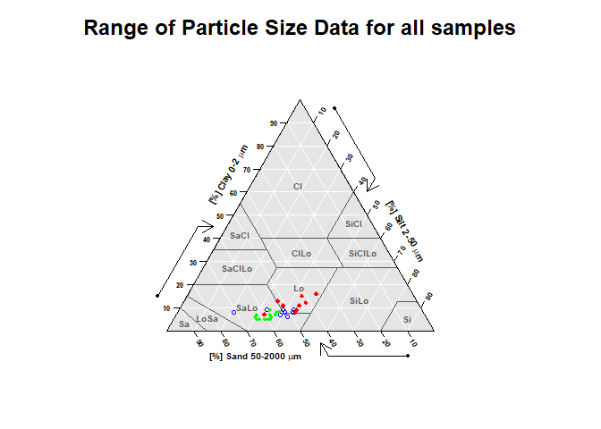
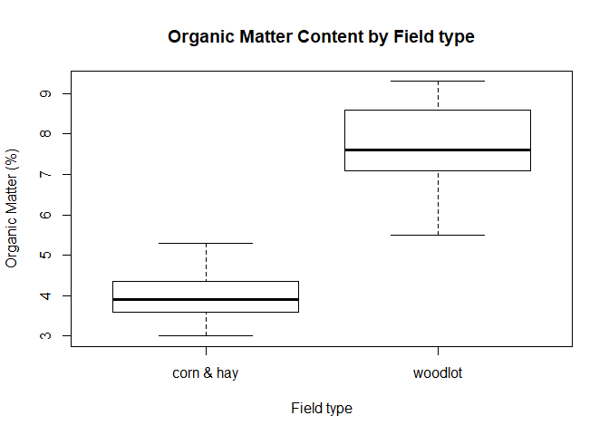

<<<<<<< HEAD
---
title: "Connecticut Three Farm Soil Health Sampling Project"
author: Jim Hyde, Megan McClellan, Jacob Isleib, Debbie Surabian
date: "March 11, 2019"
output:
  html_document:
    keep_md: yes
    toc: yes
    toc_float:
      collapsed: yes
      smooth_scroll: no
  pdf_document:
    toc: yes
  word_document:
    toc: yes
---

#Background

From October 2014 to September 2016, staff from USDA-NRCS Connecticut and the Eastern Connecticut Soil and Water Conservation District sampled soils and vegetation on three partnering farms in the northeastern part of the state.  The three farms were existing NRCS cooperators and had started implementing soil health-related practices on their managed crop lands.

#Objective
Establish baseline soil health indicator data across land uses typical in dairy production farms in Connecticut.

#Methods
Field type was used to stratify sampling, with silage corn, hay, and forested woodlots being categories.  Surface horizons of soils at all the sites were sampled using a composite sampling method (multiple samples within plot area were mixed and subsample taken) and sent to Cornell University for Cornell Assessment of Soil Health (CASH) analysis. Soil health indicators measured include Available Water Capacity (AWC), surface hardness, subsurface hardness, aggregate stability, organic matter, ACE protein index, respiration, active Carbon, pH, Phosphorus, Potassium, Magnesium, Iron, Manganese, Zinc, particle size analysis (sand, silt, clay, and USDA textural classification), and overall CASH quality score. Additionally, penetration resistance (at 0-6" and 6-18"), soil temperature (at every inch within upper 3") and infiltration (0-1" and 1-2"; double-ring method) were measured in field.

In corn fields, plant population density was measured by counting number of plants within 50-sq-ft plot. Results were also converted to plants per acre.  Corn Stalk Nitrate Test (CSNT) and Pre-Sidedress N testing (PSNT) were analyzed at University of Connecticut (number of reps vary at each site).

In hay fields, average plant height was recorded.

Forested woodlots were not characterized in terms of forestry mensuration metrics or vegetation plot data.

#Locations


```r
### load data and data preparation

setwd("S:/NRCS/Technical_Soil_Services/Soil Health Initiative/3 Farm Sampling Plan FY15")
getwd()
```

```
## [1] "S:/NRCS/Technical_Soil_Services/Soil Health Initiative/3 Farm Sampling Plan FY15"
```

```r
soil <- read.csv('soil_testing.csv')
soil2 <- soil[,c(1:26, 29)]
soil2$field_type.haycorn <- ifelse(soil2$field_type =='corn field', 'corn & hay',
                            ifelse(soil2$field_type =='hay field', 'corn & hay',
                                   ifelse(soil2$field_type =='woodlot', 'woodlot', 'NA'
                                   )))

soil2$field_type.haywood <- ifelse(soil2$field_type =='corn field', 'corn field',
                                   ifelse(soil2$field_type =='hay field', 'hay & woodlot',
                                          ifelse(soil2$field_type =='woodlot', 'hay & woodlot', 'NA'
                                          )))


soil2$all_fields <- "corn, hay, & woodlot"
soil.num <- soil[, c(8:26)]
soil.num[(2:19)] <- lapply(soil.num[(2:19)], as.numeric)
soil.num2 <- soil.num[complete.cases(soil.num),]

library(sp)
```

```
## Warning: package 'sp' was built under R version 3.5.3
```

```r
soil2.sp <- soil
attach(soil2.sp)
library(leaflet)
pal <- colorFactor(c("green", "navy", "red"), domain = c("corn field", "hay field", "woodlot"))

m <- leaflet(soil2.sp) %>% setView(lng = -71.90, lat = 41.9669, zoom = 12)
m %>% addProviderTiles(providers$Esri.WorldImagery) %>% 
  addCircleMarkers(
#    radius = ~ifelse(type == "field_type", 6, 10),
    color = ~pal(field_type),
    stroke = FALSE, fillOpacity = 0.5
  ) %>%
  addLegend("bottomright", pal = pal, values = ~field_type,
            title = "Field type",
#            labFormat = labelFormat(prefix = "$"),
            opacity = 1
  )
```

```
## Assuming "long" and "lat" are longitude and latitude, respectively
```

<!--html_preserve--><div id="htmlwidget-5dc6c2641fa2213647d3" style="width:672px;height:480px;" class="leaflet html-widget"></div>
<script type="application/json" data-for="htmlwidget-5dc6c2641fa2213647d3">{"x":{"options":{"crs":{"crsClass":"L.CRS.EPSG3857","code":null,"proj4def":null,"projectedBounds":null,"options":{}}},"setView":[[41.9669,-71.9],12,[]],"calls":[{"method":"addProviderTiles","args":["Esri.WorldImagery",null,null,{"errorTileUrl":"","noWrap":false,"detectRetina":false}]},{"method":"addCircleMarkers","args":[[41.980401,41.980401,41.979804,41.979804,41.98188,41.98188,41.980535,41.979491,41.981507,41.97837,41.99244,41.98983,41.954556,41.954556,41.953906,41.953906,41.950244,41.950244,41.954087,41.95067,41.94936,41.949835,41.953587,41.952315,41.967782,41.967782,41.965559,41.965559,41.961827,41.961827,41.965274,41.971088,41.969378,41.96742,41.96389,41.96811],[-71.967566,-71.967566,-71.96226,-71.96226,-71.970144,-71.970144,-71.968782,-71.964608,-71.972916,-71.96231,-71.96882,-71.96943,-71.835757,-71.835757,-71.838212,-71.838212,-71.831644,-71.831644,-71.843362,-71.834445,-71.833557,-71.831613,-71.840441,-71.831404,-71.975969,-71.975969,-71.975381,-71.975381,-71.974002,-71.974002,-71.973797,-71.978397,-71.977579,-71.97199,-71.97513,-71.97431],10,null,null,{"interactive":true,"className":"","stroke":false,"color":["#00FF00","#00FF00","#00FF00","#00FF00","#00FF00","#00FF00","#000080","#000080","#000080","#FF0000","#FF0000","#FF0000","#00FF00","#00FF00","#00FF00","#00FF00","#00FF00","#00FF00","#000080","#000080","#000080","#FF0000","#FF0000","#FF0000","#00FF00","#00FF00","#00FF00","#00FF00","#00FF00","#00FF00","#000080","#000080","#000080","#FF0000","#FF0000","#FF0000"],"weight":5,"opacity":0.5,"fill":true,"fillColor":["#00FF00","#00FF00","#00FF00","#00FF00","#00FF00","#00FF00","#000080","#000080","#000080","#FF0000","#FF0000","#FF0000","#00FF00","#00FF00","#00FF00","#00FF00","#00FF00","#00FF00","#000080","#000080","#000080","#FF0000","#FF0000","#FF0000","#00FF00","#00FF00","#00FF00","#00FF00","#00FF00","#00FF00","#000080","#000080","#000080","#FF0000","#FF0000","#FF0000"],"fillOpacity":0.5},null,null,null,null,null,{"interactive":false,"permanent":false,"direction":"auto","opacity":1,"offset":[0,0],"textsize":"10px","textOnly":false,"className":"","sticky":true},null]},{"method":"addLegend","args":[{"colors":["#00FF00","#000080","#FF0000"],"labels":["corn field","hay field","woodlot"],"na_color":null,"na_label":"NA","opacity":1,"position":"bottomright","type":"factor","title":"Field type","extra":null,"layerId":null,"className":"info legend","group":null}]}],"limits":{"lat":[41.94936,41.99244],"lng":[-71.978397,-71.831404]}},"evals":[],"jsHooks":[]}</script><!--/html_preserve-->

#Results

##Cornell Assessment of Soil Health data

Use correlation matrix (Pearson's correlation coefficient) and related plots to explore CASH data


```r
corr.matrix <- as.data.frame(cor(soil.num))
corr.matrix
```

```
##                          Available.Water.Capacity Surface.Hardness
## Available.Water.Capacity                1.0000000       -0.5539445
## Surface.Hardness                       -0.5539445        1.0000000
## Subsurface.Hardness                    -0.4523309        0.7585165
## Aggregate.Stability                     0.4791683       -0.2554636
## Organic.Matter                          0.6656133       -0.7261205
## ACE.Soil.Protein.Index                  0.2229837       -0.5240970
## Respiration                             0.5908734       -0.4656209
## Active.Carbon                           0.1411337       -0.2342551
## pH                                     -0.4755566        0.4844388
## P                                      -0.1637707        0.1243420
## K                                      -0.2609158        0.1335164
## Mg                                     -0.3900091        0.4709443
## Fe                                      0.5851142       -0.5938671
## Mn                                      0.6361390       -0.5867904
## Zn                                     -0.4465346        0.3150540
## overall.quality                         0.4021091       -0.6281591
## Sand                                   -0.6822067        0.4473296
## Silt                                    0.6463608       -0.3961054
## Clay                                    0.5181295       -0.3948010
##                          Subsurface.Hardness Aggregate.Stability Organic.Matter
## Available.Water.Capacity         -0.45233088           0.4791683      0.6656133
## Surface.Hardness                  0.75851648          -0.2554636     -0.7261205
## Subsurface.Hardness               1.00000000          -0.4506783     -0.7771834
## Aggregate.Stability              -0.45067831           1.0000000      0.3998237
## Organic.Matter                   -0.77718340           0.3998237      1.0000000
## ACE.Soil.Protein.Index           -0.65694612           0.2121981      0.5225978
## Respiration                      -0.56587506           0.4848530      0.6816854
## Active.Carbon                    -0.09419751          -0.2115238      0.4283916
## pH                                0.76078594          -0.6546554     -0.7140887
## P                                 0.38148213          -0.4281860     -0.2080111
## K                                 0.51136527          -0.5909745     -0.3265514
## Mg                                0.70036395          -0.4948690     -0.5396156
## Fe                               -0.69180346           0.3528148      0.7566573
## Mn                               -0.57231709           0.3335255      0.6656882
## Zn                                0.55187651          -0.6737006     -0.4358634
## overall.quality                  -0.57973111           0.0321349      0.6558646
## Sand                              0.64239126          -0.6471483     -0.7381173
## Silt                             -0.50977372           0.5621993      0.6255888
## Clay                             -0.68425870           0.5926931      0.7070695
##                          ACE.Soil.Protein.Index Respiration Active.Carbon
## Available.Water.Capacity             0.22298371   0.5908734   0.141133673
## Surface.Hardness                    -0.52409695  -0.4656209  -0.234255127
## Subsurface.Hardness                 -0.65694612  -0.5658751  -0.094197513
## Aggregate.Stability                  0.21219811   0.4848530  -0.211523830
## Organic.Matter                       0.52259783   0.6816854   0.428391627
## ACE.Soil.Protein.Index               1.00000000   0.4815010   0.381016225
## Respiration                          0.48150103   1.0000000   0.297917571
## Active.Carbon                        0.38101622   0.2979176   1.000000000
## pH                                  -0.41122125  -0.5155118   0.092662990
## P                                   -0.05668465  -0.2379870   0.495915479
## K                                   -0.13928341  -0.3227833   0.373490402
## Mg                                  -0.33045673  -0.2800560   0.317860082
## Fe                                   0.67285184   0.5634015   0.233701608
## Mn                                   0.14457290   0.4753685   0.126110154
## Zn                                  -0.26464585  -0.4623571   0.280349794
## overall.quality                      0.54473035   0.5614034   0.459078023
## Sand                                -0.39020957  -0.6688240  -0.057314992
## Silt                                 0.27919678   0.5445666  -0.005624463
## Clay                                 0.47613566   0.6849703   0.162562236
##                                   pH           P          K          Mg
## Available.Water.Capacity -0.47555658 -0.16377067 -0.2609158 -0.39000910
## Surface.Hardness          0.48443883  0.12434201  0.1335164  0.47094431
## Subsurface.Hardness       0.76078594  0.38148213  0.5113653  0.70036395
## Aggregate.Stability      -0.65465537 -0.42818596 -0.5909745 -0.49486896
## Organic.Matter           -0.71408873 -0.20801113 -0.3265514 -0.53961556
## ACE.Soil.Protein.Index   -0.41122125 -0.05668465 -0.1392834 -0.33045673
## Respiration              -0.51551182 -0.23798704 -0.3227833 -0.28005601
## Active.Carbon             0.09266299  0.49591548  0.3734904  0.31786008
## pH                        1.00000000  0.54027305  0.7950207  0.85763323
## P                         0.54027305  1.00000000  0.7613601  0.58330387
## K                         0.79502066  0.76136010  1.0000000  0.70805574
## Mg                        0.85763323  0.58330387  0.7080557  1.00000000
## Fe                       -0.69968739 -0.34641188 -0.4194841 -0.65930943
## Mn                       -0.51002543 -0.09846475 -0.1991397 -0.41500351
## Zn                        0.63272867  0.75336430  0.7484298  0.55253699
## overall.quality          -0.16131235 -0.13377890  0.1006912 -0.06852092
## Sand                      0.69895334  0.38452077  0.4591488  0.57731423
## Silt                     -0.57171767 -0.32761083 -0.3590405 -0.49297070
## Clay                     -0.71062417 -0.36494675 -0.4996403 -0.54574066
##                                  Fe          Mn         Zn overall.quality
## Available.Water.Capacity  0.5851142  0.63613905 -0.4465346      0.40210915
## Surface.Hardness         -0.5938671 -0.58679036  0.3150540     -0.62815910
## Subsurface.Hardness      -0.6918035 -0.57231709  0.5518765     -0.57973111
## Aggregate.Stability       0.3528148  0.33352547 -0.6737006      0.03213490
## Organic.Matter            0.7566573  0.66568821 -0.4358634      0.65586464
## ACE.Soil.Protein.Index    0.6728518  0.14457290 -0.2646458      0.54473035
## Respiration               0.5634015  0.47536853 -0.4623571      0.56140344
## Active.Carbon             0.2337016  0.12611015  0.2803498      0.45907802
## pH                       -0.6996874 -0.51002543  0.6327287     -0.16131235
## P                        -0.3464119 -0.09846475  0.7533643     -0.13377890
## K                        -0.4194841 -0.19913973  0.7484298      0.10069119
## Mg                       -0.6593094 -0.41500351  0.5525370     -0.06852092
## Fe                        1.0000000  0.29751709 -0.4518155      0.40343531
## Mn                        0.2975171  1.00000000 -0.3195131      0.44114853
## Zn                       -0.4518155 -0.31951310  1.0000000     -0.22032876
## overall.quality           0.4034353  0.44114853 -0.2203288      1.00000000
## Sand                     -0.5707483 -0.62520514  0.5433997     -0.45570655
## Silt                      0.4067198  0.57225570 -0.4471249      0.42578874
## Clay                      0.6997136  0.51475854 -0.5472209      0.35796911
##                                 Sand         Silt       Clay
## Available.Water.Capacity -0.68220665  0.646360845  0.5181295
## Surface.Hardness          0.44732958 -0.396105407 -0.3948010
## Subsurface.Hardness       0.64239126 -0.509773716 -0.6842587
## Aggregate.Stability      -0.64714826  0.562199346  0.5926931
## Organic.Matter           -0.73811734  0.625588756  0.7070695
## ACE.Soil.Protein.Index   -0.39020957  0.279196777  0.4761357
## Respiration              -0.66882405  0.544566576  0.6849703
## Active.Carbon            -0.05731499 -0.005624463  0.1625622
## pH                        0.69895334 -0.571717671 -0.7106242
## P                         0.38452077 -0.327610834 -0.3649468
## K                         0.45914881 -0.359040545 -0.4996403
## Mg                        0.57731423 -0.492970698 -0.5457407
## Fe                       -0.57074826  0.406719816  0.6997136
## Mn                       -0.62520514  0.572255700  0.5147585
## Zn                        0.54339971 -0.447124922 -0.5472209
## overall.quality          -0.45570655  0.425788743  0.3579691
## Sand                      1.00000000 -0.945600239 -0.7631767
## Silt                     -0.94560024  1.000000000  0.5114346
## Clay                     -0.76317672  0.511434576  1.0000000
```

```r
library(corrplot)
```

```
## Warning: package 'corrplot' was built under R version 3.5.3
```

```
## corrplot 0.84 loaded
```

```r
corrplot(cor(soil.num2), type = "upper")
```

<!-- -->

###Merge Corn Count data with CASH results


```r
plant <- read.csv('plant_data.csv', na.strings = c('', 'na'))
plant.corn <- plant[which(plant$field_type=='corn field'), c(1:9, 19:20)]
plant.corn <- plant.corn[complete.cases(plant.corn), ]
library(plyr)
```

```
## Warning: package 'plyr' was built under R version 3.5.3
```

```r
### Summarize corn count data using mean

plant.corn.sum <- ddply(plant.corn, ~site_id, summarise, num_plant.mean=mean(Number.of.Plants...50.ft2), 
                        plants_per_acre.mean = mean(Plants...Acre))

### Merge corn and soil data

soil.corn.merge <- merge(x=soil, y=plant.corn.sum, by="site_id", all.y = TRUE)
soil.corn.merge2 <- soil.corn.merge[, c(8:26, 34:35)]
```

Again, use correlation matrix and plots to explore data


```r
soil.corn.corrmatrix <- as.data.frame(cor(soil.corn.merge2))
soil.corn.corrmatrix
```

```
##                          Available.Water.Capacity Surface.Hardness
## Available.Water.Capacity               1.00000000      -0.52241687
## Surface.Hardness                      -0.52241687       1.00000000
## Subsurface.Hardness                    0.20124411       0.28169120
## Aggregate.Stability                    0.18066657       0.18952449
## Organic.Matter                         0.44387906      -0.46550117
## ACE.Soil.Protein.Index                 0.61299276      -0.52886598
## Respiration                            0.72938706      -0.51437659
## Active.Carbon                          0.55274821      -0.34425288
## pH                                     0.49567824      -0.58689012
## P                                      0.41711967      -0.18777222
## K                                      0.46654770      -0.54276861
## Mg                                     0.62167554      -0.58115080
## Fe                                    -0.11530922      -0.22621852
## Mn                                     0.55329486      -0.44241474
## Zn                                    -0.01227620      -0.22229765
## overall.quality                        0.47548617      -0.65498994
## Sand                                  -0.27284332      -0.09899417
## Silt                                   0.32627613      -0.07765096
## Clay                                   0.03597909       0.35507993
## num_plant.mean                         0.15383781       0.21743151
## plants_per_acre.mean                   0.15383781       0.21743151
##                          Subsurface.Hardness Aggregate.Stability Organic.Matter
## Available.Water.Capacity          0.20124411         0.180666573      0.4438791
## Surface.Hardness                  0.28169120         0.189524489     -0.4655012
## Subsurface.Hardness               1.00000000         0.182854260      0.3945408
## Aggregate.Stability               0.18285426         1.000000000     -0.2666363
## Organic.Matter                    0.39454081        -0.266636323      1.0000000
## ACE.Soil.Protein.Index            0.38159216        -0.213310872      0.9302429
## Respiration                       0.28078637         0.005404556      0.7478290
## Active.Carbon                     0.31401250        -0.261076891      0.8811154
## pH                                0.11838027        -0.426647945      0.7114241
## P                                 0.47553967        -0.127375745      0.6623713
## K                                 0.32599266        -0.261526719      0.9216111
## Mg                                0.28590107        -0.229536421      0.9134551
## Fe                                0.07870630        -0.218697597      0.1367351
## Mn                                0.06812266         0.016648629      0.5445616
## Zn                                0.29228254        -0.445590946      0.5200863
## overall.quality                  -0.13745702        -0.406226122      0.6063673
## Sand                              0.12487759        -0.676235065      0.2734751
## Silt                             -0.25448471         0.387527214     -0.1548313
## Clay                              0.16699540         0.823955144     -0.3365083
## num_plant.mean                    0.08466338         0.876876928     -0.3543400
## plants_per_acre.mean              0.08466338         0.876876928     -0.3543400
##                          ACE.Soil.Protein.Index  Respiration Active.Carbon
## Available.Water.Capacity             0.61299276  0.729387062   0.552748213
## Surface.Hardness                    -0.52886598 -0.514376591  -0.344252879
## Subsurface.Hardness                  0.38159216  0.280786372   0.314012503
## Aggregate.Stability                 -0.21331087  0.005404556  -0.261076891
## Organic.Matter                       0.93024292  0.747829046   0.881115376
## ACE.Soil.Protein.Index               1.00000000  0.831138536   0.905901644
## Respiration                          0.83113854  1.000000000   0.836965269
## Active.Carbon                        0.90590164  0.836965269   1.000000000
## pH                                   0.68620808  0.626285508   0.626344468
## P                                    0.66513792  0.686350003   0.769569972
## K                                    0.84110300  0.757091301   0.804638218
## Mg                                   0.91559657  0.805265453   0.863059419
## Fe                                   0.16079165  0.117856521   0.057788962
## Mn                                   0.60066893  0.801678471   0.712020330
## Zn                                   0.50040554  0.428315784   0.541289410
## overall.quality                      0.60949563  0.510896291   0.506063811
## Sand                                 0.16072966  0.012938241   0.104611984
## Silt                                -0.04272255 -0.009302698   0.008528457
## Clay                                -0.28200650 -0.012470043  -0.246940700
## num_plant.mean                      -0.28892519 -0.022555138  -0.311883674
## plants_per_acre.mean                -0.28892519 -0.022555138  -0.311883674
##                                   pH           P          K          Mg
## Available.Water.Capacity  0.49567824  0.41711967  0.4665477  0.62167554
## Surface.Hardness         -0.58689012 -0.18777222 -0.5427686 -0.58115080
## Subsurface.Hardness       0.11838027  0.47553967  0.3259927  0.28590107
## Aggregate.Stability      -0.42664795 -0.12737575 -0.2615267 -0.22953642
## Organic.Matter            0.71142407  0.66237134  0.9216111  0.91345513
## ACE.Soil.Protein.Index    0.68620808  0.66513792  0.8411030  0.91559657
## Respiration               0.62628551  0.68635000  0.7570913  0.80526545
## Active.Carbon             0.62634447  0.76956997  0.8046382  0.86305942
## pH                        1.00000000  0.38615389  0.8297829  0.85556107
## P                         0.38615389  1.00000000  0.6792130  0.65607248
## K                         0.82978290  0.67921301  1.0000000  0.91869873
## Mg                        0.85556107  0.65607248  0.9186987  1.00000000
## Fe                       -0.06298477 -0.17635012  0.0140409 -0.06592196
## Mn                        0.31805793  0.50052488  0.4831524  0.53304958
## Zn                        0.15158371  0.67951505  0.4811479  0.33317251
## overall.quality           0.82827747  0.01577628  0.6206653  0.66258705
## Sand                      0.41766217  0.16889019  0.2735764  0.23114530
## Silt                     -0.17147848 -0.14857309 -0.1263644 -0.07056733
## Clay                     -0.62731330 -0.11542665 -0.3864006 -0.38962740
## num_plant.mean           -0.54995926 -0.13542658 -0.3863484 -0.31672571
## plants_per_acre.mean     -0.54995926 -0.13542658 -0.3863484 -0.31672571
##                                   Fe          Mn          Zn overall.quality
## Available.Water.Capacity -0.11530922  0.55329486 -0.01227620     0.475486170
## Surface.Hardness         -0.22621852 -0.44241474 -0.22229765    -0.654989935
## Subsurface.Hardness       0.07870630  0.06812266  0.29228254    -0.137457018
## Aggregate.Stability      -0.21869760  0.01664863 -0.44559095    -0.406226122
## Organic.Matter            0.13673509  0.54456159  0.52008625     0.606367324
## ACE.Soil.Protein.Index    0.16079165  0.60066893  0.50040554     0.609495627
## Respiration               0.11785652  0.80167847  0.42831578     0.510896291
## Active.Carbon             0.05778896  0.71202033  0.54128941     0.506063811
## pH                       -0.06298477  0.31805793  0.15158371     0.828277467
## P                        -0.17635012  0.50052488  0.67951505     0.015776276
## K                         0.01404090  0.48315242  0.48114793     0.620665307
## Mg                       -0.06592196  0.53304958  0.33317251     0.662587049
## Fe                        1.00000000  0.33969542  0.44939293     0.217019083
## Mn                        0.33969542  1.00000000  0.44669729     0.384230047
## Zn                        0.44939293  0.44669729  1.00000000     0.017471515
## overall.quality           0.21701908  0.38423005  0.01747152     1.000000000
## Sand                      0.16398376 -0.16594962  0.39015784     0.242117378
## Silt                     -0.19051824  0.12519855 -0.35915609     0.002653724
## Clay                     -0.03135906  0.14968622 -0.23885062    -0.541718918
## num_plant.mean           -0.24284962  0.02901118 -0.41826275    -0.504325203
## plants_per_acre.mean     -0.24284962  0.02901118 -0.41826275    -0.504325203
##                                 Sand         Silt        Clay num_plant.mean
## Available.Water.Capacity -0.27284332  0.326276127  0.03597909     0.15383781
## Surface.Hardness         -0.09899417 -0.077650959  0.35507993     0.21743151
## Subsurface.Hardness       0.12487759 -0.254484711  0.16699540     0.08466338
## Aggregate.Stability      -0.67623507  0.387527214  0.82395514     0.87687693
## Organic.Matter            0.27347509 -0.154831303 -0.33650827    -0.35434001
## ACE.Soil.Protein.Index    0.16072966 -0.042722553 -0.28200650    -0.28892519
## Respiration               0.01293824 -0.009302698 -0.01247004    -0.02255514
## Active.Carbon             0.10461198  0.008528457 -0.24694070    -0.31188367
## pH                        0.41766217 -0.171478478 -0.62731330    -0.54995926
## P                         0.16889019 -0.148573093 -0.11542665    -0.13542658
## K                         0.27357642 -0.126364384 -0.38640060    -0.38634844
## Mg                        0.23114530 -0.070567328 -0.38962740    -0.31672571
## Fe                        0.16398376 -0.190518241 -0.03135906    -0.24284962
## Mn                       -0.16594962  0.125198554  0.14968622     0.02901118
## Zn                        0.39015784 -0.359156085 -0.23885062    -0.41826275
## overall.quality           0.24211738  0.002653724 -0.54171892    -0.50432520
## Sand                      1.00000000 -0.899783801 -0.64840488    -0.62368359
## Silt                     -0.89978380  1.000000000  0.25124348     0.27574397
## Clay                     -0.64840488  0.251243483  1.00000000     0.90241365
## num_plant.mean           -0.62368359  0.275743972  0.90241365     1.00000000
## plants_per_acre.mean     -0.62368359  0.275743972  0.90241365     1.00000000
##                          plants_per_acre.mean
## Available.Water.Capacity           0.15383781
## Surface.Hardness                   0.21743151
## Subsurface.Hardness                0.08466338
## Aggregate.Stability                0.87687693
## Organic.Matter                    -0.35434001
## ACE.Soil.Protein.Index            -0.28892519
## Respiration                       -0.02255514
## Active.Carbon                     -0.31188367
## pH                                -0.54995926
## P                                 -0.13542658
## K                                 -0.38634844
## Mg                                -0.31672571
## Fe                                -0.24284962
## Mn                                 0.02901118
## Zn                                -0.41826275
## overall.quality                   -0.50432520
## Sand                              -0.62368359
## Silt                               0.27574397
## Clay                               0.90241365
## num_plant.mean                     1.00000000
## plants_per_acre.mean               1.00000000
```

```r
corrplot(cor(soil.corn.merge2), type = "upper")
```

<!-- -->

Corn count data may reflect plant and row spacing rather than soil health performance.

###Select covariates with Pearson's coef > 0.70

From the correlation table above, select only covariates with a Pearson's coefficient > 0.70, to reduce the size of data used to generate a scatterplot matrix and second correlation plot.


```r
library(reshape2)
```

```
## Warning: package 'reshape2' was built under R version 3.5.3
```

```r
soil.corn.corrmatrix.melt <- subset(melt(cor(soil.corn.merge2)), value > .70)
soil.corn.corrmatrix.melt[(1:2)] <- lapply(soil.corn.corrmatrix.melt[(1:2)], as.character)
select <- !(soil.corn.corrmatrix.melt$Var1 == soil.corn.corrmatrix.melt$Var2)
soil.corn.corrmatrix.melt <- soil.corn.corrmatrix.melt[select, ]
soil.corn.corrmatrix.melt[rev(order(soil.corn.corrmatrix.melt$value)),]
```

```
##                         Var1                     Var2     value
## 440           num_plant.mean     plants_per_acre.mean 1.0000000
## 420     plants_per_acre.mean           num_plant.mean 1.0000000
## 110           Organic.Matter   ACE.Soil.Protein.Index 0.9302429
## 90    ACE.Soil.Protein.Index           Organic.Matter 0.9302429
## 215           Organic.Matter                        K 0.9216111
## 95                         K           Organic.Matter 0.9216111
## 242                        K                       Mg 0.9186987
## 222                       Mg                        K 0.9186987
## 237   ACE.Soil.Protein.Index                       Mg 0.9155966
## 117                       Mg   ACE.Soil.Protein.Index 0.9155966
## 236           Organic.Matter                       Mg 0.9134551
## 96                        Mg           Organic.Matter 0.9134551
## 153   ACE.Soil.Protein.Index            Active.Carbon 0.9059016
## 113            Active.Carbon   ACE.Soil.Protein.Index 0.9059016
## 418                     Clay           num_plant.mean 0.9024137
## 398           num_plant.mean                     Clay 0.9024137
## 439                     Clay     plants_per_acre.mean 0.9024137
## 399     plants_per_acre.mean                     Clay 0.9024137
## 152           Organic.Matter            Active.Carbon 0.8811154
## 92             Active.Carbon           Organic.Matter 0.8811154
## 424      Aggregate.Stability     plants_per_acre.mean 0.8768769
## 403      Aggregate.Stability           num_plant.mean 0.8768769
## 84      plants_per_acre.mean      Aggregate.Stability 0.8768769
## 83            num_plant.mean      Aggregate.Stability 0.8768769
## 239            Active.Carbon                       Mg 0.8630594
## 159                       Mg            Active.Carbon 0.8630594
## 240                       pH                       Mg 0.8555611
## 180                       Mg                       pH 0.8555611
## 216   ACE.Soil.Protein.Index                        K 0.8411030
## 116                        K   ACE.Soil.Protein.Index 0.8411030
## 154              Respiration            Active.Carbon 0.8369653
## 134            Active.Carbon              Respiration 0.8369653
## 132   ACE.Soil.Protein.Index              Respiration 0.8311385
## 112              Respiration   ACE.Soil.Protein.Index 0.8311385
## 219                       pH                        K 0.8297829
## 179                        K                       pH 0.8297829
## 324                       pH          overall.quality 0.8282775
## 184          overall.quality                       pH 0.8282775
## 382      Aggregate.Stability                     Clay 0.8239551
## 82                      Clay      Aggregate.Stability 0.8239551
## 238              Respiration                       Mg 0.8052655
## 138                       Mg              Respiration 0.8052655
## 218            Active.Carbon                        K 0.8046382
## 158                        K            Active.Carbon 0.8046382
## 280              Respiration                       Mn 0.8016785
## 140                       Mn              Respiration 0.8016785
## 197            Active.Carbon                        P 0.7695700
## 157                        P            Active.Carbon 0.7695700
## 217              Respiration                        K 0.7570913
## 137                        K              Respiration 0.7570913
## 131           Organic.Matter              Respiration 0.7478290
## 91               Respiration           Organic.Matter 0.7478290
## 127 Available.Water.Capacity              Respiration 0.7293871
## 7                Respiration Available.Water.Capacity 0.7293871
## 281            Active.Carbon                       Mn 0.7120203
## 161                       Mn            Active.Carbon 0.7120203
## 173           Organic.Matter                       pH 0.7114241
## 93                        pH           Organic.Matter 0.7114241
```

```r
corr.columns <- as.character(soil.corn.corrmatrix.melt$Var1)
corr.columns <- unique(corr.columns)

soil.corn.merge2.select <- soil.corn.merge2[, corr.columns]

### Evaluate relationships using scatterplot matrix
library(car)
```

```
## Loading required package: carData
```

```r
#scatterplotMatrix(soil.corn.merge2.select, col=c('black'))

#soil.corn.merge2.select <- soil.corn.merge2[ setdiff(names(soil.corn.merge2), corr.columns)]

corrplot(cor(soil.corn.merge2.select), type = "upper")
```

<!-- -->

## Evaluate ranges of soil textures between samples


```r
library(soiltexture)
```

```
## Warning: package 'soiltexture' was built under R version 3.5.3
```

```r
colnames(soil2)[24] <- "SAND"
colnames(soil2)[25] <- "SILT"
colnames(soil2)[26] <- "CLAY"

attach(soil2)
```

```
## The following objects are masked from soil2.sp:
## 
##     ACE.Soil.Protein.Index, Active.Carbon, Aggregate.Stability,
##     Available.Water.Capacity, farm, farm_id, Fe, field, field_no,
##     field_type, field_type_id, K, Mg, Mn, Organic.Matter,
##     overall.quality, P, pH, Respiration, site_id, Subsurface.Hardness,
##     Surface.Hardness, USDA_tex_class, Zn
```

```r
soil2.hay <- soil2[which(field_type == "hay field"), ]
soil2.corn <- soil2[which(field_type == "corn field"), ]
soil2.woodlot <- soil2[which(field_type == "woodlot"), ]

plot.new()

geo <- TT.plot(class.sys   = "USDA.TT",
               tri.data    = soil2.hay,
               main        = "Range of Particle Size Data for all samples",
               col = "blue",
               cex = .7,
               cex.axis=.5,
               cex.lab=.6,
               lwd=.5,
               lwd.axis=0.5,
               lwd.lab=0.3)

TT.points(tri.data = soil2.corn,
          geo = geo,
          col = "green",
          cex = .1,
          pch = 3)

TT.points(tri.data = soil2.woodlot,
          geo = geo,
          #          dat.css.ps.lim  = c(0,2,63,2000),
          #          css.transf      = TRUE,
          col = "red",
          cex = .2,
          pch = 2)
```

<!-- -->
**Legend**

|Field type |color                                 |
|-----------|--------------------------------------|
|corn field |<span style="color:green">green</span>|
|hay field  |<span style="color:blue">blue</span>  | 
|woodlot    |<span style="color:red">red</span>    |


## Bartlett's Test / ANOVA/ Box plots of individual Soil Health Indicators by Field Type

Subject each variable to Bartlett's test of Homogeneity of variance.  If p suggests null hypothesis is true (i.e., that variance is the same for all treatment groups), pool groups for one-way Analysis of Variance. If variance is not same for groups, use Welch ANOVA and Kruskal-Wallis test (i.e., non-parametric test).

If ANOVA/Welch ANOVA/Kruskal-Wallis test indicate difference in means, use pairwise t test to compare each treatment. Group treatments that meet null hypothesis of t test. Subject new groups (now limited to two treatments) to F test of variance.  Based on a results, use either ANOVA or Welch's ANOVA on new groups to compare means.

Summarize individual variables with box plot, either by individual field type groups, partially-combined groups (based on t test results), or across the entire study for variables that fail null hypothesis of ANOVA.

### Reference Sample size by Field type


```r
library(dplyr)
```

```
## Warning: package 'dplyr' was built under R version 3.5.3
```

```
## 
## Attaching package: 'dplyr'
```

```
## The following object is masked from 'package:car':
## 
##     recode
```

```
## The following objects are masked from 'package:plyr':
## 
##     arrange, count, desc, failwith, id, mutate, rename, summarise,
##     summarize
```

```
## The following objects are masked from 'package:stats':
## 
##     filter, lag
```

```
## The following objects are masked from 'package:base':
## 
##     intersect, setdiff, setequal, union
```

```r
sample.size <- ddply(soil2, ~field_type, summarise, n = n())
sample.size
```

```
##   field_type  n
## 1 corn field 18
## 2  hay field  9
## 3    woodlot  9
```

### Surface Hardness


```r
bartlett.test(Surface.Hardness ~ field_type, data = soil2)
```

```
## 
## 	Bartlett test of homogeneity of variances
## 
## data:  Surface.Hardness by field_type
## Bartlett's K-squared = 4.0698, df = 2, p-value = 0.1307
```

```r
### p-value > 0.05; the variance is the same for all treatment groups.  Use one-way ANOVA to evaluate difference between means of the groups.
aov.surf <- aov(Surface.Hardness ~ field_type, data = soil2)
summary(aov.surf)
```

```
##             Df Sum Sq Mean Sq F value   Pr(>F)    
## field_type   2  47520   23760   26.73 1.25e-07 ***
## Residuals   33  29337     889                     
## ---
## Signif. codes:  0 '***' 0.001 '**' 0.01 '*' 0.05 '.' 0.1 ' ' 1
```

ANOVA p-value < 0.05; Means are different between groups.


```r
### Analyze means
tapply(X = Surface.Hardness, INDEX = list(field_type), FUN = mean)
```

```
## corn field  hay field    woodlot 
##   209.6667   213.7778   127.2222
```

```r
### Pairwise comparisons of treatment groups
pairwise.t.test(Surface.Hardness, field_type, p.adj = "holm")
```

```
## 
## 	Pairwise comparisons using t tests with pooled SD 
## 
## data:  Surface.Hardness and field_type 
## 
##           corn field hay field
## hay field 0.74       -        
## woodlot   3.0e-07    1.2e-06  
## 
## P value adjustment method: holm
```

Corn field and hay field treatments are not significantly different.  Woodlot treatments are different from both others.


```r
var.test(Surface.Hardness ~ field_type.haycorn, soil2, alternative = "two.sided")
```

```
## 
## 	F test to compare two variances
## 
## data:  Surface.Hardness by field_type.haycorn
## F = 2.4375, num df = 26, denom df = 8, p-value = 0.1914
## alternative hypothesis: true ratio of variances is not equal to 1
## 95 percent confidence interval:
##  0.6207296 6.6527021
## sample estimates:
## ratio of variances 
##           2.437528
```

F test suggests variance is not difference between new groups.


```r
summary(aov(Surface.Hardness ~ field_type.haycorn, data = soil2))
```

```
##                    Df Sum Sq Mean Sq F value  Pr(>F)    
## field_type.haycorn  1  47418   47418   54.77 1.4e-08 ***
## Residuals          34  29439     866                    
## ---
## Signif. codes:  0 '***' 0.001 '**' 0.01 '*' 0.05 '.' 0.1 ' ' 1
```

ANOVA of new groups suggests means are different.


```r
boxplot( Surface.Hardness ~ field_type.haycorn, data = soil2, main = "Surface Hardness by Field type", xlab = "Field type", ylab = "Surface Hardness (psi)")
```

<!-- -->

### Subsurface Hardness


```r
bartlett.test(Subsurface.Hardness ~ field_type, data = soil2)
```

```
## 
## 	Bartlett test of homogeneity of variances
## 
## data:  Subsurface.Hardness by field_type
## Bartlett's K-squared = 14.726, df = 2, p-value = 0.0006343
```

Bartlett p-value < 0.05; variance appears different between field type groups; used Welch's test to assess means


```r
oneway.test(Subsurface.Hardness ~ field_type, data=soil2, na.action=na.omit, var.equal=FALSE)
```

```
## 
## 	One-way analysis of means (not assuming equal variances)
## 
## data:  Subsurface.Hardness and field_type
## F = 49.613, num df = 2.000, denom df = 11.956, p-value = 1.624e-06
```

```r
kruskal.test(Subsurface.Hardness ~ field_type, soil2, na.action=na.omit)
```

```
## 
## 	Kruskal-Wallis rank sum test
## 
## data:  Subsurface.Hardness by field_type
## Kruskal-Wallis chi-squared = 20.578, df = 2, p-value = 3.4e-05
```

Welch ANOVA p-value < 0.05; Means are different between groups using parametric test.  Kruskal-Wallis test also indicates difference between means.


```r
### Analyze means
tapply(X = Subsurface.Hardness, INDEX = list(field_type), FUN = mean)
```

```
## corn field  hay field    woodlot 
##   283.5000   264.6667   188.6667
```

```r
### Pairwise comparisons of treatment groups
pairwise.t.test(Subsurface.Hardness, field_type, p.adj = "holm")
```

```
## 
## 	Pairwise comparisons using t tests with pooled SD 
## 
## data:  Subsurface.Hardness and field_type 
## 
##           corn field hay field
## hay field 0.037      -        
## woodlot   4.9e-12    1.9e-08  
## 
## P value adjustment method: holm
```

All treatments are significantly different from one another


```r
boxplot( Subsurface.Hardness ~ field_type, data = soil2, main = "Subsurface Hardness by Field type", xlab = "Field type", ylab = "Subsurface Hardness (psi)")
```

<!-- -->

### Aggregate Stability


```r
bartlett.test(Aggregate.Stability ~ field_type, data = soil2)
```

```
## 
## 	Bartlett test of homogeneity of variances
## 
## data:  Aggregate.Stability by field_type
## Bartlett's K-squared = 16.755, df = 2, p-value = 0.00023
```

p-value < 0.05; variance appears different between field type groups


```r
oneway.test(Aggregate.Stability ~ field_type, data=soil2, na.action=na.omit, var.equal=FALSE)
```

```
## 
## 	One-way analysis of means (not assuming equal variances)
## 
## data:  Aggregate.Stability and field_type
## F = 12.206, num df = 2.000, denom df = 17.553, p-value = 0.0004762
```

```r
### 
kruskal.test(Aggregate.Stability ~ field_type, soil2, na.action=na.omit)
```

```
## 
## 	Kruskal-Wallis rank sum test
## 
## data:  Aggregate.Stability by field_type
## Kruskal-Wallis chi-squared = 12.095, df = 2, p-value = 0.002364
```

Welch ANOVA p-value < 0.05; Means are different between groups using parametric test. Kruskal-Wallis test also indicates difference between means.


```r
### Analyze means
tapply(X = Aggregate.Stability, INDEX = list(field_type), FUN = mean)
```

```
## corn field  hay field    woodlot 
##   50.86111   76.33333   78.41111
```

```r
### Pairwise comparisons of treatment groups
pairwise.t.test(Aggregate.Stability, field_type, p.adj = "holm")
```

```
## 
## 	Pairwise comparisons using t tests with pooled SD 
## 
## data:  Aggregate.Stability and field_type 
## 
##           corn field hay field
## hay field 0.0019     -        
## woodlot   0.0013     0.7995   
## 
## P value adjustment method: holm
```

Hay field and woodlot treatments are not significantly different.  Corn field treatments are different from both others.


```r
var.test(Aggregate.Stability ~ field_type.haywood, soil2, alternative = "two.sided")
```

```
## 
## 	F test to compare two variances
## 
## data:  Aggregate.Stability by field_type.haywood
## F = 6.0727, num df = 17, denom df = 17, p-value = 0.0005475
## alternative hypothesis: true ratio of variances is not equal to 1
## 95 percent confidence interval:
##   2.271624 16.234241
## sample estimates:
## ratio of variances 
##           6.072734
```

F-test suggests variance is different between new groups.


```r
oneway.test(Aggregate.Stability ~ field_type.haywood, data=soil2, na.action=na.omit, var.equal=FALSE)
```

```
## 
## 	One-way analysis of means (not assuming equal variances)
## 
## data:  Aggregate.Stability and field_type.haywood
## F = 21.953, num df = 1.000, denom df = 22.451, p-value = 0.0001079
```

Welch ANOVA suggests means are different between new groups.


```r
boxplot( Aggregate.Stability ~ field_type.haywood, data = soil2, main = "Aggregate Stability by Field type", xlab = "Field type", ylab = "Aggregate Stability (%)")
```

<!-- -->

### Organic Matter


```r
bartlett.test(Organic.Matter ~ field_type, data = soil2)
```

```
## 
## 	Bartlett test of homogeneity of variances
## 
## data:  Organic.Matter by field_type
## Bartlett's K-squared = 11.145, df = 2, p-value = 0.003802
```

p-value < 0.05; variance appears different between field type groups


```r
oneway.test(Organic.Matter ~ field_type, data=soil2, na.action=na.omit, var.equal=FALSE)
```

```
## 
## 	One-way analysis of means (not assuming equal variances)
## 
## data:  Organic.Matter and field_type
## F = 38.352, num df = 2.000, denom df = 13.492, p-value = 2.716e-06
```

```r
kruskal.test(Organic.Matter ~ field_type, soil2, na.action=na.omit)
```

```
## 
## 	Kruskal-Wallis rank sum test
## 
## data:  Organic.Matter by field_type
## Kruskal-Wallis chi-squared = 22.876, df = 2, p-value = 1.078e-05
```

Welch ANOVA p-value < 0.05; Means are different between groups using parametric test.  Kruskal-Wallis test also indicates difference between means.


```r
### Analyze means
tapply(X = Organic.Matter, INDEX = list(field_type), FUN = mean)
```

```
## corn field  hay field    woodlot 
##   3.822222   4.466667   7.677778
```

```r
### Pairwise comparisons of treatment groups
pairwise.t.test(Organic.Matter, field_type, p.adj = "holm")
```

```
## 
## 	Pairwise comparisons using t tests with pooled SD 
## 
## data:  Organic.Matter and field_type 
## 
##           corn field hay field
## hay field 0.053      -        
## woodlot   3.9e-13    9.9e-10  
## 
## P value adjustment method: holm
```

Corn field and hay field treatments are not significantly different.  woodlot treatments are different from both others.


```r
var.test(Organic.Matter ~ field_type.haycorn, soil2, alternative = "two.sided")
```

```
## 
## 	F test to compare two variances
## 
## data:  Organic.Matter by field_type.haycorn
## F = 0.24102, num df = 26, denom df = 8, p-value = 0.005308
## alternative hypothesis: true ratio of variances is not equal to 1
## 95 percent confidence interval:
##  0.06137712 0.65781254
## sample estimates:
## ratio of variances 
##          0.2410203
```

F-test suggests variance is not different between new groups.


```r
summary(aov(Organic.Matter ~ field_type.haycorn, data = soil2))
```

```
##                    Df Sum Sq Mean Sq F value  Pr(>F)    
## field_type.haycorn  1  89.47   89.47   133.3 2.6e-13 ***
## Residuals          34  22.82    0.67                    
## ---
## Signif. codes:  0 '***' 0.001 '**' 0.01 '*' 0.05 '.' 0.1 ' ' 1
```

ANOVA of new groups suggests means are different.


```r
boxplot( Organic.Matter ~ field_type.haycorn, data = soil2, main = "Organic Matter Content by Field type", xlab = "Field type", ylab = "Organic Matter (%)")
```

<!-- -->

### Active carbon


```r
bartlett.test(Active.Carbon ~ field_type, data = soil2)
```

```
## 
## 	Bartlett test of homogeneity of variances
## 
## data:  Active.Carbon by field_type
## Bartlett's K-squared = 0.79316, df = 2, p-value = 0.6726
```

p-value > 0.05; the variance is the same for all treatment groups.  Use one-way ANOVA to evaluate difference between means of the groups.


```r
aov.actC <- aov(Active.Carbon ~ field_type, data = soil2)
summary(aov.actC)
```

```
##             Df Sum Sq Mean Sq F value Pr(>F)
## field_type   2  39974   19987   1.003  0.378
## Residuals   33 657693   19930
```

Cannot reject null hypothesis that there is no difference between the means.


```r
boxplot( Active.Carbon ~ all_fields, data = soil2, main = "Active Carbon by Field type", xlab = "Field type", ylab = "Active Carbon (ppm)")
```

<!-- -->

###  Autoclaved Citrate Extractable (ACE) Soil Protein Index


```r
bartlett.test(ACE.Soil.Protein.Index ~ field_type, data = soil2)
```

```
## 
## 	Bartlett test of homogeneity of variances
## 
## data:  ACE.Soil.Protein.Index by field_type
## Bartlett's K-squared = 21.48, df = 2, p-value = 2.166e-05
```

p-value < 0.05; variance appears different between field type groups


```r
oneway.test(ACE.Soil.Protein.Index ~ field_type, data=soil2, na.action=na.omit, var.equal=FALSE)
```

```
## 
## 	One-way analysis of means (not assuming equal variances)
## 
## data:  ACE.Soil.Protein.Index and field_type
## F = 4.0811, num df = 2.000, denom df = 14.258, p-value = 0.03968
```

```r
kruskal.test(ACE.Soil.Protein.Index ~ field_type, soil2, na.action=na.omit)
```

```
## 
## 	Kruskal-Wallis rank sum test
## 
## data:  ACE.Soil.Protein.Index by field_type
## Kruskal-Wallis chi-squared = 6.4443, df = 2, p-value = 0.03987
```

Welch ANOVA p-value < 0.05; Means are different between groups using parametric test.  Kruskal-Wallis test also indicates difference between means.


```r
### Analyze means
tapply(X = ACE.Soil.Protein.Index, INDEX = list(field_type), FUN = mean)
```

```
## corn field  hay field    woodlot 
##   11.31111   12.04444   19.20000
```

```r
### Pairwise comparisons of treatment groups
pairwise.t.test(ACE.Soil.Protein.Index, field_type, p.adj = "holm")
```

```
## 
## 	Pairwise comparisons using t tests with pooled SD 
## 
## data:  ACE.Soil.Protein.Index and field_type 
## 
##           corn field hay field
## hay field 0.68912    -        
## woodlot   0.00038    0.00346  
## 
## P value adjustment method: holm
```

Corn field and hay field treatments are not significantly different.  woodlot treatments are different from both others.


```r
var.test(ACE.Soil.Protein.Index ~ field_type.haycorn, soil2, alternative = "two.sided")
```

```
## 
## 	F test to compare two variances
## 
## data:  ACE.Soil.Protein.Index by field_type.haycorn
## F = 0.084713, num df = 26, denom df = 8, p-value = 1.268e-06
## alternative hypothesis: true ratio of variances is not equal to 1
## 95 percent confidence interval:
##  0.02157258 0.23120530
## sample estimates:
## ratio of variances 
##         0.08471284
```

F-test suggests variance is different between new groups.


```r
oneway.test(ACE.Soil.Protein.Index ~ field_type.haycorn, data=soil2, na.action=na.omit, var.equal=FALSE)
```

```
## 
## 	One-way analysis of means (not assuming equal variances)
## 
## data:  ACE.Soil.Protein.Index and field_type.haycorn
## F = 7.9434, num df = 1.0000, denom df = 8.4561, p-value = 0.02135
```

Welch ANOVA suggests means are different between new groups.


```r
boxplot( ACE.Soil.Protein.Index ~ field_type.haycorn, data = soil2, main = "ACE Soil Protein Index by Field type", xlab = "Field type", ylab = "ACE Soil Protein Index (mg/g-soil)")
```

<!-- -->

### Microbial Respiration


```r
bartlett.test(Respiration ~ field_type, data = soil2)
```

```
## 
## 	Bartlett test of homogeneity of variances
## 
## data:  Respiration by field_type
## Bartlett's K-squared = 5.6731, df = 2, p-value = 0.05863
```

p-value > 0.05; the variance is the same for all treatment groups.  Use one-way ANOVA to evaluate difference between means of the groups.


```r
aov.resp <- aov(Respiration ~ field_type, data = soil2)
summary(aov.resp)
```

```
##             Df Sum Sq Mean Sq F value   Pr(>F)    
## field_type   2 1.1471  0.5735   22.31 7.44e-07 ***
## Residuals   33 0.8484  0.0257                     
## ---
## Signif. codes:  0 '***' 0.001 '**' 0.01 '*' 0.05 '.' 0.1 ' ' 1
```

ANOVA p-value < 0.05; Means are different between groups.


```r
### Analyze means
tapply(X = Respiration, INDEX = list(field_type), FUN = mean)
```

```
## corn field  hay field    woodlot 
##  0.5761111  0.8933333  0.9655556
```

```r
### Pairwise comparisons of treatment groups
pairwise.t.test(Respiration, field_type, p.adj = "holm")
```

```
## 
## 	Pairwise comparisons using t tests with pooled SD 
## 
## data:  Respiration and field_type 
## 
##           corn field hay field
## hay field 5.8e-05    -        
## woodlot   3.4e-06    0.35     
## 
## P value adjustment method: holm
```

Hay field and woodlot treatments are not significantly different.  Corn field treatments are different from both others.


```r
var.test(Respiration ~ field_type.haywood, soil2, alternative = "two.sided")
```

```
## 
## 	F test to compare two variances
## 
## data:  Respiration by field_type.haywood
## F = 0.32896, num df = 17, denom df = 17, p-value = 0.02745
## alternative hypothesis: true ratio of variances is not equal to 1
## 95 percent confidence interval:
##  0.1230533 0.8794046
## sample estimates:
## ratio of variances 
##          0.3289584
```

F-test suggests variance is different between new groups.


```r
oneway.test(Respiration ~ field_type.haywood, data=soil2, na.action=na.omit, var.equal=FALSE)
```

```
## 
## 	One-way analysis of means (not assuming equal variances)
## 
## data:  Respiration and field_type.haywood
## F = 43.814, num df = 1.000, denom df = 27.092, p-value = 4.141e-07
```

Welch ANOVA suggests means are different between new groups.


```r
boxplot( Respiration ~ field_type.haywood, data = soil2, main = "Microbial respiration by Field type, 4-day incubation", xlab = "Field type", ylab = "Microbial respiration (mg)")
```

<!-- -->

#Discussion
The Connecticut Three Farm Soil Health study resulted in a small sample size and a more robust study would be needed to confirm relationships suggested by our data.  Despite this limitation, we were able to observe significant interactions between soil health indicators and the field type treatments.  Comparisons of soil health indicators using the CASH analyses yields contrasting similarities between some of the field type treatments.  As summarized in Table 1, for most soil health indicators, two of the field types were combined based on results of analysis of difference of treatment means and pairwise comparisons.  Active Carbon showed significant differences between all field types, and Subsurface hardness showed no significant difference between any of the field types.

Table 1. Summary of results of pairwise comparisons between field types 

|**All treatments different | Corn & Hay same; Woodlot diff | Hay & woodlot same; Corn different | All treatments same**|
|--------------------------|-------------------------------|------------------------------------|---------------------|
| Subsurface Hardness      | Surface Hardness              | Aggregate Stability                | Active Carbon       |
|                          | Organic Matter                | Microbial Respiration              |                     |
|                          | ACE Soil Protein Index        |                                    |                     |

Of particular interest are differing combinations of field types for different soil health indicators that are often thought of as positively correlated.  For example, organic matter content between corn and hay fields was not significantly different based on our tests, yet aggregate stability was significantly different between these treatments.  This prompts the future research question: what soil properties are responsible for significantly higher aggregate stability in hay fields, if organic matter content is not significantly different?  Pearson's correlation coefficient value of 0.38 between organic matter and aggregate stability confirms this poorly correlated relationship.  Results from active carbon data comparisons suggests no significant different between treaments, so carbon activity/stability does not appear related to increases in aggregate stability. Pearson's correlation coefficient value of -0.21 between active carbon and aggregate stability confirms this poorly correlated relationship.  It is also interesting that significant difference of microbial respiration between treatments did not mirror that of active carbon. These two are also poorly correlated with a Pearson's correlation coefficient value of 0.30.

More soil health and dynamic soil property sampling and analysis is needed to determine whether current CASH soil properties/indicators are meaningful metrics of soil health and whether others need to be added.  Further, *performance metrics*, such as crop yields, biomass amounts, and soil moisture measurement, are needed to evaluate whether soil health indicators correlate to outcomes that affect the farmer or land manager's bottom line.  Calibration of threshold values for indicators that are found to be correlated is the final step in demonstrating how soil health-building practices relate to desirable land management outcomes.


#Acknowledgements

This study would not have been possible without the dilligent field-work from Abigail Phillips, Matt Snurkowski, Lisa Krall, Marissa Theve, and Donald Parizek.
=======
---
title: "Connecticut Three Farm Soil Health Sampling Project"
author: Jim Hyde, Megan McClellan, Jacob Isleib, Debbie Surabian
date: "March 11, 2019"
output:
  html_document:
    keep_md: yes
    toc: yes
    toc_float:
      collapsed: yes
      smooth_scroll: no
  pdf_document:
    toc: yes
  word_document:
    toc: yes
---

#Background

From October 2014 to September 2016, staff from USDA-NRCS Connecticut and the Eastern Connecticut Soil and Water Conservation District sampled soils and vegetation on three partnering farms in the northeastern part of the state.  The three farms were existing NRCS cooperators and had started implementing soil health-related practices on their managed crop lands.

#Objective
Establish baseline soil health indicator data across land uses typical in dairy production farms in Connecticut.

#Methods
Field type was used to stratify sampling, with silage corn, hay, and forested woodlots being categories.  Surface horizons of soils at all the sites were sampled using a composite sampling method (multiple samples within plot area were mixed and subsample taken) and sent to Cornell University for Cornell Assessment of Soil Health (CASH) analysis. Soil health indicators measured include Available Water Capacity (AWC), surface hardness, subsurface hardness, aggregate stability, organic matter, ACE protein index, respiration, active Carbon, pH, Phosphorus, Potassium, Magnesium, Iron, Manganese, Zinc, particle size analysis (sand, silt, clay, and USDA textural classification), and overall CASH quality score. Additionally, penetration resistance (at 0-6" and 6-18"), soil temperature (at every inch within upper 3") and infiltration (0-1" and 1-2"; double-ring method) were measured in field.

In corn fields, plant population density was measured by counting number of plants within 50-sq-ft plot. Results were also converted to plants per acre.  Corn Stalk Nitrate Test (CSNT) and Pre-Sidedress N testing (PSNT) were analyzed at University of Connecticut (number of reps vary at each site).

In hay fields, average plant height was recorded.

Forested woodlots were not characterized in terms of forestry mensuration metrics or vegetation plot data.

#Locations


```r
### load data and data preparation

setwd("S:/NRCS/Technical_Soil_Services/Soil Health Initiative/3 Farm Sampling Plan FY15")
getwd()
```

```
## [1] "S:/NRCS/Technical_Soil_Services/Soil Health Initiative/3 Farm Sampling Plan FY15"
```

```r
soil <- read.csv('soil_testing.csv')
soil2 <- soil[,c(1:26, 29)]
soil2$field_type.haycorn <- ifelse(soil2$field_type =='corn field', 'corn & hay',
                            ifelse(soil2$field_type =='hay field', 'corn & hay',
                                   ifelse(soil2$field_type =='woodlot', 'woodlot', 'NA'
                                   )))

soil2$field_type.haywood <- ifelse(soil2$field_type =='corn field', 'corn field',
                                   ifelse(soil2$field_type =='hay field', 'hay & woodlot',
                                          ifelse(soil2$field_type =='woodlot', 'hay & woodlot', 'NA'
                                          )))


soil2$all_fields <- "corn, hay, & woodlot"
soil.num <- soil[, c(8:26)]
soil.num[(2:19)] <- lapply(soil.num[(2:19)], as.numeric)
soil.num2 <- soil.num[complete.cases(soil.num),]

library(sp)
```

```
## Warning: package 'sp' was built under R version 3.5.3
```

```r
soil2.sp <- soil
attach(soil2.sp)
library(leaflet)
pal <- colorFactor(c("green", "navy", "red"), domain = c("corn field", "hay field", "woodlot"))

m <- leaflet(soil2.sp) %>% setView(lng = -71.90, lat = 41.9669, zoom = 12)
m %>% addProviderTiles(providers$Esri.WorldImagery) %>% 
  addCircleMarkers(
#    radius = ~ifelse(type == "field_type", 6, 10),
    color = ~pal(field_type),
    stroke = FALSE, fillOpacity = 0.5
  ) %>%
  addLegend("bottomright", pal = pal, values = ~field_type,
            title = "Field type",
#            labFormat = labelFormat(prefix = "$"),
            opacity = 1
  )
```

```
## Assuming "long" and "lat" are longitude and latitude, respectively
```

<!--html_preserve--><div id="htmlwidget-5dc6c2641fa2213647d3" style="width:672px;height:480px;" class="leaflet html-widget"></div>
<script type="application/json" data-for="htmlwidget-5dc6c2641fa2213647d3">{"x":{"options":{"crs":{"crsClass":"L.CRS.EPSG3857","code":null,"proj4def":null,"projectedBounds":null,"options":{}}},"setView":[[41.9669,-71.9],12,[]],"calls":[{"method":"addProviderTiles","args":["Esri.WorldImagery",null,null,{"errorTileUrl":"","noWrap":false,"detectRetina":false}]},{"method":"addCircleMarkers","args":[[41.980401,41.980401,41.979804,41.979804,41.98188,41.98188,41.980535,41.979491,41.981507,41.97837,41.99244,41.98983,41.954556,41.954556,41.953906,41.953906,41.950244,41.950244,41.954087,41.95067,41.94936,41.949835,41.953587,41.952315,41.967782,41.967782,41.965559,41.965559,41.961827,41.961827,41.965274,41.971088,41.969378,41.96742,41.96389,41.96811],[-71.967566,-71.967566,-71.96226,-71.96226,-71.970144,-71.970144,-71.968782,-71.964608,-71.972916,-71.96231,-71.96882,-71.96943,-71.835757,-71.835757,-71.838212,-71.838212,-71.831644,-71.831644,-71.843362,-71.834445,-71.833557,-71.831613,-71.840441,-71.831404,-71.975969,-71.975969,-71.975381,-71.975381,-71.974002,-71.974002,-71.973797,-71.978397,-71.977579,-71.97199,-71.97513,-71.97431],10,null,null,{"interactive":true,"className":"","stroke":false,"color":["#00FF00","#00FF00","#00FF00","#00FF00","#00FF00","#00FF00","#000080","#000080","#000080","#FF0000","#FF0000","#FF0000","#00FF00","#00FF00","#00FF00","#00FF00","#00FF00","#00FF00","#000080","#000080","#000080","#FF0000","#FF0000","#FF0000","#00FF00","#00FF00","#00FF00","#00FF00","#00FF00","#00FF00","#000080","#000080","#000080","#FF0000","#FF0000","#FF0000"],"weight":5,"opacity":0.5,"fill":true,"fillColor":["#00FF00","#00FF00","#00FF00","#00FF00","#00FF00","#00FF00","#000080","#000080","#000080","#FF0000","#FF0000","#FF0000","#00FF00","#00FF00","#00FF00","#00FF00","#00FF00","#00FF00","#000080","#000080","#000080","#FF0000","#FF0000","#FF0000","#00FF00","#00FF00","#00FF00","#00FF00","#00FF00","#00FF00","#000080","#000080","#000080","#FF0000","#FF0000","#FF0000"],"fillOpacity":0.5},null,null,null,null,null,{"interactive":false,"permanent":false,"direction":"auto","opacity":1,"offset":[0,0],"textsize":"10px","textOnly":false,"className":"","sticky":true},null]},{"method":"addLegend","args":[{"colors":["#00FF00","#000080","#FF0000"],"labels":["corn field","hay field","woodlot"],"na_color":null,"na_label":"NA","opacity":1,"position":"bottomright","type":"factor","title":"Field type","extra":null,"layerId":null,"className":"info legend","group":null}]}],"limits":{"lat":[41.94936,41.99244],"lng":[-71.978397,-71.831404]}},"evals":[],"jsHooks":[]}</script><!--/html_preserve-->

#Results

##Cornell Assessment of Soil Health data

Use correlation matrix (Pearson's correlation coefficient) and related plots to explore CASH data


```r
corr.matrix <- as.data.frame(cor(soil.num))
corr.matrix
```

```
##                          Available.Water.Capacity Surface.Hardness
## Available.Water.Capacity                1.0000000       -0.5539445
## Surface.Hardness                       -0.5539445        1.0000000
## Subsurface.Hardness                    -0.4523309        0.7585165
## Aggregate.Stability                     0.4791683       -0.2554636
## Organic.Matter                          0.6656133       -0.7261205
## ACE.Soil.Protein.Index                  0.2229837       -0.5240970
## Respiration                             0.5908734       -0.4656209
## Active.Carbon                           0.1411337       -0.2342551
## pH                                     -0.4755566        0.4844388
## P                                      -0.1637707        0.1243420
## K                                      -0.2609158        0.1335164
## Mg                                     -0.3900091        0.4709443
## Fe                                      0.5851142       -0.5938671
## Mn                                      0.6361390       -0.5867904
## Zn                                     -0.4465346        0.3150540
## overall.quality                         0.4021091       -0.6281591
## Sand                                   -0.6822067        0.4473296
## Silt                                    0.6463608       -0.3961054
## Clay                                    0.5181295       -0.3948010
##                          Subsurface.Hardness Aggregate.Stability Organic.Matter
## Available.Water.Capacity         -0.45233088           0.4791683      0.6656133
## Surface.Hardness                  0.75851648          -0.2554636     -0.7261205
## Subsurface.Hardness               1.00000000          -0.4506783     -0.7771834
## Aggregate.Stability              -0.45067831           1.0000000      0.3998237
## Organic.Matter                   -0.77718340           0.3998237      1.0000000
## ACE.Soil.Protein.Index           -0.65694612           0.2121981      0.5225978
## Respiration                      -0.56587506           0.4848530      0.6816854
## Active.Carbon                    -0.09419751          -0.2115238      0.4283916
## pH                                0.76078594          -0.6546554     -0.7140887
## P                                 0.38148213          -0.4281860     -0.2080111
## K                                 0.51136527          -0.5909745     -0.3265514
## Mg                                0.70036395          -0.4948690     -0.5396156
## Fe                               -0.69180346           0.3528148      0.7566573
## Mn                               -0.57231709           0.3335255      0.6656882
## Zn                                0.55187651          -0.6737006     -0.4358634
## overall.quality                  -0.57973111           0.0321349      0.6558646
## Sand                              0.64239126          -0.6471483     -0.7381173
## Silt                             -0.50977372           0.5621993      0.6255888
## Clay                             -0.68425870           0.5926931      0.7070695
##                          ACE.Soil.Protein.Index Respiration Active.Carbon
## Available.Water.Capacity             0.22298371   0.5908734   0.141133673
## Surface.Hardness                    -0.52409695  -0.4656209  -0.234255127
## Subsurface.Hardness                 -0.65694612  -0.5658751  -0.094197513
## Aggregate.Stability                  0.21219811   0.4848530  -0.211523830
## Organic.Matter                       0.52259783   0.6816854   0.428391627
## ACE.Soil.Protein.Index               1.00000000   0.4815010   0.381016225
## Respiration                          0.48150103   1.0000000   0.297917571
## Active.Carbon                        0.38101622   0.2979176   1.000000000
## pH                                  -0.41122125  -0.5155118   0.092662990
## P                                   -0.05668465  -0.2379870   0.495915479
## K                                   -0.13928341  -0.3227833   0.373490402
## Mg                                  -0.33045673  -0.2800560   0.317860082
## Fe                                   0.67285184   0.5634015   0.233701608
## Mn                                   0.14457290   0.4753685   0.126110154
## Zn                                  -0.26464585  -0.4623571   0.280349794
## overall.quality                      0.54473035   0.5614034   0.459078023
## Sand                                -0.39020957  -0.6688240  -0.057314992
## Silt                                 0.27919678   0.5445666  -0.005624463
## Clay                                 0.47613566   0.6849703   0.162562236
##                                   pH           P          K          Mg
## Available.Water.Capacity -0.47555658 -0.16377067 -0.2609158 -0.39000910
## Surface.Hardness          0.48443883  0.12434201  0.1335164  0.47094431
## Subsurface.Hardness       0.76078594  0.38148213  0.5113653  0.70036395
## Aggregate.Stability      -0.65465537 -0.42818596 -0.5909745 -0.49486896
## Organic.Matter           -0.71408873 -0.20801113 -0.3265514 -0.53961556
## ACE.Soil.Protein.Index   -0.41122125 -0.05668465 -0.1392834 -0.33045673
## Respiration              -0.51551182 -0.23798704 -0.3227833 -0.28005601
## Active.Carbon             0.09266299  0.49591548  0.3734904  0.31786008
## pH                        1.00000000  0.54027305  0.7950207  0.85763323
## P                         0.54027305  1.00000000  0.7613601  0.58330387
## K                         0.79502066  0.76136010  1.0000000  0.70805574
## Mg                        0.85763323  0.58330387  0.7080557  1.00000000
## Fe                       -0.69968739 -0.34641188 -0.4194841 -0.65930943
## Mn                       -0.51002543 -0.09846475 -0.1991397 -0.41500351
## Zn                        0.63272867  0.75336430  0.7484298  0.55253699
## overall.quality          -0.16131235 -0.13377890  0.1006912 -0.06852092
## Sand                      0.69895334  0.38452077  0.4591488  0.57731423
## Silt                     -0.57171767 -0.32761083 -0.3590405 -0.49297070
## Clay                     -0.71062417 -0.36494675 -0.4996403 -0.54574066
##                                  Fe          Mn         Zn overall.quality
## Available.Water.Capacity  0.5851142  0.63613905 -0.4465346      0.40210915
## Surface.Hardness         -0.5938671 -0.58679036  0.3150540     -0.62815910
## Subsurface.Hardness      -0.6918035 -0.57231709  0.5518765     -0.57973111
## Aggregate.Stability       0.3528148  0.33352547 -0.6737006      0.03213490
## Organic.Matter            0.7566573  0.66568821 -0.4358634      0.65586464
## ACE.Soil.Protein.Index    0.6728518  0.14457290 -0.2646458      0.54473035
## Respiration               0.5634015  0.47536853 -0.4623571      0.56140344
## Active.Carbon             0.2337016  0.12611015  0.2803498      0.45907802
## pH                       -0.6996874 -0.51002543  0.6327287     -0.16131235
## P                        -0.3464119 -0.09846475  0.7533643     -0.13377890
## K                        -0.4194841 -0.19913973  0.7484298      0.10069119
## Mg                       -0.6593094 -0.41500351  0.5525370     -0.06852092
## Fe                        1.0000000  0.29751709 -0.4518155      0.40343531
## Mn                        0.2975171  1.00000000 -0.3195131      0.44114853
## Zn                       -0.4518155 -0.31951310  1.0000000     -0.22032876
## overall.quality           0.4034353  0.44114853 -0.2203288      1.00000000
## Sand                     -0.5707483 -0.62520514  0.5433997     -0.45570655
## Silt                      0.4067198  0.57225570 -0.4471249      0.42578874
## Clay                      0.6997136  0.51475854 -0.5472209      0.35796911
##                                 Sand         Silt       Clay
## Available.Water.Capacity -0.68220665  0.646360845  0.5181295
## Surface.Hardness          0.44732958 -0.396105407 -0.3948010
## Subsurface.Hardness       0.64239126 -0.509773716 -0.6842587
## Aggregate.Stability      -0.64714826  0.562199346  0.5926931
## Organic.Matter           -0.73811734  0.625588756  0.7070695
## ACE.Soil.Protein.Index   -0.39020957  0.279196777  0.4761357
## Respiration              -0.66882405  0.544566576  0.6849703
## Active.Carbon            -0.05731499 -0.005624463  0.1625622
## pH                        0.69895334 -0.571717671 -0.7106242
## P                         0.38452077 -0.327610834 -0.3649468
## K                         0.45914881 -0.359040545 -0.4996403
## Mg                        0.57731423 -0.492970698 -0.5457407
## Fe                       -0.57074826  0.406719816  0.6997136
## Mn                       -0.62520514  0.572255700  0.5147585
## Zn                        0.54339971 -0.447124922 -0.5472209
## overall.quality          -0.45570655  0.425788743  0.3579691
## Sand                      1.00000000 -0.945600239 -0.7631767
## Silt                     -0.94560024  1.000000000  0.5114346
## Clay                     -0.76317672  0.511434576  1.0000000
```

```r
library(corrplot)
```

```
## Warning: package 'corrplot' was built under R version 3.5.3
```

```
## corrplot 0.84 loaded
```

```r
corrplot(cor(soil.num2), type = "upper")
```

<!-- -->

###Merge Corn Count data with CASH results


```r
plant <- read.csv('plant_data.csv', na.strings = c('', 'na'))
plant.corn <- plant[which(plant$field_type=='corn field'), c(1:9, 19:20)]
plant.corn <- plant.corn[complete.cases(plant.corn), ]
library(plyr)
```

```
## Warning: package 'plyr' was built under R version 3.5.3
```

```r
### Summarize corn count data using mean

plant.corn.sum <- ddply(plant.corn, ~site_id, summarise, num_plant.mean=mean(Number.of.Plants...50.ft2), 
                        plants_per_acre.mean = mean(Plants...Acre))

### Merge corn and soil data

soil.corn.merge <- merge(x=soil, y=plant.corn.sum, by="site_id", all.y = TRUE)
soil.corn.merge2 <- soil.corn.merge[, c(8:26, 34:35)]
```

Again, use correlation matrix and plots to explore data


```r
soil.corn.corrmatrix <- as.data.frame(cor(soil.corn.merge2))
soil.corn.corrmatrix
```

```
##                          Available.Water.Capacity Surface.Hardness
## Available.Water.Capacity               1.00000000      -0.52241687
## Surface.Hardness                      -0.52241687       1.00000000
## Subsurface.Hardness                    0.20124411       0.28169120
## Aggregate.Stability                    0.18066657       0.18952449
## Organic.Matter                         0.44387906      -0.46550117
## ACE.Soil.Protein.Index                 0.61299276      -0.52886598
## Respiration                            0.72938706      -0.51437659
## Active.Carbon                          0.55274821      -0.34425288
## pH                                     0.49567824      -0.58689012
## P                                      0.41711967      -0.18777222
## K                                      0.46654770      -0.54276861
## Mg                                     0.62167554      -0.58115080
## Fe                                    -0.11530922      -0.22621852
## Mn                                     0.55329486      -0.44241474
## Zn                                    -0.01227620      -0.22229765
## overall.quality                        0.47548617      -0.65498994
## Sand                                  -0.27284332      -0.09899417
## Silt                                   0.32627613      -0.07765096
## Clay                                   0.03597909       0.35507993
## num_plant.mean                         0.15383781       0.21743151
## plants_per_acre.mean                   0.15383781       0.21743151
##                          Subsurface.Hardness Aggregate.Stability Organic.Matter
## Available.Water.Capacity          0.20124411         0.180666573      0.4438791
## Surface.Hardness                  0.28169120         0.189524489     -0.4655012
## Subsurface.Hardness               1.00000000         0.182854260      0.3945408
## Aggregate.Stability               0.18285426         1.000000000     -0.2666363
## Organic.Matter                    0.39454081        -0.266636323      1.0000000
## ACE.Soil.Protein.Index            0.38159216        -0.213310872      0.9302429
## Respiration                       0.28078637         0.005404556      0.7478290
## Active.Carbon                     0.31401250        -0.261076891      0.8811154
## pH                                0.11838027        -0.426647945      0.7114241
## P                                 0.47553967        -0.127375745      0.6623713
## K                                 0.32599266        -0.261526719      0.9216111
## Mg                                0.28590107        -0.229536421      0.9134551
## Fe                                0.07870630        -0.218697597      0.1367351
## Mn                                0.06812266         0.016648629      0.5445616
## Zn                                0.29228254        -0.445590946      0.5200863
## overall.quality                  -0.13745702        -0.406226122      0.6063673
## Sand                              0.12487759        -0.676235065      0.2734751
## Silt                             -0.25448471         0.387527214     -0.1548313
## Clay                              0.16699540         0.823955144     -0.3365083
## num_plant.mean                    0.08466338         0.876876928     -0.3543400
## plants_per_acre.mean              0.08466338         0.876876928     -0.3543400
##                          ACE.Soil.Protein.Index  Respiration Active.Carbon
## Available.Water.Capacity             0.61299276  0.729387062   0.552748213
## Surface.Hardness                    -0.52886598 -0.514376591  -0.344252879
## Subsurface.Hardness                  0.38159216  0.280786372   0.314012503
## Aggregate.Stability                 -0.21331087  0.005404556  -0.261076891
## Organic.Matter                       0.93024292  0.747829046   0.881115376
## ACE.Soil.Protein.Index               1.00000000  0.831138536   0.905901644
## Respiration                          0.83113854  1.000000000   0.836965269
## Active.Carbon                        0.90590164  0.836965269   1.000000000
## pH                                   0.68620808  0.626285508   0.626344468
## P                                    0.66513792  0.686350003   0.769569972
## K                                    0.84110300  0.757091301   0.804638218
## Mg                                   0.91559657  0.805265453   0.863059419
## Fe                                   0.16079165  0.117856521   0.057788962
## Mn                                   0.60066893  0.801678471   0.712020330
## Zn                                   0.50040554  0.428315784   0.541289410
## overall.quality                      0.60949563  0.510896291   0.506063811
## Sand                                 0.16072966  0.012938241   0.104611984
## Silt                                -0.04272255 -0.009302698   0.008528457
## Clay                                -0.28200650 -0.012470043  -0.246940700
## num_plant.mean                      -0.28892519 -0.022555138  -0.311883674
## plants_per_acre.mean                -0.28892519 -0.022555138  -0.311883674
##                                   pH           P          K          Mg
## Available.Water.Capacity  0.49567824  0.41711967  0.4665477  0.62167554
## Surface.Hardness         -0.58689012 -0.18777222 -0.5427686 -0.58115080
## Subsurface.Hardness       0.11838027  0.47553967  0.3259927  0.28590107
## Aggregate.Stability      -0.42664795 -0.12737575 -0.2615267 -0.22953642
## Organic.Matter            0.71142407  0.66237134  0.9216111  0.91345513
## ACE.Soil.Protein.Index    0.68620808  0.66513792  0.8411030  0.91559657
## Respiration               0.62628551  0.68635000  0.7570913  0.80526545
## Active.Carbon             0.62634447  0.76956997  0.8046382  0.86305942
## pH                        1.00000000  0.38615389  0.8297829  0.85556107
## P                         0.38615389  1.00000000  0.6792130  0.65607248
## K                         0.82978290  0.67921301  1.0000000  0.91869873
## Mg                        0.85556107  0.65607248  0.9186987  1.00000000
## Fe                       -0.06298477 -0.17635012  0.0140409 -0.06592196
## Mn                        0.31805793  0.50052488  0.4831524  0.53304958
## Zn                        0.15158371  0.67951505  0.4811479  0.33317251
## overall.quality           0.82827747  0.01577628  0.6206653  0.66258705
## Sand                      0.41766217  0.16889019  0.2735764  0.23114530
## Silt                     -0.17147848 -0.14857309 -0.1263644 -0.07056733
## Clay                     -0.62731330 -0.11542665 -0.3864006 -0.38962740
## num_plant.mean           -0.54995926 -0.13542658 -0.3863484 -0.31672571
## plants_per_acre.mean     -0.54995926 -0.13542658 -0.3863484 -0.31672571
##                                   Fe          Mn          Zn overall.quality
## Available.Water.Capacity -0.11530922  0.55329486 -0.01227620     0.475486170
## Surface.Hardness         -0.22621852 -0.44241474 -0.22229765    -0.654989935
## Subsurface.Hardness       0.07870630  0.06812266  0.29228254    -0.137457018
## Aggregate.Stability      -0.21869760  0.01664863 -0.44559095    -0.406226122
## Organic.Matter            0.13673509  0.54456159  0.52008625     0.606367324
## ACE.Soil.Protein.Index    0.16079165  0.60066893  0.50040554     0.609495627
## Respiration               0.11785652  0.80167847  0.42831578     0.510896291
## Active.Carbon             0.05778896  0.71202033  0.54128941     0.506063811
## pH                       -0.06298477  0.31805793  0.15158371     0.828277467
## P                        -0.17635012  0.50052488  0.67951505     0.015776276
## K                         0.01404090  0.48315242  0.48114793     0.620665307
## Mg                       -0.06592196  0.53304958  0.33317251     0.662587049
## Fe                        1.00000000  0.33969542  0.44939293     0.217019083
## Mn                        0.33969542  1.00000000  0.44669729     0.384230047
## Zn                        0.44939293  0.44669729  1.00000000     0.017471515
## overall.quality           0.21701908  0.38423005  0.01747152     1.000000000
## Sand                      0.16398376 -0.16594962  0.39015784     0.242117378
## Silt                     -0.19051824  0.12519855 -0.35915609     0.002653724
## Clay                     -0.03135906  0.14968622 -0.23885062    -0.541718918
## num_plant.mean           -0.24284962  0.02901118 -0.41826275    -0.504325203
## plants_per_acre.mean     -0.24284962  0.02901118 -0.41826275    -0.504325203
##                                 Sand         Silt        Clay num_plant.mean
## Available.Water.Capacity -0.27284332  0.326276127  0.03597909     0.15383781
## Surface.Hardness         -0.09899417 -0.077650959  0.35507993     0.21743151
## Subsurface.Hardness       0.12487759 -0.254484711  0.16699540     0.08466338
## Aggregate.Stability      -0.67623507  0.387527214  0.82395514     0.87687693
## Organic.Matter            0.27347509 -0.154831303 -0.33650827    -0.35434001
## ACE.Soil.Protein.Index    0.16072966 -0.042722553 -0.28200650    -0.28892519
## Respiration               0.01293824 -0.009302698 -0.01247004    -0.02255514
## Active.Carbon             0.10461198  0.008528457 -0.24694070    -0.31188367
## pH                        0.41766217 -0.171478478 -0.62731330    -0.54995926
## P                         0.16889019 -0.148573093 -0.11542665    -0.13542658
## K                         0.27357642 -0.126364384 -0.38640060    -0.38634844
## Mg                        0.23114530 -0.070567328 -0.38962740    -0.31672571
## Fe                        0.16398376 -0.190518241 -0.03135906    -0.24284962
## Mn                       -0.16594962  0.125198554  0.14968622     0.02901118
## Zn                        0.39015784 -0.359156085 -0.23885062    -0.41826275
## overall.quality           0.24211738  0.002653724 -0.54171892    -0.50432520
## Sand                      1.00000000 -0.899783801 -0.64840488    -0.62368359
## Silt                     -0.89978380  1.000000000  0.25124348     0.27574397
## Clay                     -0.64840488  0.251243483  1.00000000     0.90241365
## num_plant.mean           -0.62368359  0.275743972  0.90241365     1.00000000
## plants_per_acre.mean     -0.62368359  0.275743972  0.90241365     1.00000000
##                          plants_per_acre.mean
## Available.Water.Capacity           0.15383781
## Surface.Hardness                   0.21743151
## Subsurface.Hardness                0.08466338
## Aggregate.Stability                0.87687693
## Organic.Matter                    -0.35434001
## ACE.Soil.Protein.Index            -0.28892519
## Respiration                       -0.02255514
## Active.Carbon                     -0.31188367
## pH                                -0.54995926
## P                                 -0.13542658
## K                                 -0.38634844
## Mg                                -0.31672571
## Fe                                -0.24284962
## Mn                                 0.02901118
## Zn                                -0.41826275
## overall.quality                   -0.50432520
## Sand                              -0.62368359
## Silt                               0.27574397
## Clay                               0.90241365
## num_plant.mean                     1.00000000
## plants_per_acre.mean               1.00000000
```

```r
corrplot(cor(soil.corn.merge2), type = "upper")
```

<!-- -->

Corn count data may reflect plant and row spacing rather than soil health performance.

###Select covariates with Pearson's coef > 0.70

From the correlation table above, select only covariates with a Pearson's coefficient > 0.70, to reduce the size of data used to generate a scatterplot matrix and second correlation plot.


```r
library(reshape2)
```

```
## Warning: package 'reshape2' was built under R version 3.5.3
```

```r
soil.corn.corrmatrix.melt <- subset(melt(cor(soil.corn.merge2)), value > .70)
soil.corn.corrmatrix.melt[(1:2)] <- lapply(soil.corn.corrmatrix.melt[(1:2)], as.character)
select <- !(soil.corn.corrmatrix.melt$Var1 == soil.corn.corrmatrix.melt$Var2)
soil.corn.corrmatrix.melt <- soil.corn.corrmatrix.melt[select, ]
soil.corn.corrmatrix.melt[rev(order(soil.corn.corrmatrix.melt$value)),]
```

```
##                         Var1                     Var2     value
## 440           num_plant.mean     plants_per_acre.mean 1.0000000
## 420     plants_per_acre.mean           num_plant.mean 1.0000000
## 110           Organic.Matter   ACE.Soil.Protein.Index 0.9302429
## 90    ACE.Soil.Protein.Index           Organic.Matter 0.9302429
## 215           Organic.Matter                        K 0.9216111
## 95                         K           Organic.Matter 0.9216111
## 242                        K                       Mg 0.9186987
## 222                       Mg                        K 0.9186987
## 237   ACE.Soil.Protein.Index                       Mg 0.9155966
## 117                       Mg   ACE.Soil.Protein.Index 0.9155966
## 236           Organic.Matter                       Mg 0.9134551
## 96                        Mg           Organic.Matter 0.9134551
## 153   ACE.Soil.Protein.Index            Active.Carbon 0.9059016
## 113            Active.Carbon   ACE.Soil.Protein.Index 0.9059016
## 418                     Clay           num_plant.mean 0.9024137
## 398           num_plant.mean                     Clay 0.9024137
## 439                     Clay     plants_per_acre.mean 0.9024137
## 399     plants_per_acre.mean                     Clay 0.9024137
## 152           Organic.Matter            Active.Carbon 0.8811154
## 92             Active.Carbon           Organic.Matter 0.8811154
## 424      Aggregate.Stability     plants_per_acre.mean 0.8768769
## 403      Aggregate.Stability           num_plant.mean 0.8768769
## 84      plants_per_acre.mean      Aggregate.Stability 0.8768769
## 83            num_plant.mean      Aggregate.Stability 0.8768769
## 239            Active.Carbon                       Mg 0.8630594
## 159                       Mg            Active.Carbon 0.8630594
## 240                       pH                       Mg 0.8555611
## 180                       Mg                       pH 0.8555611
## 216   ACE.Soil.Protein.Index                        K 0.8411030
## 116                        K   ACE.Soil.Protein.Index 0.8411030
## 154              Respiration            Active.Carbon 0.8369653
## 134            Active.Carbon              Respiration 0.8369653
## 132   ACE.Soil.Protein.Index              Respiration 0.8311385
## 112              Respiration   ACE.Soil.Protein.Index 0.8311385
## 219                       pH                        K 0.8297829
## 179                        K                       pH 0.8297829
## 324                       pH          overall.quality 0.8282775
## 184          overall.quality                       pH 0.8282775
## 382      Aggregate.Stability                     Clay 0.8239551
## 82                      Clay      Aggregate.Stability 0.8239551
## 238              Respiration                       Mg 0.8052655
## 138                       Mg              Respiration 0.8052655
## 218            Active.Carbon                        K 0.8046382
## 158                        K            Active.Carbon 0.8046382
## 280              Respiration                       Mn 0.8016785
## 140                       Mn              Respiration 0.8016785
## 197            Active.Carbon                        P 0.7695700
## 157                        P            Active.Carbon 0.7695700
## 217              Respiration                        K 0.7570913
## 137                        K              Respiration 0.7570913
## 131           Organic.Matter              Respiration 0.7478290
## 91               Respiration           Organic.Matter 0.7478290
## 127 Available.Water.Capacity              Respiration 0.7293871
## 7                Respiration Available.Water.Capacity 0.7293871
## 281            Active.Carbon                       Mn 0.7120203
## 161                       Mn            Active.Carbon 0.7120203
## 173           Organic.Matter                       pH 0.7114241
## 93                        pH           Organic.Matter 0.7114241
```

```r
corr.columns <- as.character(soil.corn.corrmatrix.melt$Var1)
corr.columns <- unique(corr.columns)

soil.corn.merge2.select <- soil.corn.merge2[, corr.columns]

### Evaluate relationships using scatterplot matrix
library(car)
```

```
## Loading required package: carData
```

```r
#scatterplotMatrix(soil.corn.merge2.select, col=c('black'))

#soil.corn.merge2.select <- soil.corn.merge2[ setdiff(names(soil.corn.merge2), corr.columns)]

corrplot(cor(soil.corn.merge2.select), type = "upper")
```

<!-- -->

## Evaluate ranges of soil textures between samples


```r
library(soiltexture)
```

```
## Warning: package 'soiltexture' was built under R version 3.5.3
```

```r
colnames(soil2)[24] <- "SAND"
colnames(soil2)[25] <- "SILT"
colnames(soil2)[26] <- "CLAY"

attach(soil2)
```

```
## The following objects are masked from soil2.sp:
## 
##     ACE.Soil.Protein.Index, Active.Carbon, Aggregate.Stability,
##     Available.Water.Capacity, farm, farm_id, Fe, field, field_no,
##     field_type, field_type_id, K, Mg, Mn, Organic.Matter,
##     overall.quality, P, pH, Respiration, site_id, Subsurface.Hardness,
##     Surface.Hardness, USDA_tex_class, Zn
```

```r
soil2.hay <- soil2[which(field_type == "hay field"), ]
soil2.corn <- soil2[which(field_type == "corn field"), ]
soil2.woodlot <- soil2[which(field_type == "woodlot"), ]

plot.new()

geo <- TT.plot(class.sys   = "USDA.TT",
               tri.data    = soil2.hay,
               main        = "Range of Particle Size Data for all samples",
               col = "blue",
               cex = .7,
               cex.axis=.5,
               cex.lab=.6,
               lwd=.5,
               lwd.axis=0.5,
               lwd.lab=0.3)

TT.points(tri.data = soil2.corn,
          geo = geo,
          col = "green",
          cex = .1,
          pch = 3)

TT.points(tri.data = soil2.woodlot,
          geo = geo,
          #          dat.css.ps.lim  = c(0,2,63,2000),
          #          css.transf      = TRUE,
          col = "red",
          cex = .2,
          pch = 2)
```

<!-- -->
**Legend**

|Field type |color                                 |
|-----------|--------------------------------------|
|corn field |<span style="color:green">green</span>|
|hay field  |<span style="color:blue">blue</span>  | 
|woodlot    |<span style="color:red">red</span>    |


## Bartlett's Test / ANOVA/ Box plots of individual Soil Health Indicators by Field Type

Subject each variable to Bartlett's test of Homogeneity of variance.  If p suggests null hypothesis is true (i.e., that variance is the same for all treatment groups), pool groups for one-way Analysis of Variance. If variance is not same for groups, use Welch ANOVA and Kruskal-Wallis test (i.e., non-parametric test).

If ANOVA/Welch ANOVA/Kruskal-Wallis test indicate difference in means, use pairwise t test to compare each treatment. Group treatments that meet null hypothesis of t test. Subject new groups (now limited to two treatments) to F test of variance.  Based on a results, use either ANOVA or Welch's ANOVA on new groups to compare means.

Summarize individual variables with box plot, either by individual field type groups, partially-combined groups (based on t test results), or across the entire study for variables that fail null hypothesis of ANOVA.

### Reference Sample size by Field type


```r
library(dplyr)
```

```
## Warning: package 'dplyr' was built under R version 3.5.3
```

```
## 
## Attaching package: 'dplyr'
```

```
## The following object is masked from 'package:car':
## 
##     recode
```

```
## The following objects are masked from 'package:plyr':
## 
##     arrange, count, desc, failwith, id, mutate, rename, summarise,
##     summarize
```

```
## The following objects are masked from 'package:stats':
## 
##     filter, lag
```

```
## The following objects are masked from 'package:base':
## 
##     intersect, setdiff, setequal, union
```

```r
sample.size <- ddply(soil2, ~field_type, summarise, n = n())
sample.size
```

```
##   field_type  n
## 1 corn field 18
## 2  hay field  9
## 3    woodlot  9
```

### Surface Hardness


```r
bartlett.test(Surface.Hardness ~ field_type, data = soil2)
```

```
## 
## 	Bartlett test of homogeneity of variances
## 
## data:  Surface.Hardness by field_type
## Bartlett's K-squared = 4.0698, df = 2, p-value = 0.1307
```

```r
### p-value > 0.05; the variance is the same for all treatment groups.  Use one-way ANOVA to evaluate difference between means of the groups.
aov.surf <- aov(Surface.Hardness ~ field_type, data = soil2)
summary(aov.surf)
```

```
##             Df Sum Sq Mean Sq F value   Pr(>F)    
## field_type   2  47520   23760   26.73 1.25e-07 ***
## Residuals   33  29337     889                     
## ---
## Signif. codes:  0 '***' 0.001 '**' 0.01 '*' 0.05 '.' 0.1 ' ' 1
```

ANOVA p-value < 0.05; Means are different between groups.


```r
### Analyze means
tapply(X = Surface.Hardness, INDEX = list(field_type), FUN = mean)
```

```
## corn field  hay field    woodlot 
##   209.6667   213.7778   127.2222
```

```r
### Pairwise comparisons of treatment groups
pairwise.t.test(Surface.Hardness, field_type, p.adj = "holm")
```

```
## 
## 	Pairwise comparisons using t tests with pooled SD 
## 
## data:  Surface.Hardness and field_type 
## 
##           corn field hay field
## hay field 0.74       -        
## woodlot   3.0e-07    1.2e-06  
## 
## P value adjustment method: holm
```

Corn field and hay field treatments are not significantly different.  Woodlot treatments are different from both others.


```r
var.test(Surface.Hardness ~ field_type.haycorn, soil2, alternative = "two.sided")
```

```
## 
## 	F test to compare two variances
## 
## data:  Surface.Hardness by field_type.haycorn
## F = 2.4375, num df = 26, denom df = 8, p-value = 0.1914
## alternative hypothesis: true ratio of variances is not equal to 1
## 95 percent confidence interval:
##  0.6207296 6.6527021
## sample estimates:
## ratio of variances 
##           2.437528
```

F test suggests variance is not difference between new groups.


```r
summary(aov(Surface.Hardness ~ field_type.haycorn, data = soil2))
```

```
##                    Df Sum Sq Mean Sq F value  Pr(>F)    
## field_type.haycorn  1  47418   47418   54.77 1.4e-08 ***
## Residuals          34  29439     866                    
## ---
## Signif. codes:  0 '***' 0.001 '**' 0.01 '*' 0.05 '.' 0.1 ' ' 1
```

ANOVA of new groups suggests means are different.


```r
boxplot( Surface.Hardness ~ field_type.haycorn, data = soil2, main = "Surface Hardness by Field type", xlab = "Field type", ylab = "Surface Hardness (psi)")
```

<!-- -->

### Subsurface Hardness


```r
bartlett.test(Subsurface.Hardness ~ field_type, data = soil2)
```

```
## 
## 	Bartlett test of homogeneity of variances
## 
## data:  Subsurface.Hardness by field_type
## Bartlett's K-squared = 14.726, df = 2, p-value = 0.0006343
```

Bartlett p-value < 0.05; variance appears different between field type groups; used Welch's test to assess means


```r
oneway.test(Subsurface.Hardness ~ field_type, data=soil2, na.action=na.omit, var.equal=FALSE)
```

```
## 
## 	One-way analysis of means (not assuming equal variances)
## 
## data:  Subsurface.Hardness and field_type
## F = 49.613, num df = 2.000, denom df = 11.956, p-value = 1.624e-06
```

```r
kruskal.test(Subsurface.Hardness ~ field_type, soil2, na.action=na.omit)
```

```
## 
## 	Kruskal-Wallis rank sum test
## 
## data:  Subsurface.Hardness by field_type
## Kruskal-Wallis chi-squared = 20.578, df = 2, p-value = 3.4e-05
```

Welch ANOVA p-value < 0.05; Means are different between groups using parametric test.  Kruskal-Wallis test also indicates difference between means.


```r
### Analyze means
tapply(X = Subsurface.Hardness, INDEX = list(field_type), FUN = mean)
```

```
## corn field  hay field    woodlot 
##   283.5000   264.6667   188.6667
```

```r
### Pairwise comparisons of treatment groups
pairwise.t.test(Subsurface.Hardness, field_type, p.adj = "holm")
```

```
## 
## 	Pairwise comparisons using t tests with pooled SD 
## 
## data:  Subsurface.Hardness and field_type 
## 
##           corn field hay field
## hay field 0.037      -        
## woodlot   4.9e-12    1.9e-08  
## 
## P value adjustment method: holm
```

All treatments are significantly different from one another


```r
boxplot( Subsurface.Hardness ~ field_type, data = soil2, main = "Subsurface Hardness by Field type", xlab = "Field type", ylab = "Subsurface Hardness (psi)")
```

<!-- -->

### Aggregate Stability


```r
bartlett.test(Aggregate.Stability ~ field_type, data = soil2)
```

```
## 
## 	Bartlett test of homogeneity of variances
## 
## data:  Aggregate.Stability by field_type
## Bartlett's K-squared = 16.755, df = 2, p-value = 0.00023
```

p-value < 0.05; variance appears different between field type groups


```r
oneway.test(Aggregate.Stability ~ field_type, data=soil2, na.action=na.omit, var.equal=FALSE)
```

```
## 
## 	One-way analysis of means (not assuming equal variances)
## 
## data:  Aggregate.Stability and field_type
## F = 12.206, num df = 2.000, denom df = 17.553, p-value = 0.0004762
```

```r
### 
kruskal.test(Aggregate.Stability ~ field_type, soil2, na.action=na.omit)
```

```
## 
## 	Kruskal-Wallis rank sum test
## 
## data:  Aggregate.Stability by field_type
## Kruskal-Wallis chi-squared = 12.095, df = 2, p-value = 0.002364
```

Welch ANOVA p-value < 0.05; Means are different between groups using parametric test. Kruskal-Wallis test also indicates difference between means.


```r
### Analyze means
tapply(X = Aggregate.Stability, INDEX = list(field_type), FUN = mean)
```

```
## corn field  hay field    woodlot 
##   50.86111   76.33333   78.41111
```

```r
### Pairwise comparisons of treatment groups
pairwise.t.test(Aggregate.Stability, field_type, p.adj = "holm")
```

```
## 
## 	Pairwise comparisons using t tests with pooled SD 
## 
## data:  Aggregate.Stability and field_type 
## 
##           corn field hay field
## hay field 0.0019     -        
## woodlot   0.0013     0.7995   
## 
## P value adjustment method: holm
```

Hay field and woodlot treatments are not significantly different.  Corn field treatments are different from both others.


```r
var.test(Aggregate.Stability ~ field_type.haywood, soil2, alternative = "two.sided")
```

```
## 
## 	F test to compare two variances
## 
## data:  Aggregate.Stability by field_type.haywood
## F = 6.0727, num df = 17, denom df = 17, p-value = 0.0005475
## alternative hypothesis: true ratio of variances is not equal to 1
## 95 percent confidence interval:
##   2.271624 16.234241
## sample estimates:
## ratio of variances 
##           6.072734
```

F-test suggests variance is different between new groups.


```r
oneway.test(Aggregate.Stability ~ field_type.haywood, data=soil2, na.action=na.omit, var.equal=FALSE)
```

```
## 
## 	One-way analysis of means (not assuming equal variances)
## 
## data:  Aggregate.Stability and field_type.haywood
## F = 21.953, num df = 1.000, denom df = 22.451, p-value = 0.0001079
```

Welch ANOVA suggests means are different between new groups.


```r
boxplot( Aggregate.Stability ~ field_type.haywood, data = soil2, main = "Aggregate Stability by Field type", xlab = "Field type", ylab = "Aggregate Stability (%)")
```

<!-- -->

### Organic Matter


```r
bartlett.test(Organic.Matter ~ field_type, data = soil2)
```

```
## 
## 	Bartlett test of homogeneity of variances
## 
## data:  Organic.Matter by field_type
## Bartlett's K-squared = 11.145, df = 2, p-value = 0.003802
```

p-value < 0.05; variance appears different between field type groups


```r
oneway.test(Organic.Matter ~ field_type, data=soil2, na.action=na.omit, var.equal=FALSE)
```

```
## 
## 	One-way analysis of means (not assuming equal variances)
## 
## data:  Organic.Matter and field_type
## F = 38.352, num df = 2.000, denom df = 13.492, p-value = 2.716e-06
```

```r
kruskal.test(Organic.Matter ~ field_type, soil2, na.action=na.omit)
```

```
## 
## 	Kruskal-Wallis rank sum test
## 
## data:  Organic.Matter by field_type
## Kruskal-Wallis chi-squared = 22.876, df = 2, p-value = 1.078e-05
```

Welch ANOVA p-value < 0.05; Means are different between groups using parametric test.  Kruskal-Wallis test also indicates difference between means.


```r
### Analyze means
tapply(X = Organic.Matter, INDEX = list(field_type), FUN = mean)
```

```
## corn field  hay field    woodlot 
##   3.822222   4.466667   7.677778
```

```r
### Pairwise comparisons of treatment groups
pairwise.t.test(Organic.Matter, field_type, p.adj = "holm")
```

```
## 
## 	Pairwise comparisons using t tests with pooled SD 
## 
## data:  Organic.Matter and field_type 
## 
##           corn field hay field
## hay field 0.053      -        
## woodlot   3.9e-13    9.9e-10  
## 
## P value adjustment method: holm
```

Corn field and hay field treatments are not significantly different.  woodlot treatments are different from both others.


```r
var.test(Organic.Matter ~ field_type.haycorn, soil2, alternative = "two.sided")
```

```
## 
## 	F test to compare two variances
## 
## data:  Organic.Matter by field_type.haycorn
## F = 0.24102, num df = 26, denom df = 8, p-value = 0.005308
## alternative hypothesis: true ratio of variances is not equal to 1
## 95 percent confidence interval:
##  0.06137712 0.65781254
## sample estimates:
## ratio of variances 
##          0.2410203
```

F-test suggests variance is not different between new groups.


```r
summary(aov(Organic.Matter ~ field_type.haycorn, data = soil2))
```

```
##                    Df Sum Sq Mean Sq F value  Pr(>F)    
## field_type.haycorn  1  89.47   89.47   133.3 2.6e-13 ***
## Residuals          34  22.82    0.67                    
## ---
## Signif. codes:  0 '***' 0.001 '**' 0.01 '*' 0.05 '.' 0.1 ' ' 1
```

ANOVA of new groups suggests means are different.


```r
boxplot( Organic.Matter ~ field_type.haycorn, data = soil2, main = "Organic Matter Content by Field type", xlab = "Field type", ylab = "Organic Matter (%)")
```

<!-- -->

### Active carbon


```r
bartlett.test(Active.Carbon ~ field_type, data = soil2)
```

```
## 
## 	Bartlett test of homogeneity of variances
## 
## data:  Active.Carbon by field_type
## Bartlett's K-squared = 0.79316, df = 2, p-value = 0.6726
```

p-value > 0.05; the variance is the same for all treatment groups.  Use one-way ANOVA to evaluate difference between means of the groups.


```r
aov.actC <- aov(Active.Carbon ~ field_type, data = soil2)
summary(aov.actC)
```

```
##             Df Sum Sq Mean Sq F value Pr(>F)
## field_type   2  39974   19987   1.003  0.378
## Residuals   33 657693   19930
```

Cannot reject null hypothesis that there is no difference between the means.


```r
boxplot( Active.Carbon ~ all_fields, data = soil2, main = "Active Carbon by Field type", xlab = "Field type", ylab = "Active Carbon (ppm)")
```

<!-- -->

###  Autoclaved Citrate Extractable (ACE) Soil Protein Index


```r
bartlett.test(ACE.Soil.Protein.Index ~ field_type, data = soil2)
```

```
## 
## 	Bartlett test of homogeneity of variances
## 
## data:  ACE.Soil.Protein.Index by field_type
## Bartlett's K-squared = 21.48, df = 2, p-value = 2.166e-05
```

p-value < 0.05; variance appears different between field type groups


```r
oneway.test(ACE.Soil.Protein.Index ~ field_type, data=soil2, na.action=na.omit, var.equal=FALSE)
```

```
## 
## 	One-way analysis of means (not assuming equal variances)
## 
## data:  ACE.Soil.Protein.Index and field_type
## F = 4.0811, num df = 2.000, denom df = 14.258, p-value = 0.03968
```

```r
kruskal.test(ACE.Soil.Protein.Index ~ field_type, soil2, na.action=na.omit)
```

```
## 
## 	Kruskal-Wallis rank sum test
## 
## data:  ACE.Soil.Protein.Index by field_type
## Kruskal-Wallis chi-squared = 6.4443, df = 2, p-value = 0.03987
```

Welch ANOVA p-value < 0.05; Means are different between groups using parametric test.  Kruskal-Wallis test also indicates difference between means.


```r
### Analyze means
tapply(X = ACE.Soil.Protein.Index, INDEX = list(field_type), FUN = mean)
```

```
## corn field  hay field    woodlot 
##   11.31111   12.04444   19.20000
```

```r
### Pairwise comparisons of treatment groups
pairwise.t.test(ACE.Soil.Protein.Index, field_type, p.adj = "holm")
```

```
## 
## 	Pairwise comparisons using t tests with pooled SD 
## 
## data:  ACE.Soil.Protein.Index and field_type 
## 
##           corn field hay field
## hay field 0.68912    -        
## woodlot   0.00038    0.00346  
## 
## P value adjustment method: holm
```

Corn field and hay field treatments are not significantly different.  woodlot treatments are different from both others.


```r
var.test(ACE.Soil.Protein.Index ~ field_type.haycorn, soil2, alternative = "two.sided")
```

```
## 
## 	F test to compare two variances
## 
## data:  ACE.Soil.Protein.Index by field_type.haycorn
## F = 0.084713, num df = 26, denom df = 8, p-value = 1.268e-06
## alternative hypothesis: true ratio of variances is not equal to 1
## 95 percent confidence interval:
##  0.02157258 0.23120530
## sample estimates:
## ratio of variances 
##         0.08471284
```

F-test suggests variance is different between new groups.


```r
oneway.test(ACE.Soil.Protein.Index ~ field_type.haycorn, data=soil2, na.action=na.omit, var.equal=FALSE)
```

```
## 
## 	One-way analysis of means (not assuming equal variances)
## 
## data:  ACE.Soil.Protein.Index and field_type.haycorn
## F = 7.9434, num df = 1.0000, denom df = 8.4561, p-value = 0.02135
```

Welch ANOVA suggests means are different between new groups.


```r
boxplot( ACE.Soil.Protein.Index ~ field_type.haycorn, data = soil2, main = "ACE Soil Protein Index by Field type", xlab = "Field type", ylab = "ACE Soil Protein Index (mg/g-soil)")
```

<!-- -->

### Microbial Respiration


```r
bartlett.test(Respiration ~ field_type, data = soil2)
```

```
## 
## 	Bartlett test of homogeneity of variances
## 
## data:  Respiration by field_type
## Bartlett's K-squared = 5.6731, df = 2, p-value = 0.05863
```

p-value > 0.05; the variance is the same for all treatment groups.  Use one-way ANOVA to evaluate difference between means of the groups.


```r
aov.resp <- aov(Respiration ~ field_type, data = soil2)
summary(aov.resp)
```

```
##             Df Sum Sq Mean Sq F value   Pr(>F)    
## field_type   2 1.1471  0.5735   22.31 7.44e-07 ***
## Residuals   33 0.8484  0.0257                     
## ---
## Signif. codes:  0 '***' 0.001 '**' 0.01 '*' 0.05 '.' 0.1 ' ' 1
```

ANOVA p-value < 0.05; Means are different between groups.


```r
### Analyze means
tapply(X = Respiration, INDEX = list(field_type), FUN = mean)
```

```
## corn field  hay field    woodlot 
##  0.5761111  0.8933333  0.9655556
```

```r
### Pairwise comparisons of treatment groups
pairwise.t.test(Respiration, field_type, p.adj = "holm")
```

```
## 
## 	Pairwise comparisons using t tests with pooled SD 
## 
## data:  Respiration and field_type 
## 
##           corn field hay field
## hay field 5.8e-05    -        
## woodlot   3.4e-06    0.35     
## 
## P value adjustment method: holm
```

Hay field and woodlot treatments are not significantly different.  Corn field treatments are different from both others.


```r
var.test(Respiration ~ field_type.haywood, soil2, alternative = "two.sided")
```

```
## 
## 	F test to compare two variances
## 
## data:  Respiration by field_type.haywood
## F = 0.32896, num df = 17, denom df = 17, p-value = 0.02745
## alternative hypothesis: true ratio of variances is not equal to 1
## 95 percent confidence interval:
##  0.1230533 0.8794046
## sample estimates:
## ratio of variances 
##          0.3289584
```

F-test suggests variance is different between new groups.


```r
oneway.test(Respiration ~ field_type.haywood, data=soil2, na.action=na.omit, var.equal=FALSE)
```

```
## 
## 	One-way analysis of means (not assuming equal variances)
## 
## data:  Respiration and field_type.haywood
## F = 43.814, num df = 1.000, denom df = 27.092, p-value = 4.141e-07
```

Welch ANOVA suggests means are different between new groups.


```r
boxplot( Respiration ~ field_type.haywood, data = soil2, main = "Microbial respiration by Field type, 4-day incubation", xlab = "Field type", ylab = "Microbial respiration (mg)")
```

<!-- -->

#Discussion
The Connecticut Three Farm Soil Health study resulted in a small sample size and a more robust study would be needed to confirm relationships suggested by our data.  Despite this limitation, we were able to observe significant interactions between soil health indicators and the field type treatments.  Comparisons of soil health indicators using the CASH analyses yields contrasting similarities between some of the field type treatments.  As summarized in Table 1, for most soil health indicators, two of the field types were combined based on results of analysis of difference of treatment means and pairwise comparisons.  Active Carbon showed significant differences between all field types, and Subsurface hardness showed no significant difference between any of the field types.

Table 1. Summary of results of pairwise comparisons between field types 

|**All treatments different | Corn & Hay same; Woodlot diff | Hay & woodlot same; Corn different | All treatments same**|
|--------------------------|-------------------------------|------------------------------------|---------------------|
| Subsurface Hardness      | Surface Hardness              | Aggregate Stability                | Active Carbon       |
|                          | Organic Matter                | Microbial Respiration              |                     |
|                          | ACE Soil Protein Index        |                                    |                     |

Of particular interest are differing combinations of field types for different soil health indicators that are often thought of as positively correlated.  For example, organic matter content between corn and hay fields was not significantly different based on our tests, yet aggregate stability was significantly different between these treatments.  This prompts the future research question: what soil properties are responsible for significantly higher aggregate stability in hay fields, if organic matter content is not significantly different?  Pearson's correlation coefficient value of 0.38 between organic matter and aggregate stability confirms this poorly correlated relationship.  Results from active carbon data comparisons suggests no significant different between treaments, so carbon activity/stability does not appear related to increases in aggregate stability. Pearson's correlation coefficient value of -0.21 between active carbon and aggregate stability confirms this poorly correlated relationship.  It is also interesting that significant difference of microbial respiration between treatments did not mirror that of active carbon. These two are also poorly correlated with a Pearson's correlation coefficient value of 0.30.

More soil health and dynamic soil property sampling and analysis is needed to determine whether current CASH soil properties/indicators are meaningful metrics of soil health and whether others need to be added.  Further, *performance metrics*, such as crop yields, biomass amounts, and soil moisture measurement, are needed to evaluate whether soil health indicators correlate to outcomes that affect the farmer or land manager's bottom line.  Calibration of threshold values for indicators that are found to be correlated is the final step in demonstrating how soil health-building practices relate to desirable land management outcomes.


#Acknowledgements

This study would not have been possible without the dilligent field-work from Abigail Phillips, Matt Snurkowski, Lisa Krall, Marissa Theve, and Donald Parizek.
>>>>>>> origin/master
