# Objective
Soils are characterized in part according to their place on the dry-to-wet spectrum.  Interpretive groups such and drainage class, numeric values such as depth to seasonal high water table, and other properties are used to describe, either relatively or absolutely, a pedon's "wetness".  Using morphologic and measured chemical properties, we seek to evaluate whether indirect soil characteristics support classes of wetness and whether there are any distinct groups of pedons based on the data.

# Research question
Are there objective groups of pedons based on morphology, physical and chemical properties that could be used to support criteria for a new "wet soil" order in Soil Taxonomy?

# Method
Gather pedon lab data and morphologic data from KSSL MSAccess export and NASIS, respectively.  Use R to format and perform quality control on the raw data including aggregating pedon horizon-level data to the pedon-level property summaries.  Use Principle Components Analysis, clustering, ordination, and other methods of analysis to answer the research question.

Selected pedon-level properties:  

1. average chroma in upper 50 cm  
2. ~~depth to a gleyed horizon~~ *[author's note: this property was dropped from the analysis after it was determined that too few pedons contained a non-null value]*  
3. ~~average DCB extractable Fe in upper 50 cm~~ *[author's note: this property was dropped from the analysis after it was determined that too few pedons contained a non-null value]* 
4. difference in clay content between upper-most horizon of pedon with measured clay and upper-most horizon with a 'B', 'BC', 'CB',  or 'C' master horizon designation  
5. average hue in upper 50 cm by assigning hue a number as follows: 
    
    hue   | hue_num|
    ------|--------|
    5R    | 9      |
    7.5R  | 8      |
    10R   | 7      |
    2.5YR | 6      |
    5YR   | 5      |
    7.5YR | 4      |
    10YR  | 3      |
    2.5Y  | 2      |
    5Y    | 1      |
    10Y   | 0      |
    5GY   | 0      |
    10GY  | 0      |
    5G    | 0      |
    10G   | 0      |
    5BG   | 0      |
    10BG  | 0      |
    5B    | 0      |
    10B   | 0      |
    5PB   | 0      |
    N     | 0      |
  
6. carbon content at 30 cm  
7. depth to a depleted matrix (i.e., horizon with matrix color (>=50% color percentage) with high value (>=4) and low chroma (<=2))  
  
**Excluded pedons:**
**Pedons meeting general histosols order criteria were excluded from the dataset (i.e., pedons with >=40cm of O master horizon thickness within 130cm)**


# R analysis script


```r
# Author: Jacob Isleib
# Soil taxonomy "wet" soil order data analysis

setwd("C:/workspace/sandbox/jacob/wet_soils")
.pardefault <- par()

#check for SAS pedons to be added; these are known sampled SAS pedons originating from Stolt lab
sas.pedons <- as.factor(c('07N0032', '07N0034', '07N0038', '07N0039', '07N0040', 'GR04', 'GR05', 'GR09', 'GR12', 'URI0001', 'URI0002', 'URI0003', 'URI0004', 'URI0005', 'URI0006', 'URI0007', 'URI0008', 'URI0404NP', 'URI0603GB', 'URI0604GB', 'URI0605GB', 'URI0606WH', 'URI0607GB', 'URI0607WH', 'URI0608GB', 'URI0608WH', 'URI0609WH', 'URI0705PJ', 'URI0706PJ', 'URI0707PJ', 'URI0708PJ', 'URI0710PJ', 'URI0711PJ', 'URI0712PJ', 'URI0713PJ', 'URI0714PJ', 'URI0801NP', 'URI0802NP', 'URI0803NP', 'URI0804NP', 'URI0805NP', 'URI0806NP', 'URI0807NP', 'URI0808NP', 'URI0809NP', 'URI0810NP', 'URI0811QP', 'URI0812QP', 'URI0813QP', 'URI0901QP', 'URI0902QP', 'URI0903QP', 'URI0904QP', 'URI0905QP', 'URI0906QP', 'URI0907PJ', 'URI0908PJ', 'URI0909PJ', 'URI0911PJ', 'URI0912PJ', 'URI0913PJ', 'URI0916NP', 'URI0917NP', 'URI0918NP', 'URI0919NP', 'URI130901', 'URI130902', 'URI130903', 'URI130904', 'URI130905', 'URI130906'))
sas.pedons <- sort(sas.pedons)
```
## Data wrangling

```r
# load csv export from KSSL MSAccess database
# had to manually fix horizon depth errors (NA hzn_bot depths)
ksslraw <- read.csv("access_export.csv", header=TRUE, na.strings ="")
#remove R horizons
ksslraw <- ksslraw[ksslraw$hzn_master != "R", ]
ksslraw <- unique(ksslraw)

library(plyr)
```

```
## Warning: package 'plyr' was built under R version 3.4.4
```

```r
# Remove histosols (histosols would not key out into a wet soils order)

ksslraw["thickness"] <- (ksslraw$hzn_bot-ksslraw$hzn_top)
ksslraw.histqc <- ksslraw[which(ksslraw$hzn_bot<= 130), ]
ksslraw.histqc <- ksslraw.histqc[which(ksslraw.histqc$hzn_master=='O'),]
ksslraw.histqc.sum <- ddply(ksslraw.histqc, ~pedlabsampnum1, summarise, thickness.sum=sum(thickness))
ksslraw.histqc.sum.hist <- ksslraw.histqc.sum[which(ksslraw.histqc.sum$thickness.sum >=40),]
histosols <-  ksslraw.histqc.sum.hist$pedlabsampnum1
ksslraw <- ksslraw[!(ksslraw$pedlabsampnum1 %in% histosols), ]

#Check for inclusion of SAS pedons
sas.pedons.qc <- ksslraw[which(ksslraw$pedlabsampnum1 %in% sas.pedons),]
length(unique(sas.pedons.qc$pedlabsampnum1))
```

```
## [1] 66
```
### Color

```r
# export phorizon color data from NASIS using report 'Pedon Horizon Color and Lab Sample Number, comma delim v2'
phcolor <- read.csv("phcolor.csv", header=TRUE)
#change color percentage type from integer to double
phcolor$color_pct <- as.double(phcolor$color_pct)
# change blanks to NA
phcolor[phcolor==""] <- NA
# remove erroneous data with NA Hue
phcolor <- phcolor[complete.cases(phcolor$hue), ]
# change NA chroma to zero
phcolor$chroma[is.na(phcolor$chroma)] <- 0
unique(phcolor$colormoistst)
```

```
## [1] moist dry   <NA> 
## Levels:  dry moist
```

```r
which(is.na(phcolor$colormoistst))
```

```
##   [1]   353   359   360   390   393   476   477   478   480   482   711
##  [12]   712   713   714   747   748  1080  1081  1089  1126  1128  2452
##  [23]  2549  2823  2976  4204  4451  4749  4762  4767  5804  5807  5808
##  [34]  6885  6888  6891  7004  7005  7006  7007  7008  7009  7042  7047
##  [45]  7048  7049  7050  7051  7231  7281  7282  7283  7284  7550  7552
##  [56]  7553  7566  7774  7775  7776  7872  7906  8013  8016  8019  8419
##  [67]  8420  8421  8517  8521  8546  8817  8818  8845  9470 11000 11601
##  [78] 11602 12021 12022 12039 12040 12042 12043 12046 12367 12845 12966
##  [89] 13004 13005 13006 13007 13008 13041 13042 13043 13044 13123 13141
## [100] 13142 13144 13145 13223 13288 13289 13290 13390 13391 13530 13539
## [111] 13542 13741 13744 14554 14555 14556 14802 14803 14806 14810 15996
## [122] 15997 16093 16094 16380 16628 16629 16630 16672 16673 16674 17732
## [133] 17733 17734 17735 17774 17793 17830 17833 17860 17862 17864 17947
## [144] 17948 17949 17950 18027 18202 18222 18223
```

```r
phcolor$colormoistst[is.na(phcolor$colormoistst)] <- "moist"
str(phcolor$colormoistst)
```

```
##  Factor w/ 3 levels "","dry","moist": 3 3 3 3 3 3 3 3 3 3 ...
```

```r
phcolor <- phcolor[which(phcolor$colormoistst=="moist"),]
#remove duplicate values with same Hue, Value, Chroma
phcolor <- unique(phcolor)
phcolor <- phcolor[!(phcolor$colorphysst %in% 'pyrophosphate extract'), ]

#check for lost SAS pedons
phcolor.sas.qc <- phcolor[(phcolor$lab_sample_num %in% sas.pedons.qc$labsampnum1), ]

#Qc color_pct
library(plyr)
library(dplyr)
```

```
## Warning: package 'dplyr' was built under R version 3.4.2
```

```
## 
## Attaching package: 'dplyr'
```

```
## The following objects are masked from 'package:plyr':
## 
##     arrange, count, desc, failwith, id, mutate, rename, summarise,
##     summarize
```

```
## The following objects are masked from 'package:stats':
## 
##     filter, lag
```

```
## The following objects are masked from 'package:base':
## 
##     intersect, setdiff, setequal, union
```

```r
phcolorpctna <- phcolor[which(is.na(phcolor$color_pct)),]
phcolorpctnotna <- phcolor[which(!is.na(phcolor$color_pct)),]

#QC 
phcolorpctnotnanot100 <- phcolorpctnotna[which(phcolorpctnotna$color_pct < 100),]
phcolorpctnotna100 <- phcolorpctnotna[which(phcolorpctnotna$color_pct == 100),]
phcolorpctnotna.sum <- ddply(phcolorpctnotna100, ~lab_sample_num, summarise, n=n())
max(phcolorpctnotna.sum$n)
```

```
## [1] 3
```

```r
#if this is >3, add QC below!

notna.n1 <- which(phcolorpctnotna.sum$n ==1)
lab_sample_num.notna.n1 <- as.character(phcolorpctnotna.sum$lab_sample_num[notna.n1])
lab_sample_num.notna.n1 <- as.factor(lab_sample_num.notna.n1)
phcolorpctnotna.n1 <- phcolorpctnotna[phcolorpctnotna$lab_sample_num %in% lab_sample_num.notna.n1,]

notna.n2 <- which(phcolorpctnotna.sum$n ==2)
lab_sample_num.notna.n2 <- as.character(phcolorpctnotna.sum$lab_sample_num[notna.n2])
lab_sample_num.notna.n2 <- as.factor(lab_sample_num.notna.n2)
phcolorpctnotna.n2 <- phcolorpctnotna[phcolorpctnotna$lab_sample_num %in% lab_sample_num.notna.n2,]
physst1 <- as.factor(c("interior", "broken face", "reduced"))
phcolorpctnotna.n2.fixed  <- phcolorpctnotna.n2[(phcolorpctnotna.n2$colorphysst %in% physst1), ]

notna.n3 <- which(phcolorpctnotna.sum$n ==3)
lab_sample_num.notna.n3 <- as.character(phcolorpctnotna.sum$lab_sample_num[notna.n3])
lab_sample_num.notna.n3 <- as.factor(lab_sample_num.notna.n3)
phcolorpctnotna.n3 <- phcolorpctnotna[phcolorpctnotna$lab_sample_num %in% lab_sample_num.notna.n3,]
phcolorpctnotna.n3.fixed  <- phcolorpctnotna.n3[(phcolorpctnotna.n3$colorphysst %in% physst1), ]

#put back together
phcolorpctnotna.fixed <- rbind(phcolorpctnotnanot100, phcolorpctnotna.n1, phcolorpctnotna.n2.fixed, phcolorpctnotna.n3.fixed)

length(unique(phcolorpctnotna.fixed$lab_sample_num)) == length(unique(phcolorpctnotna$lab_sample_num))
```

```
## [1] TRUE
```

```r
#If FALSE, QC for lost horizons

# summarize data by lab_sample_num to identify horizons with multiple colors and NA color percentage
phcolorpctnasum <- ddply(phcolorpctna, ~lab_sample_num, summarise, n=n())
                      #totcolor_pct=sum(color_pct))
max(phcolorpctnasum$n)
```

```
## [1] 5
```

```r
# max=5
# subset dataframe for each n
n1 <- which(phcolorpctnasum$n == 1)
lab_sample_num.n1 <- as.character(phcolorpctnasum$lab_sample_num[n1])
lab_sample_num.n1 <- as.factor(lab_sample_num.n1)
phcolorpctna.n1 <- phcolorpctna[phcolorpctna$lab_sample_num %in% lab_sample_num.n1,]
# change NA to 100 percent
phcolorpctna.n1$color_pct[is.na(phcolorpctna.n1$color_pct)] <- 100

n2 <- which(phcolorpctnasum$n == 2)
lab_sample_num.n2 <- as.character(phcolorpctnasum$lab_sample_num[n2])
lab_sample_num.n2 <- as.factor(lab_sample_num.n2)
phcolorpctna.n2 <- phcolorpctna[phcolorpctna$lab_sample_num %in% lab_sample_num.n2,]
#subset by physical state is NA, interior, or broken face
physst.qc <- unique(phcolorpctna.n2$colorphysst)
droplevels(physst.qc)
```

```
## [1] <NA>        exterior    interior    crushed     broken face rubbed     
## [7] oxidized    reduced    
## 7 Levels: broken face crushed exterior interior oxidized ... rubbed
```

```r
#physst2 <- as.factor(c(NA, "interior", "broken face"))
physst2 <- as.factor(c("exterior", "crushed"))
phcolorpctna.n2.2 <- phcolorpctna.n2[!(phcolorpctna.n2$colorphysst %in% physst2),]
#summarize to see how many color rows per subset lab_sample_num
phcolorpctna.n2.2sum <- ddply(phcolorpctna.n2.2, ~lab_sample_num, summarise, n=n())
#select lab_sample_num that now only have 1 color
n2.1 <- which(phcolorpctna.n2.2sum$n == 1)
lab_sample_num.n2.1 <- as.character(phcolorpctna.n2.2sum$lab_sample_num[n2.1])
lab_sample_num.n2.1 <- as.factor(lab_sample_num.n2.1)
phcolorpctna.n2.1 <- phcolorpctna.n2.2[phcolorpctna.n2.2$lab_sample_num %in% lab_sample_num.n2.1,]
# change NA to 100 percent
phcolorpctna.n2.1$color_pct[is.na(phcolorpctna.n2.1$color_pct)] <- 100
#select remaining lab_sample_num that still have n=2 colors
n2.2 <- which(phcolorpctna.n2.2sum$n == 2)
lab_sample_num.n2.2 <- as.character(phcolorpctna.n2.2sum$lab_sample_num[n2.2])
lab_sample_num.n2.2 <- as.factor(lab_sample_num.n2.2)
phcolorpctna.n2.2.2 <- phcolorpctna.n2.2[phcolorpctna.n2.2$lab_sample_num %in% lab_sample_num.n2.2,]
# change NA to 50 percent
phcolorpctna.n2.2.2$color_pct[is.na(phcolorpctna.n2.2.2$color_pct)] <- 50
# recombine data frames
phcolorpctna.n2rbind <- rbind(phcolorpctna.n2.1, phcolorpctna.n2.2.2)

#QC for lost horizons
length(unique(phcolorpctna.n2$lab_sample_num)) == length(unique(phcolorpctna.n2rbind$lab_sample_num))
```

```
## [1] TRUE
```

```r
n2qc1 <- unique(phcolorpctna.n2$lab_sample_num)
n2qc2 <- unique(phcolorpctna.n2rbind$lab_sample_num)

#if FALSE, check subsetting by physical state to see what samples were lost

n3 <- which(phcolorpctnasum$n == 3)
lab_sample_num.n3 <- as.character(phcolorpctnasum$lab_sample_num[n3])
phcolorpctna.n3 <- phcolorpctna[phcolorpctna$lab_sample_num %in% lab_sample_num.n3,]
phcolorpctna.n3$color_pct[is.na(phcolorpctna.n3$color_pct)] <- (100/3)

n4 <- which(phcolorpctnasum$n == 4)
lab_sample_num.n4 <- as.character(phcolorpctnasum$lab_sample_num[n4])
phcolorpctna.n4 <- phcolorpctna[phcolorpctna$lab_sample_num %in% lab_sample_num.n4,]
phcolorpctna.n4$color_pct[is.na(phcolorpctna.n4$color_pct)] <- 25

n5 <- which(phcolorpctnasum$n == 5)
lab_sample_num.n5 <- as.character(phcolorpctnasum$lab_sample_num[n5])
phcolorpctna.n5 <- phcolorpctna[phcolorpctna$lab_sample_num %in% lab_sample_num.n5,]
phcolorpctna.n5$color_pct[is.na(phcolorpctna.n5$color_pct)] <- 20

phcolorpctna.fixed <- rbind(phcolorpctna.n1, phcolorpctna.n2rbind, phcolorpctna.n3, phcolorpctna.n4, phcolorpctna.n5)

#QC for lost horizons
length(unique(phcolorpctna$lab_sample_num)) == length(unique(phcolorpctna.fixed$lab_sample_num))
```

```
## [1] TRUE
```

```r
#if FALSE, check to see what samples were lost

missing <- phcolorpctna[!(phcolorpctna$lab_sample_num %in% phcolorpctna.fixed$lab_sample_num),]

phcolor.fixed <- rbind(phcolorpctnotna.fixed, phcolorpctna.fixed)
colnames(phcolor.fixed)[7] <- "labsampnum1"

#check for lost SAS pedons
phcolor.fixed.sas.qc <- phcolor.fixed[(phcolor.fixed$labsampnum1 %in% sas.pedons.qc$labsampnum1), ]
```
### Horizon Depth

```r
#horizon depth QC
ksslraw <- ksslraw[complete.cases(ksslraw$hzn_top),]
ksslraw.qc <- ksslraw[which(is.na(ksslraw$hzn_bot)),]
missinghzn_bot <- ksslraw.qc$pedlabsampnum1
missinghzn_bot <- factor(missinghzn_bot)
ksslraw.hzn_bot.na <- ksslraw[ksslraw$pedlabsampnum1 %in% missinghzn_bot, ]
#write.csv(ksslraw.hzn_bot.na, file="ksslraw.hzn_bot.na.csv")
olmaster <- c('L', 'O')
ksslraw.hzn_bot.notna <- ksslraw[!(ksslraw$pedlabsampnum1 %in% missinghzn_bot), ]
ksslraw.hzn_bot.na <- mutate(ksslraw.hzn_bot.na, hzn_bot = 
                               ifelse(user_site_id == 'S2012VT003012', hzn_top +5, 
                                      ifelse(is.na(hzn_bot) & (hzn_master %in% olmaster), 0, 
                                             ifelse(is.na(hzn_bot), hzn_top + 5, hzn_bot))))
```

```
## Warning: package 'bindrcpp' was built under R version 3.4.4
```

```r
#QC, result should be zero
which(is.na(ksslraw.hzn_bot.na$hzn_bot))
```

```
## integer(0)
```

```r
##
# STOP SCRIPT, manually fix horizon depth errors, save fixed csv as 
##
#ksslraw.hzn_bot.na <- read.csv("ksslraw.hzn_bot.na_FIXED.csv", header= TRUE, na.strings ="", row.names = 1, stringsAsFactors=FALSE)
ksslraw <- rbind(ksslraw.hzn_bot.na, ksslraw.hzn_bot.notna)
#check to see if NAs are all fixed
which(is.na(ksslraw$hzn_top))
```

```
## integer(0)
```

```r
which(is.na(ksslraw$hzn_bot))
```

```
## integer(0)
```

```r
# fix horizon depth errors involving O and L horizons
ksslraw.hznerror <- ksslraw[which(ksslraw$hzn_bot<ksslraw$hzn_top),]
hzerror.labsampnum1 <- ksslraw.hznerror$labsampnum1
ksslraw.hznerror.sum <- ddply(ksslraw.hznerror, ~pedlabsampnum1, summarise, hzn_top.max=max(hzn_top))
ksslraw <- merge(x=ksslraw, y=ksslraw.hznerror.sum, by="pedlabsampnum1", all.x = TRUE)
ksslraw$hzn_top.max[is.na(ksslraw$hzn_top.max)] <- 0
# change O and L horizons with negative depths to negative values
ksslraw <- mutate(ksslraw, hzn_top = ifelse(labsampnum1 %in% hzerror.labsampnum1, hzn_top*(-1), hzn_top))
ksslraw <- mutate(ksslraw, hzn_bot = ifelse(labsampnum1 %in% hzerror.labsampnum1, hzn_bot*(-1), hzn_bot))
# add total thickness of O and L above zero depth to updated depths
ksslraw$hzn_top <- (ksslraw$hzn_top + ksslraw$hzn_top.max)
ksslraw$hzn_bot <- (ksslraw$hzn_bot + ksslraw$hzn_top.max)
# QC check on corrected data
which(ksslraw$hzn_top > ksslraw$hzn_bot)
```

```
## integer(0)
```

```r
#check to see if hzn_bot is > hzn top
ksslraw.qc2 <- ksslraw[which(ksslraw$hzn_bot == ksslraw$hzn_top),]

# inner join fixed PHorizon Color data with KSSL MSAccess export
ksslidsthk <- ksslraw[, c(1, 3, 9:10)]
avgchroma <- merge(ksslidsthk, phcolor.fixed, by="labsampnum1")
```
### average chroma and hue in upper 50cm calc

```r
hue <- c('5R', '7.5R', '10R', '2.5YR', '5YR', '7.5YR', '10YR', '2.5Y', '5Y', '10Y', '5GY', '10GY', '5G', '10G', '5BG', '10BG', '5B', '10B', '5PB', 'N')
hue_num <- c(9, 8, 7, 6, 5, 4, 3, 2, 1, 0,0,0,0,0,0,0,0,0,0,0)
hue_conv <- data.frame(hue, hue_num)

# select applicable columns and only rows with top_depth <50cm
avgchroma <- avgchroma[which(avgchroma$hzn_top<50), ]
avgchroma$hzn_bot[avgchroma$hzn_bot>50] <- 50
avgchroma$color_pct <- (avgchroma$color_pct/100)
avgchroma["thickness"] <- ((avgchroma$hzn_bot - avgchroma$hzn_top)*avgchroma$color_pct)
avgchroma <- merge(x=avgchroma, y=hue_conv, by = 'hue')
avgchroma <- avgchroma[, c(2:6, 1, 12, 7:11)]

avgchroma["chroma.mult"] <- (avgchroma$color_pct*avgchroma$chroma*avgchroma$thickness)
avgchroma["hue.mult"] <- (avgchroma$color_pct*avgchroma$hue_num*avgchroma$thickness)
avgchroma.sum <- ddply(avgchroma, ~labsampnum1, summarise, chroma.mult.sum=sum(chroma.mult),
                       hue.mult.sum=sum(hue.mult),
                       chroma.thickness.sum=sum(thickness))

#QC check; should result in zero
which(avgchroma.sum$thickness.sum<0)
```

```
## integer(0)
```

```r
kssl.sampnumkey <- ksslraw[, c(1, 3)]
kssl.sampnumkey <- unique(kssl.sampnumkey)
pedon.avgchroma <- merge(x=avgchroma.sum, y=kssl.sampnumkey, by = "labsampnum1")
pedon.avgchroma.sum <- ddply(pedon.avgchroma, ~pedlabsampnum1, summarise, wtavgchroma50cm = (sum(chroma.mult.sum))/(sum(chroma.thickness.sum)), 
                             wtavghue50cm = (sum(hue.mult.sum))/(sum(chroma.thickness.sum)))
# Round wt avg chroma and change data type to integer
pedon.avgchroma.sum[,'wtavgchroma50cm'] = (round(pedon.avgchroma.sum[, 'wtavgchroma50cm'], digits = 1))
pedon.avgchroma.sum[,'wtavghue50cm'] = (round(pedon.avgchroma.sum[, 'wtavghue50cm'], digits = 1))
```
### depth to "depleted matrix" (value >=4, chroma <=2)

```r
deplmatrix <- merge(ksslidsthk, phcolor.fixed, by="labsampnum1")
deplmatrix <- deplmatrix[which(deplmatrix$color_pct >= 50 & deplmatrix$value >= 4 & deplmatrix$chroma<= 2), ]
deplmatrix.sum <- ddply(deplmatrix, ~pedlabsampnum1, summarise, min.hzn_top=min(hzn_top))
colnames(deplmatrix.sum)[2] <- "deplmtrx_top"
```
### average dith.fe in upper 50 cm

```r
avgdithfe <- ksslraw[which(ksslraw$hzn_top<50), c(1, 9:10, 52)]
avgdithfe <- avgdithfe[complete.cases(avgdithfe$fe_dith),]
avgdithfe$hzn_bot[avgdithfe$hzn_bot>50] <- 50
avgdithfe["thickness"] <- (avgdithfe$hzn_bot - avgdithfe$hzn_top)
avgdithfe["mult"] <- (avgdithfe$fe_dith*avgdithfe$thickness)
avgdithfe.sum <- ddply(avgdithfe, ~pedlabsampnum1, summarise, avgdithfe50cm = (sum(mult)/sum(thickness)))
avgdithfe.sum[,'avgdithfe50cm'] = round(avgdithfe.sum[, 'avgdithfe50cm'], digits = 1)
```
### depth to gley hue

```r
gleyhue <- as.factor(c("N", "10Y", "5GY", "10GY", "5G", "10G", "5BG", "10BG", "5B", "10B", "5PB"))
allgleyhue <- merge(ksslidsthk, phcolor.fixed, by="labsampnum1")
allgleyhue <- allgleyhue[allgleyhue$hue %in% gleyhue, c(1:3, 6)]
depthgleyhue.sum <- ddply(allgleyhue, ~pedlabsampnum1, summarise, depthgleyhue = min(hzn_top))
```
### clay difference calc

```r
claytop <- ksslraw[complete.cases(ksslraw$clay_tot_psa), c(1,3,9,15)]
claytop.sum <- ddply(claytop, ~pedlabsampnum1, summarise, minhzn_top=min(hzn_top))
claytop <- merge(x = claytop, y = claytop.sum, by = "pedlabsampnum1", all.x = TRUE)
claytop <- claytop[claytop$hzn_top == claytop$minhzn_top, c(1,4)]
# aggregate data for pedons that have multiple horizons matching the min top depth
claytop.qc <- ddply(claytop, ~pedlabsampnum1, summarise, n=n(), top_clay_avg=mean(clay_tot_psa))

subsurfmasterhzn <- as.factor(c('^B', '^BC', '^CB', '^C', 'B', 'BC', 'CB', 'C'))
claybot <- ksslraw[(ksslraw$hzn_master %in% subsurfmasterhzn) & complete.cases(ksslraw$clay_tot_psa), c(1,3,9,15,61)]
claybot.sum <- ddply(claybot, ~pedlabsampnum1, summarise, minhzn_top=min(hzn_top))
claybot <- merge(x= claybot, y= claybot.sum, by = "pedlabsampnum1", all.x = TRUE)
claybot <- claybot[claybot$hzn_top == claybot$minhzn_top, c(1,4)]
# aggregate data for pedons that have multiple horizons matching the min top depth
claybot.qc <- ddply(claybot, ~pedlabsampnum1, summarise, n=n(), bot_clay_avg=mean(clay_tot_psa))

claydiff <- merge(claytop.qc[, c(1, 3)], claybot.qc[, c(1,3)], by = "pedlabsampnum1")
claydiff["clay_diff"] <- round((claydiff$bot_clay_avg - claydiff$top_clay_avg), digits = 1)
claydiff <- claydiff[, c(1,4)]
```
### organic carbon content at 30cm

```r
oc_30cm <- ksslraw[ksslraw$hzn_top <= 30 & ksslraw$hzn_bot >= 30 & !(is.na(ksslraw$final_oc)), c(1, 73)]
# account for pedons with horizon breaks at 30cm, take highest oc value
oc_30cm.sum <- ddply(oc_30cm, ~pedlabsampnum1, summarise, oc30cm=max(final_oc))
```
### load drainage class
Use 'MLRA12Office>>Pedon Lab sample number and drainage class' report on selected set in NASIS

```r
drainagecl <- read.csv("drainagecl.csv", header=TRUE, na.strings = '')
drainagecl <- unique(drainagecl)
colnames(drainagecl)[1] <- "pedlabsampnum1"

drainagecl.sas <- drainagecl[(drainagecl$pedlabsampnum1 %in% sas.pedons),]
drainagecl.sas$drainage_cl[!(drainagecl.sas$drainage_cl == 'subaqueous')] <- 'subaqueous'
drainagecl.sas$drainage_cl[is.na(drainagecl.sas$drainage_cl)] <- 'subaqueous'
drainagecl.nonsas <- drainagecl[!(drainagecl$pedlabsampnum1 %in% sas.pedons),]
drainagecl <- rbind(drainagecl.sas, drainagecl.nonsas)

drainagecl.na <- drainagecl[is.na(drainagecl$drainage_cl), ]
drainagecl.notna <- drainagecl[!(is.na(drainagecl$drainage_cl)), ]

### Fix missing drainage classes
#load master list of taxon_name and drainage class, exported from NASIS using *all* pedons.sites
#use MLRA12_Office report 'Drainage class, master dataframe, ALL nasis sites and pedons'

library(data.table)
```

```
## Warning: package 'data.table' was built under R version 3.4.2
```

```
## 
## Attaching package: 'data.table'
```

```
## The following objects are masked from 'package:dplyr':
## 
##     between, first, last
```

```r
master.drainagecl <-read.csv("masterdrainagcl.csv", header=TRUE, na.strings ="")
master.drainagecl$taxon_name <- as.character(master.drainagecl$taxon_name)
master.drainagecl$taxon_name <- tolower(master.drainagecl$taxon_name)

#create first letter capitalize function
capwords <- function(s, strict = FALSE) {
  cap <- function(s) paste(toupper(substring(s, 1, 1)),
                           {s <- substring(s, 2); if(strict) tolower(s) else s},
                           sep = "", collapse = " " )
  sapply(strsplit(s, split = " "), cap, USE.NAMES = !is.null(names(s)))
}

master.drainagecl$taxon_name <- capwords(master.drainagecl$taxon_name)
master.drainagecl$taxon_name <- as.factor(master.drainagecl$taxon_name)
master.drainagecl <- master.drainagecl[complete.cases(master.drainagecl),]
master.drainagecl.sum <- group_by(master.drainagecl, taxon_name, drainage_cl) %>% count(taxon_name, drainage_cl)
master.drainagecl.sum2 <- ddply(master.drainagecl.sum, ~taxon_name, summarise, n=max(n))
master.drainagecl.sum3 <- inner_join(master.drainagecl.sum2, master.drainagecl.sum, by= c("taxon_name", "n"))
# subset for duplicated taxon_names
master.drainagecl.sum3.error <- master.drainagecl.sum3[duplicated(master.drainagecl.sum3$taxon_name),]

kssl_drainagecl_na <- ksslraw[(ksslraw$pedlabsampnum1 %in% drainagecl.na$pedlabsampnum1), c(1:2, 4:5)]
kssl_drainagecl_na <- unique(kssl_drainagecl_na)
kssl_drainagecl_na["taxon_name"] <- ifelse(is.na(kssl_drainagecl_na$correlated_taxon_name), as.character(kssl_drainagecl_na$sampled_taxon_name), as.character(kssl_drainagecl_na$correlated_taxon_name))
kssl_drainagecl_na$taxon_name <- as.factor(kssl_drainagecl_na$taxon_name)
kssl_drainagecl_na.merge <- merge(x= kssl_drainagecl_na, y= master.drainagecl.sum3, by="taxon_name", all.x = TRUE)
kssl_drainagecl_na.merge.error <- kssl_drainagecl_na.merge[duplicated(kssl_drainagecl_na.merge$pedlabsampnum1),]
kssl_drainagecl_na.merge.error2 <- kssl_drainagecl_na.merge[kssl_drainagecl_na.merge$pedlabsampnum1 %in% kssl_drainagecl_na.merge.error$pedlabsampnum1, ]
kssl_drainagecl_na.merge.error2 <- kssl_drainagecl_na.merge.error2[c(1, 3, 6, 7, 11, 13, 15), ]
kssl_drainagecl_na.merge.ok <- kssl_drainagecl_na.merge[!(kssl_drainagecl_na.merge$pedlabsampnum1 %in% kssl_drainagecl_na.merge.error$pedlabsampnum1), ]
kssl_drainagecl_na.merge <- rbind(kssl_drainagecl_na.merge.ok, kssl_drainagecl_na.merge.error2)
drainagecl.na2 <- kssl_drainagecl_na.merge[, c(2, 7)]
drainagecl.na2$drainage_cl <- droplevels(drainagecl.na2$drainage_cl)
drainagecl <- rbind(drainagecl.na2, drainagecl.notna)

# create data frame to summarize which SAS pedons are missing analysis variables
sas.pedon.avgchroma <- pedon.avgchroma.sum$pedlabsampnum1[pedon.avgchroma.sum$pedlabsampnum1 %in% sas.pedons]
avg_chroma <- sas.pedons %in% sas.pedon.avgchroma

sas.depthgleyhue <- depthgleyhue.sum$pedlabsampnum1[depthgleyhue.sum$pedlabsampnum1 %in% sas.pedons]
depth_gleyhue <- sas.pedons %in% sas.depthgleyhue

sas.claydiff <- claydiff$pedlabsampnum1[claydiff$pedlabsampnum1 %in% sas.pedons]
clay_diff <- sas.pedons %in% sas.claydiff

sas.oc_30cm <- oc_30cm$pedlabsampnum1[oc_30cm$pedlabsampnum1 %in% sas.pedons]
oc30cm  <- sas.pedons %in% sas.oc_30cm

sas.deplmatrix <- deplmatrix.sum$pedlabsampnum1[deplmatrix.sum$pedlabsampnum1 %in% sas.pedons]
depth_deplmatrix  <- sas.pedons %in% sas.deplmatrix

sas.variable.sum <- data.frame(avg_chroma, depth_gleyhue, clay_diff, oc30cm, depth_deplmatrix, row.names = sas.pedons)

# join back to merge dataset
wetsoildata <- merge(x= pedon.avgchroma.sum, y=avgdithfe.sum, by ="pedlabsampnum1", all = TRUE)
wetsoildata <- merge(x= wetsoildata, y=depthgleyhue.sum, by ="pedlabsampnum1", all = TRUE)
wetsoildata <- merge(x= wetsoildata, y=claydiff, by ="pedlabsampnum1", all = TRUE)
wetsoildata <- merge(x= wetsoildata, y=oc_30cm.sum, by ="pedlabsampnum1", all = TRUE)
wetsoildata <- merge(x= wetsoildata, y=deplmatrix.sum, by ="pedlabsampnum1", all = TRUE)
wetsoildata <- merge(x= wetsoildata, y=drainagecl, by = "pedlabsampnum1", all.x = TRUE)

wetsoildata1 <- wetsoildata[, c(1:3, 6:9)]
#wetsoildata1 <- wetsoildata1[complete.cases(wetsoildata1[, c(1:6)]),]
#wetsoildata1 <- wetsoildata1[complete.cases(wetsoildata1),]
wetsoildata1 <- na.omit(wetsoildata1)
#wetsoildata1 <- droplevels.data.frame(wetsoildata1)
wetsoildata1.sum <- ddply(wetsoildata1, ~drainage_cl, summarise, n=n())

#check number of SAS pedons
length(which(wetsoildata1$drainage_cl == 'subaqueous'))
```

```
## [1] 60
```
## Analysis

```r
library(ggplot2)
```

```
## Warning: package 'ggplot2' was built under R version 3.4.1
```

```r
library(car)
```

```
## Warning: package 'car' was built under R version 3.4.4
```

```
## 
## Attaching package: 'car'
```

```
## The following object is masked from 'package:dplyr':
## 
##     recode
```

```r
datacomplete.cat <- wetsoildata1$drainage_cl
datacomplete.cont <- wetsoildata1[, c(2:6)]
datacomplete.cont <- na.omit(datacomplete.cont)
n_occur <- data.frame(table(datacomplete.cat))
str(datacomplete.cont)
```

```
## 'data.frame':	601 obs. of  5 variables:
##  $ wtavgchroma50cm: num  4.7 4.2 5.4 3.8 2.7 3.2 4.2 4.8 5.5 1.6 ...
##  $ wtavghue50cm   : num  3 2.6 3 2.4 3.1 2 2.5 2.7 4.8 2.7 ...
##  $ clay_diff      : num  0.4 8 3.7 12.3 8.5 14 5.2 -0.5 4.2 10 ...
##  $ oc30cm         : num  0.86 0.43 0.31 0.23 0.82 0.2 0.87 0.14 0.4 1.33 ...
##  $ deplmtrx_top   : num  5 11 117 142 8 30 15 35 64 28 ...
```

```r
str(datacomplete.cat)
```

```
##  Factor w/ 8 levels "excessively",..: 8 2 2 2 8 5 1 8 2 3 ...
```

```r
datapca <- prcomp(datacomplete.cont, scale = TRUE)
print(datapca)
```

```
## Standard deviations (1, .., p=5):
## [1] 1.3324368 1.0807048 0.9432415 0.8918160 0.6096302
## 
## Rotation (n x k) = (5 x 5):
##                         PC1         PC2        PC3         PC4         PC5
## wtavgchroma50cm -0.65901174  0.04786768  0.1340290 -0.13376861  0.72632941
## wtavghue50cm    -0.58396553 -0.05608387 -0.2700395 -0.50807844 -0.56988931
## clay_diff       -0.19015249  0.60139680 -0.6048359  0.48602011 -0.01104239
## oc30cm           0.06608214 -0.70323056 -0.6600791  0.08009654  0.24285819
## deplmtrx_top    -0.42914213 -0.37195692  0.3280002  0.69378040 -0.29760667
```

```r
summary(datapca)
```

```
## Importance of components%s:
##                           PC1    PC2    PC3    PC4     PC5
## Standard deviation     1.3324 1.0807 0.9432 0.8918 0.60963
## Proportion of Variance 0.3551 0.2336 0.1779 0.1591 0.07433
## Cumulative Proportion  0.3551 0.5887 0.7666 0.9257 1.00000
```

```r
x <- predict(datapca, datacomplete.cont)
length(datacomplete.cat)
```

```
## [1] 601
```

```r
length(datacomplete.cont)
```

```
## [1] 5
```

```r
# Create correlation matrix
round(cor(datacomplete.cont), 2)
```

```
##                 wtavgchroma50cm wtavghue50cm clay_diff oc30cm deplmtrx_top
## wtavgchroma50cm            1.00         0.55      0.13  -0.14         0.37
## wtavghue50cm               0.55         1.00      0.11   0.05         0.17
## clay_diff                  0.13         0.11      1.00  -0.13        -0.02
## oc30cm                    -0.14         0.05     -0.13   1.00         0.08
## deplmtrx_top               0.37         0.17     -0.02   0.08         1.00
```

```r
#scatterplot matrix
spm(datacomplete.cont)
```

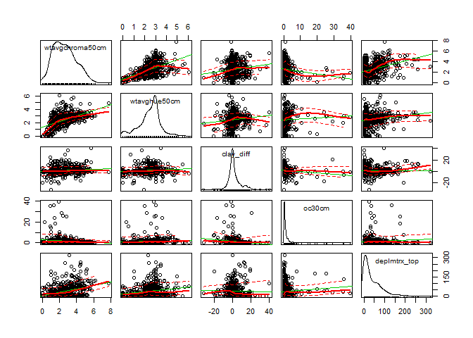<!-- -->
  
Figure 1 Scatterplot matrix

### PCA biplot groups and labels by drainage class

```r
library(devtools)
```

```
## Warning: package 'devtools' was built under R version 3.4.3
```

```r
library(ggbiplot)
```

```
## Loading required package: scales
```

```
## Warning: package 'scales' was built under R version 3.4.1
```

```
## Loading required package: grid
```

```r
g1 <- ggbiplot(datapca, obs.scale = 1, var.scale = 1#, 
              #groups = datacomplete.cat, ellipse = TRUE, 
              )#labels = datacomplete.cat, circle = FALSE)
g1 <- g1 + scale_color_discrete(name = '')
g1 <- g1 + theme(legend.direction = 'horizontal', 
               legend.position = 'top')
print(g1)
```

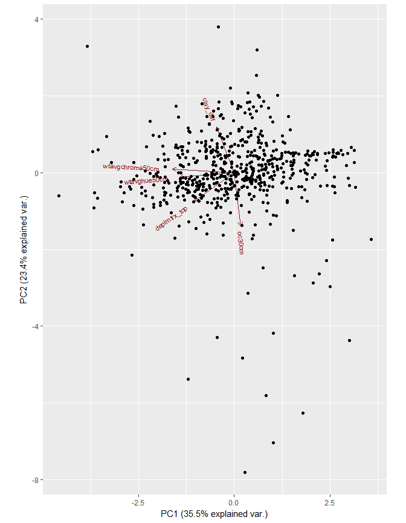<!-- -->
  
Figure 2 PCA biplot

```r
g2 <- ggbiplot(datapca, obs.scale = 1, var.scale = 1, 
              groups = datacomplete.cat, ellipse = TRUE, 
              labels = datacomplete.cat, circle = FALSE)
g2 <- g2 + scale_color_discrete(name = '')
g2 <- g2 + theme(legend.direction = 'horizontal', 
               legend.position = 'top')
print(g2)
```

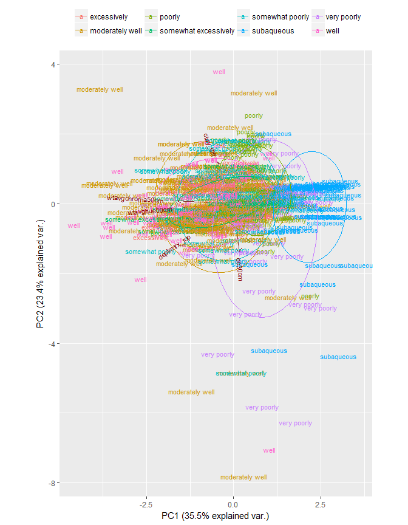<!-- -->
  
Figure 3 PCA biplot with drainage class groups and labels

Figure 3 illustrates that PC1 appears to be very related to "wetness".  Based on the normal distribution ellipses, we see a trend along the x-axis of wetter drainage class with positive PC1 values.

### Clustering

```r
# Perform hard clustering and evaluate silhouette widths to aid in determining appropriate number of clusters

library(cluster)
data.std <- data.frame(datacomplete.cont, scale(datacomplete.cont))
sil.widths <- vector(mode='numeric')

for(i in 2:10) {
  
  cl <- pam(data.std, k = i, stand = FALSE)
  
  sil.widths[i] <- cl$silinfo$avg.width
  
}
#par(mar=c(4,4,3,1))
par(mar=c(3,3,3,1))
plot(sil.widths, type='b', xlab='Number of Clusters', ylab='Average Silhouette Width', las=1, lwd=2, col='RoyalBlue', cex=1.25, main='Finding the "Right" Number of Clusters')

grid()
```

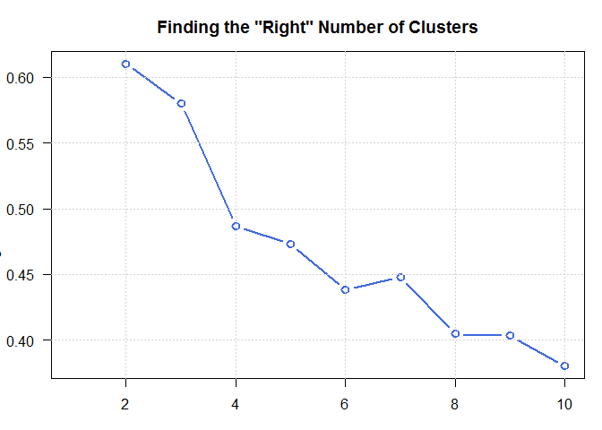<!-- -->
  
Figure 4 Average silhouette width by number of clusters using PAM.

```r
# other silhouette width plots
library(factoextra)
```

```
## Warning: package 'factoextra' was built under R version 3.4.3
```

```
## Welcome! Related Books: `Practical Guide To Cluster Analysis in R` at https://goo.gl/13EFCZ
```

```r
fviz_nbclust(data.std, pam, method = "wss") #+
```

<!-- -->

```r
#geom_vline(xintercept = 2, linetype = 2)
```
  
Figure 5 Silhouette width sum of squares by number of clusters using PAM.

```r
fviz_nbclust(data.std, pam, method = "silhouette")
```

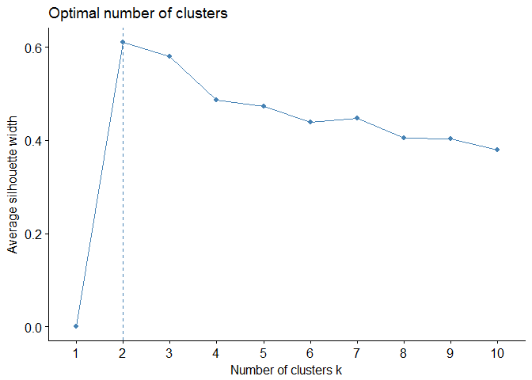<!-- -->
  
Figure 6 Average Silhouette width by number of clusters using PAM.

```r
fviz_nbclust(data.std, hcut, method = "silhouette",
             hc_method = "complete")
```

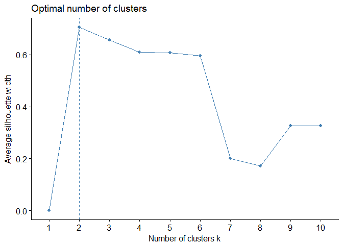<!-- -->
  
Figure 7 Silhouette width sum of squares by number of clusters using hcut.

The silhouette widths suggest that 2 clusters are the most meaningful.


```r
# More plotting k-medoids clusters

data.res.2 <- pam(scale(datacomplete.cont), 2)
data.res.2$medoids
```

```
##      wtavgchroma50cm wtavghue50cm  clay_diff     oc30cm deplmtrx_top
## 809        0.7013037    0.3375799 -0.2118743 -0.1497972    0.1454614
## 1208      -0.6785988   -0.4875772 -0.2118743 -0.2477603   -0.5309201
```

```r
clusplot(data.res.2, main = "Cluster plot, k = 2", 
         color = TRUE)
```

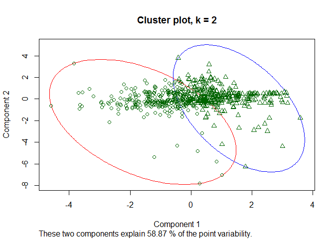<!-- -->

```r
fviz_cluster(data.res.2, data = datacomplete.cont)
```

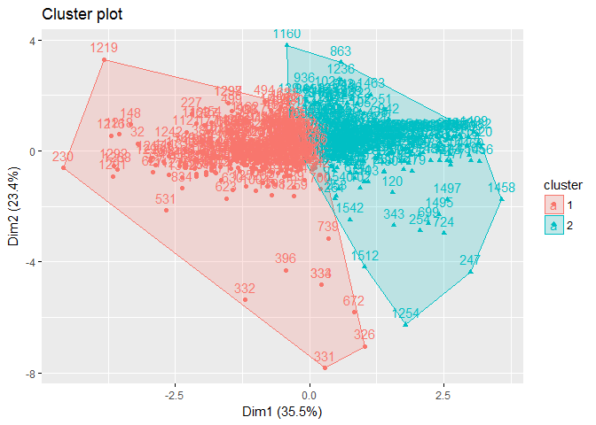<!-- -->
  
Figure 8 Cluster biplot with k=2 clusters.

```r
data.res.3 <- pam(scale(datacomplete.cont), 3)
data.res.3$medoids
```

```
##      wtavgchroma50cm wtavghue50cm   clay_diff      oc30cm deplmtrx_top
## 1525      0.08801375    0.5438692  0.05579547  0.00230345   -0.7422893
## 322       1.08461000    0.4407245 -0.13752161 -0.30963176    1.0332121
## 305      -0.67859875   -0.7970112 -0.12265106 -0.32767760   -0.4675093
```

```r
clusplot(data.res.3, main = "Cluster plot, k = 3", 
         color = TRUE)
```

<!-- -->

```r
fviz_cluster(data.res.3, data = datacomplete.cont)
```

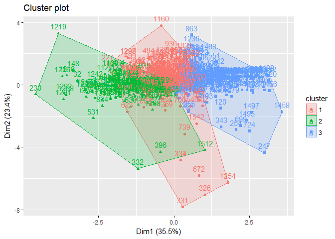<!-- -->
  
Figure 9 Cluster biplot with k=3 clusters.

```r
data.res.4 <- pam(scale(datacomplete.cont), 4)
data.res.4$medoids
```

```
##      wtavgchroma50cm wtavghue50cm  clay_diff      oc30cm deplmtrx_top
## 402        0.3946587   0.54386916  0.5167824 -0.08276979   -0.8268370
## 322        1.0846100   0.44072452 -0.1375216 -0.30963176    1.0332121
## 566       -0.3719538   0.02814596 -0.6282496 -0.12401742   -0.3406878
## 1459      -1.2152275  -1.51902366 -0.1821332 -0.29158592   -0.5731939
```

```r
clusplot(data.res.4, main = "Cluster plot, k = 4", 
         color = TRUE)
```

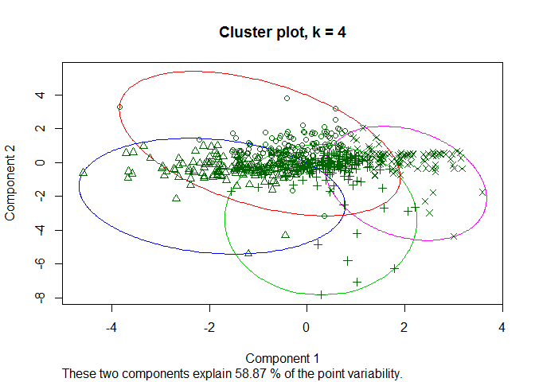<!-- -->

```r
fviz_cluster(data.res.4, data = datacomplete.cont)
```

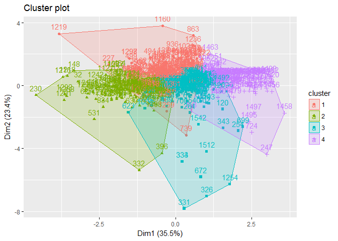<!-- -->
  
Figure 10 Cluster biplot with k=4 clusters.

```r
library(RColorBrewer)
```

```
## Warning: package 'RColorBrewer' was built under R version 3.4.1
```

```r
# nice colors for later
col.set <- brewer.pal(9, 'Set1')
```
### Evaluate cluster distribution by drainage class


```r
# Combine K-medoids and category data and box plot
combinek2 <- data.frame(datacomplete.cat, data.res.2$clustering)
par(cex.axis=.5)
boxplot(data.res.2.clustering ~ datacomplete.cat, data=combinek2, axes = FALSE)
box()
axis(side = 1, at = combinek2$datacomplete.cat, labels= combinek2$datacomplete.cat)
axis(side = 2, at = c(1,2, -1))
title(ylab = "cluster", xlab="drainage class")
```

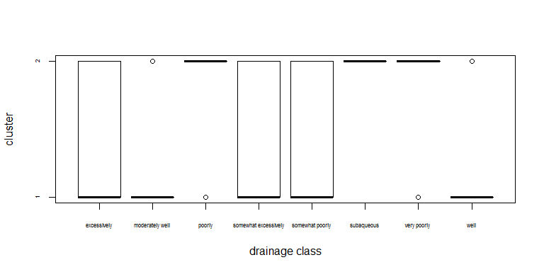<!-- -->
  
Figure 11 Box plot of cluster distribution by drainage class, k=2 clusters.

```r
library(plyr)

ggplot(combinek2, aes(x=data.res.2.clustering)) +
  geom_histogram(aes(y=..density..),      # Histogram with density instead of count on y-axis
                 binwidth=.05,
                 colour="black", fill="white") +
  geom_density(alpha=.2, fill="#FF6666") +   # Overlay with transparent density plot
  facet_wrap(~ datacomplete.cat) +
  scale_x_continuous(breaks=c(1,2) +
  theme(axis.text = element_text(size = 2)))
```

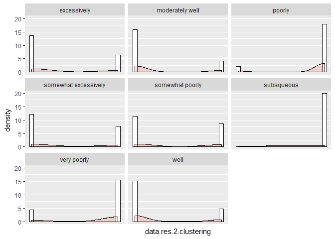<!-- -->
  
Figure 12 Histogram of cluster distribution by drainage class, k=2 clusters.

With 2 clusters, Poorly, Very Poorly (without histosols), and Subaqueous drainage class pedons have a strong membership in the same cluster (cluster 2).  The plot suggests that Poorly and Very Poorly pedons that were assigned to cluster 1  are outliers in the distribution.


```r
# Combine K-medoids and category data and box plot
par(cex.axis=.5)
combinek3 <- data.frame(datacomplete.cat, data.res.3$clustering)
boxplot(data.res.3.clustering ~ datacomplete.cat, data=combinek3, axes = FALSE)
box()
axis(side = 1, at = combinek3$datacomplete.cat, labels= combinek3$datacomplete.cat)
axis(side = 2, at = c(1,2,3))
title(ylab = "cluster", xlab="drainage class")
```

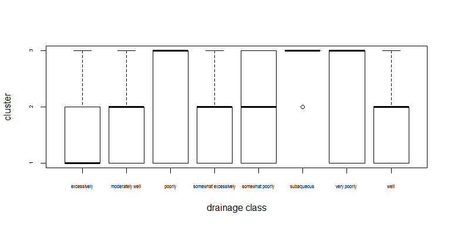<!-- -->
  
Figure 13 Box plot of cluster distribution by drainage class, k=3 clusters.

```r
ggplot(combinek3, aes(x=data.res.3.clustering)) +
  geom_histogram(aes(y=..density..),      # Histogram with density instead of count on y-axis
                 binwidth=.05,
                 colour="black", fill="white") +
  geom_density(alpha=.2, fill="#FF6666") +   # Overlay with transparent density plot
  facet_wrap(~ datacomplete.cat)  +
  scale_x_continuous(breaks=c(1,2,3))
```

<!-- -->
  
Figure 14 Histogram of cluster distribution by drainage class, k=3 clusters.

```r
# Combine K-medoids and category data and box plot
par(cex.axis=.5)
combinek4 <- data.frame(datacomplete.cat, data.res.4$clustering)
boxplot(data.res.4.clustering ~ datacomplete.cat, data=combinek4, axes = FALSE)
box()
axis(side = 1, at = combinek4$datacomplete.cat, labels= combinek4$datacomplete.cat)
axis(side = 2, at = c(1,2,3,4))
title(ylab = "cluster", xlab="drainage class")
```

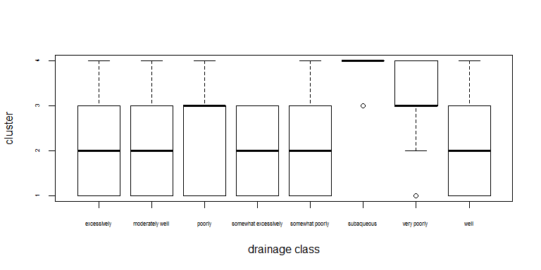<!-- -->
  
Figure 15 Box plot of cluster distribution by drainage class, k=4 clusters.

With 3 clusters, distribution of drainage class by cluster number agrees with the silhouette width analysis suggesting that 3+ clusters lack cohesion 

#Discussion

The PCA Biplot (Figure 3) illustrates general relationships of drainage class groupings (visible using Normal probability ellipses) to the first two principal components and individual variable eigenvectors.  PC1 appears related to soil moisture or "wetness".  The plot shows that there is quite a bit of comingling between excessively, somewhat excessively, well, moderately well, and somewhat poorly drainage classe suggesting that the chemical and morphologic properties we used to summarize the pedons does not do a good job at distinguishing wetness for these drainage classes.  Poorly, very poorly, and subaqueous normal distribution ellipses appear to have more distinct ranges along PC1.  PC2 appears to be very related to organic carbon content at 30cm.  There is an observable increase in the range of PC2 values for Very Poorly drained pedons from Poorly drained pedons, which agrees with general understanding about carbon content between these drainage classes (i.e., very poorly drained series are often in Humic or Histic subgroups or related taxons reflecting significant accumulations of organic carbon). Subaqueous soils have a much narrower range of PC2, which also agrees with tacit knowledge based on summaries of measured OC content for subaqueous pedon horizons.

Using different methods of evaluating the silhouette widths of clustering (Figures 4-7) yields that 2 cohesive clusters of data exist in this dataset.  Figures 8 is a plot of K-medoids clustering with 2 clusters.  This plot shows that one of the clusters occupies space that corresponds to Poorly, Very Poorly, and Subaqueous drainage ellipses in the PCA biplot.  This result suggests that given the selected soil properties used in this analysis, these three drainage classes are members of a single group of data.  Figures 11 and 12 summarize the distribution of cluster assignments by drainage class.  These agree with the observation from Figure 8 that Poorly, Very Poorly, and Subaqueous drainage classes cohere to a single cluster.  Applying 3+ clusters was explored but Figures 13 through 15 illustrate how greater number of clusters produce groups that lack cohesion.

Further analysis is suggested using a larger, more geographically varied dataset.  We limited our dataset to regions that have available sampled subaqueous pedons so that we have a somewhat balanced dataset with a complete range of drainage classes.  The lack of subaqueous pedon data in other regions is a limitation to expanding the geographic area as of this writing.  Also, it may be interesting to subset the dataset by only Somewhat Poorly and wetter drainage classes, as the less-wet drainage classes appear to be very comingled in respect to the analysis covariates and principle components.

**Update 02/24/2018: A review by Dylan Beaudette suggests exploring use of CIE LAB coordinates (coverting color from Munsell), KSSL+morphology, and slice(), slab(), and related functions for weighted averages over depth intervals.  These functions will be explored in future iterations of this analysis.**
