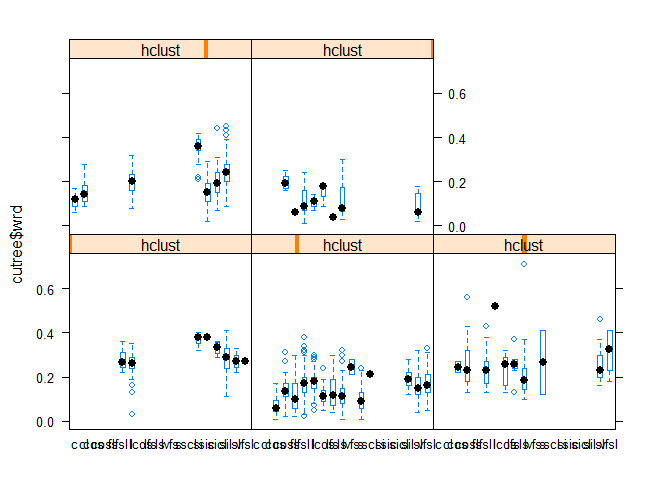

<<<<<<< HEAD
---
title: "Water Retention Difference model(s) using measured pedon horizon properties from MLRA Management Area 12-TOL (Southern New England and Eastern New York)"
author: "Jacob Isleib"
date: "December 4, 2018"
output: 
  html_document: 
    keep_md: yes
    toc: yes
    toc_float:
      collapsed: yes
      smooth_scroll: no

---

#Objective
Available Water Capacity (AWC) is a SSURGO component horizon property used widely for interpretation.  A better understanding of relationships between measured water retention difference (WRD; a proxy for AWC) and other measured soil properties in the KSSL characterization database would allow USDA staff to more accurately populate AWC values for aggregated soil survey data.

#Research question
Are there possible stratifications of the MMA 12-TOL WRD dataset that will improve fitting a model?

 
#Data Exploration
I started my data exploration by evaluating the entire MMA 12-TOL WRD dataset as one population.

Using the KSSL MSAccess Export (dated 2016-09-06), a sql query is used to summarize all KSSL data for sites located within non-MLRA soil survey areas intersecting MMA 12-TOL (I already had this tabular data, so used it in lieu of querying via a fetchKSSL command). 

Data is exported from MSAccess to a text document.  The following R script is used to import into Rstudio and prepare the data for analysis


```r
library(car)
```

```
## Warning: package 'car' was built under R version 3.4.4
```

```
## Loading required package: carData
```

```
## Warning: package 'carData' was built under R version 3.4.4
```

```r
library(corrplot)
```

```
## Warning: package 'corrplot' was built under R version 3.4.4
```

```
## corrplot 0.84 loaded
```

```r
library(cluster)
```

```
## Warning: package 'cluster' was built under R version 3.4.4
```

```r
library(ape)
```

```
## Warning: package 'ape' was built under R version 3.4.4
```

```r
library(RColorBrewer)
```

```
## Warning: package 'RColorBrewer' was built under R version 3.4.1
```

```r
library(plyr)
```

```
## Warning: package 'plyr' was built under R version 3.4.4
```

```r
# Import tab delimited text file to data frame

kssl12tol <- read.delim("C:/workspace/sandbox/jacob/wrd_analysis/kssl12tol20160906.txt")

# Subset KSSL data frame to properties we suspect might be correlated to WRD

kssl12tol5 <- subset(kssl12tol[,c(89, 12:15, 71)])

# remove rows from data frame containing NA values in any column

kssl12tol6 <- kssl12tol5[complete.cases(kssl12tol5),]
```

#Analysis

Create scatterplot matrix of subset data


```r
spm(kssl12tol6[,c(1, 3:6)])
```

<!-- -->

Evaluating the scatterplot matrix shows that the abundance of organic matter data is <20%.


```r
# Subset the dataframe for rows with est_OM <20%

kssl12tol7 <- subset(kssl12tol6, est_OM < 20)
```

The plots of <20% OM subset appears to be a more usable dataset:


```r
spm(kssl12tol7[,c(1, 3:6)])
```

<!-- -->

##Run prcomp, sca, and correlation matrix

##Create and print Principle Components Analysis


```r
ksslpca <- prcomp(kssl12tol7[, -2], scale = TRUE)

print(ksslpca)
```

```
## Standard deviations (1, .., p=5):
## [1] 1.608328e+00 1.092898e+00 9.055746e-01 6.314980e-01 7.513286e-05
## 
## Rotation (n x k) = (5 x 5):
##                      PC1         PC2         PC3        PC4          PC5
## wrd_l2       -0.36839860  0.53630720 -0.42313012  0.6305696 4.631146e-08
## sand_tot_psa  0.60907720  0.13262371 -0.07266242  0.1942854 7.539292e-01
## silt_tot_psa -0.56592556  0.07804091 -0.22950459 -0.5510105 5.633409e-01
## clay_tot_psa -0.41537253 -0.42590698  0.54460561  0.4850113 3.379907e-01
## est_OM       -0.02239101  0.71224884  0.68294469 -0.1605826 6.004008e-08
```

##Create correlation matrix


```r
round(cor(kssl12tol7[,-2]), 2)
```

```
##              wrd_l2 sand_tot_psa silt_tot_psa clay_tot_psa est_OM
## wrd_l2         1.00        -0.42         0.53         0.06   0.20
## sand_tot_psa  -0.42         1.00        -0.91        -0.72   0.02
## silt_tot_psa   0.53        -0.91         1.00         0.36   0.01
## clay_tot_psa   0.06        -0.72         0.36         1.00  -0.06
## est_OM         0.20         0.02         0.01        -0.06   1.00
```

None of the correlation coefficients are very strong (i.e., >=0.7); the highest was silt content at 0.53. 

Question: Is there potential to stratify this dataset by clusters and create stronger correlations? Use distance matrices to evaluate whether clusters exist. 

Perform hard clustering and evaluate silhouette widths to aid in determining appropriate number of clusters:


```r
kssl.std <- data.frame(kssl12tol7[, c(1, 4)], scale( kssl12tol7[, c(1,4)]))

 

sil.widths <- vector(mode='numeric')

for(i in 2:10) {

  cl <- pam(kssl.std[, c(1,4)], k = i, stand = FALSE)

  sil.widths[i] <- cl$silinfo$avg.width

}

 

par(mar=c(4,4,3,1))

plot(sil.widths, type='b', xlab='Number of Clusters', ylab='Average Silhouette Width', las=1, lwd=2, col='RoyalBlue', cex=1.25, main='Finding the "Right" Number of Clusters')

grid()
```

<!-- -->

This metric suggests 2 clusters are reasonable.


```r
# kmeans

library(cluster)
library(ape)
library(RColorBrewer)
5
```

```
## [1] 5
```

```r
# nice colors for later
col.set <- brewer.pal(9, 'Set1')

# remove texture class column
kssl12tol8 <- kssl12tol7[,c(1,3:6)]

# check structure
str(kssl12tol8)
```

```
## 'data.frame':	2136 obs. of  5 variables:
##  $ wrd_l2      : num  0.24 0.24 0.24 0.21 0.2 0.14 0.14 0.17 0.18 0.17 ...
##  $ sand_tot_psa: num  48.7 48.7 48.7 50 51.9 67.3 64.2 69.8 55.7 55.1 ...
##  $ silt_tot_psa: num  41.9 41.9 41.9 40.2 38.3 22.8 30.5 25.2 41.1 41.8 ...
##  $ clay_tot_psa: num  9.4 9.4 9.4 9.8 9.8 9.9 5.3 5 3.2 3.1 ...
##  $ est_OM      : num  4.52 4.52 4.52 3.45 1.48 ...
```

```r
# k means

par(mfrow=c(3,3), mar=c(1,1,1,1))
for(i in 1:9) {
  cl <- kmeans(kssl12tol8, centers=2)
  plot(kssl12tol8, col = col.set[cl$cluster])
  grid()
  points(cl$centers, col = col.set, pch = 8, cex = 2, lwd=2)
#  box()
}
```

<!-- --><!-- --><!-- --><!-- --><!-- --><!-- --><!-- --><!-- -->

```r
# k medoid
par(mfrow=c(2,3), mar=c(1,1,1,1))
for(i in 2:7) {
  cl <- clara(kssl12tol8, k = 2, stand = TRUE)
  plot(kssl12tol8, col = col.set[cl$clustering])
  grid()
  points(cl$medoids, col = col.set, pch = 0, cex = 2, lwd=2)
  #  box()
}
```

<!-- --><!-- -->

Both of these cluster plots appear quite tangled, but put a cluster break in the total silt somewhere around 40%.  I subset the data using 3 separate methods and evaluated correlation matrices:

**'Coarse' vs 'fine' textures**

Coarse = 'lfs', 'fs', 's', 'ls', 'lcos', 'cos';
Fine = "l", "sl", "fsl", "cosl", "cl", "sil", "vfsl", "si", "c", "sic", "sicl", "lvfs", "scl"


```r
coarse <- which(kssl12tol7$tex_psda %in% c('lfs', 'fs', 's', 'ls', 'lcos', 'cos'))
coarse2 <- kssl12tol7[coarse,]
round(cor(coarse2[,-2]), 2)
```

```
##              wrd_l2 sand_tot_psa silt_tot_psa clay_tot_psa est_OM
## wrd_l2         1.00        -0.29         0.29         0.00   0.20
## sand_tot_psa  -0.29         1.00        -0.97        -0.22  -0.29
## silt_tot_psa   0.29        -0.97         1.00        -0.01   0.28
## clay_tot_psa   0.00        -0.22        -0.01         1.00   0.04
## est_OM         0.20        -0.29         0.28         0.04   1.00
```

```r
loamy <- which(kssl12tol7$tex_psda %in% c("l", "sl", "fsl", "cosl", "cl", "sil", "vfsl", "si", "c", "sic", "sicl", "lvfs", "scl" ))
loamy2 <- kssl12tol7[loamy,]
round(cor(loamy2[,-2]), 2)
```

```
##              wrd_l2 sand_tot_psa silt_tot_psa clay_tot_psa est_OM
## wrd_l2         1.00        -0.32         0.48        -0.08   0.22
## sand_tot_psa  -0.32         1.00        -0.84        -0.68   0.06
## silt_tot_psa   0.48        -0.84         1.00         0.18  -0.02
## clay_tot_psa  -0.08        -0.68         0.18         1.00  -0.08
## est_OM         0.22         0.06        -0.02        -0.08   1.00
```

**40% total silt break**


```r
lowsilt <- which(kssl12tol7$silt_tot_psa <= 40 )
lowsilt2 <- kssl12tol7[lowsilt,]
round(cor(lowsilt2[,-2]), 2)
```

```
##              wrd_l2 sand_tot_psa silt_tot_psa clay_tot_psa est_OM
## wrd_l2         1.00        -0.22         0.30         0.03   0.21
## sand_tot_psa  -0.22         1.00        -0.87        -0.78   0.01
## silt_tot_psa   0.30        -0.87         1.00         0.37   0.05
## clay_tot_psa   0.03        -0.78         0.37         1.00  -0.09
## est_OM         0.21         0.01         0.05        -0.09   1.00
```

```r
highsilt <- which(kssl12tol7$silt_tot_psa > 40 )
highsilt2 <- kssl12tol7[highsilt,]
round(cor(highsilt2[,-2]), 2)
```

```
##              wrd_l2 sand_tot_psa silt_tot_psa clay_tot_psa est_OM
## wrd_l2         1.00        -0.20         0.50        -0.22   0.21
## sand_tot_psa  -0.20         1.00        -0.67        -0.70   0.09
## silt_tot_psa   0.50        -0.67         1.00        -0.06  -0.06
## clay_tot_psa  -0.22        -0.70        -0.06         1.00  -0.07
## est_OM         0.21         0.09        -0.06        -0.07   1.00
```

**Texture class breaks near the 40% silt break:**

nonsilty= 'lfs', 'fs', 's', 'ls', 'lcos', 'cos', 'l', 'sl', 'fsl', 'cosl', 'cl', 'c', 'scl'
Silty= 'sil', 'vfsl', 'si', 'sic', 'sicl', 'lvfs'


```r
nonsilty <- which(kssl12tol7$tex_psda %in% c('lfs', 'fs', 's', 'ls', 'lcos', 'cos', "l", "sl", "fsl", "cosl", "cl", "c", "scl"))
nonsilty2 <- kssl12tol7[nonsilty,]
round(cor(nonsilty2[,-2]), 2)
```

```
##              wrd_l2 sand_tot_psa silt_tot_psa clay_tot_psa est_OM
## wrd_l2         1.00        -0.32         0.39         0.08   0.24
## sand_tot_psa  -0.32         1.00        -0.92        -0.76   0.00
## silt_tot_psa   0.39        -0.92         1.00         0.43   0.06
## clay_tot_psa   0.08        -0.76         0.43         1.00  -0.09
## est_OM         0.24         0.00         0.06        -0.09   1.00
```

```r
silty <- which(kssl12tol7$tex_psda %in% c("sil", "vfsl", "si", "sic", "sicl", "lvfs" ))
silty2 <- kssl12tol7[silty,]
round(cor(silty2[,-2]), 2)
```

```
##              wrd_l2 sand_tot_psa silt_tot_psa clay_tot_psa est_OM
## wrd_l2         1.00        -0.21         0.56        -0.26   0.22
## sand_tot_psa  -0.21         1.00        -0.64        -0.67  -0.05
## silt_tot_psa   0.56        -0.64         1.00        -0.14   0.04
## clay_tot_psa  -0.26        -0.67        -0.14         1.00   0.02
## est_OM         0.22        -0.05         0.04         0.02   1.00
```

The silty subset is the only resulting data that produces correlation coefficients (slightly) higher than the non-subset data (0.56 vs 0.54), although the non-silty subset has a substantially lower correlation coefficient. 

##Non-metric Multidimensional Scaling (nMDS)

###Generate nMDS

Non-metric Multidimensional Scaling was also explored with the following results:


```r
library(vegan)
```

```
## Warning: package 'vegan' was built under R version 3.4.4
```

```
## Loading required package: permute
```

```
## Warning: package 'permute' was built under R version 3.4.4
```

```
## Loading required package: lattice
```

```
## This is vegan 2.5-3
```

```r
library(RColorBrewer)
library(cluster)

### nMDS with the vegan Package

nonneg <- which(kssl12tol7$wrd_l2 >= 0 )
ksslnonneg <- kssl12tol7[nonneg,]
kssl.scaled <- data.frame(name=ksslnonneg[, 2], round(scale( ksslnonneg[, -2]), 2))
write.table(kssl.scaled, file ="kssl.scaled.txt")
kssl.scaled2 <- read.table('kssl.scaled.txt', stringsAsFactors = FALSE)

# define colors based on natural groupings

cols <- brewer.pal(9, 'Set1')

# distance calc + ordination
s <- metaMDS(kssl.scaled2[, -1], distance = 'gower', autotransform = FALSE, wascores=FALSE)
```

```
## Run 0 stress 0.1035298 
## Run 1 stress 0.1151174 
## Run 2 stress 0.4208918 
## Run 3 stress 0.4208917 
## Run 4 stress 0.1451945 
## Run 5 stress 0.1341055 
## Run 6 stress 0.1455215 
## Run 7 stress 0.4208942 
## Run 8 stress 0.1285872 
## Run 9 stress 0.134194 
## Run 10 stress 0.139584 
## Run 11 stress 0.1476527 
## Run 12 stress 0.1409149 
## Run 13 stress 0.1225076 
## Run 14 stress 0.1376223 
## Run 15 stress 0.1399746 
## Run 16 stress 0.1496021 
## Run 17 stress 0.1363131 
## Run 18 stress 0.1364149 
## Run 19 stress 0.1321663 
## Run 20 stress 0.1283941 
## *** No convergence -- monoMDS stopping criteria:
##      6: no. of iterations >= maxit
##     14: scale factor of the gradient < sfgrmin
```

```r
## this is used to generate 4 classes from a divisive hierarchical clustering
# manually compute distance matrix

d <- dist(kssl.scaled2[, -1])
m <- as.matrix(d)
dimnames(m) <- list(kssl.scaled2$name, kssl.scaled2$name)
d <- as.dist(m)

# dendrogram from divisive clustering

dd <- diana(d)
h <- as.hclust(dd)

# define colors based on cutting a divisive hierarchical clustering into 4 groups

cols <- brewer.pal(9, 'Set1')[cutree(h, 4)]

# plot ordination

plot.new()
par(mar=c(3,1,3,1))
fig <- ordiplot(s, cex.axis=0.75 , axes=FALSE, xlab='', ylab='', main='nMDS by metaMDS()')
```

```
## species scores not available
```

```r
abline(h=0, v=0, lty=2, col='grey')
text(fig$sites, kssl.scaled2$name, cex=1, font=4, col=cols)

#ordicluster(fig, agnes(daisy(kssl.scaled[, -1]), method='ward'), prune=3, col = "orange")

box()
```

<!-- -->

```r
attr(kssl.scaled$silt_tot_psa, 'scaled:center')
```

```
## NULL
```

```r
#create dataframe of texture class and cut vectors of hclust tree
cutree <- data.frame(kssl.scaled2$name, cutree(h, k = 5), ksslnonneg[, c(1, 3:6)] )
colnames(cutree) <- c("names", "hclust", 'wrd', "SAND", "SILT", "CLAY", "OM")
```

###Evaluate nMDS clusters

Next, I want to evaluate the clusters from the nMDS.  Recombine the values from hclust with the original texture classes, and particle size data (non-scaled, original data).

Create frequency barcharts to summarize textural class trends for each cluster:


```r
library(plyr)
library(dplyr)
```

```
## Warning: package 'dplyr' was built under R version 3.4.4
```

```
## 
## Attaching package: 'dplyr'
```

```
## The following objects are masked from 'package:plyr':
## 
##     arrange, count, desc, failwith, id, mutate, rename, summarise,
##     summarize
```

```
## The following object is masked from 'package:car':
## 
##     recode
```

```
## The following objects are masked from 'package:stats':
## 
##     filter, lag
```

```
## The following objects are masked from 'package:base':
## 
##     intersect, setdiff, setequal, union
```

```r
#counts <- ddply(cutree, .(cutree$hclust, cutree$names), nrow)
counts <- ddply(cutree, .(cutree$hclust, cutree$names), summarise, V1=n())

library(lattice)
#create barcharts of each cluster, y=freq count, x=texture class
barchart(V1 ~ cutree$names | cutree$hclust, data=counts, layout= c(2,3))
```

<!-- -->

This plot does not prove very useful in regards to stratifying the WRD data.  There is overlap between some of the clusters, and some data (i.e., coarse-textured samples) are not well represented in the frequency counts.

###Plot nMDS clusters on USDA soil textural triangles

Try plotting numeric particle size analysis data:


```r
#subset

cutree1 <- which(cutree$hclust==1)
cutree1 <- cutree[cutree1,]
cutree2 <- which(cutree$hclust==2)
cutree2 <- cutree[cutree2,]
cutree3 <- which(cutree$hclust==3)
cutree3 <- cutree[cutree3,]
cutree4 <- which(cutree$hclust==4)
cutree4 <- cutree[cutree4,]
cutree5 <- which(cutree$hclust==5)
cutree5 <- cutree[cutree5,]

library(MASS)
```

```
## Warning: package 'MASS' was built under R version 3.4.4
```

```
## 
## Attaching package: 'MASS'
```

```
## The following object is masked from 'package:dplyr':
## 
##     select
```

```r
library(soiltexture)
```

```
## Warning: package 'soiltexture' was built under R version 3.4.4
```

```r
geo <- TT.geo.get()
#
kde.res1 <- TT.kde2d(
  geo = geo,
  tri.data = cutree1
)
kde.res2 <- TT.kde2d(
  geo = geo,
  tri.data = cutree2
)
kde.res3 <- TT.kde2d(
  geo = geo,
  tri.data = cutree3
)
kde.res4 <- TT.kde2d(
  geo = geo,
  tri.data = cutree4
)
kde.res5 <- TT.kde2d(
  geo = geo,
  tri.data = cutree5
)


plot.new()
#plot hclust cuts into soil texture triangles
old.par <- par(no.readonly=T)
#par(mar = c(5,4,4,2) + 0.1, "mfcol" = c(3,2),"mfrow"=c(3,2))

#
TT.contour(
  x = kde.res1,
  geo = geo,
  main = "hclust #1",
  lwd = 2,
  col = "red"
)
TT.plot( class.sys = "USDA.TT",
         tri.data = cutree1,
         geo = geo,
         add = TRUE,
         cex = .01,
         cex.axis=.5,
         cex.lab=.6,
         lwd=.5,
         lwd.axis=0.5,
         lwd.lab=0.3)#,
```

<!-- -->

```r
TT.contour(
  x = kde.res2,
  geo = geo,
  main = "hclust #2",
  lwd = 2,
  col = "red"
)
TT.plot( class.sys = "USDA.TT",
         tri.data = cutree2,
         geo = geo,
         add = TRUE,
         cex = .01,
         cex.axis=.5,
         cex.lab=.6,
         lwd=.5,
         lwd.axis=0.5,
         lwd.lab=0.3)
```

<!-- -->

```r
TT.contour(
  x = kde.res3,
  geo = geo,
  main = "hclust #3",
  lwd = 2,
  col = "red"
)
TT.plot( class.sys = "USDA.TT",
       tri.data = cutree3,
         geo = geo,
         add = TRUE,
         cex = .01,
         cex.axis=.5,
         cex.lab=.6,
         lwd=.5,
         lwd.axis=0.5,
         lwd.lab=0.3)
```

<!-- -->

```r
TT.contour(
  x = kde.res4,
  geo = geo,
  main = "hclust #4",
  lwd = 2,
  col = "red"
)
TT.plot( class.sys = "USDA.TT",
         tri.data = cutree4,
         geo = geo,
         add = TRUE,
         cex = .01,
         cex.axis=.5,
         cex.lab=.6,
         lwd=.5,
         lwd.axis=0.5,
         lwd.lab=0.3)
```

<!-- -->

```r
TT.contour(
  x = kde.res5,
  geo = geo,
  main = "hclust #5",
  lwd = 2,
  col = "red"
)
TT.plot( class.sys = "USDA.TT",
         tri.data = cutree5,
         geo = geo,
         add = TRUE,
         cex = .01,
         cex.axis=.5,
         cex.lab=.6,
         lwd=.5,
         lwd.axis=0.5,
         lwd.lab=0.3)
```

<!-- -->

Plotting PSA data still appears to yield quite a bit of overlap, especially between clusters 2,3 and 5. 

Boxplots of WRD and OM data will be created to evaluated whether this data is highly correlated to the nMDS clusters.


```r
#plot.new()
bwplot(cutree$OM ~ names | hclust, data=cutree)
```

<!-- -->

```r
#plot.new()
bwplot(cutree$wrd ~ names | hclust, data=cutree )
```

<!-- -->

OM% appears to be highly correlated to clusters 3 and 5 (regardless of USDA texture class).  WRD appears to have lower correlation to the clusters (across texture class), but appears to be correlated to clusters when comparing individual textures.

##Further subsetting with total sand content groups

Because we are interesting in modeling WRD according to some textural parameter(s) and OM, our evaluation will continue by focusing on the soil texture triangles stratified by hclust cuts (see page 13 above).  A visual evaluation of the clusters that appear separated according to their plots on the triangle are clusters 1, 2, and 4.  The rough breaks between this could be accomplished by setting sand content class breaks at 35% and 50%.


```r
low.sand <- which(cutree$SAND < 35 )
low.sand <- cutree[low.sand,]

mid.sand <- which(cutree$SAND < 50 & cutree$SAND >=35)
mid.sand <- cutree[mid.sand,]

high.sand <- which(cutree$SAND >= 50)
high.sand <- cutree[high.sand,]
```

###Correlation matrices

Correlation matrices are generated again for the subsets to determine independent variables to explore using in multiple regression models:


```r
round(cor(low.sand[,3:7]), 2)
```

```
##        wrd  SAND  SILT  CLAY    OM
## wrd   1.00 -0.08  0.66 -0.52  0.29
## SAND -0.08  1.00 -0.26 -0.53  0.05
## SILT  0.66 -0.26  1.00 -0.68  0.05
## CLAY -0.52 -0.53 -0.68  1.00 -0.07
## OM    0.29  0.05  0.05 -0.07  1.00
```

```r
round(cor(mid.sand[,3:7]), 2)
```

```
##        wrd  SAND  SILT  CLAY    OM
## wrd   1.00 -0.12  0.33 -0.27  0.26
## SAND -0.12  1.00 -0.54 -0.27  0.01
## SILT  0.33 -0.54  1.00 -0.67 -0.01
## CLAY -0.27 -0.27 -0.67  1.00  0.00
## OM    0.26  0.01 -0.01  0.00  1.00
```

```r
round(cor(high.sand[,3:7]), 2)
```

```
##        wrd  SAND  SILT  CLAY    OM
## wrd   1.00 -0.33  0.35  0.10  0.22
## SAND -0.33  1.00 -0.94 -0.58 -0.06
## SILT  0.35 -0.94  1.00  0.28  0.10
## CLAY  0.10 -0.58  0.28  1.00 -0.06
## OM    0.22 -0.06  0.10 -0.06  1.00
```

###Fit models


```r
#fit multiple linear regression models
fit1 <- lm(wrd ~ SILT + OM, data=low.sand)
fit2 <- lm(wrd ~ SILT + OM, data=mid.sand)
fit3 <- lm(wrd ~ SILT + OM, data=high.sand)
```

###Results


```r
summary(fit1)
```

```
## 
## Call:
## lm(formula = wrd ~ SILT + OM, data = low.sand)
## 
## Residuals:
##      Min       1Q   Median       3Q      Max 
## -0.17746 -0.03610 -0.00092  0.03717  0.24613 
## 
## Coefficients:
##               Estimate Std. Error t value Pr(>|t|)    
## (Intercept) -0.0499281  0.0139780  -3.572 0.000394 ***
## SILT         0.0045126  0.0002332  19.349  < 2e-16 ***
## OM           0.0080393  0.0010487   7.666 1.15e-13 ***
## ---
## Signif. codes:  0 '***' 0.001 '**' 0.01 '*' 0.05 '.' 0.1 ' ' 1
## 
## Residual standard error: 0.05982 on 439 degrees of freedom
## Multiple R-squared:  0.5051,	Adjusted R-squared:  0.5028 
## F-statistic:   224 on 2 and 439 DF,  p-value: < 2.2e-16
```

```r
summary(fit2)
```

```
## 
## Call:
## lm(formula = wrd ~ SILT + OM, data = mid.sand)
## 
## Residuals:
##       Min        1Q    Median        3Q       Max 
## -0.239919 -0.030306 -0.001864  0.032777  0.315508 
## 
## Coefficients:
##              Estimate Std. Error t value Pr(>|t|)    
## (Intercept) 0.0343025  0.0204322   1.679   0.0938 .  
## SILT        0.0035002  0.0004335   8.075 5.64e-15 ***
## OM          0.0049167  0.0007781   6.319 6.08e-10 ***
## ---
## Signif. codes:  0 '***' 0.001 '**' 0.01 '*' 0.05 '.' 0.1 ' ' 1
## 
## Residual standard error: 0.05254 on 474 degrees of freedom
## Multiple R-squared:  0.1805,	Adjusted R-squared:  0.1771 
## F-statistic: 52.22 on 2 and 474 DF,  p-value: < 2.2e-16
```

```r
summary(fit3)
```

```
## 
## Call:
## lm(formula = wrd ~ SILT + OM, data = high.sand)
## 
## Residuals:
##      Min       1Q   Median       3Q      Max 
## -0.20001 -0.04312 -0.00896  0.03516  0.58267 
## 
## Coefficients:
##              Estimate Std. Error t value Pr(>|t|)    
## (Intercept) 0.0848746  0.0058144  14.597  < 2e-16 ***
## SILT        0.0024862  0.0001978  12.568  < 2e-16 ***
## OM          0.0042961  0.0006040   7.113 1.94e-12 ***
## ---
## Signif. codes:  0 '***' 0.001 '**' 0.01 '*' 0.05 '.' 0.1 ' ' 1
## 
## Residual standard error: 0.06949 on 1212 degrees of freedom
## Multiple R-squared:  0.1589,	Adjusted R-squared:  0.1575 
## F-statistic: 114.5 on 2 and 1212 DF,  p-value: < 2.2e-16
```

The summary of the mid and high sand subsets suggest that the models do not explain the variance in WRD well. The low sand model performs much better than the other 2 subsets, but still has a mediocre r2 value.  The residual standard error values for all 3 models are 0.05-0.07, which is high in terms of WRD or AWC values.

I want to evaluate combining the mid and high sand subsets to see what the multiple regression summary looks like:


```r
midhigh.sand <- which(cutree$SAND >= 35 )
midhigh.sand <- cutree[midhigh.sand,]
fit4 <- lm(wrd ~ SILT + OM, data=midhigh.sand)
summary(fit4)
```

```
## 
## Call:
## lm(formula = wrd ~ SILT + OM, data = midhigh.sand)
## 
## Residuals:
##      Min       1Q   Median       3Q      Max 
## -0.23488 -0.04075 -0.00707  0.03351  0.58365 
## 
## Coefficients:
##              Estimate Std. Error t value Pr(>|t|)    
## (Intercept) 0.0837594  0.0045447  18.430   <2e-16 ***
## SILT        0.0024918  0.0001264  19.706   <2e-16 ***
## OM          0.0044589  0.0004869   9.158   <2e-16 ***
## ---
## Signif. codes:  0 '***' 0.001 '**' 0.01 '*' 0.05 '.' 0.1 ' ' 1
## 
## Residual standard error: 0.0652 on 1689 degrees of freedom
## Multiple R-squared:  0.2234,	Adjusted R-squared:  0.2224 
## F-statistic: 242.9 on 2 and 1689 DF,  p-value: < 2.2e-16
```

This "lumping" of the >=35% sand into one subset appears to be an acceptable alternative versus the 35-50 and >50 subsets.  The multiple r2 value is slightly better, though still suggests the model isn't sufficiently explaining the variance.  The residual std error is slightly worse compared to the 35-50% subset, but better than the >50% subset.

Variance inflation factors suggest acceptable levels of collinearity.


```r
sqrt(vif(fit1))
```

```
##    SILT      OM 
## 1.00109 1.00109
```

```r
sqrt(vif(fit4))
```

```
##     SILT       OM 
## 1.000642 1.000642
```

To answer our original research question, I fit a multiple regression model to the entire dataset with the following summary results:


```r
fit5 <- lm(wrd ~ SILT + OM, data = cutree)
summary(fit5)
```

```
## 
## Call:
## lm(formula = wrd ~ SILT + OM, data = cutree)
## 
## Residuals:
##      Min       1Q   Median       3Q      Max 
## -0.24177 -0.04175 -0.00524  0.03474  0.58897 
## 
## Coefficients:
##              Estimate Std. Error t value Pr(>|t|)    
## (Intercept) 7.648e-02  3.741e-03   20.45   <2e-16 ***
## SILT        2.599e-03  8.712e-05   29.83   <2e-16 ***
## OM          5.108e-03  4.479e-04   11.40   <2e-16 ***
## ---
## Signif. codes:  0 '***' 0.001 '**' 0.01 '*' 0.05 '.' 0.1 ' ' 1
## 
## Residual standard error: 0.06528 on 2131 degrees of freedom
## Multiple R-squared:  0.3246,	Adjusted R-squared:  0.324 
## F-statistic: 512.2 on 2 and 2131 DF,  p-value: < 2.2e-16
```

Residuals are very similar between the subset models and the model of the entire dataset.  r2 value is improved in the low sand subset versus the entire, but the >=35% sand subset has a lower r2.

The answer of the question regarding whether we can improve models by subsetting depend on the properties of a soil or aggregate data being modeled: if it's low-sand soil material, we appear to have improved model fit; if it's high-sand soil material, the subset model appears similar or slightly worse than the model from the entire dataset.

Here are the model formulas:

<35% sand::
WRD = 0.0045378(*total_silt_pct) + 0079013(*OM%)  - 0.0515483 

>=35% sand::
WRD = 0.0024801(*total_silt_pct) + 0.0046541(*OM%) + 0.0836176  

#Discussion

The 2 multiple regression models developed appear to insufficiently explain the variance in lab-measured WRD values in MMA 12-TOL.  Further data exploration is needed to determine whether other available measured value(s) besides PSA and OM% improve modelling.

##Previous analysis: individual texture class regression models

I had previously attempted to develop individual regression models by texture class, although using much more basic methods available in MSExcel.  A summary of the results is shown below in Table 1.


**Table1**
Analysis notes: all WRD values were filtered to the 95% confidence interval (median +/- 2*stdev); linear regressions were made and y intercepts used as baseline AWC values; if regression was negative and/or too little data, median WRD value of <0.5 OC% horizons is substituted for y intercept.

| texture | regression           | r2_value | baseline_awc | notes               | median of <0.5 OC | difference b/t y intercept and <0.5 OC median |
|---------|----------------------|----------|--------------|---------------------|-------------------|-----------------------------------------------|
| c       | y = 0.0044x + 0.1079 | 0.0934   | 0.11         |                     | 0.11              | 0                                             |
| cl      | y = 0.0252x + 0.1472 | 0.0155   | 0.15         |                     | 0.14              | 0.01                                          |
| cos     | n/a                  |          |              |                     | 0.06              | 0.06                                          |
| cosl    | y = 0.0055x + 0.1491 | 0.1919   | 0.15         |                     | 0.15              | 0                                             |
| fs      | y = 0.0561x + 0.1251 | 0.1085   | 0.12         |                     | 0.1               | 0.03                                          |
| fsl     | y = 0.0008x + 0.1729 | 0.0025   | 0.17         |                     | 0.15              | 0.02                                          |
| l       | y = 0.0054x + 0.1808 | 0.0908   | 0.18         |                     | 0.17              | 0.01                                          |
| lcos    | y = 0.0043x + 0.114  | 0.1539   | 0.11         |                     | 0.11              | 0                                             |
| lfs     | y = 0.0053x + 0.1292 | 0.0606   | 0.13         |                     | 0.09              | 0.05                                          |
| ls      | y = 0.0024x + 0.1167 | 0.021    | 0.12         |                     | 0.12              | 0                                             |
| lvfs    |                      |          |              | only 2 values       | only 1 value      | #VALUE!                                       |
| s       | y = 0.0073x + 0.0935 | 0.0178   | 0.09         |                     | 0.08              | 0.01                                          |
| scl     |                      |          |              | only 1 value        | only 1 value      | #VALUE!                                       |
| si      | n/a                  |          |              | negative regression | 0.36              | 0.36                                          |
| sic     | y = 0.0067x + 0.1407 | 0.0285   | 0.14         |                     | 0.14              | 0                                             |
| sicl    | y = 0.0107x + 0.1768 | 0.1432   | 0.18         |                     | 0.16              | 0.02                                          |
| sil     | y = 0.0037x + 0.2303 | 0.0245   | 0.23         |                     | 0.22              | 0.01                                          |
| sl      | y = 0.0024x + 0.1574 | 0.0177   | 0.16         |                     | 0.15              | 0.01                                          |
| vfsl    | y = 0.0091x + 0.1642 | 0.0494   | 0.16         |                     | 0.15              | 0.01                                          |

Note: the following texture classes are defined by the particle size class criteria in the 12ed of Keys to Soil Taxonomy, with the exception of sands and loamy sands, which splits the "sandy" class into 2 classes


**Table 2. Texture groups**

| texture      | regression           | r2_value | baseline_awc | notes         |
|--------------|----------------------|----------|--------------|---------------|
| sands        | y = 0.0049x + 0.0906 | 0.0124   | 0.09         |               |
| loamy sands  | y = 0.0031x + 0.1195 | 0.0302   | 0.12         |               |
| fine         | y = 0.0054x + 0.1499 | 0.0357   | 0.15         |               |
| fine-loamy   | y = 0.0252x + 0.1521 | 0.374    | 0.15         |               |
| coarse-silty | y = 0.0083x + 0.2768 | 0.0387   | 0.28         |               |
| coarse-loamy | y = 0.0037x + 0.1771 | 0.0389   | 0.18         |               |
| very fine    | y = 0.0083x + 0.0853 | 0.3043   | 0.09         | only 5 values |


The new models developed using R for data exploration (i.e., cluster analysis, ordination) and multiple regression outperform model results previously developed (as explained in the 'Analysis notes' in the table above) in MSExcel.  This suggests that using USDA texture classes are not viable clusters in terms of WRD.  Hard clustering, silhouette, and ordination suggest fewer clusters exist within the dataset (Figures 4, 7, and 8).  Plotting hclust cuts of ordination results suggest that they do not conform well to individual texture classes (Figure 10).  More comprehensive KSSL data exploration is needed to develop models with acceptable levels of residuals, collinearity, accuracy, and model coefficients.

I have applied the results of my previous modelling attempt in MSExcel to a NASIS report that models AWC values based off of CHorizon data (PSA, texture class, OM%, and adjusts to whole soil AWC using fragment content).  I plan to incorporate the results of this course project to that report, to facilitate comparison of models during CHorizon data population.  Even though the models do not appear to explain all the variance in WRD according to summary coefficients, these models likely represent better alternatives to previous national or regional "cheat sheets" used to estimate AWC based on soil texture, OM%, and fragment content.

#Remaining questions

I have been unable to find a method to summarize the results of a lm() model developed from the entire dataset, to a subset of the data to evaluate residuals and other summaries (for only the subset range).  Specifically, I want to see the standard residual error of the fit.all model only for values >=35% sand.  

=======
---
title: "Water Retention Difference model(s) using measured pedon horizon properties from MLRA Management Area 12-TOL (Southern New England and Eastern New York)"
author: "Jacob Isleib"
date: "December 4, 2018"
output: 
  html_document: 
    keep_md: yes
    toc: yes
    toc_float:
      collapsed: yes
      smooth_scroll: no

---

#Objective
Available Water Capacity (AWC) is a SSURGO component horizon property used widely for interpretation.  A better understanding of relationships between measured water retention difference (WRD; a proxy for AWC) and other measured soil properties in the KSSL characterization database would allow USDA staff to more accurately populate AWC values for aggregated soil survey data.

#Research question
Are there possible stratifications of the MMA 12-TOL WRD dataset that will improve fitting a model?

 
#Data Exploration
I started my data exploration by evaluating the entire MMA 12-TOL WRD dataset as one population.

Using the KSSL MSAccess Export (dated 2016-09-06), a sql query is used to summarize all KSSL data for sites located within non-MLRA soil survey areas intersecting MMA 12-TOL (I already had this tabular data, so used it in lieu of querying via a fetchKSSL command). 

Data is exported from MSAccess to a text document.  The following R script is used to import into Rstudio and prepare the data for analysis


```r
library(car)
```

```
## Warning: package 'car' was built under R version 3.4.4
```

```
## Loading required package: carData
```

```
## Warning: package 'carData' was built under R version 3.4.4
```

```r
library(corrplot)
```

```
## Warning: package 'corrplot' was built under R version 3.4.4
```

```
## corrplot 0.84 loaded
```

```r
library(cluster)
```

```
## Warning: package 'cluster' was built under R version 3.4.4
```

```r
library(ape)
```

```
## Warning: package 'ape' was built under R version 3.4.4
```

```r
library(RColorBrewer)
```

```
## Warning: package 'RColorBrewer' was built under R version 3.4.1
```

```r
library(plyr)
```

```
## Warning: package 'plyr' was built under R version 3.4.4
```

```r
# Import tab delimited text file to data frame

kssl12tol <- read.delim("C:/workspace/sandbox/jacob/wrd_analysis/kssl12tol20160906.txt")

# Subset KSSL data frame to properties we suspect might be correlated to WRD

kssl12tol5 <- subset(kssl12tol[,c(89, 12:15, 71)])

# remove rows from data frame containing NA values in any column

kssl12tol6 <- kssl12tol5[complete.cases(kssl12tol5),]
```

#Analysis

Create scatterplot matrix of subset data


```r
spm(kssl12tol6[,c(1, 3:6)])
```

<!-- -->

Evaluating the scatterplot matrix shows that the abundance of organic matter data is <20%.


```r
# Subset the dataframe for rows with est_OM <20%

kssl12tol7 <- subset(kssl12tol6, est_OM < 20)
```

The plots of <20% OM subset appears to be a more usable dataset:


```r
spm(kssl12tol7[,c(1, 3:6)])
```

<!-- -->

##Run prcomp, sca, and correlation matrix

##Create and print Principle Components Analysis


```r
ksslpca <- prcomp(kssl12tol7[, -2], scale = TRUE)

print(ksslpca)
```

```
## Standard deviations (1, .., p=5):
## [1] 1.608328e+00 1.092898e+00 9.055746e-01 6.314980e-01 7.513286e-05
## 
## Rotation (n x k) = (5 x 5):
##                      PC1         PC2         PC3        PC4          PC5
## wrd_l2       -0.36839860  0.53630720 -0.42313012  0.6305696 4.631146e-08
## sand_tot_psa  0.60907720  0.13262371 -0.07266242  0.1942854 7.539292e-01
## silt_tot_psa -0.56592556  0.07804091 -0.22950459 -0.5510105 5.633409e-01
## clay_tot_psa -0.41537253 -0.42590698  0.54460561  0.4850113 3.379907e-01
## est_OM       -0.02239101  0.71224884  0.68294469 -0.1605826 6.004008e-08
```

##Create correlation matrix


```r
round(cor(kssl12tol7[,-2]), 2)
```

```
##              wrd_l2 sand_tot_psa silt_tot_psa clay_tot_psa est_OM
## wrd_l2         1.00        -0.42         0.53         0.06   0.20
## sand_tot_psa  -0.42         1.00        -0.91        -0.72   0.02
## silt_tot_psa   0.53        -0.91         1.00         0.36   0.01
## clay_tot_psa   0.06        -0.72         0.36         1.00  -0.06
## est_OM         0.20         0.02         0.01        -0.06   1.00
```

None of the correlation coefficients are very strong (i.e., >=0.7); the highest was silt content at 0.53. 

Question: Is there potential to stratify this dataset by clusters and create stronger correlations? Use distance matrices to evaluate whether clusters exist. 

Perform hard clustering and evaluate silhouette widths to aid in determining appropriate number of clusters:


```r
kssl.std <- data.frame(kssl12tol7[, c(1, 4)], scale( kssl12tol7[, c(1,4)]))

 

sil.widths <- vector(mode='numeric')

for(i in 2:10) {

  cl <- pam(kssl.std[, c(1,4)], k = i, stand = FALSE)

  sil.widths[i] <- cl$silinfo$avg.width

}

 

par(mar=c(4,4,3,1))

plot(sil.widths, type='b', xlab='Number of Clusters', ylab='Average Silhouette Width', las=1, lwd=2, col='RoyalBlue', cex=1.25, main='Finding the "Right" Number of Clusters')

grid()
```

<!-- -->

This metric suggests 2 clusters are reasonable.


```r
# kmeans

library(cluster)
library(ape)
library(RColorBrewer)
5
```

```
## [1] 5
```

```r
# nice colors for later
col.set <- brewer.pal(9, 'Set1')

# remove texture class column
kssl12tol8 <- kssl12tol7[,c(1,3:6)]

# check structure
str(kssl12tol8)
```

```
## 'data.frame':	2136 obs. of  5 variables:
##  $ wrd_l2      : num  0.24 0.24 0.24 0.21 0.2 0.14 0.14 0.17 0.18 0.17 ...
##  $ sand_tot_psa: num  48.7 48.7 48.7 50 51.9 67.3 64.2 69.8 55.7 55.1 ...
##  $ silt_tot_psa: num  41.9 41.9 41.9 40.2 38.3 22.8 30.5 25.2 41.1 41.8 ...
##  $ clay_tot_psa: num  9.4 9.4 9.4 9.8 9.8 9.9 5.3 5 3.2 3.1 ...
##  $ est_OM      : num  4.52 4.52 4.52 3.45 1.48 ...
```

```r
# k means

par(mfrow=c(3,3), mar=c(1,1,1,1))
for(i in 1:9) {
  cl <- kmeans(kssl12tol8, centers=2)
  plot(kssl12tol8, col = col.set[cl$cluster])
  grid()
  points(cl$centers, col = col.set, pch = 8, cex = 2, lwd=2)
#  box()
}
```

<!-- --><!-- --><!-- --><!-- --><!-- --><!-- --><!-- --><!-- -->

```r
# k medoid
par(mfrow=c(2,3), mar=c(1,1,1,1))
for(i in 2:7) {
  cl <- clara(kssl12tol8, k = 2, stand = TRUE)
  plot(kssl12tol8, col = col.set[cl$clustering])
  grid()
  points(cl$medoids, col = col.set, pch = 0, cex = 2, lwd=2)
  #  box()
}
```

<!-- --><!-- -->

Both of these cluster plots appear quite tangled, but put a cluster break in the total silt somewhere around 40%.  I subset the data using 3 separate methods and evaluated correlation matrices:

**'Coarse' vs 'fine' textures**

Coarse = 'lfs', 'fs', 's', 'ls', 'lcos', 'cos';
Fine = "l", "sl", "fsl", "cosl", "cl", "sil", "vfsl", "si", "c", "sic", "sicl", "lvfs", "scl"


```r
coarse <- which(kssl12tol7$tex_psda %in% c('lfs', 'fs', 's', 'ls', 'lcos', 'cos'))
coarse2 <- kssl12tol7[coarse,]
round(cor(coarse2[,-2]), 2)
```

```
##              wrd_l2 sand_tot_psa silt_tot_psa clay_tot_psa est_OM
## wrd_l2         1.00        -0.29         0.29         0.00   0.20
## sand_tot_psa  -0.29         1.00        -0.97        -0.22  -0.29
## silt_tot_psa   0.29        -0.97         1.00        -0.01   0.28
## clay_tot_psa   0.00        -0.22        -0.01         1.00   0.04
## est_OM         0.20        -0.29         0.28         0.04   1.00
```

```r
loamy <- which(kssl12tol7$tex_psda %in% c("l", "sl", "fsl", "cosl", "cl", "sil", "vfsl", "si", "c", "sic", "sicl", "lvfs", "scl" ))
loamy2 <- kssl12tol7[loamy,]
round(cor(loamy2[,-2]), 2)
```

```
##              wrd_l2 sand_tot_psa silt_tot_psa clay_tot_psa est_OM
## wrd_l2         1.00        -0.32         0.48        -0.08   0.22
## sand_tot_psa  -0.32         1.00        -0.84        -0.68   0.06
## silt_tot_psa   0.48        -0.84         1.00         0.18  -0.02
## clay_tot_psa  -0.08        -0.68         0.18         1.00  -0.08
## est_OM         0.22         0.06        -0.02        -0.08   1.00
```

**40% total silt break**


```r
lowsilt <- which(kssl12tol7$silt_tot_psa <= 40 )
lowsilt2 <- kssl12tol7[lowsilt,]
round(cor(lowsilt2[,-2]), 2)
```

```
##              wrd_l2 sand_tot_psa silt_tot_psa clay_tot_psa est_OM
## wrd_l2         1.00        -0.22         0.30         0.03   0.21
## sand_tot_psa  -0.22         1.00        -0.87        -0.78   0.01
## silt_tot_psa   0.30        -0.87         1.00         0.37   0.05
## clay_tot_psa   0.03        -0.78         0.37         1.00  -0.09
## est_OM         0.21         0.01         0.05        -0.09   1.00
```

```r
highsilt <- which(kssl12tol7$silt_tot_psa > 40 )
highsilt2 <- kssl12tol7[highsilt,]
round(cor(highsilt2[,-2]), 2)
```

```
##              wrd_l2 sand_tot_psa silt_tot_psa clay_tot_psa est_OM
## wrd_l2         1.00        -0.20         0.50        -0.22   0.21
## sand_tot_psa  -0.20         1.00        -0.67        -0.70   0.09
## silt_tot_psa   0.50        -0.67         1.00        -0.06  -0.06
## clay_tot_psa  -0.22        -0.70        -0.06         1.00  -0.07
## est_OM         0.21         0.09        -0.06        -0.07   1.00
```

**Texture class breaks near the 40% silt break:**

nonsilty= 'lfs', 'fs', 's', 'ls', 'lcos', 'cos', 'l', 'sl', 'fsl', 'cosl', 'cl', 'c', 'scl'
Silty= 'sil', 'vfsl', 'si', 'sic', 'sicl', 'lvfs'


```r
nonsilty <- which(kssl12tol7$tex_psda %in% c('lfs', 'fs', 's', 'ls', 'lcos', 'cos', "l", "sl", "fsl", "cosl", "cl", "c", "scl"))
nonsilty2 <- kssl12tol7[nonsilty,]
round(cor(nonsilty2[,-2]), 2)
```

```
##              wrd_l2 sand_tot_psa silt_tot_psa clay_tot_psa est_OM
## wrd_l2         1.00        -0.32         0.39         0.08   0.24
## sand_tot_psa  -0.32         1.00        -0.92        -0.76   0.00
## silt_tot_psa   0.39        -0.92         1.00         0.43   0.06
## clay_tot_psa   0.08        -0.76         0.43         1.00  -0.09
## est_OM         0.24         0.00         0.06        -0.09   1.00
```

```r
silty <- which(kssl12tol7$tex_psda %in% c("sil", "vfsl", "si", "sic", "sicl", "lvfs" ))
silty2 <- kssl12tol7[silty,]
round(cor(silty2[,-2]), 2)
```

```
##              wrd_l2 sand_tot_psa silt_tot_psa clay_tot_psa est_OM
## wrd_l2         1.00        -0.21         0.56        -0.26   0.22
## sand_tot_psa  -0.21         1.00        -0.64        -0.67  -0.05
## silt_tot_psa   0.56        -0.64         1.00        -0.14   0.04
## clay_tot_psa  -0.26        -0.67        -0.14         1.00   0.02
## est_OM         0.22        -0.05         0.04         0.02   1.00
```

The silty subset is the only resulting data that produces correlation coefficients (slightly) higher than the non-subset data (0.56 vs 0.54), although the non-silty subset has a substantially lower correlation coefficient. 

##Non-metric Multidimensional Scaling (nMDS)

###Generate nMDS

Non-metric Multidimensional Scaling was also explored with the following results:


```r
library(vegan)
```

```
## Warning: package 'vegan' was built under R version 3.4.4
```

```
## Loading required package: permute
```

```
## Warning: package 'permute' was built under R version 3.4.4
```

```
## Loading required package: lattice
```

```
## This is vegan 2.5-3
```

```r
library(RColorBrewer)
library(cluster)

### nMDS with the vegan Package

nonneg <- which(kssl12tol7$wrd_l2 >= 0 )
ksslnonneg <- kssl12tol7[nonneg,]
kssl.scaled <- data.frame(name=ksslnonneg[, 2], round(scale( ksslnonneg[, -2]), 2))
write.table(kssl.scaled, file ="kssl.scaled.txt")
kssl.scaled2 <- read.table('kssl.scaled.txt', stringsAsFactors = FALSE)

# define colors based on natural groupings

cols <- brewer.pal(9, 'Set1')

# distance calc + ordination
s <- metaMDS(kssl.scaled2[, -1], distance = 'gower', autotransform = FALSE, wascores=FALSE)
```

```
## Run 0 stress 0.1035298 
## Run 1 stress 0.1151174 
## Run 2 stress 0.4208918 
## Run 3 stress 0.4208917 
## Run 4 stress 0.1451945 
## Run 5 stress 0.1341055 
## Run 6 stress 0.1455215 
## Run 7 stress 0.4208942 
## Run 8 stress 0.1285872 
## Run 9 stress 0.134194 
## Run 10 stress 0.139584 
## Run 11 stress 0.1476527 
## Run 12 stress 0.1409149 
## Run 13 stress 0.1225076 
## Run 14 stress 0.1376223 
## Run 15 stress 0.1399746 
## Run 16 stress 0.1496021 
## Run 17 stress 0.1363131 
## Run 18 stress 0.1364149 
## Run 19 stress 0.1321663 
## Run 20 stress 0.1283941 
## *** No convergence -- monoMDS stopping criteria:
##      6: no. of iterations >= maxit
##     14: scale factor of the gradient < sfgrmin
```

```r
## this is used to generate 4 classes from a divisive hierarchical clustering
# manually compute distance matrix

d <- dist(kssl.scaled2[, -1])
m <- as.matrix(d)
dimnames(m) <- list(kssl.scaled2$name, kssl.scaled2$name)
d <- as.dist(m)

# dendrogram from divisive clustering

dd <- diana(d)
h <- as.hclust(dd)

# define colors based on cutting a divisive hierarchical clustering into 4 groups

cols <- brewer.pal(9, 'Set1')[cutree(h, 4)]

# plot ordination

plot.new()
par(mar=c(3,1,3,1))
fig <- ordiplot(s, cex.axis=0.75 , axes=FALSE, xlab='', ylab='', main='nMDS by metaMDS()')
```

```
## species scores not available
```

```r
abline(h=0, v=0, lty=2, col='grey')
text(fig$sites, kssl.scaled2$name, cex=1, font=4, col=cols)

#ordicluster(fig, agnes(daisy(kssl.scaled[, -1]), method='ward'), prune=3, col = "orange")

box()
```

<!-- -->

```r
attr(kssl.scaled$silt_tot_psa, 'scaled:center')
```

```
## NULL
```

```r
#create dataframe of texture class and cut vectors of hclust tree
cutree <- data.frame(kssl.scaled2$name, cutree(h, k = 5), ksslnonneg[, c(1, 3:6)] )
colnames(cutree) <- c("names", "hclust", 'wrd', "SAND", "SILT", "CLAY", "OM")
```

###Evaluate nMDS clusters

Next, I want to evaluate the clusters from the nMDS.  Recombine the values from hclust with the original texture classes, and particle size data (non-scaled, original data).

Create frequency barcharts to summarize textural class trends for each cluster:


```r
library(plyr)
library(dplyr)
```

```
## Warning: package 'dplyr' was built under R version 3.4.4
```

```
## 
## Attaching package: 'dplyr'
```

```
## The following objects are masked from 'package:plyr':
## 
##     arrange, count, desc, failwith, id, mutate, rename, summarise,
##     summarize
```

```
## The following object is masked from 'package:car':
## 
##     recode
```

```
## The following objects are masked from 'package:stats':
## 
##     filter, lag
```

```
## The following objects are masked from 'package:base':
## 
##     intersect, setdiff, setequal, union
```

```r
#counts <- ddply(cutree, .(cutree$hclust, cutree$names), nrow)
counts <- ddply(cutree, .(cutree$hclust, cutree$names), summarise, V1=n())

library(lattice)
#create barcharts of each cluster, y=freq count, x=texture class
barchart(V1 ~ cutree$names | cutree$hclust, data=counts, layout= c(2,3))
```

<!-- -->

This plot does not prove very useful in regards to stratifying the WRD data.  There is overlap between some of the clusters, and some data (i.e., coarse-textured samples) are not well represented in the frequency counts.

###Plot nMDS clusters on USDA soil textural triangles

Try plotting numeric particle size analysis data:


```r
#subset

cutree1 <- which(cutree$hclust==1)
cutree1 <- cutree[cutree1,]
cutree2 <- which(cutree$hclust==2)
cutree2 <- cutree[cutree2,]
cutree3 <- which(cutree$hclust==3)
cutree3 <- cutree[cutree3,]
cutree4 <- which(cutree$hclust==4)
cutree4 <- cutree[cutree4,]
cutree5 <- which(cutree$hclust==5)
cutree5 <- cutree[cutree5,]

library(MASS)
```

```
## Warning: package 'MASS' was built under R version 3.4.4
```

```
## 
## Attaching package: 'MASS'
```

```
## The following object is masked from 'package:dplyr':
## 
##     select
```

```r
library(soiltexture)
```

```
## Warning: package 'soiltexture' was built under R version 3.4.4
```

```r
geo <- TT.geo.get()
#
kde.res1 <- TT.kde2d(
  geo = geo,
  tri.data = cutree1
)
kde.res2 <- TT.kde2d(
  geo = geo,
  tri.data = cutree2
)
kde.res3 <- TT.kde2d(
  geo = geo,
  tri.data = cutree3
)
kde.res4 <- TT.kde2d(
  geo = geo,
  tri.data = cutree4
)
kde.res5 <- TT.kde2d(
  geo = geo,
  tri.data = cutree5
)


plot.new()
#plot hclust cuts into soil texture triangles
old.par <- par(no.readonly=T)
#par(mar = c(5,4,4,2) + 0.1, "mfcol" = c(3,2),"mfrow"=c(3,2))

#
TT.contour(
  x = kde.res1,
  geo = geo,
  main = "hclust #1",
  lwd = 2,
  col = "red"
)
TT.plot( class.sys = "USDA.TT",
         tri.data = cutree1,
         geo = geo,
         add = TRUE,
         cex = .01,
         cex.axis=.5,
         cex.lab=.6,
         lwd=.5,
         lwd.axis=0.5,
         lwd.lab=0.3)#,
```

<!-- -->

```r
TT.contour(
  x = kde.res2,
  geo = geo,
  main = "hclust #2",
  lwd = 2,
  col = "red"
)
TT.plot( class.sys = "USDA.TT",
         tri.data = cutree2,
         geo = geo,
         add = TRUE,
         cex = .01,
         cex.axis=.5,
         cex.lab=.6,
         lwd=.5,
         lwd.axis=0.5,
         lwd.lab=0.3)
```

<!-- -->

```r
TT.contour(
  x = kde.res3,
  geo = geo,
  main = "hclust #3",
  lwd = 2,
  col = "red"
)
TT.plot( class.sys = "USDA.TT",
       tri.data = cutree3,
         geo = geo,
         add = TRUE,
         cex = .01,
         cex.axis=.5,
         cex.lab=.6,
         lwd=.5,
         lwd.axis=0.5,
         lwd.lab=0.3)
```

<!-- -->

```r
TT.contour(
  x = kde.res4,
  geo = geo,
  main = "hclust #4",
  lwd = 2,
  col = "red"
)
TT.plot( class.sys = "USDA.TT",
         tri.data = cutree4,
         geo = geo,
         add = TRUE,
         cex = .01,
         cex.axis=.5,
         cex.lab=.6,
         lwd=.5,
         lwd.axis=0.5,
         lwd.lab=0.3)
```

<!-- -->

```r
TT.contour(
  x = kde.res5,
  geo = geo,
  main = "hclust #5",
  lwd = 2,
  col = "red"
)
TT.plot( class.sys = "USDA.TT",
         tri.data = cutree5,
         geo = geo,
         add = TRUE,
         cex = .01,
         cex.axis=.5,
         cex.lab=.6,
         lwd=.5,
         lwd.axis=0.5,
         lwd.lab=0.3)
```

<!-- -->

Plotting PSA data still appears to yield quite a bit of overlap, especially between clusters 2,3 and 5. 

Boxplots of WRD and OM data will be created to evaluated whether this data is highly correlated to the nMDS clusters.


```r
#plot.new()
bwplot(cutree$OM ~ names | hclust, data=cutree)
```

<!-- -->

```r
#plot.new()
bwplot(cutree$wrd ~ names | hclust, data=cutree )
```

<!-- -->

OM% appears to be highly correlated to clusters 3 and 5 (regardless of USDA texture class).  WRD appears to have lower correlation to the clusters (across texture class), but appears to be correlated to clusters when comparing individual textures.

##Further subsetting with total sand content groups

Because we are interesting in modeling WRD according to some textural parameter(s) and OM, our evaluation will continue by focusing on the soil texture triangles stratified by hclust cuts (see page 13 above).  A visual evaluation of the clusters that appear separated according to their plots on the triangle are clusters 1, 2, and 4.  The rough breaks between this could be accomplished by setting sand content class breaks at 35% and 50%.


```r
low.sand <- which(cutree$SAND < 35 )
low.sand <- cutree[low.sand,]

mid.sand <- which(cutree$SAND < 50 & cutree$SAND >=35)
mid.sand <- cutree[mid.sand,]

high.sand <- which(cutree$SAND >= 50)
high.sand <- cutree[high.sand,]
```

###Correlation matrices

Correlation matrices are generated again for the subsets to determine independent variables to explore using in multiple regression models:


```r
round(cor(low.sand[,3:7]), 2)
```

```
##        wrd  SAND  SILT  CLAY    OM
## wrd   1.00 -0.08  0.66 -0.52  0.29
## SAND -0.08  1.00 -0.26 -0.53  0.05
## SILT  0.66 -0.26  1.00 -0.68  0.05
## CLAY -0.52 -0.53 -0.68  1.00 -0.07
## OM    0.29  0.05  0.05 -0.07  1.00
```

```r
round(cor(mid.sand[,3:7]), 2)
```

```
##        wrd  SAND  SILT  CLAY    OM
## wrd   1.00 -0.12  0.33 -0.27  0.26
## SAND -0.12  1.00 -0.54 -0.27  0.01
## SILT  0.33 -0.54  1.00 -0.67 -0.01
## CLAY -0.27 -0.27 -0.67  1.00  0.00
## OM    0.26  0.01 -0.01  0.00  1.00
```

```r
round(cor(high.sand[,3:7]), 2)
```

```
##        wrd  SAND  SILT  CLAY    OM
## wrd   1.00 -0.33  0.35  0.10  0.22
## SAND -0.33  1.00 -0.94 -0.58 -0.06
## SILT  0.35 -0.94  1.00  0.28  0.10
## CLAY  0.10 -0.58  0.28  1.00 -0.06
## OM    0.22 -0.06  0.10 -0.06  1.00
```

###Fit models


```r
#fit multiple linear regression models
fit1 <- lm(wrd ~ SILT + OM, data=low.sand)
fit2 <- lm(wrd ~ SILT + OM, data=mid.sand)
fit3 <- lm(wrd ~ SILT + OM, data=high.sand)
```

###Results


```r
summary(fit1)
```

```
## 
## Call:
## lm(formula = wrd ~ SILT + OM, data = low.sand)
## 
## Residuals:
##      Min       1Q   Median       3Q      Max 
## -0.17746 -0.03610 -0.00092  0.03717  0.24613 
## 
## Coefficients:
##               Estimate Std. Error t value Pr(>|t|)    
## (Intercept) -0.0499281  0.0139780  -3.572 0.000394 ***
## SILT         0.0045126  0.0002332  19.349  < 2e-16 ***
## OM           0.0080393  0.0010487   7.666 1.15e-13 ***
## ---
## Signif. codes:  0 '***' 0.001 '**' 0.01 '*' 0.05 '.' 0.1 ' ' 1
## 
## Residual standard error: 0.05982 on 439 degrees of freedom
## Multiple R-squared:  0.5051,	Adjusted R-squared:  0.5028 
## F-statistic:   224 on 2 and 439 DF,  p-value: < 2.2e-16
```

```r
summary(fit2)
```

```
## 
## Call:
## lm(formula = wrd ~ SILT + OM, data = mid.sand)
## 
## Residuals:
##       Min        1Q    Median        3Q       Max 
## -0.239919 -0.030306 -0.001864  0.032777  0.315508 
## 
## Coefficients:
##              Estimate Std. Error t value Pr(>|t|)    
## (Intercept) 0.0343025  0.0204322   1.679   0.0938 .  
## SILT        0.0035002  0.0004335   8.075 5.64e-15 ***
## OM          0.0049167  0.0007781   6.319 6.08e-10 ***
## ---
## Signif. codes:  0 '***' 0.001 '**' 0.01 '*' 0.05 '.' 0.1 ' ' 1
## 
## Residual standard error: 0.05254 on 474 degrees of freedom
## Multiple R-squared:  0.1805,	Adjusted R-squared:  0.1771 
## F-statistic: 52.22 on 2 and 474 DF,  p-value: < 2.2e-16
```

```r
summary(fit3)
```

```
## 
## Call:
## lm(formula = wrd ~ SILT + OM, data = high.sand)
## 
## Residuals:
##      Min       1Q   Median       3Q      Max 
## -0.20001 -0.04312 -0.00896  0.03516  0.58267 
## 
## Coefficients:
##              Estimate Std. Error t value Pr(>|t|)    
## (Intercept) 0.0848746  0.0058144  14.597  < 2e-16 ***
## SILT        0.0024862  0.0001978  12.568  < 2e-16 ***
## OM          0.0042961  0.0006040   7.113 1.94e-12 ***
## ---
## Signif. codes:  0 '***' 0.001 '**' 0.01 '*' 0.05 '.' 0.1 ' ' 1
## 
## Residual standard error: 0.06949 on 1212 degrees of freedom
## Multiple R-squared:  0.1589,	Adjusted R-squared:  0.1575 
## F-statistic: 114.5 on 2 and 1212 DF,  p-value: < 2.2e-16
```

The summary of the mid and high sand subsets suggest that the models do not explain the variance in WRD well. The low sand model performs much better than the other 2 subsets, but still has a mediocre r2 value.  The residual standard error values for all 3 models are 0.05-0.07, which is high in terms of WRD or AWC values.

I want to evaluate combining the mid and high sand subsets to see what the multiple regression summary looks like:


```r
midhigh.sand <- which(cutree$SAND >= 35 )
midhigh.sand <- cutree[midhigh.sand,]
fit4 <- lm(wrd ~ SILT + OM, data=midhigh.sand)
summary(fit4)
```

```
## 
## Call:
## lm(formula = wrd ~ SILT + OM, data = midhigh.sand)
## 
## Residuals:
##      Min       1Q   Median       3Q      Max 
## -0.23488 -0.04075 -0.00707  0.03351  0.58365 
## 
## Coefficients:
##              Estimate Std. Error t value Pr(>|t|)    
## (Intercept) 0.0837594  0.0045447  18.430   <2e-16 ***
## SILT        0.0024918  0.0001264  19.706   <2e-16 ***
## OM          0.0044589  0.0004869   9.158   <2e-16 ***
## ---
## Signif. codes:  0 '***' 0.001 '**' 0.01 '*' 0.05 '.' 0.1 ' ' 1
## 
## Residual standard error: 0.0652 on 1689 degrees of freedom
## Multiple R-squared:  0.2234,	Adjusted R-squared:  0.2224 
## F-statistic: 242.9 on 2 and 1689 DF,  p-value: < 2.2e-16
```

This "lumping" of the >=35% sand into one subset appears to be an acceptable alternative versus the 35-50 and >50 subsets.  The multiple r2 value is slightly better, though still suggests the model isn't sufficiently explaining the variance.  The residual std error is slightly worse compared to the 35-50% subset, but better than the >50% subset.

Variance inflation factors suggest acceptable levels of collinearity.


```r
sqrt(vif(fit1))
```

```
##    SILT      OM 
## 1.00109 1.00109
```

```r
sqrt(vif(fit4))
```

```
##     SILT       OM 
## 1.000642 1.000642
```

To answer our original research question, I fit a multiple regression model to the entire dataset with the following summary results:


```r
fit5 <- lm(wrd ~ SILT + OM, data = cutree)
summary(fit5)
```

```
## 
## Call:
## lm(formula = wrd ~ SILT + OM, data = cutree)
## 
## Residuals:
##      Min       1Q   Median       3Q      Max 
## -0.24177 -0.04175 -0.00524  0.03474  0.58897 
## 
## Coefficients:
##              Estimate Std. Error t value Pr(>|t|)    
## (Intercept) 7.648e-02  3.741e-03   20.45   <2e-16 ***
## SILT        2.599e-03  8.712e-05   29.83   <2e-16 ***
## OM          5.108e-03  4.479e-04   11.40   <2e-16 ***
## ---
## Signif. codes:  0 '***' 0.001 '**' 0.01 '*' 0.05 '.' 0.1 ' ' 1
## 
## Residual standard error: 0.06528 on 2131 degrees of freedom
## Multiple R-squared:  0.3246,	Adjusted R-squared:  0.324 
## F-statistic: 512.2 on 2 and 2131 DF,  p-value: < 2.2e-16
```

Residuals are very similar between the subset models and the model of the entire dataset.  r2 value is improved in the low sand subset versus the entire, but the >=35% sand subset has a lower r2.

The answer of the question regarding whether we can improve models by subsetting depend on the properties of a soil or aggregate data being modeled: if it's low-sand soil material, we appear to have improved model fit; if it's high-sand soil material, the subset model appears similar or slightly worse than the model from the entire dataset.

Here are the model formulas:

<35% sand::
WRD = 0.0045378(*total_silt_pct) + 0079013(*OM%)  - 0.0515483 

>=35% sand::
WRD = 0.0024801(*total_silt_pct) + 0.0046541(*OM%) + 0.0836176  

#Discussion

The 2 multiple regression models developed appear to insufficiently explain the variance in lab-measured WRD values in MMA 12-TOL.  Further data exploration is needed to determine whether other available measured value(s) besides PSA and OM% improve modelling.

##Previous analysis: individual texture class regression models

I had previously attempted to develop individual regression models by texture class, although using much more basic methods available in MSExcel.  A summary of the results is shown below in Table 1.


**Table1**
Analysis notes: all WRD values were filtered to the 95% confidence interval (median +/- 2*stdev); linear regressions were made and y intercepts used as baseline AWC values; if regression was negative and/or too little data, median WRD value of <0.5 OC% horizons is substituted for y intercept.

| texture | regression           | r2_value | baseline_awc | notes               | median of <0.5 OC | difference b/t y intercept and <0.5 OC median |
|---------|----------------------|----------|--------------|---------------------|-------------------|-----------------------------------------------|
| c       | y = 0.0044x + 0.1079 | 0.0934   | 0.11         |                     | 0.11              | 0                                             |
| cl      | y = 0.0252x + 0.1472 | 0.0155   | 0.15         |                     | 0.14              | 0.01                                          |
| cos     | n/a                  |          |              |                     | 0.06              | 0.06                                          |
| cosl    | y = 0.0055x + 0.1491 | 0.1919   | 0.15         |                     | 0.15              | 0                                             |
| fs      | y = 0.0561x + 0.1251 | 0.1085   | 0.12         |                     | 0.1               | 0.03                                          |
| fsl     | y = 0.0008x + 0.1729 | 0.0025   | 0.17         |                     | 0.15              | 0.02                                          |
| l       | y = 0.0054x + 0.1808 | 0.0908   | 0.18         |                     | 0.17              | 0.01                                          |
| lcos    | y = 0.0043x + 0.114  | 0.1539   | 0.11         |                     | 0.11              | 0                                             |
| lfs     | y = 0.0053x + 0.1292 | 0.0606   | 0.13         |                     | 0.09              | 0.05                                          |
| ls      | y = 0.0024x + 0.1167 | 0.021    | 0.12         |                     | 0.12              | 0                                             |
| lvfs    |                      |          |              | only 2 values       | only 1 value      | #VALUE!                                       |
| s       | y = 0.0073x + 0.0935 | 0.0178   | 0.09         |                     | 0.08              | 0.01                                          |
| scl     |                      |          |              | only 1 value        | only 1 value      | #VALUE!                                       |
| si      | n/a                  |          |              | negative regression | 0.36              | 0.36                                          |
| sic     | y = 0.0067x + 0.1407 | 0.0285   | 0.14         |                     | 0.14              | 0                                             |
| sicl    | y = 0.0107x + 0.1768 | 0.1432   | 0.18         |                     | 0.16              | 0.02                                          |
| sil     | y = 0.0037x + 0.2303 | 0.0245   | 0.23         |                     | 0.22              | 0.01                                          |
| sl      | y = 0.0024x + 0.1574 | 0.0177   | 0.16         |                     | 0.15              | 0.01                                          |
| vfsl    | y = 0.0091x + 0.1642 | 0.0494   | 0.16         |                     | 0.15              | 0.01                                          |

Note: the following texture classes are defined by the particle size class criteria in the 12ed of Keys to Soil Taxonomy, with the exception of sands and loamy sands, which splits the "sandy" class into 2 classes


**Table 2. Texture groups**

| texture      | regression           | r2_value | baseline_awc | notes         |
|--------------|----------------------|----------|--------------|---------------|
| sands        | y = 0.0049x + 0.0906 | 0.0124   | 0.09         |               |
| loamy sands  | y = 0.0031x + 0.1195 | 0.0302   | 0.12         |               |
| fine         | y = 0.0054x + 0.1499 | 0.0357   | 0.15         |               |
| fine-loamy   | y = 0.0252x + 0.1521 | 0.374    | 0.15         |               |
| coarse-silty | y = 0.0083x + 0.2768 | 0.0387   | 0.28         |               |
| coarse-loamy | y = 0.0037x + 0.1771 | 0.0389   | 0.18         |               |
| very fine    | y = 0.0083x + 0.0853 | 0.3043   | 0.09         | only 5 values |


The new models developed using R for data exploration (i.e., cluster analysis, ordination) and multiple regression outperform model results previously developed (as explained in the 'Analysis notes' in the table above) in MSExcel.  This suggests that using USDA texture classes are not viable clusters in terms of WRD.  Hard clustering, silhouette, and ordination suggest fewer clusters exist within the dataset (Figures 4, 7, and 8).  Plotting hclust cuts of ordination results suggest that they do not conform well to individual texture classes (Figure 10).  More comprehensive KSSL data exploration is needed to develop models with acceptable levels of residuals, collinearity, accuracy, and model coefficients.

I have applied the results of my previous modelling attempt in MSExcel to a NASIS report that models AWC values based off of CHorizon data (PSA, texture class, OM%, and adjusts to whole soil AWC using fragment content).  I plan to incorporate the results of this course project to that report, to facilitate comparison of models during CHorizon data population.  Even though the models do not appear to explain all the variance in WRD according to summary coefficients, these models likely represent better alternatives to previous national or regional "cheat sheets" used to estimate AWC based on soil texture, OM%, and fragment content.

#Remaining questions

I have been unable to find a method to summarize the results of a lm() model developed from the entire dataset, to a subset of the data to evaluate residuals and other summaries (for only the subset range).  Specifically, I want to see the standard residual error of the fit.all model only for values >=35% sand.  

>>>>>>> origin/master
