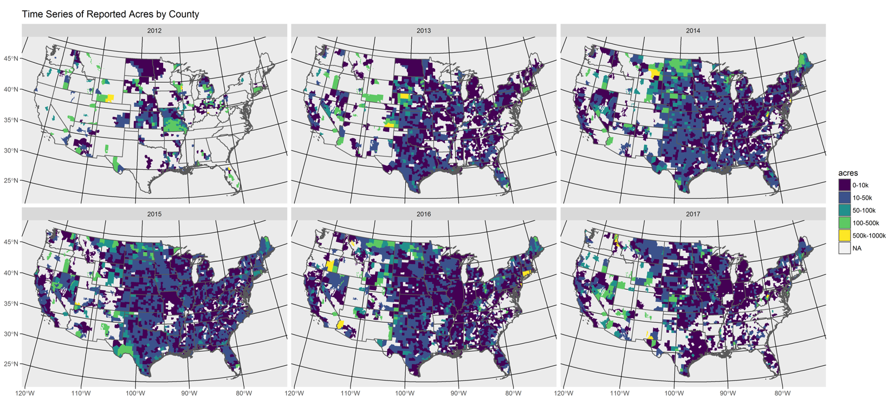

```{r setup, include=FALSE}
knitr::opts_chunk$set(echo = TRUE)
```


## [Progress](https://nasis.sc.egov.usda.gov/NasisReportsWebSite/limsreport.aspx?report_name=get_progress_from_LIMS)

Tracks MLRA Soil Survey Office (SSO) progress metrics by fiscal year, and project type. This report is useful for tracking annual progress. The report output includes:

* Acreage - sum of muacres, land category acres, acre goal, and reported acres
* Count - total number (n) of projects, including approved, QCed, QAed, completed, areasymbol per project, nationalmusym per project, and spatial changes per project


## [Project](https://nasis.sc.egov.usda.gov/NasisReportsWebSite/limsreport.aspx?report_name=get_project_from_LIMS)

Tracks individual projects by MLRA Soil Survey Office (SSO) and fiscal year. This report can be used to review a SSO Long Range Plan and examine the progress of individual projects. The report output includes:

* Project Description (first 1000 characters)
* Acreage - sum of muacres, land category acres, acre goal, and reported acres
* Count - total number (n) of projects, including approved, QCed, QAed, completed, areasymbol per project, nationalmusym per project, and spatial changes per project
* Dates - start, QC, QA, spatial, and complete


## [Project Correlation](https://nasis.sc.egov.usda.gov/NasisReportsWebSite/limsreport.aspx?report_name=get_project_correlation_from_LIMS)

Tracks project correlation history by MLRA Soil Survey Office (SSO), fiscal year, and project name. This report can be used to track map unit changes (e.g. new vs. old musym) and flag map units that require spatial changes. This report is useful for constructing before and after maps, and tracking progress at the map unit level.


