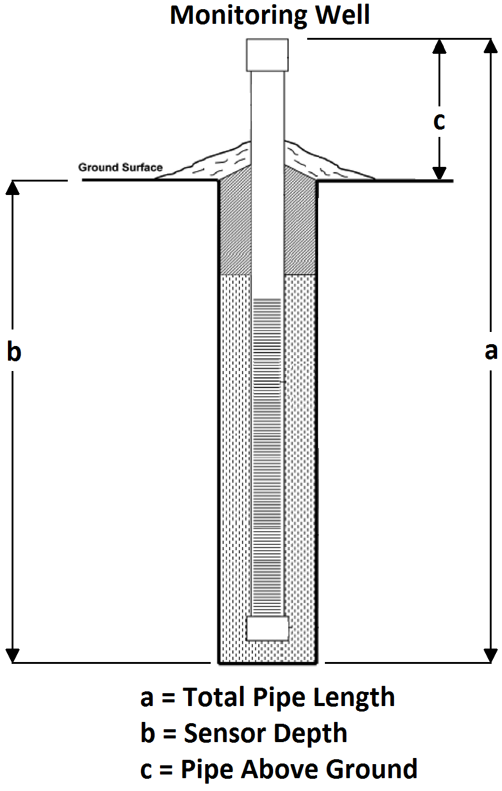
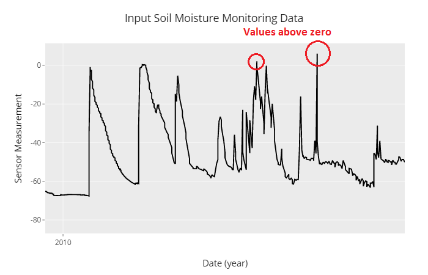
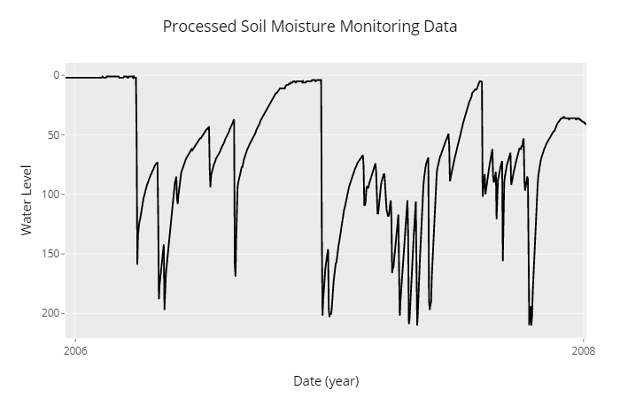

```{r setup, include=FALSE}
knitr::opts_chunk$set(echo = FALSE, warning = FALSE, message = FALSE)
```

# Introduction

Soil moisture monitoring data exists in many different forms.  Before an accurate analysis can be completed, it is nescessary to first review the data, identifying errors, insuring completeness and confirming logical responses to precipitation events.  This process can be automated to some degree, but still requires a skilled hydrologist to confirm a dataset is ready for analysis.  The data preparation and review typically follows the suggested steps outlined below.

## Step 1

### Data Preparation

The data gathered during soil moisture monitoring usually contains the following data at a minimum:

  * Date - (MM/DD/YYYY)
  * Time - (HH:MM:SS)
  * Water Level (L)
  
An example of what the .csv file table fitting these conditions might look like is included below:
  
```{r}
library(knitr)
library(readr)
library(kableExtra)
X0000138B95DB_20161109_1444 <- read_csv("C:/workspace2/0000138B95DB_20161109_1444.csv")
kable(X0000138B95DB_20161109_1444[1:10,], "html", padding = 2) %>% kable_styling(full_width=FALSE)
```
  
A .csv file containing these 3 pieces of data, in columns in the order listed above for analysis is the optimum format for automating the data preparation step within this application.  The date should be in MM/DD/YYYY format.  The time should be in a 24 hour format HH:MM:SS.  The water level can be in several forms: feet, inches, meters, centimeters.  The units must be specified in the app.  The values may also be recorded as positive or negative.  There is also an option specify this in the application.

#### Accurate Sensor Depth

Knowing the exact sensor depth is crucial to proper data prepraration.  If the sensor depth is not known, you can calculate it based on the total pipe length and the length of the pipe above the soil surface.

Calculate the sensor depth using the formula:

$a = b + c$

#### Water Monitoring Instrument Diagram

{width=350px}

The sensor measurements are then corrected to the soil surface based on the sensor depth provided in the applications.  If the data is already corrected, no additional information is needed.

#### Ideal Plot of data


#### Potential Issues

1. Peaks above zero -



Possible Reasons

* incorrect sensor depth
* units (inch vs. centimeters)
* slope position

Possible Actions

* field check/notes
* check units
* check slope position
* Clip peaks to zero
* Adjust values to sensor depth

2. Axis is reversed -



Reason

* sensor measurements are negative

Action

* Choose negative measurements in the application

#### Final Graph


## Step 2

### Data Analysis

