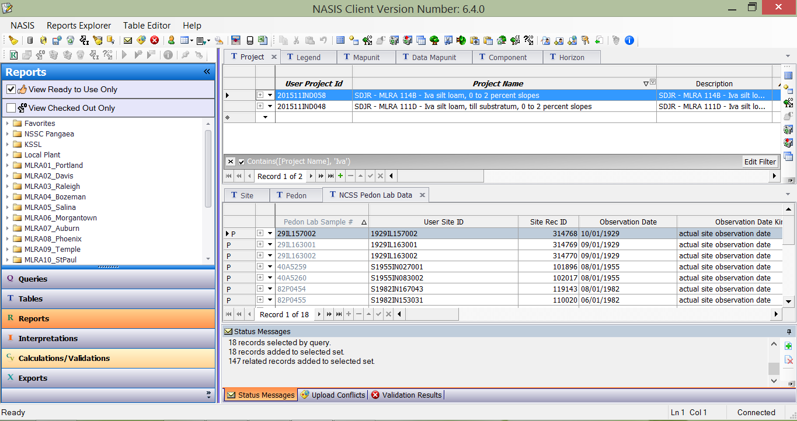

```{r setup, echo=FALSE, warning=FALSE, message=FALSE}
library(aqp)
library(soilDB)
library(RColorBrewer)
library(plyr)
library(ggplot2)
library(reshape2)
library(stringr)
library(knitr)

source("report_functions.R")

```

---
title: "Digital summaries of legacy pedon descriptions"
author: "Stephen Roecker, Jay Skovlin, Dylan Beaudette, Skye Wills"
output:
  word_document: default
fig_caption: yes
---

# Abstract

Soil scientists have been collecting field and lab pedon descriptions for over a hundred years. Within the United States a small portion of this data has been captured in the National Soil Information System (NASIS). While NASIS serves as a superb data repository, its analytical capabilities are limited, and thus we believe it's data is underutilized. Therefore we advocate the use of R, which can easily import data from NASIS and has custom functions designed for digital soil morphometrics. In conjunction with the Western Regional Cooperative Soil Survey Technology Committee we have developed R Markdown reports that provide standardized summaries and graphics of data commonly used for soil survey activities, such as the Soil Data Join and Recorrelation initiative, development of Official Series Descriptions and soil map unit components, and competing dissimilar soils. With little prior knowledge even R novices can quickly generate their own results. Examples can be viewed at, https://github.com/ncss-tech/soil-pit/tree/master/examples, where development is on-going.

# Introduction

The National Cooperative Soil Survey (NCSS) has amassed a substantial amount of legacy pedon data in support of developing soil surveys over the last 100 years. This data consists of field estimates, observations, and laboratory measurements. Unlike the soil map layers and their associated attribute data (component data), pedon data represent unaggregated (point) data from individual observations of soils on the landscape. This makes pedon data an invaluable resource for future updates to existing soil surveys. Currently such updates to the aggregated component data have been taking place on a national scale as part of the Soil Data Join and Recorrelation (SDJR) initiative since 2012 (403-305-NI, 2013). In the future, additional updates are planned for the spatial data.

Since the introduction of the National Soil Information System (NASIS) in 1994, approximately 606,595 field pedons and approximately 63,000 lab pedons have been digitized. While significant, this represents only a small portion of total field pedons ever described. In addition, it is speculated that the real number is approximately 30 percent less, more like 400,000 pedons, due to duplicate records and placeholders in the NASIS database (Ferguson, 2015). The ambiguity in this number reflects the view that pedon data is considered supporting data, and thus is not subjected to the more rigorous review performed on component data which is distributed to the public in combination with soil map layers.

```{r, echo=FALSE, warning=FALSE}

pedons <- c(577, 6152, 9517, 19058, 42587, 112182, 231609, 184913)
year <- c("<1950s", "1950s", "1960s", "1970s", "1980s", "1990s", "2000s", "2010s")

ggplot(data.frame(pedons, year), aes(x=year, y=pedons)) + geom_bar(stat="identity")

# There has been lots of talk about the number or Soil Series, Components, Map units, etc... but little focus on the point data resource.
# Lots of talk about collecting new data, but little appreciation for existing data.
```

In order to store soil data compactly and effeciently, NASIS has a complex hierarchical data structure (http://www.nrcs.usda.gov/wps/portal/nrcs/detail/soils/survey/tools/?cid=nrcs142p2_053547). One structure stores point data - observations of site and pedon data, with soil horizons being the most basic element. Another database structure stores aggregated data about soil map units and their unique soil components (e.g. soil series, phases). Each soil component is made up of generalized soil horizons. Nested within each horizon record are additional child tables that are linked to the horizon record. Each of these child tables, may include several related child tables to capture heterogeneous soil conditions within each soil horizon. The dominant condition is specified as the representative value (RV). For numeric component data, it is possible to specify a range with a Low (L) and High (H) values. This makes it possible to characterize the distribution or uncertainty of a particular soil variable, such as clay content. Using this system, it is possible to capture complex soil horizonation, aggregate the data, and then generate spatial predictions by linking to the soil polygon layer.



A fundamental and complicated step in the mapping process involves aggregating numerous horizon descriptions from field and lab pedons into component horizon data. While there are standards that guide the process of describing individual sites and pedons in the Soil Survey Manual (Soil Survey Division Staff, 1993) and the Field Book for Describing and Sampling Soils (Schoeneberger et al., 2012); there are no definitive guidelines for the process of aggregating point/pedon observations and data into component database elements. The most relevant relevant guidelines either address developing Official Series Descriptions (OSD) (USDA, 2015), or how component ranges relate to the OSD (USDA, 2003). Historically, the process of determining the ranges (L, RV, H) for various soil attributes has been done with pencil and paper or rudimentary spreadsheets, and conditioned using expert knowledge. A practice that still continues today for a variety of reasons, including:

    1. familiarity with existing protocol
    2. inconsistency among the existing data
    3. large additional workload involved in digitizing data
    4. perceived or real software limitations
    5. lack of training in new software

The second number on the list, is close a second. It stems from several factors, including the sampling bias, the completeness of each observation, the method the measurement, and fluid soil series concepts. How soil scientist weight the first 3 factors in their decision making process is where the science meets the art. The last factor is a victim of the first 3, because as a soil scientist collects more data their concept of the soil series may change and thus necessiate changing the OSD. This undermines the utility of the soil series labels given to pedons in NASIS, because changing the OSD may necessitate changing labels to existing pedons. Therefore a soil scientist needs to ensure that their dataset is representative of the soil series or component they're trying to summarize. All these issues make it difficult to automate the aggregation process.

While it is possible to manipulate pedon data directly in NASIS; the majority of existing functions within NASIS have been designed to analyze and evaluate component-level aggregate data. It is possible to export data from NASIS to other software, but none of the alternatives provide the same concise summary of data as do the standardized reports for component data in NASIS. New reports could be added to NASIS, but complex reports are difficult to write because NASIS currently supports a limited implementation of the Structured Query Language (SQL) which has few functions for performing statistical analysis. We advocate exporting pedon data to R (R Core Development Team, 2015), which allows soil scientists to leverage numerous R functions designed for organizing and analyzing data. Scripting of reports in R provides access to current report-writing capability (Xie, 2014; Allaire et al., 2015), and user-contributed functions specifically designed for digital soil morphometrics, such as the aqp (Beaudette et al., 2012), soilDB (Beaudette and Skovlin, 2015), and soiltexture (Moeys, 2015) packages.

## Tools for interacting with soil data
### Tabular analysis
    1. Pencil and paper
    2. Excel spreadsheets
    3. PedonPC and AnalysisPC (Microsoft Access databases)
    4. NASIS
    5. R

### Spatial analysis
    1. SoilWeb
    2. Web Soil Survey
    3. Soil Data Viewer
    4. SSURGO file geodatabases
    5. R
_* sorted by sophistication_

# Methods - R

## Summary or report workflow
    0. Setup ODBC connection and install additional packages
    1. Develop and assign generalized horizonation labels (GHL)
    2. Generate report and evaluate

RStudio, an Integrated Development Environment (IDE) for R, is used to generate summary reports in R. It provides a minimalist Graphical User Interface (GUI) that organizes the R environment into 4 task oriented windows. The initial start up process of using RStudio and R to run the reports requires the user to install several R packages and their dependencies (Roecker, 2015), and setup an ODBC connection to NASIS (Beaudette, 2015). These steps are fully documented online, and readers are pointed to these reference documents for full details. R is a highly extendable environment, and is in dynamic development, so installing additional packages is a common place practice as packages are updated or new packages become available. 

Prior to aggregating the horizons, it is necessary to develop a list of GHL to specify which horizons are similar enough to be aggregated. This is accomplished by mapping the existing horizon designations for each horizon, and matching them to a generalized (i.e. simplified) horizonation sequence for each soil series or component. The assumption is made that the existing horizon designations accurately reflect the soil morphology and the corresponding soil properties of the horizons. For established soil series, the Official Series Description (OSD) can be used as a starting point for determining the appropriate GHL to assign to the horizons for the soil in question. The OSD provides a sample of likely horizons within either the typical pedon described or the range of characteristics (RIC) sections. For example, Bw and Btk horizons might be aggregated if the development of the Btk horizon is incipient and doesn't meet the definition of an argillic or calcic diagnostic horizon. Another approach is to simply examine the frequency with which each horizon occurs. Horizons that occur frequently are likely to be the most representative. Lastly it maybe useful to graphically examine uni-variate or multivariate summaries of each horizon (Beaudette and Skovlin, 2015). 


# TODO: insert a caption for figure and adjust formatting on the table

```{r sort-hz-by-freq-print-html, echo=FALSE, results='asis'}

data(loafercreek, package = 'soilDB')
pedons <- loafercreek
counts <- rbind(sort(table(pedons$hzname), decreasing=TRUE))
kable(as.data.frame.matrix(counts)[1:12])
```

Once appropriate GHL have been determined for the collection of pedons, pattern matching is used to assign the new GHL to each horizon. The process uses functions designed to parse the text from each horizon designation, and match it to the new GHL. The function searches for any combination of characters before or after the specified pattern.  Patterns that don't match any of the GHL are labeled "not used". Special meta-characters serve as anchors or anti-wildcards for the beginning (i.e. caret "^"), and end (i.e. dollar sign "\$") of the given pattern. For example, the GHL pattern rule "Bt" will match any permutation of Bt, such 2Bt or Bt1. To exclude 2Bt horizons, a more specific pattern of "^Bt" would be necessary. Conversely, to exclude Bt1 horizons, a pattern of "Bt\$" would be used. The GHL rules information is stored in a text file as it is developed, and then referenced by the report script. If the user is satisfied with the resulting GHL designations, they can upload it to the comp layer id field in the horizon table in NASIS where it is stored for future use. Also this information will be honored by future reports, unless null.

- *GHL and rules for the aqp loafercreek sample data-set:*
    - **A**: `^A$|Ad|Ap`
    - **Bt1**: `Bt1$`
    - **Bt2**: `^Bt2$`
    - **Bt3**: `^Bt3|^Bt4|CBt$|BCt$|2Bt|2CB$|^C$`
    - **Cr**: `Cr`
    - **R**: `R`
  
In order to fetch NASIS data for use in R, a user must first load a selected set of field and lab pedons in NASIS. A selected set is a view or virtual table that is created via a query, and serves as a working subset of a user's local NASIS database. NASIS has numerous queries to accomplish this. Once the data is loaded in NASIS, it can be imported into R via an ODBC connection using the fetchNASIS() function in the soilDB package.  The user needs to modify the report script by entering the name of the text file (e.g. "Miami") containing the GHL rules that correspond to the pedons loaded into the selected set.  The report script is run and an html document is generated by pressing the Knit button in RStudio. The necessary analysis steps are programmed into the report script and the output is formatted to html using R Markdown (Rmd).

Embedded in the reports are a mixture of tables and graphics. Numerical variables are summarized by percentiles (i.e. quantiles), instead of the mean and confidence intervals, because they provide nonparametric estimates of the a distribution and are therefore less influenced by skewed variables which are common in soil datasets. The percentiles used in the report can be adjusted by the user, but the default is set to the five number summary (0%, 25%, 50% or median, 75%, 100%). Additionally, the percentiles are appended with the number of observations (n) (e.g. (0%, 25%, 50% or median, 75%, 100%)(n)), to inform the user of the sample size. The standard graphics used are box plots, which provide a similar summary and interpretation (outliers, ~5%, ~25%, 50% or median, ~75%, ~95%, outliers) as the five number summary. To summarize categorical variables, frequency tables (i.e. contingency tables) are used. 


# Results and Discussion

The full field and lab reports are not shown here due to space limitations. Instead readers are directed to https://github.com/ncss-tech/soil-pit/tree/master/examples, where development is on-going. The list below summarizes their content.
What follows are excerpts and discussion of the reports content.

- Field pedon report content:
    - Map of georeferenced pedons
    - Table of identifying information: pedon id, soil series, etc...
    - Soil profile plots
    - Surface rock fragments
    - Depths and thickness of diagnostic horizons
    - GHL vs original horizon designations
    - Depth and thickness of GHL
    - Numeric variables: clay content, rock fragments, pH, etc...
    - GHL vs texture and texture class modifer
    - GHL vs Hue
    - Elevation, slope gradient and aspect
    - Parent material vs landform
    - Down slope vs across slope shape
    - Drainage class vs hillslope position

- Lab pedon report content:
    - Map of georeference pedons
    - Table of identifying information: pedon id, soil series, etc...
    - Soil profile plots
    - Weighted averages for the particle size control section
    - Depths and thickness for the particle size control section
    - GHL vs original horizon designations
    - Depth and thickness of GHL
    - Numeric variables: particle size fractions, pH, base saturation, carbon content, etc...
    - GHL vs lab texture
    
Much of the information contained in the reports is typically used to summarize data for developing OSD and aggregated map unit soil components, and competing dissimilar soils. Evaluating the graphics and tables within the reports quickly show where there are possible errors, narrow or wide ranges in values or where data gaps exist due to insufficient data. One of the first outputs of the report that should be examined thoroughly is a contingency table of the GHL versus the original horizon designations. This shows the results of the pattern matching and should be examined to confirm whether the GHL assignments are as desired. For example GHL that are labeled as "not used", did not match any of the given patterns, which the user may or may not wish to label.

As an example the following tables and figures show an excerpt summaries of clay content, pH, and texture for all the field and lab data labeled as the Miami soil series with NASIS. The example shows that the field data is missing estimates for clay content. Given the vintage of the dataset, this is not surprising, as it was not always common to record field estimates for clay content. The lab data thankfully has numerous measurements of clay content. By examining the boxplots we can a clear increase in the Bt and 2Bt horizons, and decrease in the 2Cd horizon. The boxplots for pH however show a wide interquartile range for solum and a slight decrease in the median pH with depth. The subsoil (i.e. 2BCt and 2Cd) however shows a much narrow interquartile range and higher median pH. Examing the contingency tables of texture we can a greater frequency of silty textures in the A and E horizons. The Bt horizon though shows a higher frequency of clay loam textures. If silty textures are indicative of loess cap associated with the Miami series, it suggests that numerous Bt horizons should be relabeled as 2Bt horizons. Whatever the interpretation, the report's summaries provide ample information and allow soil scientists to ask questions of their data; particularly when viewed in aggregate. 

```{r, echo=FALSE, warning=FALSE, comment=""}
load("miami_field.RData")
load("miami_lab.RData")

cols <- brewer.pal(n = length(levels(miami_field$genhz)), name = "Set1") 
hz.names <- levels(miami_field$genhz)
miami_field$genhz.soil_color <- cols[match(miami_field$genhz, hz.names)] # assign a color to each generalized horizon label
plot(miami_field[1:10], name = 'hzname', color = 'genhz.soil_color', label = 'pedon_id') # plot generalized horizons via color and add a legend
legend('bottomleft', legend=hz.names, pt.bg=c(cols), pch=22)
title("Sample of soil profile plots of field pedons")

cols <- brewer.pal(n = length(levels(miami_lab$genhz)), name = "Set1") 
hz.names <- levels(miami_lab$genhz)
miami_lab$genhz.soil_color <- cols[match(miami_lab$genhz, hz.names)] # assign a color to each generalized horizon label
plot(miami_lab[1:10], name = 'hzname', color = 'genhz.soil_color', label = 'labpeiid') # plot generalized horizons via color and add a legend
legend('bottomleft', legend=hz.names, pt.bg=c(cols), pch=22)
title("Sample of soil profile plots of lab pedons")

p <- c(0, 0.25, 0.5, 0.75, 1)

h <- horizons(miami_field)
lh <- horizons(miami_lab)

h.lo <- melt(h, id.vars="genhz", measure.vars = c('clay', 'phfield'))
h.5n <- ddply(h.lo, .(variable, genhz), .fun = sum5n)
h.wi <- dcast(h.5n, genhz ~ variable, value.var = 'range')

kable(h.wi, align = "c", caption = "Summary of Miami field pedons by generic horizon (min, 25th, median, 75th, max)(n)")

lh.num <- lh[c("genhz", "claytot", "ph1to1h2o")]
lh.lo <- melt(lh.num, id.vars="genhz", measure.vars=c("claytot", "ph1to1h2o"))
lh.5n <- ddply(lh.lo, .(variable, genhz), .fun=sum5n)
lh.c <- dcast(lh.5n, genhz~variable, value.var = "range")

kable(lh.c, align = "c", caption = "Summary of Miami lab pedons by generic horizon (min, 25th, median, 75th, max)(n)")

qplot(genhz, value, data = h.lo, geom = "boxplot", ylab = "cm", main = "Boxplot of Miami field pedons by generic horizon") + facet_wrap(~variable, scales = "free") + theme(axis.text.x = element_text(angle = 45, hjust = 1, vjust = 1))

qplot(genhz, value, data = lh.lo, geom = "boxplot", main = "Boxplot of Miami lab pedons by generic horizon") + facet_wrap(~variable, scales = "free", ncol = 4) + theme(axis.text.x = element_text(angle = 45, hjust = 1, vjust = 1))

kable(addmargins(table(h$genhz, h$texture_class)), digits = 0, caption = "Texture of Miami field pedons by generic horizon (counts)")

kable(addmargins(table(lh$genhz, lh$lab_texcl)), digits = 0, caption = "Texture of Miami lab pedons by generic horizon (counts)")

```


# Conclusion

Rarely can soil scientists observe full pedons or polypedons in the field. Therefore we can only approximate the range of their internal variation by examining several soil profiles and comparing multiple descriptions. While this is a common problem few tools are readily available within the NCSS to generate summaries of several pedons, and fewer are efficient. For these reasons we believe the legacy field and lab pedon data stored within NASIS is under utilized. To address this problem the Western Regional Cooperative Soil Survey Committee developed R Markdown reports that summarize the data typically used to develop OSD, and soil map unit components. This process formalized the vague NCSS protocol by importing data from NASIS into R, and uses R Markdown to generate reports of field and lab pedons that can summarizes the typical soil properties 


Soil profile descriptions within the NASIS database represent a immense body of observations. From an organizational perspective the data can often be difficult to use and summarize. Using the relational structure of the NASIS database combined with the extensible data handling and statistical analysis capabilities of R, it is possible to generate powerful graphical and tabular summaries for collections of pedon data.  The scripting environment in R allows many data handling, statistical, and summarization processes to be bundled into one report.  The assignment of GHL in correlating similar horizon designations for summary is a fundamental step in this process, which both requires soil scientists expert knowledge and helps expand their knowledge. Graphical displays of soil data continue to expand in capability within R making it a useful platform for generating reports summarizing pedon data.


* Find some where to cite Fred Young. Young and others have described a similar process for evaluating the soils within a given map units, but we think 

Mixture of the graphics and 

What did you learn? "Alfred"

- we have a wealth of existing data
- data on soil series should be viewed in aggregate
- "we shouldn't let the perfect be the enemy of the good"
- reproducible research is good
- Soil Departments should teach Statistics!!! Soil students are rarely taught how to analyze soil in its three dimensional nature.
- Soil scientists are great at collecting data, but we have to just as good at analyzing it.

# Acknowledgements
Alena Stephens, John Hammerly, Jennifer Outcalt, Henry Ferguson, Paul Finnell, and others...

# References
JJ Allaire, Joe Cheng, Yihui Xie, Jonathan McPherson, Winston      Chang, Jeff Allen, Hadley Wickham and Rob Hyndman (2015). rmarkdown: Dynamic Documents for R. R package version 0.6.1. http://CRAN.R-project.org/package=rmarkdown
  
  Beaudette, D.E., Roudier P., and A.T. O'Geen. Algorithms for
  Quantitative Pedology: A Toolkit for Soil Scientists. 2012

Beaudette, D.E., and J.M. Skovlin (2015)a. soilDB: Soil Database
  Interface. R package version 1.5-2.
  HTTP://CRAN.R-project.org/package=soilDB
  
Beaudette, D.E., and J.M. Skovlin (2015)b. Assigning Generalized Horizon Labels https://r-forge.r-project.org/scm/viewvc.php/*checkout*/docs/aqp/gen-hz-assignment.html?root=aqp

Beaudette, D.E., 2015. Setup an ODBC Connection to the Local NASIS Database. https://r-forge.r-project.org/scm/viewvc.php/*checkout*/docs/soilDB/setup_local_nasis.html?root=aqp

Ferguson, H., 2015. Personal communication.

Julien Moeys (2015). soiltexture: Functions for Soil Texture Plot,
  Classification and Transformation. R package version 1.3.3.
  HTTP://CRAN.R-project.org/package=soiltexture

R Development Core Team, 2015.R:A Language and Environment for Statistical Computing. R Foundation for Statistical Computing. Vienna, Austria. ISBN3-900051-07-0.

Schoeneberger, P.J., D.A. Wysocki, E.C. Benham, and Soil Survey Staff. 2012. Field book for describing and sampling soils, Version 3.0. Natural Resources Conservation Service, National Soil Survey Center, Lincoln, NE.

Soil Survey Division Staff, 1993. Soil survey manual. Soil Conservation Service. U.S. Department of Agriculture Handbook 18.

U.S. Department of Agriculture (USDA), Natural Resources Conservation Service. National soil survey handbook, title 430-VI. Available online. Accessed [06/24/2015].

U.S. Department of Agriculture (USDA), Natural Resources Conservation Service. National Instructions, title 430-305, Soil Data Join Recorrelation Initative, 3rd edition. http://directives.sc.egov.usda.gov/viewerFS.aspx?hid=36725 [10/2014].

U.S. Department of Agriculture (USDA), Natural Resources Conservation Service. Technical Note 4, Populating Map Unit Data: Taxonomic classes and map unit componnents. http://directives.sc.egov.usda.gov/viewerFS.aspx?hid=36725 [02/2013].

Yihui Xie (2014) knitr: A Comprehensive Tool for Reproducible
  Research in R. In Victoria Stodden, Friedrich Leisch and Roger D. Peng, editors, Implementing Reproducible Computational Research. Chapman and Hall/CRC. ISBN 978-1466561595
