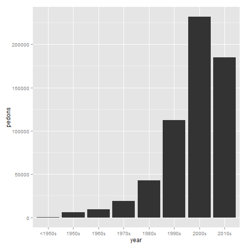
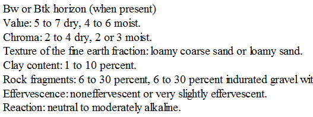
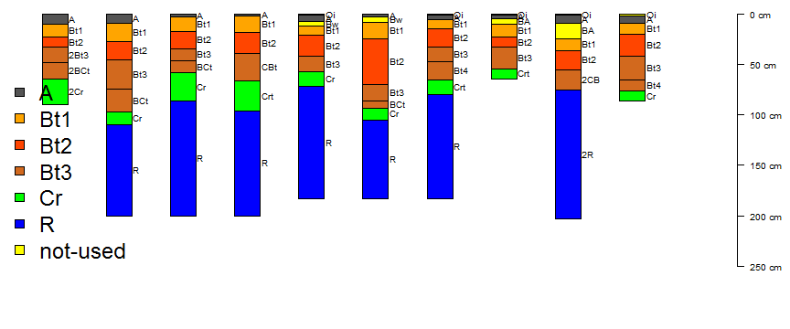

Digital summaries of legacy pedon descriptions
========================================================
author: Stephen Roecker, Dylan Beaudette, Jay Skovlin, Skye Wills
date: 6/1/2015


Legacy pedon data within the US
========================================================


```
# pedons = 606,595
# lab pedons = ~64,000
```

 


NRCS soil databases
========================================================

1. National Soil Information System (NASIS) (SQL Server)
   * SSURGO and Soil Data Access
   * STASTGO2
2. Soil Characterization Database (Access)
3. Ecological Site Descriptions (Text)
4. Official Series Descriptions (Text)

_* sorted by database sophistication_


NASIS
========================================================


* Analysis is limited to a subset of SQL functions
* 99% of existing reports are for aggregate data
* No inherent graphing capability


What do we need
=======================================================

### Horizon data

|   | Low | RV | High |
|:--|:---:|:--:|:----:|
|A  |  ?  | ?  |  ?   |
|B  |  ?  | ?  |  ?   |
|C  |  ?  | ?  |  ?   |


|   | textureRV | texture2 | texture3 |
|:--|:---------:|:--------:|:--------:|
|A  |     ?     |    ?     |    ?     |
|B  |     ?     |    ?     |    ?     |
|C  |     ?     |    ?     |    ?     |
### Site data
- slope
- landform
- precipitation
- etc...


Tools for interacting with soil data
========================================================
### Tabular analysis

    1. Pen and paper
    2. Excel
    3. PedonPC and AnalysisPC (Access front ends) 
    4. NASIS
    5. R

### Spatial analysis
    1. SoilWeb
    2. Web Soil Survey
    3. Soil Data Viewer
    4. SSURGO file geodatabases
    5. R
    
_* sorted by user sophistication_


Objective?
========================================================
### Problems
    1. Data is underutilized
    2. Inefficient tools
    3. Fluid series concepts
    4. Vaguely defined uncertainty metrics
    5. Data isn't digitized
    6. Tools are difficulat (especially R?)

### Solution ?
    1. standardized R reports


Why hasn't this been done already
========================================================


- description styles
- legacy nomenclature
- varying depths


Summary of Report workflow
========================================================
1. Develop typical horizonation

2. Assign new generic horization

3. Evaluate new horization

4. Generate report

5. Import new generic horizonation into NASIS

[&#8594;&nbsp;extended tutorial](https://r-forge.r-project.org/scm/viewvc.php/*checkout*/docs/aqp/gen-hz-assignment.html?root=aqp)


Assumptions
========================================================
- horizonation is exists and is accurate
- a subset of pedons (sample) should represent a component (population or aggregate)
- some semi-automated process is necessary to efficiently summarize soil data
- null hypthesis - pedons are assumed similar unless significantly(?) different 
- low-rv-high values should approximate the bulk of the distribution


Develop a typical horization
========================================================
- Look up the series RIC if available



- sort by frequency

|   |  A| Bt1| Bt2| Cr| Bt3| Oi|  R| Crt| BA| 2Bt3| 2Bt4| ABt| BCt| Bt| Bt4| CBt| 2Cr| 2R| Bw|  C| Rt| 2BCt| 2Bt2| 2CB| 2Crt| AB| Ad| Ap|  B|
|:--|--:|---:|---:|--:|---:|--:|--:|---:|--:|----:|----:|---:|---:|--:|---:|---:|---:|--:|--:|--:|--:|----:|----:|---:|----:|--:|--:|--:|--:|
|d  | 53|  51|  50| 30|  23| 19| 18|  15|  9|    4|    3|   3|   3|  3|   3|   3|   2|  2|  2|  2|  2|    1|    1|   1|    1|  1|  1|  1|  1|
- graphically examine


Assign generic horizonation
========================================================
- pattern matching via [regular expression](http://www.regexr.com/) (REGEX)
 - this is where most micro-correlation decisions are defined

- GHL and rules for our sample dataset:
  - **A**: `^A$|Ad|Ap`
  - **Bt1**: `Bt1$`
  - **Bt2**: `^Bt2$`
  - **Bt3**: `^Bt3|^Bt4|CBt$|BCt$|2Bt|2CB$|^C$`
  - **Cr**: `Cr`
  - **R**: `R`

- special characters in REGEX rules: 
 - `|` = "or"
 - `^` = anchor to left-side
 - `$` = anchor to right-side


Evaluate typical horizonation
========================================================


|         | 2BCt| 2Bt2| 2Bt3| 2Bt4| 2CB| 2Cr| 2Crt| 2R|  A| AB| ABt| Ad| Ap|  B| BA| BCt| Bt| Bt1| Bt2| Bt3| Bt4| Bw|  C| CBt| Cr| Crt| Oi|  R| Rt| Sum|
|:--------|----:|----:|----:|----:|---:|---:|----:|--:|--:|--:|---:|--:|--:|--:|--:|---:|--:|---:|---:|---:|---:|--:|--:|---:|--:|---:|--:|--:|--:|---:|
|A        |    0|    0|    0|    0|   0|   0|    0|  0| 53|  0|   0|  1|  1|  0|  0|   0|  0|   0|   0|   0|   0|  0|  0|   0|  0|   0|  0|  0|  0|  55|
|Bt1      |    0|    0|    0|    0|   0|   0|    0|  0|  0|  0|   0|  0|  0|  0|  0|   0|  0|  51|   0|   0|   0|  0|  0|   0|  0|   0|  0|  0|  0|  51|
|Bt2      |    0|    0|    0|    0|   0|   0|    0|  0|  0|  0|   0|  0|  0|  0|  0|   0|  0|   0|  50|   0|   0|  0|  0|   0|  0|   0|  0|  0|  0|  50|
|Bt3      |    1|    1|    4|    3|   1|   0|    0|  0|  0|  0|   0|  0|  0|  0|  0|   3|  0|   0|   0|  23|   3|  0|  2|   3|  0|   0|  0|  0|  0|  44|
|Cr       |    0|    0|    0|    0|   0|   2|    1|  0|  0|  0|   0|  0|  0|  0|  0|   0|  0|   0|   0|   0|   0|  0|  0|   0| 30|  15|  0|  0|  0|  48|
|R        |    0|    0|    0|    0|   0|   0|    0|  2|  0|  0|   0|  0|  0|  0|  0|   0|  0|   0|   0|   0|   0|  0|  0|   0|  0|   0|  0| 18|  2|  22|
|not-used |    0|    0|    0|    0|   0|   0|    0|  0|  0|  1|   3|  0|  0|  1|  9|   0|  3|   0|   0|   0|   0|  2|  0|   0|  0|   0| 19|  0|  0|  38|
|Sum      |    1|    1|    4|    3|   1|   2|    1|  2| 53|  1|   3|  1|  1|  1|  9|   3|  3|  51|  50|  23|   3|  2|  2|   3| 30|  15| 19| 18|  2| 308|


Evaluate typical horizonation
========================================================

 

Demonstrate Reports
========================================================
- open existing reports


Closing thoughts
========================================================
- we have a wealth of existing data
- data on soil series should be viewed in aggregate
- "we shouldn't let the perfect be the enemy of the good"
- reproducible research is good
- Soil Departments should teach Statistics!!!
- Soil scientists are great at collecting data, but we have to just as good at analyzing it.


Thank You
========================================================
**Questions, comments, ideas**
<br><br>

**R resources for pedologists**
- <span class="link-to-details">&#8594;&nbsp;[NCSS Job-Aids](http://www.nrcs.usda.gov/wps/portal/nrcs/detail/soils/edu/ncss/?cid=nrcs142p2_054322)</span>
- <span class="link-to-details">&#8594;&nbsp;[aqp tutorials](http://aqp.r-forge.r-project.org/)</span>
- <span class="link-to-details">&#8594;&nbsp;[Statistical data analysis for pedologists](http://www2.gru.wvu.edu/~tdavello/files/stats/table_of_contents.html)
- <span class="link-to-details">&#8594;&nbsp;[Dylan Beaudette's blog](http://casoilresource.lawr.ucdavis.edu/blog/)
- <span class="link-to-details">&#8594;&nbsp;[soil-pit Github repository](https://github.com/sroecker01/soil-pit)
<br><br>

**Additional AQP Contributors:**
- Pierre Roudier (Landcare Research)
