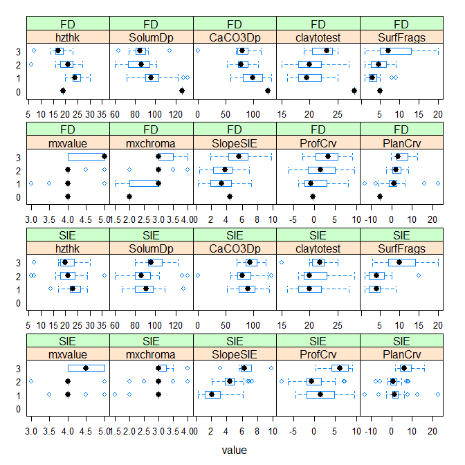
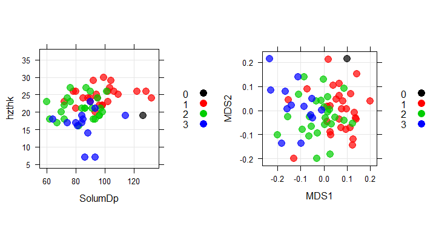
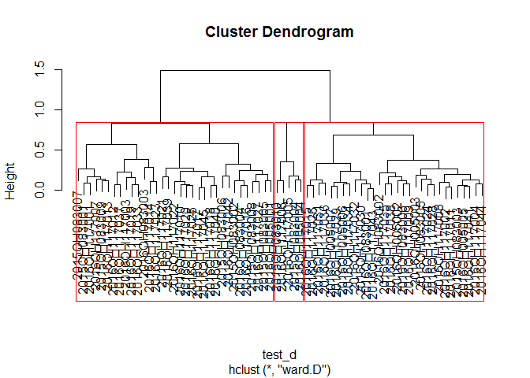
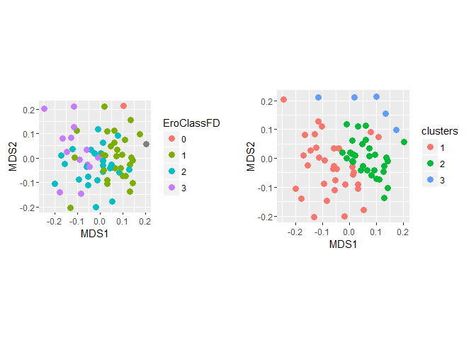
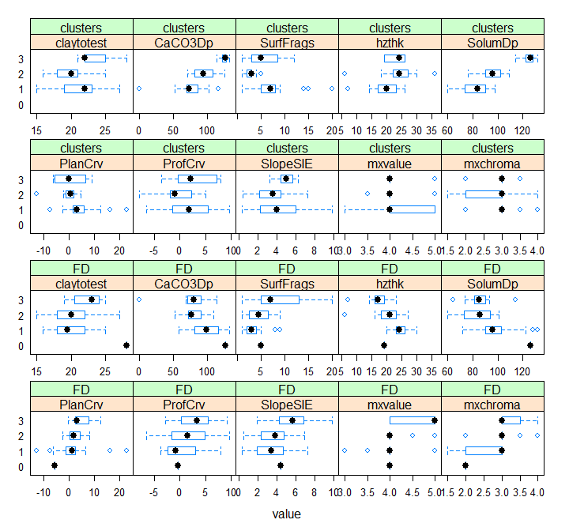
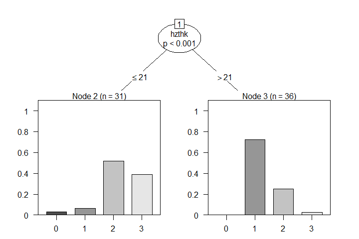
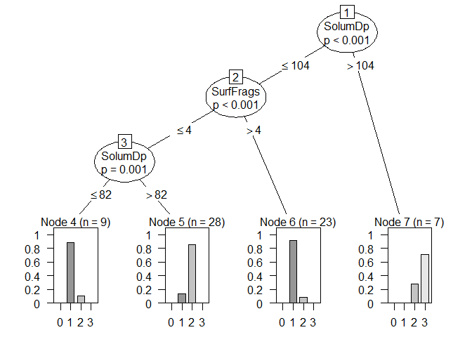
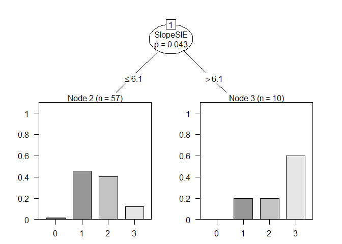
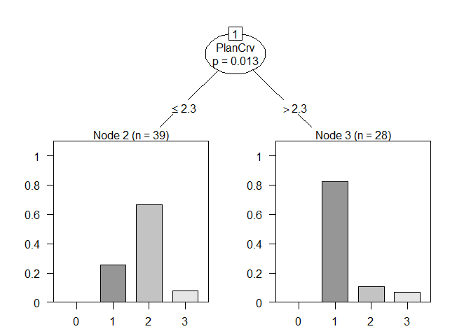

# Analysis of 11-FIN Erosion Classes
Stephen Roecker  
November 7, 2016  


## Setup


```r
library(aqp)
library(lattice)
library(ggplot2)
library(reshape2)
library(cluster)
library(caret)
library(party)
library(vegan)
library(RColorBrewer)
library(gridExtra)
```

## Import Data and Transform


```r
data <- read.csv("C:/workspace/neil_arcsie/Pedon_Data_DumpSIE.csv")

names(data) <- gsub(" ", "", names(data))
names(data) <- gsub("\\.", "", names(data))
data <- transform(data,
                  EroClassFD = as.factor(EroClassFD),
                  EroClassSIE = as.factor(EroClassSIE),
                  hzthk = hzdepb - hzdept,
                  rgb = munsell2rgb(mxhue, mxvalue, mxchroma, return_triplets = TRUE)
                  )
```

```
## Notice: converting hue to character
```


## Confusion Matrix of the Erosion Class vs the ArcSIE Predictions


```r
cm <- confusionMatrix(data = data$EroClassSIE, reference = data$EroClassFD)

cm$table
```

```
##           Reference
## Prediction  0  1  2  3
##          0  0  0  0  0
##          1  0 17 10  2
##          2  1  8 14  7
##          3  0  3  1  4
```

```r
cm$overall
```

```
##       Accuracy          Kappa  AccuracyLower  AccuracyUpper   AccuracyNull 
##     0.52238806     0.24052426     0.39674840     0.64598512     0.41791045 
## AccuracyPValue  McnemarPValue 
##     0.05450886            NaN
```

The overall accuracy of the ArcSIE predictions is 0.5223881.


## Boxplots of the Erosion Classes


```r
vals <- c("hzthk", "SolumDp", "CaCO3Dp", "claytotest", "SurfFrags", "mxvalue", "mxchroma", "SlopeSIE", "ProfCrv", "PlanCrv")
data_lo <- melt(data, id.vars = "EroClassFD", measure.vars = vals)
data_lo2 <- melt(data, id.vars = "EroClassSIE", measure.vars = vals)

ggplot(data_lo, aes(x = EroClassFD, y = value)) +
  geom_boxplot() +
  facet_wrap(~ variable, scales="free_y")
```

<!-- -->

```r
# bwplot(EroClassFD ~ value | variable, data = data_lo, scales = list(x ="free"), as.table = TRUE)
# bwplot(EroClassSIE ~ value | variable, data = data_lo, scales = list(x ="free"), as.table = TRUE)
```

The box plots show that the erosion classes have a linear trend for some variables, while others only show one class deviating from the others. In addition the variation within each classes overlap the others, such that their median values are indistinguishable from the other classes in many cases.


## Scatterplots of the Erosion Classes


```r
soil_vals <- c("hzthk", "SolumDp", "CaCO3Dp", "claytotest", "SurfFrags") # excluded color, only observed a narrow range thus small differences swamp everthing else
geo_vals <- c("SlopeSIE", "ProfCrv", "PlanCrv")
vals <- c(soil_vals, geo_vals)

test <- subset(data, select = vals)
test_d <- daisy(scale(test), metric = "gower")
test_mds <- metaMDS(test_d, distance = "gower", autotransform = FALSE)
```

```
## Run 0 stress 0.23203 
## Run 1 stress 0.239688 
## Run 2 stress 0.2404032 
## Run 3 stress 0.2400696 
## Run 4 stress 0.2338825 
## Run 5 stress 0.2340638 
## Run 6 stress 0.2338541 
## Run 7 stress 0.237789 
## Run 8 stress 0.2357983 
## Run 9 stress 0.2393571 
## Run 10 stress 0.2403582 
## Run 11 stress 0.2403404 
## Run 12 stress 0.2321023 
## ... Procrustes: rmse 0.007823348  max resid 0.04405315 
## Run 13 stress 0.2415355 
## Run 14 stress 0.2350543 
## Run 15 stress 0.2431735 
## Run 16 stress 0.2325666 
## Run 17 stress 0.2370467 
## Run 18 stress 0.2356247 
## Run 19 stress 0.2391978 
## Run 20 stress 0.2391682 
## *** No convergence -- monoMDS stopping criteria:
##     20: stress ratio > sratmax
```

```r
test_pts <- cbind(as.data.frame(test_mds$points), EroClassFD = data$EroClassFD)

p1 <- ggplot(data, aes(x = hzthk, y = SolumDp,  col = EroClassFD)) +
  geom_point(cex = 3) +
  theme(aspect.ratio = 1)
p2 <- ggplot(test_pts, aes(x = MDS1, y = MDS2, col = EroClassFD)) +
  geom_point(cex = 3) +
  theme(aspect.ratio = 1)
grid.arrange(p1, p2, ncol = 2)
```

<!-- -->

The scatter plots of the erosion classes displayed over various dimensions, including using multidimensional (MD) scaling, again show their is overlap between the erosion classes. 


## Cluster Analysis


```r
test_c <- hclust(test_d, method = "ward")
plot(test_c, labels = data$upedonid)
rect.hclust(test_c, k = 3)
```

<!-- -->

Example of Centerburg data classified using a hierarchical cluster analysis, and aggregated into the 3 most distinct classes. The 3rd class appears to be an outlier.


## Contingency Table of the Erosion Classes vs the Hierachical Clusters


```r
clusters <- cbind(data, test_pts, clusters = as.factor(cutree(test_c, k = 3)))

with(clusters, table(EroClassFD, clusters))
```

```
##           clusters
## EroClassFD  1  2  3
##          0  0  0  1
##          1  7 18  3
##          2 15 10  0
##          3 11  1  1
```

```r
with(clusters, table(EroClassSIE, clusters))
```

```
##            clusters
## EroClassSIE  1  2  3
##           1 15 13  1
##           2 13 16  2
##           3  5  1  2
```

The contingency table shows that the field determined erosion classes (EroClassFD) 1 and 2 overlap the most with the hierarchical clusters 2 and 3. The ArcSIE predictions don't appear to have as much correspondence with the hierarchical clusters.


## Scatter Plots of the Erosion Classes vs the Hierachical Clusters


```r
p1 <- ggplot(clusters, aes(x = MDS1, y = MDS2, col = EroClassFD)) +
  geom_point(cex = 3) +
  theme(aspect.ratio = 1)
p2 <- ggplot(clusters, aes(x = MDS1, y = MDS2, col = clusters), main = "test") +
  geom_point(cex = 3) + 
  theme(aspect.ratio = 1)
grid.arrange(p1, p2, ncol = 2)
```

<!-- -->

The hierarchical clusters seem to have less overlap when viewed along the multidimensional scaled axes.


## Box Plots fo the Erosion Classes vs the Hierachical Clusters


```r
names(data_lo)[names(data_lo) == "EroClassFD"] <- "clusters"
vals <- c("claytotest", "CaCO3Dp", "SurfFrags", "hzthk", "SolumDp", "PlanCrv", "ProfCrv", "SlopeSIE", "mxvalue", "mxchroma")
data_lo2 <- melt(clusters, id.vars = "clusters", measure.vars = vals)

data_lo_merge <- rbind(cbind(data_lo, test = "EroClassFD"), cbind(data_lo2, test = "clusters"))

ggplot(data_lo_merge, aes(x = clusters, y = value)) +
  geom_boxplot() +
  facet_wrap(~ variable + test, scales="free_y", ncol = 2)
```

<!-- -->

Back to back the erosion classes and hierarchical clusters show a similarly degree of separability. As observed early cluster 3 seems be an outlier, which a deeper solum (SolumDP) and depth to carbonates (CaCO3Dp).


```r
## Principal Component Analysis (PCA)

data_na <- na.exclude(data)
test <- subset(data_na, select = vals)
test_pc <- princomp(test, cor = TRUE)
```


## Classification Trees


```r
clusters <- subset(clusters, !is.na(EroClassFD))

test1 <- ctree(EroClassFD ~ ., data = clusters[, c("EroClassFD", soil_vals)])
plot(test1)
```

<!-- -->

```r
cm1 <- confusionMatrix(data = predict(test1, type = "response"), reference = clusters$EroClassFD)
cm1$table
```

```
##           Reference
## Prediction  0  1  2  3
##          0  0  0  0  0
##          1  0 26  9  1
##          2  1  2 16 12
##          3  0  0  0  0
```

```r
cm1$overall
```

```
##       Accuracy          Kappa  AccuracyLower  AccuracyUpper   AccuracyNull 
##   0.6268656716   0.3810051737   0.5001047440   0.7420258373   0.4179104478 
## AccuracyPValue  McnemarPValue 
##   0.0004537149            NaN
```

The classification tree of erosion classes using only soil variables as predictors shows that we can only separate the classes on horizon thickness (hzthk) using a break of 21-cm, which gives an overall accuracy of 0.6268657. The bar plots for node 2, shows that it more impure than node 3. 


```r
test2 <- ctree(clusters ~ ., data = clusters[, c("clusters", soil_vals)])
plot(test2)
```

<!-- -->

```r
cm2 <- confusionMatrix(data = predict(test2, type = "response"), reference = clusters$clusters)
cm2$table
```

```
##           Reference
## Prediction  1  2  3
##          1 29  3  0
##          2  4 24  0
##          3  0  2  5
```

```r
round(cm2$overall, 2)
```

```
##       Accuracy          Kappa  AccuracyLower  AccuracyUpper   AccuracyNull 
##           0.87           0.77           0.76           0.94           0.49 
## AccuracyPValue  McnemarPValue 
##           0.00            NaN
```

The classification tree for the hierachical clusters using only soil variables as predictors has an overall accuracy of 0.8656716, and is split on solum depth (SolumDp) and surface fragments (SurfFrags).


```r
test <- ctree(EroClassFD ~ ., data = clusters[, c("EroClassFD", geo_vals)])
plot(test)
```

<!-- -->

```r
cm2 <- confusionMatrix(data = predict(test, type = "response"), reference = clusters$EroClassFD)
cm2$table
```

```
##           Reference
## Prediction  0  1  2  3
##          0  0  0  0  0
##          1  1 26 23  7
##          2  0  0  0  0
##          3  0  2  2  6
```

```r
cm2$overall
```

```
##       Accuracy          Kappa  AccuracyLower  AccuracyUpper   AccuracyNull 
##      0.4776119      0.1512848      0.3540149      0.6032516      0.4179104 
## AccuracyPValue  McnemarPValue 
##      0.1925839            NaN
```

The classification tree of the erosion classes using the 


```r
test <- ctree(clusters ~ ., data = clusters[, c("clusters", geo_vals)])
plot(test)
```

<!-- -->

```r
cm3 <- confusionMatrix(data = predict(test, type = "response"), reference = clusters$clusters)
cm3$table
```

```
##           Reference
## Prediction  1  2  3
##          1 23  3  2
##          2 10 26  3
##          3  0  0  0
```

```r
cm3$overall
```

```
##       Accuracy          Kappa  AccuracyLower  AccuracyUpper   AccuracyNull 
##   7.313433e-01   5.045193e-01   6.090378e-01   8.323593e-01   4.925373e-01 
## AccuracyPValue  McnemarPValue 
##   5.981897e-05   3.252177e-02
```

## Summary

